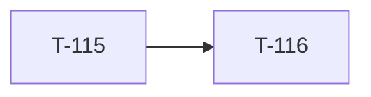

<!-- AUTO-GENERATED by ./scripts/ticket sync — DO NOT EDIT -->

# Ticket Lead Dashboard

## Running / Review

- **T-372** (3188) — POST /admin/roles/sync demotes every admin who never completed a Discord login [running] — VERIFIED FROM THE COMMAND CENTER. One admin button press can lock every admin out of the platform, and that route is the only way back.

services/role_sync.rs:65-67 — `resolve_role` returns `Ok(UserRole::Enlisted)` when `role_ids` is EMPTY. `resync_all_roles` (:38) walks EVERY user, reads their stored snowflakes, and writes the resolved role when it differs (:51 `UPDATE users SET role = $1 WHERE discord_id = $2`). **Absent stored data decodes as an affirmative `enlisted`.**

`user_discord_roles` has EXACTLY ONE writer — `sync_roles`, called only from the Discord OAuth callback (confirmed by grep across src/, seeds/, tests/, migrations/). No seed populates it. So every user who has never completed a Discord login holds zero rows, including:
  - the dev-login operator `000000000000000001`, which handlers/dev.rs:41-54 upserts as `admin`;
  - anyone hand-promoted via PATCH /admin/users/{discordId} — handlers/admin.rs:149 writes the role and never touches user_discord_roles.

One POST /api/v1/admin/roles/sync demotes all of them — **including the admin who pressed it.** On a dev or staging DB that is total admin lockout.

THE ASYMMETRY IS THE PROOF THIS IS A BUG: the OAuth path is already hardened against exactly this. T-185 introduced `RoleSnapshot::Authoritative` vs `Unavailable` (oauth.rs:129) with six regression tests at oauth.rs:280-385, and discord.rs:145-149 explicitly refuses #[serde(default)] on `roles`. `resync_all_roles` has no equivalent guard — and the comment at oauth.rs:295-296 NAMES the dependency: 'with no snapshot left for resync_all_roles to restore from.'

FIX: give resync the same treatment. A user with no stored snowflakes has NO SNAPSHOT, which is not the same statement as NO ROLES, and must be SKIPPED rather than demoted. Read T-185's reasoning first — it drew this exact distinction one function over.

== DEFERRED 2026-07-26 BY OPERATOR DECISION, NOT CANCELLED ==
Recording a bug is most of its value; fixing it now is optional. The audits that produced this ticket were generating work faster than the run could close it, and the original T-182..T-297 feature backlog had not moved in hours. The operator's call, verbatim in substance: there will always be bugs, that is what developing is — knowing them is good, but spending the token budget on things that do not need fixing right now means nothing ships.
This is findable, fully diagnosed, and reproducible from the notes above. Promote it to `idea` when it actually blocks something, when it starts costing real time, or after the feature backlog lands. Nothing here was judged wrong — only not now.
- **T-386** (3202) — render-check's exit code cannot fail a probe — every browser assertion has been decorative [running] — THIRD INSTANCE OF THIS RUN'S SIGNATURE DEFECT, and it is in the harness every frontend slice used.

tools/tbd-tools/src/smokes.rs:3112-3115:
    let assert_ok = assert_value.as_ref().map(|v| {
        v.as_bool() == Some(true)
            || !(v.is_null() || *v == json!(false) || *v == json!(0) || *v == json!(""))
    });

So `assert_ok` is TRUE for any non-null, non-false, non-zero, non-empty value — **including every JSON object and every non-empty string.** Verified from the command center by reading the code, and DEMONSTRATED by a probe agent: a probe returning `{"pass":false,"failed":["W1_reached_editor","THROWN"]}` printed `"assertOk": true` and **exited 0**.

Every `--assert-js` probe in this program returns an object of observations. So **the gate's exit code has never enforced a single browser assertion.** T-320's 30-assertion persistence probe, T-338's, T-352's, T-359's, T-368's — the assertions were real and their VALUES were read and reported faithfully, so the findings stand. What does not stand is any claim of the form 'the gate passed it'. The gate was decorative on that axis.

Compare the two siblings already fixed tonight: the wave gate ran the DB suite with TEST_DATABASE_URL unset so 30 tests skipped and it printed PASS; and clippy ran without --features so it compiled none of doc/mission/world and reported success on code it never read. Same shape, third surface.

FIX: require an explicit contract rather than truthiness. Options, in order of preference — treat an object with a boolean `pass` field as authoritative and fail on `pass: false`; require the probe to return a literal `true`; or add `--assert-json-path pass`. Whichever, a probe that returns an object with no recognised verdict field must FAIL, not pass, or this recurs the moment someone returns diagnostics.

Note the comment two lines above says 'The raw value is echoed in the verdict so a diagnostic probe can return a JSON string' — so returning a string was a deliberate feature. Keep that ability, but stop treating it as a pass.

== DEFERRED 2026-07-26 BY OPERATOR DECISION, NOT CANCELLED ==
Recording a bug is most of its value; fixing it now is optional. The audits that produced this ticket were generating work faster than the run could close it, and the original T-182..T-297 feature backlog had not moved in hours. The operator's call, verbatim in substance: there will always be bugs, that is what developing is — knowing them is good, but spending the token budget on things that do not need fixing right now means nothing ships.
This is findable, fully diagnosed, and reproducible from the notes above. Promote it to `idea` when it actually blocks something, when it starts costing real time, or after the feature backlog lands. Nothing here was judged wrong — only not now.
- **T-417** (3242) — T-243's compiled-export artifact re-sorts keys, and its own comment says it does not [running] — Two MINORs and a NIT from wave 4's adversarial verifier, plus two structural findings from T-240's agent. All in the frontend authoring surface.

1. MINOR -- apps/website/frontend/src/mission_commands.rs:174-178. The shipped 'Export Compiled' file is NOT byte-identical to GET /compiled, and the comment claiming the difference is whitespace is FALSE. The code re-parses to serde_json::Value to pretty-print; Value::Object is a BTreeMap and `preserve_order` is enabled NOWHERE in the workspace (grep -rn preserve_order Cargo.lock apps/*/*/Cargo.toml crates/*/Cargo.toml -> empty), so the round trip RE-SORTS EVERY OBJECT'S KEYS ALPHABETICALLY.
   MEASURED on mission 6d291619-8182-4164-866d-4e165a5516af: /compiled = 2006 bytes, key order schemaVersion,meta,environment,factions,orbat,slots,radioPlan,zones,flow,winConditions. Export download = 3006 bytes, key order environment,factions,flow,meta,orbat,radioPlan,schemaVersion,slots,winConditions,zones. Deep-equal after recursive key sort: TRUE -- so the mod still loads it and nothing is lost.
   WHY IT MATTERS ANYWAY: mission_commands.rs:353-359 invites the reader to check the bridge output 'against a live GET /missions/:id/compiled'. A harness that does exactly that byte-compares and fails. The false comment plus the invitation together set a trap for whoever next verifies the twin.
   NOT AFFECTED: the unit test client_twin_is_byte_identical_to_the_compiled_route compares two COMPACT to_vec outputs and is genuinely non-vacuous. The overclaim is the report headline applied to the shipped artifact, and the in-code comment.

2. MINOR -- mission_commands.rs:92-97 (message) and :25-31 (the ROW_META doc). 'Export Compiled' misdiagnoses an expired or absent session as 'This mission has no saved server row yet -- save a version first, then export.' set_row_meta only runs on a successful GET /missions/:id; on a 401 the row never arrives. The mission DOES have a server row, and the suggested remedy would also 401. Reachable with JWT_ACCESS_TTL_MIN=15 and a long-idle tab whose refresh token has died. The ROW_META doc enumerates 'a local-only / non-UUID id, a 404, an offline boot' -- but not 401.
   REPRO: fresh browser profile that never visited /auth/callback, open /missions/<id>/edit, call window.__editorCommands.compiled_document_json().

3. NIT -- T-243's report says '1 mission with placed slots, 11 others refused'. Measured: 13 live missions (deleted_at IS NULL AND current_version_id IS NOT NULL) -- 1 x 200, 12 x 409 'no placed slots'. A further 40 rows with versions are soft-deleted and 404. Same conclusion, wrong count.

4. STRUCTURAL, from T-240's agent -- THE ARSENAL HAS NO SAVE BUTTON. Every cargo mutation persists immediately: arsenal.rs:1029/1036/1042/1063 each call persist_cargo -> editor_ops::set_loadout. So 'block save' has no button to disable and the export gate is the only authoring-time refusal the client has. T-240's ticket assumed a save step that does not exist. REPRO: open Arsenal on any slot, click + on a cargo row, reload -- the qty is persisted with no save action.

5. STRUCTURAL, from T-240's agent -- cargo authored into a container with NO GARMENT WORN is undeliverable and BOTH ENDS ARE QUIET. arsenal.rs:895-902 renders the group labelled 'no garment worn' with a total and no limit; over() is false so nothing tints. T-240's rule deliberately stays silent (never invent capacity) and says so at arsenal_rules.rs:800-808. The mod already detects exactly this -- TBD_LoadoutEquipHelper.c:1105-1106 Degrades with 'this slot's kit wears no %1 -- mission/kit authoring mismatch' -- so the engine knows and the author never hears it. REPRO: clear the vest row, add a magazine to the vest cargo container, export.

CONFIRMED NON-ISSUE, do not investigate: the verifier noted the dev API 404s on /api/v1/health. That route never existed -- app.rs:297 registers /healthz, which returns 200 and is what preflight uses.

## Ready

- **T-090** (900) — Map visualization program [ready] — Map Engine v2 through sea-band + contours @ `bd481cf1`. **Active:** **T-090.5.5** tree/veg/prop glyphs. Single lane.

## Next queued (top 10)

- **T-072** (720) — Ctrl multi-place [queued] — Hold Ctrl to place multiple copies without re-selecting asset.
- **T-073** (730) — Shift + map rotation [queued] — Shift-drag and map rotation widget for placed entities.
- **T-075** (750) — Spacebar flyTo vs widget [queued] — Spacebar centers selection; resolve flyTo vs transform widget conflict.
- **T-116** (1160) — Results POST to backend [queued] — SPLIT 2026-07-26. Mod half SHIPPED: TBD_ResultsReporter.c (682 lines, T-181.13.1) POSTs to /api/v1/ingest/match-results. Website half OPEN and folded into T-232 — event_hub.rs renders no result/outcome/match data at all. This row now tracks only the website half.
- **T-117** (1170) — Mission upload + validation UI [queued] — Web UI for mission upload and schema validation (API exists).
- **T-118** (1180) — Event ORBAT + identity linking UI [queued] — SPLIT 2026-07-26. DONE: identity-link UI (settings.rs:6-9,74-94, T-159.25) and the ORBAT selector (event_hub.rs:520-572, T-159.25a). OPEN residual is tracked by T-226 (PATCH /events/{id} has no caller), T-284 (clear_slot unreachable, admin cannot free a claimed slot) and T-231 (identity last mile). This row is a pointer, not work.
- **T-120** (1200) — Staging soak + golden mission smoke [queued] — Pinned game/mod version soak; golden-mission smoke on staging server.
- **T-146** (1470) — Asset Browser Data Wiring [queued] — Hook up T-150 registry items (vehicles/crates/…) to Asset Browser for map drag-place. Unblocked by T-150; after or parallel T-068.9 ingest preferred.
- **T-170** (1670) — Prod default flip to Leptos SPA [queued] — Make the Leptos SPA the production default: set `SPA_DIST_DIR` to the trunk release dist in the prod env, move the Discord OAuth redirect origin, staging soak, then flip. OPERATOR-GATED (env + Discord app settings are operator-held); claude-code prepares configs/runbook + verifies the staging soak gates. Runbook anchor: docs/website/DEV_RUNBOOK.md §SPA serving; T-159 finish program left this as the sole operator-gated residual.

## Dependency graph (scoped)

```mermaid
flowchart LR
  T115[T-115] --> T116[T-116]
```
