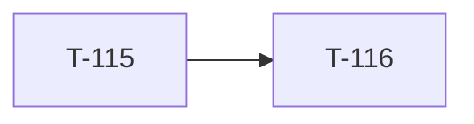

<!-- AUTO-GENERATED by ./scripts/ticket sync — DO NOT EDIT -->

# Ticket Lead Dashboard

## Running / Review

- **T-331** (3147) — content_golden.sql seeds literal NULLs, so the matches columns cannot be constrained [running] — FOUND by T-228 while constraining role_played; blocking two thirds of that work and not in its owned directory.

`seeds/content_golden.sql:358-369` inserts literal NULL into `matches.aar_replay_url` (2 rows) and `matches.winning_faction` (1 row), under ON CONFLICT (id) DO UPDATE SET ... = EXCLUDED.... **That seed is where the operator's live NULLs came from.** T-228 measured both branches on a pg_dump copy rather than arguing them:
  - WITH the NOT NULL constraint: `psql < seeds/content_golden.sql` fails `ERROR: null value in column "aar_replay_url" ... violates not-null constraint`, exit 3, failing row rf-match-20260704-01.
  - WITHOUT it: the backfill clears the NULLs, then re-running the seed puts all three back. A backfill-only migration is self-defeating.

So three `NULL` -> `''` edits at seeds/content_golden.sql:358-369 must land in the SAME commit as the constraint. The exact DDL is already recorded as a comment block at the foot of migrations/0009_role_played_not_null.sql so it does not need re-deriving.

`''` destroys no meaning here and that was checked, not assumed: the mod omits winning_faction from the payload entirely when there is no winner (TBD_ResultsReporter.c:18,546), `outcome` carries pending/failure/aborted, and telemetry.rs:519 already writes COALESCE($8, '') on create — `''` is the canonical no-winner on the only write path that exists.

NOT urgent: `make seed` (Makefile:25-26) does NOT apply content_golden.sql — it is a manual operator tool, so this is not CI-red today. It would make the golden DB un-rebuildable once the constraint lands. Do NOT touch match_player_stats.command_win, which T-228 checked and left alone: NULL there is a real third state (not a command slot / not adjudicated), distinct from false, and already Option<bool> on both sides.

SCOPE WIDENED 2026-07-26 by T-324, which found a SECOND fixture bug in the same file and corrected my diagnosis of it.

seeds/content_golden.sql:623 and :650 hand-INSERT user 000000000000000005 onto BLUFOR/Alpha#1 AND OPFOR/Recon#1 (fixture UUIDs 00000000-0000-4000-5000-0000000000{05,15}) — one user, two seats. I had told T-324 this row came from the assign_slot handler. IT CANNOT HAVE: assign_slot upserts the registration (slot_id = EXCLUDED.slot_id), so it would have repointed the row at OPFOR, and the registration names the EARLIER seat. Neither handler can produce this shape. It is hand-written fixture data.

WHY THIS MATTERS BEYOND TIDINESS: it means T-228's partial unique index on orbat_slots(event_mission_id, assigned_to) WHERE assigned_to IS NOT NULL is NOT blocked by production data — it is blocked by this one seed file. T-324 verified the index against every handler path in a scratch DB (register move, bench, idempotent re-claim, assign, withdraw promotion, race-loser 409, reservation 409) and its fix COMPOSES with it. It also proved the ordering is what makes it compose: release-then-claim commits cleanly, claim-then-release raises 23505.

So fixing these two seed rows converts the double-seat invariant from handler DISCIPLINE into a STRUCTURAL guarantee. That is the real prize here.

ONE BLOCKER when the index lands: tests/events.rs:540 seeds the legacy two-seat state that T-318's recovery regression needs, and a partial unique index cannot be DEFERRABLE. Either drop the index around that seed or retire the assertion — decide deliberately, it is testing a real recovery path.

THIRD SCOPE ITEM, from T-330: `missions.created_at` AND `missions.updated_at` are `timestamp with time zone` with NO NOT NULL and NO DEFAULT (0001_initial_schema.sql:374-375). That is structurally unlike 0003_registry_compat.sql:14 and 0006_user_factions.sql:13, which are both `DEFAULT now() NOT NULL`. So ANY hand-written INSERT that omits either column stores NULL — and CLAUDE.md documents `psql` as an ops path, so hand-written INSERTs are expected.

T-330 hit this concretely: a two-argument COALESCE(updated_at, created_at) would STILL have 500'd, because created_at can be NULL too. It needed a three-link chain terminating in the Go zero time. The durable fix is `SET DEFAULT now()` + `SET NOT NULL` on both columns after a backfill — the same conclusion T-325 reached for the text columns, in the same directory, so do them together.

== DEFERRED 2026-07-26 BY OPERATOR DECISION, NOT CANCELLED ==
Recording a bug is most of its value; fixing it now is optional. The audits that produced this ticket were generating work faster than the run could close it, and the original T-182..T-297 feature backlog had not moved in hours. The operator's call, verbatim in substance: there will always be bugs, that is what developing is — knowing them is good, but spending the token budget on things that do not need fixing right now means nothing ships.
This is findable, fully diagnosed, and reproducible from the notes above. Promote it to `idea` when it actually blocks something, when it starts costing real time, or after the feature backlog lands. Nothing here was judged wrong — only not now.
- **T-356** (3172) — The other side of the armory join has the identical defect, still open [running] — FOUND by T-346 while proving why it must NOT trim. This is the mirror image of T-346, on the other side of the same join, and it produces the same user-visible empty dossier card from the opposite direction.

`crates/map-engine-core/src/mission/orbat.rs:23-25` — OrbatSquadTemplate.faction is #[serde(default)] and untrimmed. `apps/website/api/src/handlers/events.rs:391` binds it straight into orbat_slots.faction with no normalisation. So attaching a mission with no `faction` key stores `""`, and a padded one stores the padding.

WHY THIS MATTERS MORE THAN IT LOOKS: T-346 deliberately chose require-and-refuse over trimming precisely BECAUSE this side does not normalise — ORBAT "  USA  " plus armory "  USA  " renders correctly today, and a one-sided trim would have broken it. Fixing this side makes the whole join consistent and only then is normalising either side safe. Until then both sides must keep storing bytes verbatim.

So: apply the SAME shape T-346 used — require the field, refuse a value that differs from its trimmed form, store verbatim. Do NOT trim one side. If you decide to normalise both sides together, that is a defensible larger change, but it needs a migration for the live rows (orbat_slots holds 18 rows today) and it must land as one commit.

Read T-346's work on main first; it is the reference implementation and its test pins the over-rejection direction too.

NEW ASYMMETRY SINCE T-346, flagged by T-357 rather than buried: T-346 now REJECTS a whitespace-only ARMORY faction (`it.faction.trim().is_empty()` -> 400) while the ORBAT side still ACCEPTS one. So a whitespace-only ORBAT faction is now PERMANENTLY UNMATCHABLE — no armory row can legally be created that would join to it. That is an additional argument for require-and-refuse on this side, which would reject "\t" symmetrically.

Also from T-357, which ran the real pipeline: a TAB-only editor key DOES validate and DOES land verbatim in orbat_slots.faction — but `slug_key` neutralises it to the `faction` fallback on the COMPILED path, so there is no wire hazard downstream. The damage is confined to the DB column and the join, which is exactly this ticket.

== DEFERRED 2026-07-26 BY OPERATOR DECISION, NOT CANCELLED ==
Recording a bug is most of its value; fixing it now is optional. The audits that produced this ticket were generating work faster than the run could close it, and the original T-182..T-297 feature backlog had not moved in hours. The operator's call, verbatim in substance: there will always be bugs, that is what developing is — knowing them is good, but spending the token budget on things that do not need fixing right now means nothing ships.
This is findable, fully diagnosed, and reproducible from the notes above. Promote it to `idea` when it actually blocks something, when it starts costing real time, or after the feature backlog lands. Nothing here was judged wrong — only not now.
- **T-377** (3193) — PATCH and the compiler hold opposite meanings for an empty weather string [running] — TWO HALVES OF ONE T-192 FIX DISAGREEING, and the only defence is client-side.

handlers/missions.rs:48-56 — `valid_weather` maps `"" | "clear"` to `WeatherType::Clear`. So PATCH /missions/:id with `{"weather": ""}` **silently rewrites a stored `dense_fog` to `clear` and answers 200.**

services/mission_compile.rs:127-136 does the opposite, deliberately, and says so at :126: `weather_preset("")` returns None so that 'an absent value must fall through to the row, not overwrite it.' And :32-36 documents that the editor MIRRORS meta.environment.weather to the row through this exact PATCH. So the compiler treats "" as 'not authored, keep the row' and the PATCH treats it as 'set clear'.

**The defence is in the client, not the server:** frontend/src/eden_chrome.rs:706-710 guards with `if value.is_empty() || !is_mission_row_id(&id) { return; }`. Any direct API caller — curl, the mod, a future client — reaches the hole.

Fix: drop "" from valid_weather's clear arm so both halves agree that blank means not-authored. Same handler, also unguarded and worth the same pass: `title` (:393-395, and create at :296 DOES reject empty, so the two disagree), `custom_terrain_name`, `briefing`, `thumbnail_url` (:430-435 — defensible for the last two). And `time_of_day: ""` binds `''::time`, a Postgres cast error, so it 500s rather than blanking — already relayed to T-367.

== DEFERRED 2026-07-26 BY OPERATOR DECISION, NOT CANCELLED ==
Recording a bug is most of its value; fixing it now is optional. The audits that produced this ticket were generating work faster than the run could close it, and the original T-182..T-297 feature backlog had not moved in hours. The operator's call, verbatim in substance: there will always be bugs, that is what developing is — knowing them is good, but spending the token budget on things that do not need fixing right now means nothing ships.
This is findable, fully diagnosed, and reproducible from the notes above. Promote it to `idea` when it actually blocks something, when it starts costing real time, or after the feature backlog lands. Nothing here was judged wrong — only not now.
- **T-508** (3348) — W43 hotfix: aar_replay_url_backfill IT vs T-331 NOT NULL [running] — Wave 43 cold gate FAIL. T-331 migration 0015 SET NOT NULL on matches.aar_replay_url (canonical empty is ''). tests/aar_replay_url_backfill.rs still plants NULL and expects migration 0010 to SET NULL for scrubbed rows — INSERT fails 23502. Cure: align 0010 scrub target to '' (same canonical empty as T-331/telemetry COALESCE), rewrite the IT plant/assert for NOT NULL (prove NULL insert rejected; scrubbed rows become '' not NULL; kept '' still kept). Do not weaken 0015. Perturbation RED required.

## Ready

- **T-090** (900) — Map visualization program [ready] — Map Engine v2 through sea-band + contours @ `bd481cf1`. **Active:** **T-090.5.5** tree/veg/prop glyphs. Single lane.

## Next queued (top 10)

- **T-072** (720) — Ctrl multi-place [queued] — Hold Ctrl to place multiple copies without re-selecting asset.
- **T-073** (730) — Shift + map rotation [queued] — Shift-drag and map rotation widget for placed entities.
- **T-075** (750) — Spacebar flyTo vs widget [queued] — Spacebar centers selection; resolve flyTo vs transform widget conflict.
- **T-116** (1160) — Results POST to backend [queued] — SPLIT 2026-07-26. Mod half SHIPPED: TBD_ResultsReporter.c (682 lines, T-181.13.1) POSTs to /api/v1/ingest/match-results. Website half OPEN and folded into T-232 — event_hub.rs renders no result/outcome/match data at all. This row now tracks only the website half.
- **T-117** (1170) — Mission upload + validation UI [queued] — Web UI for mission upload and schema validation (API exists).
- **T-118** (1180) — Event ORBAT + identity linking UI [queued] — SPLIT 2026-07-26. DONE: identity-link UI (settings.rs:6-9,74-94, T-159.25) and the ORBAT selector (event_hub.rs:520-572, T-159.25a). OPEN residual is tracked by T-226 (PATCH /events/{id} has no caller), T-284 (clear_slot unreachable, admin cannot free a claimed slot) and T-231 (identity last mile). This row is a pointer, not work.
- **T-120** (1200) — Staging soak + golden mission smoke [queued] — Pinned game/mod version soak; golden-mission smoke on staging server.
- **T-146** (1470) — Asset Browser Data Wiring [queued] — Hook up T-150 registry items (vehicles/crates/…) to Asset Browser for map drag-place. Unblocked by T-150; after or parallel T-068.9 ingest preferred.
- **T-170** (1670) — Prod default flip to Leptos SPA [queued] — Make the Leptos SPA the production default: set `SPA_DIST_DIR` to the trunk release dist in the prod env, move the Discord OAuth redirect origin, staging soak, then flip. OPERATOR-GATED (env + Discord app settings are operator-held); claude-code prepares configs/runbook + verifies the staging soak gates. Runbook anchor: docs/website/DEV_RUNBOOK.md §SPA serving; T-159 finish program left this as the sole operator-gated residual.

## Dependency graph (scoped)

```mermaid
flowchart LR
  T115[T-115] --> T116[T-116]
```
