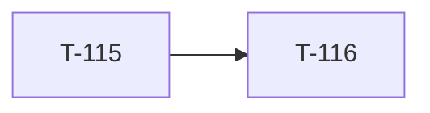

<!-- AUTO-GENERATED by ./scripts/ticket sync — DO NOT EDIT -->

# Ticket Lead Dashboard

## Running / Review

- **T-499** (3334) — admin_field roles/sync still demotes all users in shared IT DB [running] — Wave 38 residual from T-400. identity_link/factions/telemetry isolated. admin_field.rs POST /admin/roles/sync still loops every users row and demotes anyone without user_discord_roles — fires inside the suite against shared rows. Cure: scope sync to fixture actors or skip in IT / use private actors for asserts.
- **T-500** (3340) — mission_compile does not run cargo wire_safety (Save-only refuse) [running] — Wave 39 adversarial residual (CLEAN). T-416 wires Save Version via load_cargo_phys_catalog + validate_mission_editor_payload_with_catalog. Production mission_compile.rs does not call scan_cargo_capacity — pre-existing over-capacity versions can still compile until re-saved. Cure: pass CargoPhysCatalog into the compile gate (same table as Save) or document compile-as-trust-saved with a Class-R that compile path mentions the Save refuse.
- **T-537** (3377) — xtask empty/lossy write residuals outside T-383 owns (enf/world/map) [running] — FOUND as T-383 residual (W51 CLEAN). Owns fixed cmds/sync/schema_gates; still open:
- enf/apidoc.rs header-only TSV overwrite exits 0
- world/aux.rs:1009/1022/1050, world/build.rs:664/958
- map/labels.rs:455, map/sap.rs:1007

Same shape: success path writing structurally empty/lossy content over committed files. Cure: refuse_empty_write (or equivalent) at each site. Repro: see T-383 summary.

## Ready

- **T-090** (900) — Map visualization program [ready] — Map Engine v2 through sea-band + contours @ `bd481cf1`. **Active:** **T-090.5.5** tree/veg/prop glyphs. Single lane.

## Next queued (top 10)

- **T-072** (720) — Ctrl multi-place [queued] — Hold Ctrl to place multiple copies without re-selecting asset.
- **T-073** (730) — Shift + map rotation [queued] — Shift-drag and map rotation widget for placed entities.
- **T-075** (750) — Spacebar flyTo vs widget [queued] — Spacebar centers selection; resolve flyTo vs transform widget conflict.
- **T-116** (1160) — Results POST to backend [queued] — SPLIT 2026-07-26. Mod half SHIPPED: TBD_ResultsReporter.c (682 lines, T-181.13.1) POSTs to /api/v1/ingest/match-results. Website half OPEN and folded into T-232 — event_hub.rs renders no result/outcome/match data at all. This row now tracks only the website half.
- **T-117** (1170) — Mission upload + validation UI [queued] — Web UI for mission upload and schema validation (API exists).
- **T-118** (1180) — Event ORBAT + identity linking UI [queued] — SPLIT 2026-07-26. DONE: identity-link UI (settings.rs:6-9,74-94, T-159.25) and the ORBAT selector (event_hub.rs:520-572, T-159.25a). OPEN residual is tracked by T-226 (PATCH /events/{id} has no caller), T-284 (clear_slot unreachable, admin cannot free a claimed slot) and T-231 (identity last mile). This row is a pointer, not work.
- **T-120** (1200) — Staging soak + golden mission smoke [queued] — Pinned game/mod version soak; golden-mission smoke on staging server.
- **T-146** (1470) — Asset Browser Data Wiring [queued] — Hook up T-150 registry items (vehicles/crates/…) to Asset Browser for map drag-place. Unblocked by T-150; after or parallel T-068.9 ingest preferred.
- **T-170** (1670) — Prod default flip to Leptos SPA [queued] — Make the Leptos SPA the production default: set `SPA_DIST_DIR` to the trunk release dist in the prod env, move the Discord OAuth redirect origin, staging soak, then flip. OPERATOR-GATED (env + Discord app settings are operator-held); claude-code prepares configs/runbook + verifies the staging soak gates. Runbook anchor: docs/website/DEV_RUNBOOK.md §SPA serving; T-159 finish program left this as the sole operator-gated residual.

## Dependency graph (scoped)

```mermaid
flowchart LR
  T115[T-115] --> T116[T-116]
```
