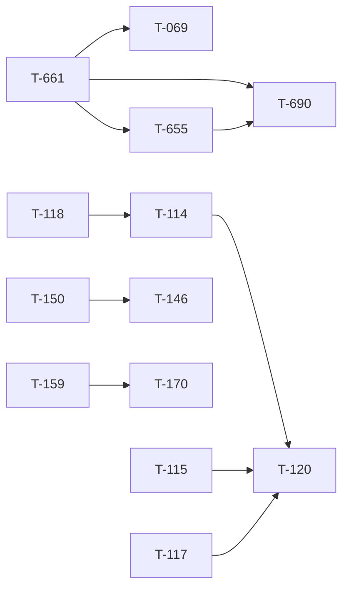

<!-- AUTO-GENERATED by ./scripts/ticket sync — DO NOT EDIT -->

# Ticket Lead Dashboard

## Running / Review

## Ready

- **T-090** (900) — Map visualization program [ready] — Map Engine v2 through sea-band + contours @ `bd481cf1`. **Active:** **T-090.5.5** tree/veg/prop glyphs. Single lane.

## Next queued (top 10)

- **T-120** (1200) — Staging soak + golden mission smoke [queued] — Pinned game/mod version soak; golden-mission smoke on staging server.
- **T-146** (1470) — Asset Browser Data Wiring [queued] — Hook up T-150 registry items (vehicles/crates/…) to Asset Browser for map drag-place. Unblocked by T-150; after or parallel T-068.9 ingest preferred.
- **T-170** (1670) — Prod default flip to Leptos SPA [queued] — Make the Leptos SPA the production default: set `SPA_DIST_DIR` to the trunk release dist in the prod env, move the Discord OAuth redirect origin, staging soak, then flip. OPERATOR-GATED (env + Discord app settings are operator-held); claude-code prepares configs/runbook + verifies the staging soak gates. Runbook anchor: docs/website/DEV_RUNBOOK.md §SPA serving; T-159 finish program left this as the sole operator-gated residual.
- **T-069** (4180) — Markers on map — the four schema-carried fields [queued] — PROMOTED, RESCOPED, AND MERGED WITH T-213 (cancelled in favour of this row — the two were the same job under two names). Keeps this id because it owns the in-code stub message and the test that pins it. SCOPE: the four schema-carried fields only — `ATTR-FIELD-MRK-TYPE`, `-MRK-TEXT`, `-MRK-POSITION` against `$defs/marker` = {x, z, icon, label}, plus `RIGHT-MODE-006`. Marker STYLE (size / rotation / shape / brush / colour / alpha) and Eden's whole second Area-marker model are a $defs/marker widening and are a workbench ticket that must ship AFTER this one, or this converts from a factory ticket into a workbench one. This is the one absent-entity family that is factory-dispatchable today, because $defs/marker already declares the four fields and the icon enum is closed at 64 aliases, so the marker CORE needs no schema edit at all. TWO DEAD PREMISES TO FIX BEFORE STARTING: T-213's spec cited a `state/schema.ts` that no longer exists (the React tree was deleted at T-159.29.3), and THIS TICKET'S OWN SPEC PREMISE at docs/specs/Mission_Creator_Architecture/t069_markers_on_map.md IS CONFIRMED DEAD — rewrite it first. Code: the whole right-dock stub — tab button `{tab_btn(2, "Markers")}` at eden_chrome.rs:3046 and a body that is the `_ =>` fallthrough arm reading "Marker placement lands in T-069." at :3337; PaletteKind :1833 has three variants and needs a fourth. `grep -c marker editor_ops.rs` -> 0: not one marker command exists in the SPA's mutation surface. In store.rs `markersById` is a declared root :355 with `marker_any(id, x, z, icon, label)` :3048 and `marker_row_id` :3033 already written, but the ONLY two mutators — `set_faction_briefing_marker` :2030 and `remove_faction_briefing_marker` :2070 — are faction-briefing scoped with zero product callers, so free placement needs generic add/move/remove. RENDER PATH, graded medium and the thing to check FIRST: `crates/map-engine-render/src/draw_order.rs` declares every lane (`LaneRole` :9; mission lanes MissionZones :55, SquadLinks :57, MissionVehicles, Slots) and there is NO marker lane, and `upload_icon_lane` (engine.rs:3555) is a CLOSED three-arm match over world assets. All 10 `marker` hits in that 6,302-line file were read and none is a mission marker. BUT if markers can ride the slot SoA that editor_ops.rs already uploads via `core.materialize()`, BOTH crate paths drop and this ticket stops touching map-engine-render at all. Trace `slots_gpu` before assuming the lane.
- **T-690** (4185) — Compile becomes a compiler: structured diagnostics instead of a toast [queued] — The U7 item from framework_synthesis.md C.2, ranked 7 of 16, and the row that FEEDS T-655's panel. fnf_v4.md:713-715 (13.1) rates "the export hook that makes Eden a compiler" as the single thing FNF v4 does better than anyone else: `init3DEN.sqf` turns Export-to-Multiplayer into a build step that derives group names, rewrites sync links, toggles markers, strips inventories, restores every mutation, wraps the lot in `collect3DENHistory` as ONE undo step, and self-heals on next open if a previous export left scaffolding behind — "No other Arma framework I've seen treats the editor as a compilation front-end this deliberately." TBD ALREADY HAS THE BUILD STEP AND NONE OF THE BUILD SYSTEM: `apps/website/frontend/src/mission_commands.rs`:23 `compiled_export_text`, :186 `compiled_document_json`, :237 the download error path, over `crates/map-engine-core/src/mission/compile.rs`. Everything the compile learns today is thrown away or flattened into a pass/fail. Scope: give the compile a structured result — a list of findings with severity, a stable rule id, the owning entity id and a message — returned alongside the bytes rather than instead of them, and rendered in T-655's panel. THE FIRST CONTENT IS ALREADY WRITTEN DOWN AND CURRENTLY SILENT: `crates/map-engine-core/src/mission/flatten.rs`:2584-2649 is the T-216 drop ledger — six author-facing values the compile silently discards (a squad's leaderSlotId, a slot's tag / callsign / rank / stance, and the entire vehicle roster) — and it records that `make verify-t180` stayed green throughout BECAUSE NOT ONE OF ITS 22 TESTS CHECKED. Each of those six is a diagnostic this ticket can emit on day one, and each stays emitted until T-674/T-675 land the schema half. TWO RULES CARRIED FROM THE CORPUS: diagnostics are NEVER debug-gated (fnf_v4.md 14.9 — v4's shipped state is the un-diagnosable one; T-635 gates telemetry, not correctness), and no severity may fire on correct input (fnf_tooling.md 1.3 — the Analyzer's role accordion can never go green). Depends on T-655 for the surface; owns only the compiler and the command layer so the panel stays a single claimant.
- **T-672** (4190) — Connection graph: draw, sync, delete, formation [queued] — The connection-graph quarter of the split T-079. Ids: `CONN-START-001`, `CONN-SYNC-001`, `CONN-DEL-001`, `ACTION-FORM-001`, `CTX-FORMATION-001`. HARD DEPENDENCY on T-664 — two of those are context-menu items by definition. Code: drag-from-entity-to-entity is a third gesture mode in `onpointerdown` (mission_editor.rs:1395) / `onpointerup` :1644; link create / sync / delete mutators in editor_ops.rs; a link map in store.rs; menu items in context_menu.rs. THE RENDER LANE MAY ALREADY EXIST: `LaneRole::SquadLinks` (crates/map-engine-render/src/draw_order.rs:57) is "T-180.4 — squad leader->member hairline links (under slot rings)" and its doc comment :49 groups it with Contours / ForestOutline as a flat LineList lane — exactly the primitive a connection graph needs. Either reuse it and drop draw_order.rs from owns, or add a MissionConnections peer. WARNING carried from the framework corpus: `CONN-SYNC-001` is a bare `missing` row in gap_analysis.md with no note, and FNF v4's ENTIRE defect cluster lives on exactly this mechanism — the inspector and the validation rules must precede the edges. Do not ship edges you cannot see or check.
- **T-671** (4200) — Mission presentation: briefing text and thumbnail [queued] — Closes `ATTR-FIELD-SCN-OVERVIEW-TEXT` and `-SCN-PICTURE`, and it is the highest value-per-unit-effort row in the attributes sweep: THE API ALREADY ACCEPTS BOTH AND THERE IS NO CALLER. `MissionDetail.briefing` (dto.rs:846) and `.thumbnail_url` :850 already exist and the PATCH body in apps/website/api/src/handlers/missions.rs already takes both (:657 / :658) — no backend change, no schema change. Blocks FNF-style derived briefings downstream. Note these are `missions` ROW COLUMNS, not `meta.*`, and the editor's only PATCH path is the RowMirror debounce machine (eden_chrome.rs:496-829, error surface :797) which today mirrors exactly two columns, `MIRROR_TIME` :501 and `MIRROR_WEATHER` :506 — authoring briefing in the editor adds a third. The editor surface is MissionSettingsDialog (eden_chrome.rs:3788, post-split eden_settings.rs; read :3788-3850 — Terrain readonly, Time, Weather, then flow + render prefs, and a briefing textarea plus a thumbnail field belong in the same overflow-y-auto column at :3834+), and create_mission_dialog.rs (227 lines, one component at :27) is the other surface that cannot set it today. PRODUCT CALL THE OPERATOR SHOULD MAKE BEFORE THIS STARTS: if briefing is authored in the Mission Library dossier instead of the editor, owns becomes `apps/website/frontend/src/mission_overview.rs` (1,412 lines) ALONE and the ticket becomes collision-free against the entire program. Both are defensible; the library version packs better.
- **T-084** (4210) — Classname / mod prefix search in the asset browser [queued] — PROMOTED — the cheapest ratio in the interactions sweep: four ids against one function. `RIGHT-SEARCH-002/003/004/005` are all pattern parsing in front of `pub fn filter_catalog(nodes, query)` at `apps/website/frontend/src/asset_catalog.rs`:396, read in full (:390-414): it lowercases the query and does a LABEL SUBSTRING match with a self-match/descendant-match rule, and there is NO PREFIX PARSING OF ANY KIND. Add the grammar in front of it. The three call sites are all inside DockRight (post-split eden_dock_right.rs): :3163 Objects, :3218 Factions, :3306 Vehicles; the two `type="search"` inputs are :3112 (shared Factions/Objects, signals `search` :2990 / `object_search` :3012) and :3253 (`vehicle_search` :3009) — placeholder and hint copy change there. COORDINATE WITH T-646, which lands earlier and also touches filter_catalog for `class:` search and the submode chips: T-646 owns the submode/crew work, this row owns the prefix/pattern grammar, and whichever runs second builds on the other. `Ctrl+F`-focuses-search was considered for this ticket and deliberately routed elsewhere — folding it in here would have cost a full wave (see T-662).
- **T-637** (4220) — Dock density and the 240px equalisation [queued] — RESCOPED by editor_chrome_direction.md and it ABSORBS T-632 (cancelled in favour of this row). Two halves that turned out to be one job. (1) EQUALISATION: Eden is 240/240 in every one of the 75 screenshots; we are 256 left and ~310 right, and the right dock's fifth tab (MANAGE) runs off the viewport at x~1908 — that clipping is a SYMPTOM of the width, which is why T-632 folds in here rather than standing as its own ticket. Eden fits six cells in 240 px by using F-key labels only, no words. (2) DENSITY: the left dock is EDITOR LAYERS plus one row, then ~900 px of void, with five unlabelled icon buttons marooned at the bottom edge; the right dock is a 2-node tree then void. Eden fills its 240 px with a tab strip, a category strip, a filter-chip row, a search row and a dense 15.8 px-pitch tree. This is a layout question, not a spacing tweak. FINDING THAT SHOULD BE IN THE FIX: the five marooned buttons are the `strip_btn(...)` calls at eden_chrome.rs:2857-2861 inside a `class="mt-auto ..."` row :2856 — `mt-auto` IS the marooning — and their tooltips read "Hierarchy (visual only)", "Layers (visual only)", "Assets (visual only)", "History (visual only)", "Settings (visual only)", with only the first passing active=true. THEY ARE DECORATION, NOT CONTROLS. The tree renderer to densify is ROW_H = 24.0 :1525 / `virtual_tree` :1711 (post-split eden_tree.rs). WHY THIS TICKET RUNS ALONE IN ITS OWN WAVE: equalising the dock widths pulls in DOCK_LEFT_PX and DOCK_RIGHT_PX, and those constants are read by three files — select_tool.rs unprojects the pointer with them and mission_editor.rs sizes the wgpu canvas with them (mount points confirmed at mission_editor.rs:2052 DockLeft, :2059 DockRight, :2070 BottomToolbelt). That turns a single-module cosmetic ticket into a six-file geometry-and-input ticket, and mission_editor.rs has no spare capacity left in any earlier wave.
- **T-673** (4300) — Marker style and Area markers — the $defs/marker widening [queued] — Six attribute ids: `ATTR-FIELD-MRK-SIZE`, `-MRK-ROTATION`, `-MRK-SHAPE`, `-MRK-BRUSH`, `-MRK-COLOR`, `-MRK-ALPHA`. BLOCKING EVIDENCE: `$defs/marker` in the compiled schema is exactly {x, z, icon, label} and CLOSED — the compiled schema carries 25 `"additionalProperties": false`, so these fields are contract-blocked, not merely unbuilt. Icon-vs-Area is Eden's entire second marker model, so this is a widening plus a mod-side reader, not a UI ticket. MUST SHIP AFTER T-069, which authors the four schema-carried fields; folding these into T-069 would convert a factory-dispatchable ticket into a workbench one, which is the specific mistake this split exists to prevent. EXECUTOR IS `workbench` DELIBERATELY: this modifies `packages/tbd-schema/schema/mission.schema.json` and/or `apps/mod/tbd-framework/`, which the CLAUDE.md executor gate puts out of reach of any coding agent. The factory filters on executor, so this tagging is the safety mechanism — do not flip it to claude-code.

EXECUTOR CORRECTED 2026-08-02: was filed `workbench` on the mistaken reading that any .c file needs the Arma Workbench GUI. It does not — scripts/mod/compile.sh compiles tbd-framework against the native Linux dedicated server headlessly, verified: "OK: compiled clean, 5707 files, 11182 classes, 832 ms, no Workbench". Schema edits are plain JSON. This is factory work. Per the model-routing rule, the .c portion routes to Fable 5 even though the executor is claude-code.

SCHEMA HALF SPLIT OUT to T-706 (one widening pass for the whole program). This ticket is the Enfusion reader plus any editor UI; it does not touch packages/tbd-schema.

## Dependency graph (scoped)

```mermaid
flowchart LR
  T661[T-661] --> T069[T-069]
  T118[T-118] --> T114[T-114]
  T114[T-114] --> T120[T-120]
  T115[T-115] --> T120[T-120]
  T117[T-117] --> T120[T-120]
  T150[T-150] --> T146[T-146]
  T159[T-159] --> T170[T-170]
  T661[T-661] --> T655[T-655]
  T661[T-661] --> T690[T-690]
  T655[T-655] --> T690[T-690]
```
