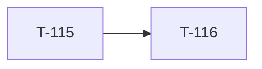

<!-- AUTO-GENERATED by ./scripts/ticket sync — DO NOT EDIT -->

# Ticket Lead Dashboard

## Running / Review

- **T-558** (3411) — Test-harness residue after T-534: a DB consumer the Class-R cannot see, unpruned rust_it DBs, and one shared migrate DB [running] — Four findings from T-534, none of them regressions, all of them the same shape it just fixed.

1. `apps/website/api/src/services/registry_import.rs:455` -- a THIRTIETH database consumer that the
   T-542 Class-R guard cannot see. An in-crate `#[tokio::test]` reads TEST_DATABASE_URL raw and
   migrates the operator's BASE database. It is the only DB test in the lib target, self-cleaning and
   idempotent, so it is deterministic today -- and it now has the base database entirely to itself
   because T-534 moved everything else onto per-binary DBs. The real gap:
   `t542_no_raw_test_database_url_reads_outside_common` scans only `tests/*.rs`. Extend it to `src/`
   and this class stops being invisible.

2. `make test-it` now leaves 25 `rust_it_<suite>_it` databases behind. They are recreated per run so
   they do not grow, but nothing prunes them -- the Makefile drops only `rust_it`. `Makefile` was
   outside T-534's scope. (The GATE path is handled: T-534 extended `prune_old_gate_wave_dbs` in
   wave.sh to reap derived names on the same keep-N-and-N-1 policy.)

3. `tests/db_migrate.rs` and `tests/models_fromrow.rs` still SHARE one `MIGRATE_TEST_DATABASE_URL`.
   Two binaries, one database -- the exact shape T-534 removed everywhere else. Deterministic today
   only because cargo runs targets sequentially and both use `>=`/count assertions the sibling's rows
   do not move. It survives on ordering, which is what this program keeps paying for.

4. Two concurrent `cargo test` runs against the same base still race, now on `<base>_<suite>_it`
   rather than on `<base>`. No worse than before, and the gate lock already serialises the gate --
   recorded so nobody rediscovers it as new.
- **T-559** (3412) — T-554 Class-R soft contains — comment decoy opt(&row.briefing) stays green [running] — FOUND by W63 adversarial verifier (DIRTY MAJOR) after T-554.

hydrate_wires_row_briefing_into_apply_row_meta only asserts body.contains("opt(&row.briefing)").
W62 None mutation FAILS (good). Both wires → None + `// decoy opt(&row.briefing)` inside each fn → PASS.

Repro: in mission_hydrate.rs replace both opt(&row.briefing) with None but leave a comment containing the substring in adopt_payload and apply_row; cargo test -p website-frontend hydrate_wires_row_briefing still green.
- **T-560** (3413) — T-557 Class-R hollow — comment COALESCE / bind-form INSERT still races [running] — FOUND by W63 adversarial verifier (DIRTY MAJOR) after T-557.

t534_dev_login_prime_literals_still_match_handler greps COALESCE(arma_id and bans only the literal '', 'dev-arma-…' stamp.
Comment `// COALESCE(arma_id` + remove real UPDATE → PASS.
INSERT arma_id = $3 + comment COALESCE (no real UPDATE) → PASS; barrier probe 3× idx_users_arma_id hits.

Product NULL+COALESCE path holds (0 race hits). Pin does not.

Repro: keep ON CONFLICT (discord_id), stamp arma_id via bind $N in INSERT VALUES, replace live COALESCE UPDATE with a comment containing COALESCE(arma_id; Class-R green; concurrent cold dev-login 23505 again.

## Ready

- **T-090** (900) — Map visualization program [ready] — Map Engine v2 through sea-band + contours @ `bd481cf1`. **Active:** **T-090.5.5** tree/veg/prop glyphs. Single lane.

## Next queued (top 10)

- **T-072** (720) — Ctrl multi-place [queued] — Hold Ctrl to place multiple copies without re-selecting asset.
- **T-073** (730) — Shift + map rotation [queued] — Shift-drag and map rotation widget for placed entities.
- **T-075** (750) — Spacebar flyTo vs widget [queued] — Spacebar centers selection; resolve flyTo vs transform widget conflict.
- **T-116** (1160) — Results POST to backend [queued] — SPLIT 2026-07-26. Mod half SHIPPED: TBD_ResultsReporter.c (682 lines, T-181.13.1) POSTs to /api/v1/ingest/match-results. Website half OPEN and folded into T-232 — event_hub.rs renders no result/outcome/match data at all. This row now tracks only the website half.
- **T-117** (1170) — Mission upload + validation UI [queued] — Web UI for mission upload and schema validation (API exists).
- **T-118** (1180) — Event ORBAT + identity linking UI [queued] — SPLIT 2026-07-26. DONE: identity-link UI (settings.rs:6-9,74-94, T-159.25) and the ORBAT selector (event_hub.rs:520-572, T-159.25a). OPEN residual is tracked by T-226 (PATCH /events/{id} has no caller), T-284 (clear_slot unreachable, admin cannot free a claimed slot) and T-231 (identity last mile). This row is a pointer, not work.
- **T-120** (1200) — Staging soak + golden mission smoke [queued] — Pinned game/mod version soak; golden-mission smoke on staging server.
- **T-146** (1470) — Asset Browser Data Wiring [queued] — Hook up T-150 registry items (vehicles/crates/…) to Asset Browser for map drag-place. Unblocked by T-150; after or parallel T-068.9 ingest preferred.
- **T-170** (1670) — Prod default flip to Leptos SPA [queued] — Make the Leptos SPA the production default: set `SPA_DIST_DIR` to the trunk release dist in the prod env, move the Discord OAuth redirect origin, staging soak, then flip. OPERATOR-GATED (env + Discord app settings are operator-held); claude-code prepares configs/runbook + verifies the staging soak gates. Runbook anchor: docs/website/DEV_RUNBOOK.md §SPA serving; T-159 finish program left this as the sole operator-gated residual.

## Dependency graph (scoped)

```mermaid
flowchart LR
  T115[T-115] --> T116[T-116]
```
