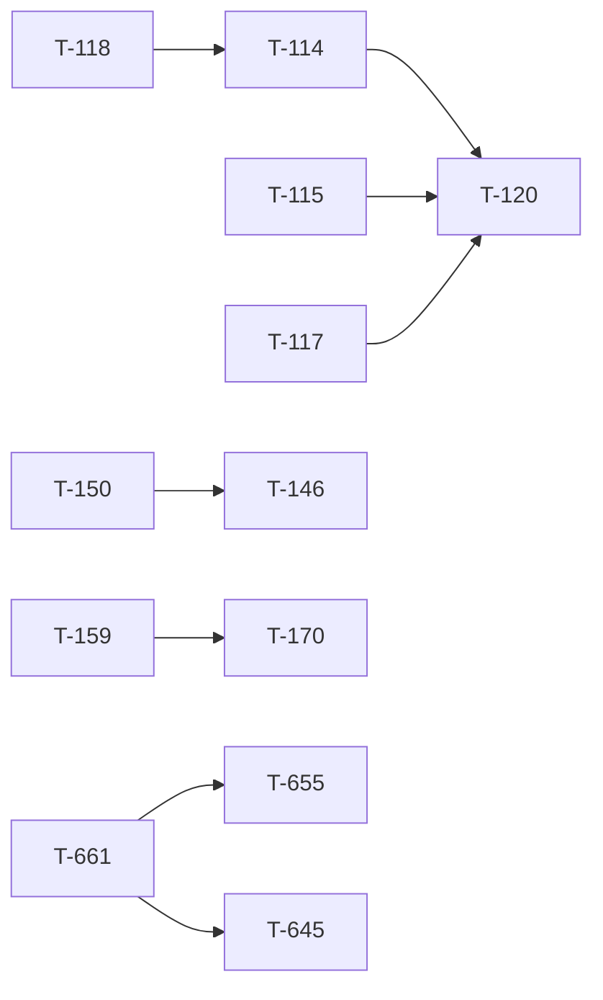

<!-- AUTO-GENERATED by ./scripts/ticket sync — DO NOT EDIT -->

# Ticket Lead Dashboard

## Running / Review

## Ready

- **T-090** (900) — Map visualization program [ready] — Map Engine v2 through sea-band + contours @ `bd481cf1`. **Active:** **T-090.5.5** tree/veg/prop glyphs. Single lane.

## Next queued (top 10)

- **T-120** (1200) — Staging soak + golden mission smoke [queued] — Pinned game/mod version soak; golden-mission smoke on staging server.
- **T-146** (1470) — Asset Browser Data Wiring [queued] — Hook up T-150 registry items (vehicles/crates/…) to Asset Browser for map drag-place. Unblocked by T-150; after or parallel T-068.9 ingest preferred.
- **T-170** (1670) — Prod default flip to Leptos SPA [queued] — Make the Leptos SPA the production default: set `SPA_DIST_DIR` to the trunk release dist in the prod env, move the Discord OAuth redirect origin, staging soak, then flip. OPERATOR-GATED (env + Discord app settings are operator-held); claude-code prepares configs/runbook + verifies the staging soak gates. Runbook anchor: docs/website/DEV_RUNBOOK.md §SPA serving; T-159 finish program left this as the sole operator-gated residual.
- **T-655** (4090) — Validation panel: persistent issue list with rollup [queued] — The surface for the validation group, and product order says it should ship FIRST within that group. The rollup ranks #2 of 10 in the tooling analysis and the reason is decisive: FNF commented THEIRS out inside an HTML comment, so a maker gets no summary of failures and every other check became invisible. Requirements: a persistent issue list with a rollup; CLICK-TO-SELECT findings, not a clipboard dump; a severity ladder with a legend; and NO SEVERITY THAT FIRES ON CORRECT INPUT. Validation is ALWAYS ON — not behind a debug flag, not on save, not on export (T-635 gates telemetry; correctness diagnostics are never gated). Code: no validation surface exists in the SPA, so a NEW `apps/website/frontend/src/validation_panel.rs` (module name INFERRED; wave 0 pre-declares the stub) plus the mount and the always-on re-evaluation tick in mission_editor.rs, where `MissionEditorPage` :642 owns every overlay mount (:2060-2110). DELIBERATE SCOPING DECISION: if the panel DOCKS rather than floats it also touches the dock chrome, and that single path would collide it with most of the program. Float it, or accept the serialisation and re-open the owns row. NOTE, unresolved and worth the operator's attention: the file graph would permit this ticket as early as wave 3, and both independent packings put it late. That is a product call, not a scheduling one, and it costs zero waves either way.
- **T-645** (4100) — Placement helpers: patterns, align, space, orient, garrison [queued] — The single highest-yield borrow in the 3den Enhanced catalogue, and what mission makers actually use all day. Placement Tools apply a pattern LIVE to the current selection: Circular / Line / Grid / Fill Area (scatter). Plus 6 align commands, 3 space-equally commands, 6 orient commands, and drag-to-garrison (drop a group on a building and it occupies firing positions). Not in the Eden gap table — it is 3den Enhanced's own addition. Code: every helper is a batched multi-slot transform and the existing batched mutators are in editor_ops.rs (`attrs_update_position` :667, `move_vehicles` :1877, `copy_selection` :394, `paste_at_cursor` :436); entry points go in the menu descriptor table `MENUS` (eden_chrome.rs:112-166, now eden_top_strip.rs); the pure pattern math goes in a NEW `apps/website/frontend/src/place_helpers.rs` (module name INFERRED, testable without a DOM; wave 0 pre-declares the stub). REQUIRED RULE, added from the corpus: bulk operations on a selection MUST CONFIRM and MUST BE UNDOABLE — undo grouping is an editor_ops concern. WOG's own tools invert this and neither of their destructive bulk ops is wrapped in undo. Drag-to-garrison needs building footprints from `crates/map-engine-core/src/world/obb.rs` (243 lines); INFERRED read-only and NOT claimed — if it turns out to need writing, that is a scope discovery worth its own row rather than a silent widening.
- **T-649** (4110) — Select All in view, and multi-edit per-field checkboxes [queued] — Closes `SEL-ALL-001` and `ATTR-MULTI-001` / `ATTR-MULTI-CHK-001`. Eden scopes Select All to what is ON SCREEN, not to the whole mission — copy that; it is a viewport-rect query and the marquee already has the exact primitive (`marquee_ids` select_tool.rs:276, `marquee_ids_with_vehicles` :308). `Ctrl+A` joins the existing keydown arms in mission_editor.rs:1019-1031 beside `KeyC` :1020 and `KeyV` :1023. Multi-edit: fields with differing values disable until a per-field checkbox opts them in; `apps/website/frontend/src/attributes.rs` has ZERO checkbox inputs today (tabs :16, field bodies :255-348). THE BLOCKING GUARD IS TWO IDENTICAL THREE-LINE BLOCKS in editor_ops.rs: `if ctx.selection.borrow().len() > 1 { return; }` at :583-585 in `open_attributes` and at :605-607 in `open_arsenal` — multi-select today SUPPRESSES THE MODAL ENTIRELY, and this ticket inverts that. Note T-082 collides with this row on attributes.rs and editor_ops.rs and is deliberately one wave later; if the operator prefers one ticket, fold T-082 in — the combined owns is unchanged from this row's and the program loses a wave slot for free.
- **T-686** (4115) — Loadout import — close the round-trip TBD has only half of [queued] — The U2 item from framework_synthesis.md C.2, ranked 6 of 16 ("Medium-high value, Small effort"). WOG is the ONLY framework in the corpus with a loadout ROUND-TRIP — GUI arsenal -> `WOG: EXPORT` -> clipboard -> `tpl/<faction>/<role>.sqf`, and `WOG: IMPORT` reads it back — and wog.md:814 states the gap it closes: "Most frameworks give you export only." TBD is currently in the export-only class: `apps/website/frontend/src/arsenal.rs`:1058-1066 gates through `try_export` (the T-240 refusal gate — a refusal produces no bytes) and hands the result to `download_json("loadout-export.json", ...)`; THERE IS NO INGEST PATH ANYWHERE (no file input in arsenal.rs). NO NEW FORMAT IS NEEDED: the document written is `packages/tbd-schema/schema/loadout-export.schema.json` v2, which already carries 7 closed objects, and `arsenal.rs`:489-596 already holds the file-vs-doc-field distinction that T-199 established. Scope: a file picker, a parse against the shipped schema, and one apply path onto the current Arsenal picks — plus the refusal behaviour that mirrors the export gate (a document that does not validate applies nothing and says why, rather than half-applying). REQUIRED, from the same corpus: re-use `rules::validate_loadout` / `cargo_capacity_errors` (arsenal_rules.rs:350-368) on the imported picks before commit — OFCRA's ~11 silent loadout data bugs are all schema errors a typed importer makes unrepresentable (ofcra_omtk.md 5.9, 14.1), and importing without validating would re-import them. Import must be one undo step.
- **T-669** (4120) — Clipboard completion: Ctrl+X cut, Ctrl+Shift+V paste-at-original [queued] — Closes `ACTION-CUT-001` and `ACTION-PASTE-ORIG-001`. Hours, not days: two match arms in the editor keydown, read in full at `apps/website/frontend/src/mission_editor.rs`:1019-1031 beside the existing `"KeyC" if modk && !alt && !shift` :1020 and `"KeyV" if modk && !alt && !shift` :1023. BOTH PRIMITIVES ALREADY EXIST — cut is `copy_selection` (editor_ops.rs:394) followed by `delete_selection` :327, and `paste_at_cursor(None, None)` :436 is LITERALLY paste-at-original because the anchor is optional. editor_ops.rs is deliberately NOT claimed: nothing there changes, which makes this one of only three tickets in the program that touch exactly one file.
- **T-082** (4130) — Attributes modal: entity type and a real role description field [queued] — PROMOTED AND SCOPED HARD, because as written "full attribute fields" would silently absorb 20 workbench ids against a 31-id OBJ family. SCOPE, stated so it cannot drift: `ATTR-FIELD-OBJ-TYPE` and `ATTR-FIELD-OBJ-ROLE-DESC` ONLY. `ATTR-MULTI-001` / `ATTR-MULTI-CHK-001` route to T-649. `OBJ-UNIT-NAME`, `OBJ-CALLSIGN`, `OBJ-RANK` and `OBJ-STANCE` are contract-blocked and route to the workbench program. Code: `apps/website/frontend/src/attributes.rs` is 367 lines; `identity_tab` :322 has `text_field("Role", ..., "Rifleman", ...)` :326 and `text_field("Tag", ..., "MED · ENG · SL...", ...)` :330, both writing through `attrs_update_slot`. `OBJ-ROLE-DESC` needs a SEPARATE description field — today `role` doubles as both — and `OBJ-TYPE` needs a type control that does not exist. THE REASON TYPE CANNOT BE CHANGED TODAY, and it is not the modal: `read_attrs` (editor_ops.rs:631) builds SlotAttrs from `core.materialize()` :637 and NEVER READS `assetId`, even though the core mutator exists at store.rs:1276. Writes go through `attrs_update_slot` :796. Collides with T-649 on both paths; one wave apart by design.
- **T-651** (4140) — Editor comments / annotations [queued] — Closes `PLACE-COMMENT-001` and the three fields `ATTR-FIELD-CMT-TITLE` / `-TOOLTIP` / `-POSITION` (filed separately in the attributes sweep as a new slice; it is the same ticket, derived once here). Editor-only virtual entities that appear in the outliner, support drag/copy/layers, and NEVER COMPILE into the mission — that constraint is what keeps the ticket small AND what keeps it factory-safe (it never reaches mission.schema.json), so keep it explicit. Placed via RMB empty -> Place Comment, which is why it depends on T-664. Corpus evidence, weighted honestly: FNF v3 ships 28 in-map Comment objects including a seven-paragraph tutorial (mission.sqm:4093) and per-object instructions; FNF v4 deleted the 219-line configGuide.txt and the whole 421-file template, and what survived as onboarding is literally TWO Comment entities. Against that, WOG and OFCRA have no comment equivalent — this is one community across two eras, not a four-way convergence, and must not be presented as one. ADD ONE SCOPE LINE the draft lacks: the NEW-MISSION TEMPLATE SHOULD SEED COMMENTS, the way v4's mission.sqm seeds its two reminders — that is the half of the mechanism that survived a total rewrite and it costs nothing. Code: a new editor-only entity map in store.rs (6,574 lines; `add_slot` :526 and the markersById :355 precedent are the shapes; "never compiles" is enforced by NOT declaring a root key in `flatten_to_mod_document`, a pattern store.rs:2007-2018 already documents); mutators in editor_ops.rs (none exist for any annotation type); `NodeKind` :62 / `OutlinerNode` :75 / `build_outliner` :105 in outliner.rs for "appears in the outliner"; the place gesture in mission_editor.rs; and the menu item in context_menu.rs, T-664's new module.

## Dependency graph (scoped)

```mermaid
flowchart LR
  T118[T-118] --> T114[T-114]
  T114[T-114] --> T120[T-120]
  T115[T-115] --> T120[T-120]
  T117[T-117] --> T120[T-120]
  T150[T-150] --> T146[T-146]
  T159[T-159] --> T170[T-170]
  T661[T-661] --> T655[T-655]
  T661[T-661] --> T645[T-645]
```
