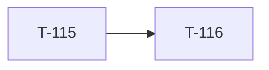

<!-- AUTO-GENERATED by ./scripts/ticket sync — DO NOT EDIT -->

# Ticket Lead Dashboard

## Running / Review

## Ready

- **T-090** (900) — Map visualization program [ready] — Map Engine v2 through sea-band + contours @ `bd481cf1`. **Active:** **T-090.5.5** tree/veg/prop glyphs. Single lane.
- **T-476** (3315) — verify-t438/t456 Makefile recipes lack hollow-body tripwire [ready] — NIT from wave 28 adversarial. T-467 wired real bash recipes into Makefile + ci-local + ci.yml, but there is no T-471/T-472-style recipe-body tripwire — a future hollow `@true` / `echo PASS` / `#fake` recipe would green until noticed.

Repro (hypothetical): replace verify-t438 recipe with `@true` → make verify-t438 PASS while script never runs.

Cure: extend verify-t468-style (or sibling) tripwire to assert Makefile verify-t438/verify-t456 recipes invoke the real bash scripts (not echo/@true/#).
- **T-481** (3320) — Reject whitespace-only DISCORD_CLIENT_ID in Config::validate [ready] — Wave 30 adversarial verifier (T-430): production validate guards discord_client_id.is_empty() only (config.rs). A whitespace-only id (" ") with APP_ENV=production validates Ok and is not treated as oauth_unconfigured. Same pattern as prior secret/redirect whitespace nits.

Repro: set discord_client_id=" " + env=production → validate() Ok.

Cure: trim (or reject if trim empty) before the Missing check; Class-R pin.
- **T-483** (3322) — Harden oauth.rs unit clears_oauth_state to exact OAUTH_STATE_CLEAR [ready] — Wave 31 residual from T-480. IT assert_oauth_state_cleared is byte-equality to OAUTH_STATE_CLEAR, but unit helper clears_oauth_state in apps/website/api/src/handlers/oauth.rs (~449) still soft-contains oauth_state=/Max-Age=0/HttpOnly with no Path=/ pin. Path=/api clear cookie still greens the unit helper.

Repro: soft check accepts 'oauth_state=; Path=/api; Max-Age=0; HttpOnly'.

Cure: assert equality to OAUTH_STATE_CLEAR (or require Path=/ exact) in the unit helper.

## Next queued (top 10)

- **T-072** (720) — Ctrl multi-place [queued] — Hold Ctrl to place multiple copies without re-selecting asset.
- **T-073** (730) — Shift + map rotation [queued] — Shift-drag and map rotation widget for placed entities.
- **T-075** (750) — Spacebar flyTo vs widget [queued] — Spacebar centers selection; resolve flyTo vs transform widget conflict.
- **T-116** (1160) — Results POST to backend [queued] — SPLIT 2026-07-26. Mod half SHIPPED: TBD_ResultsReporter.c (682 lines, T-181.13.1) POSTs to /api/v1/ingest/match-results. Website half OPEN and folded into T-232 — event_hub.rs renders no result/outcome/match data at all. This row now tracks only the website half.
- **T-117** (1170) — Mission upload + validation UI [queued] — Web UI for mission upload and schema validation (API exists).
- **T-118** (1180) — Event ORBAT + identity linking UI [queued] — SPLIT 2026-07-26. DONE: identity-link UI (settings.rs:6-9,74-94, T-159.25) and the ORBAT selector (event_hub.rs:520-572, T-159.25a). OPEN residual is tracked by T-226 (PATCH /events/{id} has no caller), T-284 (clear_slot unreachable, admin cannot free a claimed slot) and T-231 (identity last mile). This row is a pointer, not work.
- **T-120** (1200) — Staging soak + golden mission smoke [queued] — Pinned game/mod version soak; golden-mission smoke on staging server.
- **T-146** (1470) — Asset Browser Data Wiring [queued] — Hook up T-150 registry items (vehicles/crates/…) to Asset Browser for map drag-place. Unblocked by T-150; after or parallel T-068.9 ingest preferred.
- **T-170** (1670) — Prod default flip to Leptos SPA [queued] — Make the Leptos SPA the production default: set `SPA_DIST_DIR` to the trunk release dist in the prod env, move the Discord OAuth redirect origin, staging soak, then flip. OPERATOR-GATED (env + Discord app settings are operator-held); claude-code prepares configs/runbook + verifies the staging soak gates. Runbook anchor: docs/website/DEV_RUNBOOK.md §SPA serving; T-159 finish program left this as the sole operator-gated residual.

## Dependency graph (scoped)

```mermaid
flowchart LR
  T115[T-115] --> T116[T-116]
```
