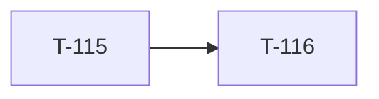

<!-- AUTO-GENERATED by ./scripts/ticket sync — DO NOT EDIT -->

# Ticket Lead Dashboard

## Running / Review

- **T-494** (3333) — mission_overview trim source-ratchet still allows !b.is_empty() match arm [running] — Wave 37 adversarial NIT on T-407. dossier_body_uses_trim_aware_briefing_helper only bans .filter(|b| !b.is_empty()); a match-arm !b.is_empty() stayed GREEN while the behavioral trim test went RED. Also residual from T-407 report: schedule events.rs briefing still uses (!briefing.is_empty()) without trim (out of T-407 owns). Cure: widen source ratchet to ban non-trim empty checks on briefing paths; align schedule card trim with event_hub/mission_overview.
- **T-544** (3384) — T-532 Class-R only — no HTTP IT for set-current version re-point [running] — FOUND by W54 adversarial verifier (CLEAN MINOR-NIT) after T-532.

POST /missions/:id/versions/:vid/set-current is covered by in-handler Class-R source pins only. Cure: HTTP IT in tests/missions.rs that creates two versions, calls set-current to the older, asserts current_version_id + /compiled behavior.

Repro: rg set_current_version apps/website/api/tests — no hit.
- **T-545** (3385) — mcp-daemon.sh comment still claims mcpd-bin ignores CARGO_TARGET_DIR [running] — FOUND by W55 adversarial verifier (CLEAN MINOR-NIT) after T-543.

Runtime is correct (T-328/T-543). Residual: scripts/mod/mcp-daemon.sh comment still says mcpd-bin ignores CARGO_TARGET_DIR. Cure: update the comment to match live honor of CARGO_TARGET_DIR.

Repro: rg 'ignores CARGO_TARGET_DIR' scripts/mod/

## Ready

- **T-090** (900) — Map visualization program [ready] — Map Engine v2 through sea-band + contours @ `bd481cf1`. **Active:** **T-090.5.5** tree/veg/prop glyphs. Single lane.

## Next queued (top 10)

- **T-072** (720) — Ctrl multi-place [queued] — Hold Ctrl to place multiple copies without re-selecting asset.
- **T-073** (730) — Shift + map rotation [queued] — Shift-drag and map rotation widget for placed entities.
- **T-075** (750) — Spacebar flyTo vs widget [queued] — Spacebar centers selection; resolve flyTo vs transform widget conflict.
- **T-116** (1160) — Results POST to backend [queued] — SPLIT 2026-07-26. Mod half SHIPPED: TBD_ResultsReporter.c (682 lines, T-181.13.1) POSTs to /api/v1/ingest/match-results. Website half OPEN and folded into T-232 — event_hub.rs renders no result/outcome/match data at all. This row now tracks only the website half.
- **T-117** (1170) — Mission upload + validation UI [queued] — Web UI for mission upload and schema validation (API exists).
- **T-118** (1180) — Event ORBAT + identity linking UI [queued] — SPLIT 2026-07-26. DONE: identity-link UI (settings.rs:6-9,74-94, T-159.25) and the ORBAT selector (event_hub.rs:520-572, T-159.25a). OPEN residual is tracked by T-226 (PATCH /events/{id} has no caller), T-284 (clear_slot unreachable, admin cannot free a claimed slot) and T-231 (identity last mile). This row is a pointer, not work.
- **T-120** (1200) — Staging soak + golden mission smoke [queued] — Pinned game/mod version soak; golden-mission smoke on staging server.
- **T-146** (1470) — Asset Browser Data Wiring [queued] — Hook up T-150 registry items (vehicles/crates/…) to Asset Browser for map drag-place. Unblocked by T-150; after or parallel T-068.9 ingest preferred.
- **T-170** (1670) — Prod default flip to Leptos SPA [queued] — Make the Leptos SPA the production default: set `SPA_DIST_DIR` to the trunk release dist in the prod env, move the Discord OAuth redirect origin, staging soak, then flip. OPERATOR-GATED (env + Discord app settings are operator-held); claude-code prepares configs/runbook + verifies the staging soak gates. Runbook anchor: docs/website/DEV_RUNBOOK.md §SPA serving; T-159 finish program left this as the sole operator-gated residual.

## Dependency graph (scoped)

```mermaid
flowchart LR
  T115[T-115] --> T116[T-116]
```
