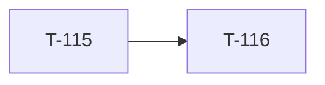

<!-- AUTO-GENERATED by ./scripts/ticket sync — DO NOT EDIT -->

# Ticket Lead Dashboard

## Running / Review

## Ready

- **T-090** (900) — Map visualization program [ready] — Map Engine v2 through sea-band + contours @ `bd481cf1`. **Active:** **T-090.5.5** tree/veg/prop glyphs. Single lane.
- **T-423** (3262) — T-216's contract-floor test cannot detect the failure its own doc comment says it exists to detect [ready] — Two MINORs from wave 5's adversarial verifier, both in `crates/map-engine-core/src/mission/flatten.rs`.

1. `flatten.rs:2465-2537`, `the_vehicle_row_still_has_the_shape_this_module_reads`. Its doc comment says: 'What must not happen is a rename, a retype or a removal: those compose silently... That is the failure this test exists to make loud.' PROVEN SILENT:
     sed -i '551s/\"resourceName\"/\"resourceNameRENAMED\"/' crates/map-engine-core/src/doc/store.rs   # inside add_vehicle
     cargo test -p map-engine-core --features doc,mission -p map-engine-render -- the_vehicle_row_still_has_the_shape_this_module_reads
     # ... ok
   It reads LEDGER_FIXTURE, a hand-written constant, so it can only detect T-216 disagreeing with ITSELF -- never the writer renaming the floor, which is the stated purpose. STAYS MINOR because the gate step as a whole does go red on that rename: `doc::store::tests::attach_vehicle_roundtrip` and `doc::apply_faction::tests::apply_faction_vehicles` fail (377 passed / 2 failed). The protection exists; it is not where the ticket says it is. Fix is to drive the fixture from `add_vehicle` output rather than a literal -- noting T-216's own reason for not calling it directly (a signature change would become a merge break rather than a caught disagreement), so the answer is probably a serialised round trip, not a direct call.

2. `flatten.rs:2530-2536` -- the tolerance assertion is a TAUTOLOGY. It clones the fixture row into a serde_json::Value, inserts `cargo`, then asserts two OTHER keys are unchanged. No module code runs; it cannot fail. The comment says 'Asserted rather than assumed.' It is assumed.
   The CLAIM is nonetheless TRUE for a stronger reason than the test gives, established by the verifier: `EditorPayload` (flatten.rs:591-605) is {editor, environment} and `EditorGraph` (:607-613) is {factions, squads, slots} -- THERE IS NO `vehicles` FIELD ANYWHERE IN THE READER, and `scan_editor_payload_types` is a plain `serde_json::from_slice::<EditorPayload>` with no deny_unknown_fields. So T-215's `factionId`/`cargo[]` extras cannot produce a save-time 400, and a map-placed vehicle with no `squadId` cannot be dropped by a reader that never deserialises a vehicle row at all.
- **T-424** (3263) — cargo test --lib <selector> exits 0 when the selector matches zero tests, so 25 pinned checks can silently empty [ready] — Found by T-216 during wave 5 while restoring `scripts/verify-t180-coherency.sh`, and independently replicated by the wave's adversarial verifier.

  cargo test -p map-engine-core --lib --features doc,mission -- zzz_no_such_test_exists_anywhere
  # test result: ok. 0 passed; 254 filtered out          rc=0

`verify-t180-coherency.sh` pins 25 such selector invocations. A typo'd or RENAMED test name prints `verify-t180 OK` having run nothing, with no guard anywhere. Same family as everything else this weekend: a check reporting success over an input it never examined.

MEASURED CURRENT STATE: `grep -c 'test result: ok\. 0 passed'` across a full run -> 0, so all 25 selectors match at least one test TODAY. Nothing holds that. A rename of any pinned test silently empties its check and the script still prints ALL PASS.

CURE: a wrapper asserting `passed >= 1` per line. T-216 judged it a third structural change to that file and deliberately left it -- correctly, it belongs here.

CONTEXT: this is the third gate-integrity defect found in that one script this wave. The other two are FIXED and shipped in wave 5 -- `--features doc` not enabling `mission` (the script had not compiled since T-344, so sections C/D/G/I and the whole frontend block never ran), and three static bans in `if rg ...; then fail; fi` form that printed OK when `rg` was absent from the host. Both now green: `verify-t180: ALL PASS`, rc=0, end to end, verified independently.
- **T-480** (3319) — Harden oauth_state clear IT to exact OAUTH_STATE_CLEAR equality [ready] — Wave 30 adversarial verifier (T-429): assert_oauth_state_cleared in apps/website/api/tests/oauth_redirect.rs uses contains("Path=/") / contains("Max-Age=0") soft checks, not equality to OAUTH_STATE_CLEAR (handlers/oauth.rs). A clear cookie with Path=/api or Max-Age=00 still passes.

Repro: python3 -c 'c="oauth_state=; Path=/api; Max-Age=0; HttpOnly"; print(c.startswith("oauth_state=") and "Max-Age=0" in c and "Path=/" in c and "HttpOnly" in c)' → True while Path diverges from OAUTH_STATE_CLEAR.

Cure: assert Set-Cookie equals OAUTH_STATE_CLEAR (or parse and require Path=/ exact).

## Next queued (top 10)

- **T-072** (720) — Ctrl multi-place [queued] — Hold Ctrl to place multiple copies without re-selecting asset.
- **T-073** (730) — Shift + map rotation [queued] — Shift-drag and map rotation widget for placed entities.
- **T-075** (750) — Spacebar flyTo vs widget [queued] — Spacebar centers selection; resolve flyTo vs transform widget conflict.
- **T-116** (1160) — Results POST to backend [queued] — SPLIT 2026-07-26. Mod half SHIPPED: TBD_ResultsReporter.c (682 lines, T-181.13.1) POSTs to /api/v1/ingest/match-results. Website half OPEN and folded into T-232 — event_hub.rs renders no result/outcome/match data at all. This row now tracks only the website half.
- **T-117** (1170) — Mission upload + validation UI [queued] — Web UI for mission upload and schema validation (API exists).
- **T-118** (1180) — Event ORBAT + identity linking UI [queued] — SPLIT 2026-07-26. DONE: identity-link UI (settings.rs:6-9,74-94, T-159.25) and the ORBAT selector (event_hub.rs:520-572, T-159.25a). OPEN residual is tracked by T-226 (PATCH /events/{id} has no caller), T-284 (clear_slot unreachable, admin cannot free a claimed slot) and T-231 (identity last mile). This row is a pointer, not work.
- **T-120** (1200) — Staging soak + golden mission smoke [queued] — Pinned game/mod version soak; golden-mission smoke on staging server.
- **T-146** (1470) — Asset Browser Data Wiring [queued] — Hook up T-150 registry items (vehicles/crates/…) to Asset Browser for map drag-place. Unblocked by T-150; after or parallel T-068.9 ingest preferred.
- **T-170** (1670) — Prod default flip to Leptos SPA [queued] — Make the Leptos SPA the production default: set `SPA_DIST_DIR` to the trunk release dist in the prod env, move the Discord OAuth redirect origin, staging soak, then flip. OPERATOR-GATED (env + Discord app settings are operator-held); claude-code prepares configs/runbook + verifies the staging soak gates. Runbook anchor: docs/website/DEV_RUNBOOK.md §SPA serving; T-159 finish program left this as the sole operator-gated residual.

## Dependency graph (scoped)

```mermaid
flowchart LR
  T115[T-115] --> T116[T-116]
```
