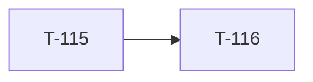

<!-- AUTO-GENERATED by ./scripts/ticket sync — DO NOT EDIT -->

# Ticket Lead Dashboard

## Running / Review

- **T-342** (3158) — Replace the ban window.prompt with a real dialog — the gate provably cannot drive a native prompt [running] — RECOMMENDED by T-323 with a hard engineering reason rather than a taste argument, which is why it is filed rather than dismissed.

personnel.rs's ban flow uses `window.prompt`. T-323 established, by trying: **overriding window.prompt from JS does NOT intercept the web_sys call** (patching Window.prototype.prompt does not either), and with the CDP Page domain enabled and no dialog handler a real prompt BLOCKS THE RENDERER. So the browser gate cannot drive this destructive admin action at all, in principle, while it remains a native prompt. T-323 had to prove its fix with host-side unit tests on an extracted `classify_ban_reason` instead — good work, but it means the actual click path is untested forever.

A shared Dialog/Sheet also lets the required-reason rule be INLINE — disable the confirm button — rather than teaching it through an error toast after the fact, which is what T-323 had to settle for. The platform already has the Dialog vocabulary; T-226's Event Manager edit dialog (landed today, 31/31 browser assertions) is the freshest reference.

Two smaller items in the same file, worth folding in:
  - personnel.rs:333 — the role editor still does `Err(_) => toasts.error("Failed to update role")`, discarding the server message exactly as the ban did. One-line api_error_message fix.
  - 'Issue Warning' is still a mock toast although POST /admin/users/:id/warnings exists.

Note the browser gate is HEALTHY as of T-320, so a Dialog version IS testable end to end — that is the payoff.

== DEFERRED 2026-07-26 BY OPERATOR DECISION, NOT CANCELLED ==
Recording a bug is most of its value; fixing it now is optional. The audits that produced this ticket were generating work faster than the run could close it, and the original T-182..T-297 feature backlog had not moved in hours. The operator's call, verbatim in substance: there will always be bugs, that is what developing is — knowing them is good, but spending the token budget on things that do not need fixing right now means nothing ships.
This is findable, fully diagnosed, and reproducible from the notes above. Promote it to `idea` when it actually blocks something, when it starts costing real time, or after the feature backlog lands. Nothing here was judged wrong — only not now.
- **T-385** (3201) — Join matches.terrain into /servers so the theater readout can come back [running] — HANDOFF from T-359, which removed the phantom readout and left a tripwire test that FAILS with instructions the day this lands. Do not restore the UI before the route.

The data exists and is populated: `matches.terrain` (terrain_type, nullable), keyed by `server_statuses.current_match_id`. T-359 ran the join on the live dev DB and got `TBD Primary — Everon | everon`. No migration and no ingest change needed — terrain already arrives at handlers/telemetry.rs:341 (MatchInput.terrain), validated at :22, bound at :597.

  1. handlers/servers.rs:29 `server_intel()` — add `LEFT JOIN matches ON matches.id = server_statuses.current_match_id` and expose it on ServerIntelDto (:20).
  2. frontend/src/dto.rs:283 — the field must land in the SAME COMMIT as the recaptured golden, never ahead of the route. An Option + skip_serializing_if round-trips absent -> None -> absent, so the gate would stay GREEN over a fictional field. That is precisely the defect T-306 removed the catch-all to prevent, and it would recur.
  3. Then delete T-359's tripwire and restore the readout.

WORTH DOING AT THE SAME TIME, because it is why this bug was invisible: `ServerRowDto` has exactly two references in the crate — its own definition and its own golden test — while server_intel.rs:73 fetches `DataEnvelope<Value>`. A DTO only its own golden reads proves the wire, not the page. Adopting it is blocked on `ServerRowDto.status` keeping a TOLERANT parse, or one unparseable status fails the whole envelope and the page renders 'Failed to load data.' for every server. Also `v_str` (server_intel.rs:19-21) ends in unwrap_or_default(), collapsing absent/null/non-string/empty into one "" — the conflation T-306 split apart for the status object and left on the row's scalars.

== DEFERRED 2026-07-26 BY OPERATOR DECISION, NOT CANCELLED ==
Recording a bug is most of its value; fixing it now is optional. The audits that produced this ticket were generating work faster than the run could close it, and the original T-182..T-297 feature backlog had not moved in hours. The operator's call, verbatim in substance: there will always be bugs, that is what developing is — knowing them is good, but spending the token budget on things that do not need fixing right now means nothing ships.
This is findable, fully diagnosed, and reproducible from the notes above. Promote it to `idea` when it actually blocks something, when it starts costing real time, or after the feature backlog lands. Nothing here was judged wrong — only not now.
- **T-492** (3331) — fmt_changed/clippy_changed ignore changed_rs rc (empty→SKIP) [running] — Wave 36 adversarial NIT. T-401 made git_porcelain_paths fail-loud, and wasm_changed/refuse_empty_range check rc. fmt_changed and clippy_changed still do files="$(changed_rs …)" and treat empty as SKIP (return 0) without checking $?. Gate path is still safe because refuse_empty_range runs first. Cure: propagate changed_rs failure in those helpers (or share a wrapper that dies on rc≠0).
- **T-535** (3375) — T-385: live IT must assert GET /servers terrain from match join (positive) [running] — FOUND by W50 adversarial verifier (MAJOR) after T-385.

T-385 ships LEFT JOIN matches.terrain and Class-R/golden pins, but the only live IT path asserts terrain is null on create. A regression that always returns None (broken join / wrong column) stays green. Cure: seed a match with terrain + point server_statuses.current_match_id at it, then GET /servers and assert the row's terrain equals the seeded value (e.g. everon).

Repro: delete LEFT JOIN from SERVER_STATUS_SELECT_* → golden/source pins may still pass if not re-run; HTTP create-null IT still passes. Need positive IT RED on join removal.

## Ready

- **T-090** (900) — Map visualization program [ready] — Map Engine v2 through sea-band + contours @ `bd481cf1`. **Active:** **T-090.5.5** tree/veg/prop glyphs. Single lane.

## Next queued (top 10)

- **T-072** (720) — Ctrl multi-place [queued] — Hold Ctrl to place multiple copies without re-selecting asset.
- **T-073** (730) — Shift + map rotation [queued] — Shift-drag and map rotation widget for placed entities.
- **T-075** (750) — Spacebar flyTo vs widget [queued] — Spacebar centers selection; resolve flyTo vs transform widget conflict.
- **T-116** (1160) — Results POST to backend [queued] — SPLIT 2026-07-26. Mod half SHIPPED: TBD_ResultsReporter.c (682 lines, T-181.13.1) POSTs to /api/v1/ingest/match-results. Website half OPEN and folded into T-232 — event_hub.rs renders no result/outcome/match data at all. This row now tracks only the website half.
- **T-117** (1170) — Mission upload + validation UI [queued] — Web UI for mission upload and schema validation (API exists).
- **T-118** (1180) — Event ORBAT + identity linking UI [queued] — SPLIT 2026-07-26. DONE: identity-link UI (settings.rs:6-9,74-94, T-159.25) and the ORBAT selector (event_hub.rs:520-572, T-159.25a). OPEN residual is tracked by T-226 (PATCH /events/{id} has no caller), T-284 (clear_slot unreachable, admin cannot free a claimed slot) and T-231 (identity last mile). This row is a pointer, not work.
- **T-120** (1200) — Staging soak + golden mission smoke [queued] — Pinned game/mod version soak; golden-mission smoke on staging server.
- **T-146** (1470) — Asset Browser Data Wiring [queued] — Hook up T-150 registry items (vehicles/crates/…) to Asset Browser for map drag-place. Unblocked by T-150; after or parallel T-068.9 ingest preferred.
- **T-170** (1670) — Prod default flip to Leptos SPA [queued] — Make the Leptos SPA the production default: set `SPA_DIST_DIR` to the trunk release dist in the prod env, move the Discord OAuth redirect origin, staging soak, then flip. OPERATOR-GATED (env + Discord app settings are operator-held); claude-code prepares configs/runbook + verifies the staging soak gates. Runbook anchor: docs/website/DEV_RUNBOOK.md §SPA serving; T-159 finish program left this as the sole operator-gated residual.

## Dependency graph (scoped)

```mermaid
flowchart LR
  T115[T-115] --> T116[T-116]
```
