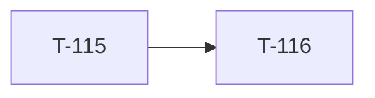

<!-- AUTO-GENERATED by ./scripts/ticket sync — DO NOT EDIT -->

# Ticket Lead Dashboard

## Running / Review

## Ready

- **T-090** (900) — Map visualization program [ready] — Map Engine v2 through sea-band + contours @ `bd481cf1`. **Active:** **T-090.5.5** tree/veg/prop glyphs. Single lane.
- **T-437** (3276) — Destroy-target inert diagnostics still claim entities[] never spawn [ready] — Residual from T-254 / wave 9 adversarial MAJOR M1. After T-254, TBD_MissionDocumentStruct models entities[] and SpawnMissionEntities runs on parse, but operator-facing inert strings still blame a build that does not spawn/model entities.

Live lie at apps/mod/tbd-framework/Scripts/Game/TBD/Objectives/TBD_ObjectiveRegistry.c:647 (also banners/comments at :609-620, TBD_ObjectivesComponent.c:694-697, TBD_ObjectiveRules.c:115-117, packages/tbd-schema/schema/mission.schema.json:465).

Repro: author a destroy objective whose alias fails for zone/timing/registry reasons; inertReason still says the build does not spawn entities[] — misdiagnoses live failures.

Cure: rewrite diagnostics to distinguish missing spawn vs unresolved alias vs out-of-zone; update schema prose.
- **T-470** (3309) — T-466 Class-R order-blind / unreachable error UI false-green [ready] — Residual from wave 26 adversarial MAJOR. Live Content list keeps Result, seeds only on Ok, surfaces error+Retry. Class-R content_list_error_does_not_seed_as_empty_success is needle-soft:
(1) list_seeded.set(true) before match / outside Ok → PASS
(2) also seed in Err → PASS (Retry then permanent empty)
(3) error UI unreachable (.filter(|_| false)) with needles still in source → PASS

Repro: move list_seeded.set(true) before Ok arm → Class-R still green.

Cure: order-sensitive / structural pins (seed only inside Ok arm AST or window); pin Retry reachable (not filtered out); RED→GREEN on verifier perturbations.
- **T-471** (3310) — T-468 tripwire accepts hollow Makefile ci-local-schema recipe [ready] — Residual from wave 26 adversarial MAJOR. verify-t468-ci-schema-parity.sh requires ci.yml run: make ci-local-schema and that Makefile has a ci-local-schema: target name — not that the recipe still invokes schema-validate + verify-citations.

Repro: replace ci-local-schema recipe with `echo hollow-only` → tripwire PASS; CI green while map-object-enums unrun.

Cure: pin Makefile recipe body contains schema-validate (and citations) or expand GATE set check; RED→GREEN on hollow recipe.
- **T-472** (3311) — T-471 verify-t468 still greens echo/@true/#fake Makefile recipes [ready] — Residual from wave 27 adversarial BLOCKER. verify-t468 recipe pin uses `^\t.*(?:\$\(MAKE\)|make)\s+schema-validate\b` — matches `@echo "$(MAKE) schema-validate"`, `schema-validate-fake`, `@true # $(MAKE) schema-validate`.

Repro: hollow echo of make lines / -fake targets / comment-only → tripwire PASS.

Cure: require real recipe invocations (tab + optional @ + $(MAKE)|make + exact target, no echo, ignore # comments); RED→GREEN on verifier recipes.
- **T-473** (3312) — T-470 Class-R still greens spaced/indirect Err seed + if-false Retry [ready] — Residual from wave 27 adversarial BLOCKER/MAJOR. Class-R pins exact `list_seeded.set(true)` only:
(1) early `list_seeded.set( true )` + keep Ok set → PASS
(2) Err `set( true )` / `set((true))` / `set(seed)` → PASS
(3) wrap Retry UI in `if false { … }` (no filter) → PASS

Repro: spaced set( true ) before match → Class-R green.

Cure: normalize whitespace for seed pin; forbid any list_seeded.set outside Ok arm; ban if false / unreachable Retry; RED→GREEN on verifier perturbations.
- **T-474** (3313) — T-437 verify-t437 presence-only; paraphrased lies still PASS [ready] — Residual from wave 27 adversarial BLOCKER. verify-t437 forbids exact historical lie strings and requires DiagnoseEmptyDestroyTargets / out-of-zone as substrings — comment-only pins and paraphrased lies (`entities[] are never placed…`) still PASS; collapsed DiagnoseEmpty returns leave comment needles green.

Repro: paraphrase lie or comment-only DiagnoseEmptyDestroyTargets → verify PASS.

Cure: structural pins (live fn body must contain distinct return arms / out-of-zone string in executable path not only comments); broaden forbidden lie paraphrases; RED→GREEN on verifier perturbations.

## Next queued (top 10)

- **T-072** (720) — Ctrl multi-place [queued] — Hold Ctrl to place multiple copies without re-selecting asset.
- **T-073** (730) — Shift + map rotation [queued] — Shift-drag and map rotation widget for placed entities.
- **T-075** (750) — Spacebar flyTo vs widget [queued] — Spacebar centers selection; resolve flyTo vs transform widget conflict.
- **T-116** (1160) — Results POST to backend [queued] — SPLIT 2026-07-26. Mod half SHIPPED: TBD_ResultsReporter.c (682 lines, T-181.13.1) POSTs to /api/v1/ingest/match-results. Website half OPEN and folded into T-232 — event_hub.rs renders no result/outcome/match data at all. This row now tracks only the website half.
- **T-117** (1170) — Mission upload + validation UI [queued] — Web UI for mission upload and schema validation (API exists).
- **T-118** (1180) — Event ORBAT + identity linking UI [queued] — SPLIT 2026-07-26. DONE: identity-link UI (settings.rs:6-9,74-94, T-159.25) and the ORBAT selector (event_hub.rs:520-572, T-159.25a). OPEN residual is tracked by T-226 (PATCH /events/{id} has no caller), T-284 (clear_slot unreachable, admin cannot free a claimed slot) and T-231 (identity last mile). This row is a pointer, not work.
- **T-120** (1200) — Staging soak + golden mission smoke [queued] — Pinned game/mod version soak; golden-mission smoke on staging server.
- **T-146** (1470) — Asset Browser Data Wiring [queued] — Hook up T-150 registry items (vehicles/crates/…) to Asset Browser for map drag-place. Unblocked by T-150; after or parallel T-068.9 ingest preferred.
- **T-170** (1670) — Prod default flip to Leptos SPA [queued] — Make the Leptos SPA the production default: set `SPA_DIST_DIR` to the trunk release dist in the prod env, move the Discord OAuth redirect origin, staging soak, then flip. OPERATOR-GATED (env + Discord app settings are operator-held); claude-code prepares configs/runbook + verifies the staging soak gates. Runbook anchor: docs/website/DEV_RUNBOOK.md §SPA serving; T-159 finish program left this as the sole operator-gated residual.

## Dependency graph (scoped)

```mermaid
flowchart LR
  T115[T-115] --> T116[T-116]
```
