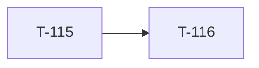

<!-- AUTO-GENERATED by ./scripts/ticket sync — DO NOT EDIT -->

# Ticket Lead Dashboard

## Running / Review

- **T-353** (3169) — Four SPA gaps T-232 could not reach from its own files [running] — All found by T-232 while writing the populated render branches; each needs a file it did not own.

1. **`event_hub.rs:182` `fn event_hub_view` is private.** The /events surface spec wants the full inline-ORBAT hub in the detail column. T-232 built a self-contained dossier summary plus a deep link instead. Making it `pub(crate)` gets events.rs to spec parity without duplicating anything.

2. **No `/announcements/:id` route exists** (`router.rs`), so the dashboard intel feed row — spec element 20 — links to `/announcements` rather than deep-linking the post. Needs the route plus URL-driven selection in announcements.rs. Note T-232 deliberately left announcements.rs WITHOUT auto-selection, so a deep link is the intended way in.

3. **`server_intel.rs:30` `format_uptime` is private**, so dashboard.rs now carries a duplicate. Wants a shared home in `datefmt.rs` — and `log_stamp` from audit.rs wants to go with it. Two definitions of a displayed timestamp drifting apart is the same class as the two definitions of 'a deployment' T-326 refused to create.

4. **`POST /me/leave-requests` exists (`api/src/app.rs:100`) with NO CALLER in the SPA** — the deployments spec's LOA button, item 8. Identical shape to the dead PATCH/DELETE T-226 found and wired. T-232 correctly left it: that slice was render branches, not mutations.

== DEFERRED 2026-07-26 BY OPERATOR DECISION, NOT CANCELLED ==
Recording a bug is most of its value; fixing it now is optional. The audits that produced this ticket were generating work faster than the run could close it, and the original T-182..T-297 feature backlog had not moved in hours. The operator's call, verbatim in substance: there will always be bugs, that is what developing is — knowing them is good, but spending the token budget on things that do not need fixing right now means nothing ships.
This is findable, fully diagnosed, and reproducible from the notes above. Promote it to `idea` when it actually blocks something, when it starts costing real time, or after the feature backlog lands. Nothing here was judged wrong — only not now.
- **T-498** (3333) — Discord webhook title not CSV/formula-safe (sibling of T-408) [running] — Wave 38 residual from T-408. Audit CSV now escape_csv_formula. Live Discord sink is services/webhook.rs title: cap_runes(&a.title) via cms push_to_discord — user title into embed, not formula-escaped. Ticket cited stale cms.rs:64. Cure: sanitize embed fields for formula/control chars or document Discord as non-spreadsheet sink with Class-R.
- **T-543** (3383) — mcpd-bin.sh still echoes shared target/debug/mcpd path [running] — FOUND by W54 adversarial verifier (CLEAN MINOR-NIT) after T-328.

mcp-daemon.sh correctly builds/execs from target-dev-mcpd and discards mcpd-bin.sh stdout. Residual footgun: scripts/mod/lib/mcpd-bin.sh still hardcodes echo $ROOT/target/debug/mcpd; mcp-call-selftest.sh still consumes that echo. Cure: honor CARGO_TARGET_DIR in mcpd-bin.sh echo path.

Repro: rg 'target/debug/mcpd' scripts/mod/

## Ready

- **T-090** (900) — Map visualization program [ready] — Map Engine v2 through sea-band + contours @ `bd481cf1`. **Active:** **T-090.5.5** tree/veg/prop glyphs. Single lane.

## Next queued (top 10)

- **T-072** (720) — Ctrl multi-place [queued] — Hold Ctrl to place multiple copies without re-selecting asset.
- **T-073** (730) — Shift + map rotation [queued] — Shift-drag and map rotation widget for placed entities.
- **T-075** (750) — Spacebar flyTo vs widget [queued] — Spacebar centers selection; resolve flyTo vs transform widget conflict.
- **T-116** (1160) — Results POST to backend [queued] — SPLIT 2026-07-26. Mod half SHIPPED: TBD_ResultsReporter.c (682 lines, T-181.13.1) POSTs to /api/v1/ingest/match-results. Website half OPEN and folded into T-232 — event_hub.rs renders no result/outcome/match data at all. This row now tracks only the website half.
- **T-117** (1170) — Mission upload + validation UI [queued] — Web UI for mission upload and schema validation (API exists).
- **T-118** (1180) — Event ORBAT + identity linking UI [queued] — SPLIT 2026-07-26. DONE: identity-link UI (settings.rs:6-9,74-94, T-159.25) and the ORBAT selector (event_hub.rs:520-572, T-159.25a). OPEN residual is tracked by T-226 (PATCH /events/{id} has no caller), T-284 (clear_slot unreachable, admin cannot free a claimed slot) and T-231 (identity last mile). This row is a pointer, not work.
- **T-120** (1200) — Staging soak + golden mission smoke [queued] — Pinned game/mod version soak; golden-mission smoke on staging server.
- **T-146** (1470) — Asset Browser Data Wiring [queued] — Hook up T-150 registry items (vehicles/crates/…) to Asset Browser for map drag-place. Unblocked by T-150; after or parallel T-068.9 ingest preferred.
- **T-170** (1670) — Prod default flip to Leptos SPA [queued] — Make the Leptos SPA the production default: set `SPA_DIST_DIR` to the trunk release dist in the prod env, move the Discord OAuth redirect origin, staging soak, then flip. OPERATOR-GATED (env + Discord app settings are operator-held); claude-code prepares configs/runbook + verifies the staging soak gates. Runbook anchor: docs/website/DEV_RUNBOOK.md §SPA serving; T-159 finish program left this as the sole operator-gated residual.

## Dependency graph (scoped)

```mermaid
flowchart LR
  T115[T-115] --> T116[T-116]
```
