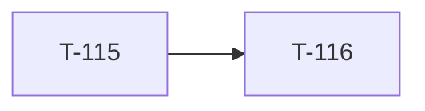

<!-- AUTO-GENERATED by ./scripts/ticket sync — DO NOT EDIT -->

# Ticket Lead Dashboard

## Running / Review

- **T-355** (3171) — An unparseable event_id silently becomes NULL and skips the attendance write on a 200 [running] — FOUND by T-347, which fixed the whitespace half and deliberately left this because it is a per-call-site decision rather than one line.

handlers/telemetry.rs:44 — `parse_uuid_opt` turns an UNPARSEABLE non-empty `event_id` or `mission_id` into `None`. The handler then skips the attendance UPDATE entirely and returns 200. So a game server sending a malformed id gets a success response while nobody's attendance is recorded, and there is no signal anywhere that it happened.

T-347 already fixed the adjacent whitespace case (a PADDED id failed the parse the same way; it now trims first). What remains is genuinely-malformed input, and it should almost certainly be a 400 — an id the sender clearly meant to supply and got wrong is not the same as an absent one.

WHY IT IS NOT A ONE-LINER: `current_match_id` shares the same helper and has a DOCUMENTED three-state contract (absent keeps / "" clears / uuid sets), which T-316 established deliberately to stop a pure COALESCE pinning the live row to a finished match forever. So the helper cannot simply start rejecting — the decision has to be made per call site. Read T-316's reasoning before changing anything.

Also worth recording, from T-347's read of the mod side: TBD_ResultsReporter.c:596 `BuildSourceMatchId` always appends `@<utc>#<tick>`, so the SHIPPING mod cannot send a wholly blank id. The blank and malformed paths are reachable by any other sender — including the hand-replay that the reporter's own log at :503 instructs an admin to perform.

== DEFERRED 2026-07-26 BY OPERATOR DECISION, NOT CANCELLED ==
Recording a bug is most of its value; fixing it now is optional. The audits that produced this ticket were generating work faster than the run could close it, and the original T-182..T-297 feature backlog had not moved in hours. The operator's call, verbatim in substance: there will always be bugs, that is what developing is — knowing them is good, but spending the token budget on things that do not need fixing right now means nothing ships.
This is findable, fully diagnosed, and reproducible from the notes above. Promote it to `idea` when it actually blocks something, when it starts costing real time, or after the feature backlog lands. Nothing here was judged wrong — only not now.
- **T-479** (3318) — Flaky events IT: event_orbat_registration_and_race duplicate arma_id [running] — Observed wave 29 cold re-gate FAIL once on fresh tbd_wave29b_cold: event_orbat_registration_and_race panicked in common/mod.rs:217 seed_user with duplicate key idx_users_arma_id (events-arma-000000000000334002). Immediate re-gate on fresh tbd_wave29c_cold PASS (33/40/13). Not caused by T-431/477 product SQL (attendance backfill). Likely parallel seed race or leftover arma_id uniqueness collision in events IT fixtures.

Repro: intermittent under `bash scripts/platform/wave.sh gate <base>` with TBD_GATE_DB cold DB.

Cure: make seed_user idempotent on arma_id or unique arma_id per test worker; assert no shared snowflake collision across parallel tests.
- **T-531** (3371) — null_tolerance still lists deployments.* as KNOWN_OPEN after T-341 [running] — FOUND by W48 adversarial verifier (MINOR) after T-341 shipped.

`apps/website/api/tests/null_tolerance.rs` still has `KNOWN_OPEN` entry `("src/handlers/deployments.rs", "*", "T-341 — open")` and `BASELINE_CAP=1`, while deployments.rs no longer has bare `event_registrations.*`. Comments still claim "BASELINE_CAP is now 0" / "T-341 takes this to 0".

The stale path is `eprintln!` only today (not a hard fail); cold gate PASS saw it. Prune the entry, set `BASELINE_CAP=0`, fix the lying comments. Repro: `rg 'T-341 — open|BASELINE_CAP' apps/website/api/tests/null_tolerance.rs`.

## Ready

- **T-090** (900) — Map visualization program [ready] — Map Engine v2 through sea-band + contours @ `bd481cf1`. **Active:** **T-090.5.5** tree/veg/prop glyphs. Single lane.

## Next queued (top 10)

- **T-072** (720) — Ctrl multi-place [queued] — Hold Ctrl to place multiple copies without re-selecting asset.
- **T-073** (730) — Shift + map rotation [queued] — Shift-drag and map rotation widget for placed entities.
- **T-075** (750) — Spacebar flyTo vs widget [queued] — Spacebar centers selection; resolve flyTo vs transform widget conflict.
- **T-116** (1160) — Results POST to backend [queued] — SPLIT 2026-07-26. Mod half SHIPPED: TBD_ResultsReporter.c (682 lines, T-181.13.1) POSTs to /api/v1/ingest/match-results. Website half OPEN and folded into T-232 — event_hub.rs renders no result/outcome/match data at all. This row now tracks only the website half.
- **T-117** (1170) — Mission upload + validation UI [queued] — Web UI for mission upload and schema validation (API exists).
- **T-118** (1180) — Event ORBAT + identity linking UI [queued] — SPLIT 2026-07-26. DONE: identity-link UI (settings.rs:6-9,74-94, T-159.25) and the ORBAT selector (event_hub.rs:520-572, T-159.25a). OPEN residual is tracked by T-226 (PATCH /events/{id} has no caller), T-284 (clear_slot unreachable, admin cannot free a claimed slot) and T-231 (identity last mile). This row is a pointer, not work.
- **T-120** (1200) — Staging soak + golden mission smoke [queued] — Pinned game/mod version soak; golden-mission smoke on staging server.
- **T-146** (1470) — Asset Browser Data Wiring [queued] — Hook up T-150 registry items (vehicles/crates/…) to Asset Browser for map drag-place. Unblocked by T-150; after or parallel T-068.9 ingest preferred.
- **T-170** (1670) — Prod default flip to Leptos SPA [queued] — Make the Leptos SPA the production default: set `SPA_DIST_DIR` to the trunk release dist in the prod env, move the Discord OAuth redirect origin, staging soak, then flip. OPERATOR-GATED (env + Discord app settings are operator-held); claude-code prepares configs/runbook + verifies the staging soak gates. Runbook anchor: docs/website/DEV_RUNBOOK.md §SPA serving; T-159 finish program left this as the sole operator-gated residual.

## Dependency graph (scoped)

```mermaid
flowchart LR
  T115[T-115] --> T116[T-116]
```
