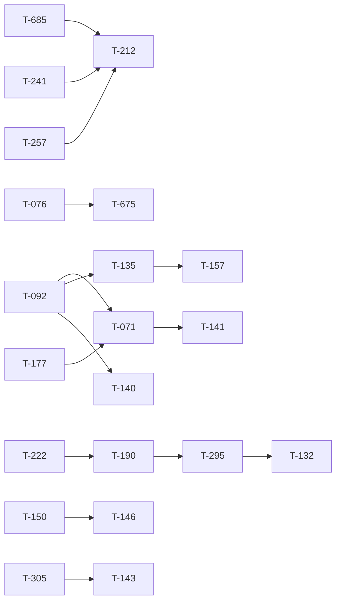

<!-- AUTO-GENERATED by cargo run -q -p xtask -- ticket sync — DO NOT EDIT -->

# Ticket Lead Dashboard

## Running / Review

## Ready

- **T-090** (7079) — Map visualization program [ready] — Map Engine v2 through sea-band + contours @ `bd481cf1`. **Active:** **T-090.5.5** tree/veg/prop glyphs. Single lane.
- **T-212** (7320) — Typed per-side objectives with attributes [ready] — Objectives as typed, placed, per-side entities with one uniform attribute spine
- **T-290** (7540) — Nine dead flatten fields mod never reads [ready] — meta.author/templateId/playerRange, the environment block, factions[].tickets, orbat[].type, winConditions.mode, flow.briefingSeconds and the orbat block are emitted but never read by the mod; add readers where cheap and annotate the rest in an emit ledger.
- **T-242** (7560) — Emit T-216 slot deltas through flatten [ready] — The T-216 schema deltas (slot tag/callsign/rank/stance, group leaderSlotId, root vehicles $def) are all declared in mission.schema.json today, but flatten drops the four slot fields (DIAG_DROP_SLOT_*); emit them and pin with schema-validated goldens.
- **T-257** (7750) — Undo scope misses loadouts, items, objectives, markers [ready] — hydrate clears loadouts, items, objectives and markers but store.rs expand_scope covers slots, squads, factions and editor_layers only, so those roots become non-undoable the day something mutates them. Add them to the UndoManager scope with a test per root.
- **T-190** (7760) — Two tabs on one mission clobber each other [ready] — Two tabs on one mission write one IndexedDB key; the last debounce wins and the reload prompt blames server drift. Detect the second tab, merge through the CRDT, and give the conflict modal counts, timestamps and a destructive marker.
- **T-932** (7780) — Parked briefing markers survive server save/reload [ready] — T-826 parking: pendingBriefingMarkers drop on server JSON save/reload before first faction mint
- **T-704** (7940) — Command palette over every editor command [ready] — Alt+Space opens a fuzzy palette over every top-strip and toolbelt command, ranked by usage frequency stored per browser; Esc closes; Enter runs the command through its existing handler.
- **T-142** (7950) — MC shell layout polish [ready] — Toolbelt placement, Attributes modal grouping and stub-tool visibility — layout UX without full T-082 field parity; no document-write changes.
- **T-157** (7960) — Mission Create visual overhaul [ready] — The New Mission dialog gets a visual map picker with terrain thumbnails and a modset selection; time, weather and max players leave the dialog because they are editor settings.
- **T-158** (7970) — Editor shell UX consolidation [ready] — Consolidate the two Settings entry points into one, wire the top-bar buttons that are still inert, and remove the redundant left-dock Assets tab now that the right dock is the asset surface.
- **T-129** (7980) — Building floor selector [ready] — Per-building floor slice in the Mission Creator map: a floor selector tool derives storey bands from the occluder BVH heights and clips the building render to the chosen floor so placement inside multi-floor buildings is unambiguous.
- **T-131** (7990) — Route planner tool [ready] — Mission Creator tool that plans routes on the exported road graph: click waypoints, snap to road segments, show distance and an elevation profile. Not runtime convoy AI.
- **T-141** (8000) — Procedural slot naming [ready] — Adjective/nickname word packs generate slot display names on creation; a manual override wins and survives renumbering. Builds on T-071 ORBAT numbering.
- **T-146** (8050) — Asset Browser Data Wiring [ready] — Hook up T-150 registry items (vehicles/crates/…) to Asset Browser for map drag-place. Unblocked by T-150; after or parallel T-068.9 ingest preferred.
- **T-143** (8070) — Water mask placement guard and exact hydrology [ready] — Ship the T-935.9 water mask to the editor: a placement guard refuses units in the ocean and warns in lakes; pak.rs (fixed by T-305) reads Eden water entities so the vector layer becomes exact instead of the appearance classifier.
- **T-135** (8180) — Mission modset manager [ready] — Per-mission Workshop modset presets validated against registry aliases at export: a workshop_sync service resolves mod metadata, the modpacks page edits presets, and export refuses a mission whose registry aliases are not covered by its preset.
- **T-309** (8190) — FactionDoc squad level for Apply Template [ready] — Preserve squads through Apply Template: add a squad level to faction-library.schema.json and FactionDoc (core/dto.rs:745), then both sides of the editor ops — orbat_apply_faction and faction_doc_from_side_core — so save-as-template then Apply round-trips N squads.
- **T-140** (8200) — Mission client payload budget [ready] — Measure compiled mission size against slot and entity counts, define a console-safe budget, and make compile report a payload-budget diagnostic with a server-only-bulk policy for what exceeds it.
- **T-136** (8210) — 3D AAR / OCAP-style replay [ready] — Post-event replay: T-940.13 telemetry events → a replay endpoint returning a per-match timeline → a map scrubber page with unit positions over time; aar_replay_url on deployments links to it.
- **T-295** (8220) — Realtime collaborative editing [ready] — Axum websocket at /missions/{id}/sync relays yrs updates and awareness between clients; the editor's collab_sync.rs applies remote updates into the local doc; POST /versions gains edit-since-load concurrency (base version id → 409).
- **T-132** (8230) — Multiplayer MC + visual git [ready] — Visual mission diff/review UI over the T-295 sync: doc/diff.rs computes entity-level changes between two versions and a mission_diff page renders added, removed, moved and changed slots and vehicles for review before publish.
- **T-138** (8240) — One-command self-host setup via xtask [ready] — `cargo xtask setup all` checks deps, writes .env, runs db up, migrate and seed, and optionally pulls map assets (git lfs pull) — the fork-friendly install story, in Rust, no shell script.
- **T-294** (8250) — Arland has a manifest and no object data [ready] — terrain-registry.json declares arland queued with P1 only; packages/map-assets/arland holds a 756-byte manifest and zero objects. Run the export-terrain gate for arland: the operator exports from Workbench, the agent stages, builds and records P1.
- **T-653** (8260) — Preserve the three headless editor-screenshot findings [ready] — Document in EDITOR_GATE_RUNBOOK.md and KB-002 the three non-obvious headless screenshot fixes: writable XDG_CACHE_HOME for fontconfig, --use-angle=vulkan only, and canvas.toDataURL capture (Page.captureScreenshot returns a black map).
- **T-905** (8280) — Split 37 T-159 frontend SIZE-3 allowlist files [ready] — Split T-159 frontend SIZE-3 files (37) the T-899 allowlist is holding
- **T-906** (8290) — Split 7 T-145 API SIZE-3 allowlist files [ready] — Split T-145 API SIZE-3 files (7) the T-899 allowlist is holding
- **T-907** (8300) — Split 11 map-engine SIZE-3 allowlist files [ready] — Split map-engine SIZE-3 files (11) the T-899 allowlist is holding
- **T-908** (8310) — Split 8 xtask/tools SIZE-3 allowlist files [ready] — Split xtask/tools SIZE-3 files (8) the T-899 allowlist is holding
- **T-933** (8320) — leptos-gates v-suite goldens break pre-close exit-0 [ready] — mk leptos-gates exits non-zero after editor-suite 20/20 because v-suite SPA goldens mass-fail
- **T-816** (8330) — Armed composition hint open; one Esc clears both layers wrongly [ready] — Esc with an armed composition and the Controls Hint open clears both in one press
- **T-817** (8340) — Grid labels lag ~1.4s on stationary wheel zoom [ready] — Grid labels lag up to ~1.4s on wheel zoom with a stationary pointer
- **T-820** (8350) — Catalog failure generic cause; chips visible wrongly [ready] — Catalog failure view shows the generic cause with chips visible where no-modpack should fire
- **T-821** (8360) — Save version prefill static; second save 409s [ready] — Save Version prefill is a static 0.1.0 — no auto-bump, second save 409s
- **T-822** (8370) — Outliner dblclick must not open asset picker under Attributes [ready] — Outliner dblclick bubbles into the map container — asset picker opens under Attributes
- **T-823** (8380) — OBJ readout must count vehicles or rename honestly [ready] — OBJ readout counts slots only — placed vehicles are invisible to it
- **T-824** (8390) — Placed zones must render visibly at rest on map [ready] — Placed zones are not visible on the map — investigate and fix the render (repro-first)
- **T-827** (8400) — Validation chip red under 4.5:1 live-effective [ready] — Validation chip red measures 4.0-4.3:1 over the live glass — passes only by plate-calc
- **T-828** (8410) — Marker captions drift when zoom changes without rebind [ready] — Marker captions are world-frozen at bind-time zoom — drift past 40px until a rebind
- **T-830** (8420) — Outliner rows cramped; density pass on layer tree [ready] — Outliner rows are too cramped — density pass on the layer tree
- **T-831** (8430) — Per-side marker authoring audit then explicit UI [ready] — Per-side markers: author for each side, visible only to that side (Arma 3 model) — establish what exists first
- **T-833** (8440) — Rotation ring: relative delta plus live preview [ready] — Rotation widget: relative drag delta (not absolute aim) + live per-frame preview
- **T-834** (8450) — Wave-205 residue: two stale pre-renumber comments, dead widget_is_rotate, marker grammar [ready] — Wave-205 residue: two stale pre-renumber comments, dead widget_is_rotate, marker grammar
- **T-837** (8460) — Vehicles cannot be deleted — slots can, vehicles cannot [ready] — Vehicles cannot be deleted — slots can, vehicles cannot
- **T-838** (8470) — Map markers selectable; outliner lists; dblclick opens Attributes [ready] — Markers select on the map and list in the outliner; double-click opens marker Attributes
- **T-839** (8480) — Retire floating Select/Ruler/LoS bottom-centre pill [ready] — The floating Select/Ruler/LoS pill still exists — decision 1 said it dies
- **T-841** (8490) — Type picker popover translucent; make opaque panel [ready] — The Type picker popover is translucent — text blurs over the map; make it an opaque panel
- **T-845** (8500) — A selected vehicle looks identical to an unselected one [ready] — A selected vehicle looks identical to an unselected one
- **T-848** (8510) — Group to must use exclusive ORBAT membership [ready] — Connect ▸ Group to must mean exclusive ORBAT squad membership — not stackable connection edges
- **T-849** (8520) — Add ungroup leave-squad verb without deleting slot [ready] — Ungroup / leave-squad — no editor verb to take a slot out of a squad without deleting it
- **T-850** (8530) — Squad tether must follow drag on auto-grouped units [ready] — T-801 eye-pass: squad tether did not follow drag on same-squad (auto-grouped) units
- **T-926** (8540) — Vehicle Attributes Transform/Position tab [ready] — Vehicle Attributes need Transform/Position parity (X/Y/Z + Heading at minimum); T-818 only shipped Heading/Cargo/Crew
- **T-927** (8550) — Editor chrome dblclick leak to map [ready] — Chrome docks/Attributes/top bar leak map dblclick — W210 eye-pass

## Next queued (top 10)

- **T-940** (6999) — Website platform: events, telemetry, admin, content [queued] — Fixes the audit's S5 findings in apps/website/api: waitlist seats, registration tombstones and no_show, schedule cascades, flat telemetry counters, pool config, audit stream, users pager, vehicle mutations, wiki features, mortar ballistics, rcon actions, reservation tiers and telemetry events.
- **T-935** (7089) — Map binary storage — hybrid rkyv + POD [queued] — Replace gz-JSON/PNG map assets with a hybrid layout: raw #[repr(C)] POD for bulk GPU data (chunks, DEM, density), rkyv archives for structured metadata (roads, labels, water, buildings, catalog), mipmapped containers for satellite and bathymetry.
- **T-674** (7430) — T-216 follow-on: slot identity reaches the wire [queued] — Four attribute ids — `ATTR-FIELD-OBJ-CALLSIGN`, `-OBJ-RANK`, `-OBJ-STANCE`, `-OBJ-UNIT-NAME` — plus the two TBD-only keys `tag` and `leaderSlotId`. `OBJ-UNIT-NAME` rides this slice rather than standing alone; the sweep says so explicitly. THE CONTRACT DELTA IS ALREADY WRITTEN OUT at `crates/map-engine-core/src/mission/flatten.rs`:2620-2632 — five `$defs/slot` / `$defs/group` keys. T-216 is `shipped`, but it shipped THE LEDGER AND ITS TRIPWIRE, not the fix: flatten.rs:2584-2649 enumerates six author-facing values the compile silently drops (a squad's leaderSlotId, a slot's tag / callsign / rank / stance, and the entire vehicle roster) and records that `make verify-t180` stayed green throughout BECAUSE NOT ONE OF ITS 22 TESTS CHECKED. `stance` additionally needs an Enfusion spawn-pose call — word-boundary `stance` in apps/mod is ZERO (the 39-file `grep -rl stance` result is every hit being the substring inside `instance`). Widening `/compiled` without care 500s every mission. Related: T-242. EXECUTOR IS `workbench` DELIBERATELY: this modifies `packages/tbd-schema/schema/mission.schema.json` and/or `apps/mod/tbd-framework/`, which the CLAUDE.md executor gate puts out of reach of any coding agent. The factory filters on executor, so this tagging is the safety mechanism — do not flip it to claude-code.

EXECUTOR CORRECTED 2026-08-02: was filed `workbench` on the mistaken reading that any .c file needs the Arma Workbench GUI. It does not — scripts/mod/compile.sh compiles tbd-framework against the native Linux dedicated server headlessly, verified: "OK: compiled clean, 5707 files, 11182 classes, 832 ms, no Workbench". Schema edits are plain JSON. This is factory work. Per the model-routing rule, the .c portion routes to Fable 5 even though the executor is claude-code.

SCHEMA HALF SPLIT OUT to T-706 (one widening pass for the whole program). This ticket is the Enfusion reader plus any editor UI; it does not touch packages/tbd-schema.
- **T-675** (7440) — Vehicle roster reaches game — T-076 compile half [queued] — Cross-boundary compile half split from T-076 so crew UI could ship separately.
Closes the sixth T-216 drop-ledger row: top-level vehicles[] with seats and crew refs.
T-706 already widened the schema; this program emits and reads the roster.
Unmerged salvage 113108a1 overlaps T-674 — check subsumption before redo.

- **T-936** (7449) — Mission logic the audit found missing [queued] — Win/loss framework, task state machine with HUD, editable radio nets, weather timeline, audio emitters, dynamic spawn modules and tactical graphics — schema, core flatten, editor panels and Enfusion runtime for each.
- **T-941** (7579) — Enfusion mod lifecycle: safestart, lobby, screens, HUD [queued] — Fixes the audit's S6 findings in apps/mod/tbd-framework: safestart armed through LOBBY and BRIEFING, once-only deploy on BRIEFING, END and DEBRIEF screens, an objective HUD, spectator clamp, private link codes, radio fallback and fuelled vehicles.
- **T-937** (7699) — Editor data layer: id arrays, undo, persist [queued] — Fixes the audit's S2 findings in the mission editor data layer: native YArray id lists, gesture-grouped undo with a depth cap, a materialize side-key cache, surfaced save errors with hidden-tab flush, and payload schema hardening.
- **T-938** (7799) — Engine and wasm performance [queued] — Closes the audit's S3 render and geometry findings: pooled lane buffers, measured chunk-crossing uploads, GPU culling for every icon lane, BVH section cuts with a sparse HeightField, frame-sliced viewsheds, and a wasm memory budget guard.
- **T-939** (7859) — Editor usability: selection, gizmo, arrange, templates [queued] — Fixes the audit's S4 findings in the mission editor UI: outliner multi-select drag, batch faction and squad reassign, a Z gizmo, Arrange shortcuts, squad templates, canvas diagnostics with connection wires, vehicle-panel virtualization and Ctrl+F search.
- **T-111** (8269) — Lazy chunk residency @ 1M [queued] — Program for T-067.1: byte-budget chunk eviction with cache eviction and reload on viewport re-entry, so a 1M-object terrain stays within browser memory. Spec: t067_spatial_chunks.md §Deferred.

## Dependency graph (scoped)

```mermaid
flowchart LR
  T092[T-092] --> T071[T-071]
  T177[T-177] --> T071[T-071]
  T685[T-685] --> T212[T-212]
  T241[T-241] --> T212[T-212]
  T257[T-257] --> T212[T-212]
  T076[T-076] --> T675[T-675]
  T222[T-222] --> T190[T-190]
  T135[T-135] --> T157[T-157]
  T071[T-071] --> T141[T-141]
  T150[T-150] --> T146[T-146]
  T305[T-305] --> T143[T-143]
  T092[T-092] --> T135[T-135]
  T092[T-092] --> T140[T-140]
  T190[T-190] --> T295[T-295]
  T295[T-295] --> T132[T-132]
```
