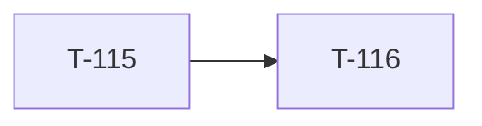

<!-- AUTO-GENERATED by ./scripts/ticket sync — DO NOT EDIT -->

# Ticket Lead Dashboard

## Running / Review

- **T-495** (3334) — GET /members IT still only asserts data is_array (no offset exercise) [running] — Wave 37 residual from T-412. Handler Class-R pins limit/offset + envelope. apps/website/api/tests/events.rs:~275 still only assert!(mem["data"].is_array()). Cure: seed >20 members on a cold IT DB and assert offset=20 returns member 21 / envelope total.
- **T-547** (3387) — datefmt format_uptime doc overclaims server-control sharing [running] — FOUND by W55 adversarial verifier (CLEAN MINOR-NIT) after T-353.

Gap 3 correctly shared format_uptime/log_stamp for dashboard/server_intel/audit. datefmt docs overclaim server-control uses the same HH:MM:SS helper; that page still has a different private helper. Cure: fix the doc comment or unify the helper.

Repro: rg format_uptime apps/website/frontend/src/
- **T-548** (3388) — missions.rs featured-card briefing still uses !b.is_empty() without trim [running] — FOUND by W56 adversarial verifier (CLEAN residual, outside T-494 owns) after T-494.

mission_overview / event_hub / schedule (events.rs) now trim-ratchet briefing emptiness. Library hero featured card in apps/website/frontend/src/missions.rs still uses .filter(|b| !b.is_empty()) without trim.

Repro: rg 'filter\(\|b\| !b\.is_empty\(\)\)' apps/website/frontend/src/missions.rs

## Ready

- **T-090** (900) — Map visualization program [ready] — Map Engine v2 through sea-band + contours @ `bd481cf1`. **Active:** **T-090.5.5** tree/veg/prop glyphs. Single lane.

## Next queued (top 10)

- **T-072** (720) — Ctrl multi-place [queued] — Hold Ctrl to place multiple copies without re-selecting asset.
- **T-073** (730) — Shift + map rotation [queued] — Shift-drag and map rotation widget for placed entities.
- **T-075** (750) — Spacebar flyTo vs widget [queued] — Spacebar centers selection; resolve flyTo vs transform widget conflict.
- **T-116** (1160) — Results POST to backend [queued] — SPLIT 2026-07-26. Mod half SHIPPED: TBD_ResultsReporter.c (682 lines, T-181.13.1) POSTs to /api/v1/ingest/match-results. Website half OPEN and folded into T-232 — event_hub.rs renders no result/outcome/match data at all. This row now tracks only the website half.
- **T-117** (1170) — Mission upload + validation UI [queued] — Web UI for mission upload and schema validation (API exists).
- **T-118** (1180) — Event ORBAT + identity linking UI [queued] — SPLIT 2026-07-26. DONE: identity-link UI (settings.rs:6-9,74-94, T-159.25) and the ORBAT selector (event_hub.rs:520-572, T-159.25a). OPEN residual is tracked by T-226 (PATCH /events/{id} has no caller), T-284 (clear_slot unreachable, admin cannot free a claimed slot) and T-231 (identity last mile). This row is a pointer, not work.
- **T-120** (1200) — Staging soak + golden mission smoke [queued] — Pinned game/mod version soak; golden-mission smoke on staging server.
- **T-146** (1470) — Asset Browser Data Wiring [queued] — Hook up T-150 registry items (vehicles/crates/…) to Asset Browser for map drag-place. Unblocked by T-150; after or parallel T-068.9 ingest preferred.
- **T-170** (1670) — Prod default flip to Leptos SPA [queued] — Make the Leptos SPA the production default: set `SPA_DIST_DIR` to the trunk release dist in the prod env, move the Discord OAuth redirect origin, staging soak, then flip. OPERATOR-GATED (env + Discord app settings are operator-held); claude-code prepares configs/runbook + verifies the staging soak gates. Runbook anchor: docs/website/DEV_RUNBOOK.md §SPA serving; T-159 finish program left this as the sole operator-gated residual.

## Dependency graph (scoped)

```mermaid
flowchart LR
  T115[T-115] --> T116[T-116]
```
