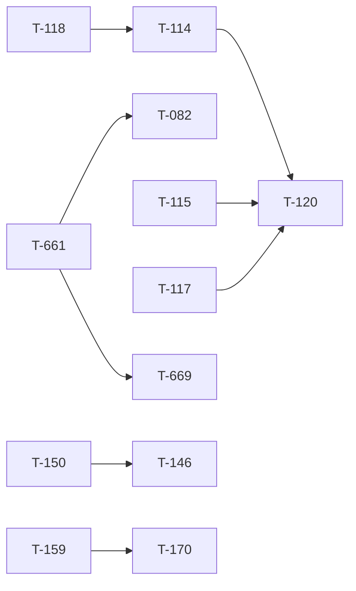

<!-- AUTO-GENERATED by ./scripts/ticket sync — DO NOT EDIT -->

# Ticket Lead Dashboard

## Running / Review

## Ready

- **T-090** (900) — Map visualization program [ready] — Map Engine v2 through sea-band + contours @ `bd481cf1`. **Active:** **T-090.5.5** tree/veg/prop glyphs. Single lane.

## Next queued (top 10)

- **T-120** (1200) — Staging soak + golden mission smoke [queued] — Pinned game/mod version soak; golden-mission smoke on staging server.
- **T-146** (1470) — Asset Browser Data Wiring [queued] — Hook up T-150 registry items (vehicles/crates/…) to Asset Browser for map drag-place. Unblocked by T-150; after or parallel T-068.9 ingest preferred.
- **T-170** (1670) — Prod default flip to Leptos SPA [queued] — Make the Leptos SPA the production default: set `SPA_DIST_DIR` to the trunk release dist in the prod env, move the Discord OAuth redirect origin, staging soak, then flip. OPERATOR-GATED (env + Discord app settings are operator-held); claude-code prepares configs/runbook + verifies the staging soak gates. Runbook anchor: docs/website/DEV_RUNBOOK.md §SPA serving; T-159 finish program left this as the sole operator-gated residual.
- **T-669** (4120) — Clipboard completion: Ctrl+X cut, Ctrl+Shift+V paste-at-original [queued] — Closes `ACTION-CUT-001` and `ACTION-PASTE-ORIG-001`. Hours, not days: two match arms in the editor keydown, read in full at `apps/website/frontend/src/mission_editor.rs`:1019-1031 beside the existing `"KeyC" if modk && !alt && !shift` :1020 and `"KeyV" if modk && !alt && !shift` :1023. BOTH PRIMITIVES ALREADY EXIST — cut is `copy_selection` (editor_ops.rs:394) followed by `delete_selection` :327, and `paste_at_cursor(None, None)` :436 is LITERALLY paste-at-original because the anchor is optional. editor_ops.rs is deliberately NOT claimed: nothing there changes, which makes this one of only three tickets in the program that touch exactly one file.
- **T-082** (4130) — Attributes modal: entity type and a real role description field [queued] — PROMOTED AND SCOPED HARD, because as written "full attribute fields" would silently absorb 20 workbench ids against a 31-id OBJ family. SCOPE, stated so it cannot drift: `ATTR-FIELD-OBJ-TYPE` and `ATTR-FIELD-OBJ-ROLE-DESC` ONLY. `ATTR-MULTI-001` / `ATTR-MULTI-CHK-001` route to T-649. `OBJ-UNIT-NAME`, `OBJ-CALLSIGN`, `OBJ-RANK` and `OBJ-STANCE` are contract-blocked and route to the workbench program. Code: `apps/website/frontend/src/attributes.rs` is 367 lines; `identity_tab` :322 has `text_field("Role", ..., "Rifleman", ...)` :326 and `text_field("Tag", ..., "MED · ENG · SL...", ...)` :330, both writing through `attrs_update_slot`. `OBJ-ROLE-DESC` needs a SEPARATE description field — today `role` doubles as both — and `OBJ-TYPE` needs a type control that does not exist. THE REASON TYPE CANNOT BE CHANGED TODAY, and it is not the modal: `read_attrs` (editor_ops.rs:631) builds SlotAttrs from `core.materialize()` :637 and NEVER READS `assetId`, even though the core mutator exists at store.rs:1276. Writes go through `attrs_update_slot` :796. Collides with T-649 on both paths; one wave apart by design.
- **T-651** (4140) — Editor comments / annotations [queued] — Closes `PLACE-COMMENT-001` and the three fields `ATTR-FIELD-CMT-TITLE` / `-TOOLTIP` / `-POSITION` (filed separately in the attributes sweep as a new slice; it is the same ticket, derived once here). Editor-only virtual entities that appear in the outliner, support drag/copy/layers, and NEVER COMPILE into the mission — that constraint is what keeps the ticket small AND what keeps it factory-safe (it never reaches mission.schema.json), so keep it explicit. Placed via RMB empty -> Place Comment, which is why it depends on T-664. Corpus evidence, weighted honestly: FNF v3 ships 28 in-map Comment objects including a seven-paragraph tutorial (mission.sqm:4093) and per-object instructions; FNF v4 deleted the 219-line configGuide.txt and the whole 421-file template, and what survived as onboarding is literally TWO Comment entities. Against that, WOG and OFCRA have no comment equivalent — this is one community across two eras, not a four-way convergence, and must not be presented as one. ADD ONE SCOPE LINE the draft lacks: the NEW-MISSION TEMPLATE SHOULD SEED COMMENTS, the way v4's mission.sqm seeds its two reminders — that is the half of the mechanism that survived a total rewrite and it costs nothing. Code: a new editor-only entity map in store.rs (6,574 lines; `add_slot` :526 and the markersById :355 precedent are the shapes; "never compiles" is enforced by NOT declaring a root key in `flatten_to_mod_document`, a pattern store.rs:2007-2018 already documents); mutators in editor_ops.rs (none exist for any annotation type); `NodeKind` :62 / `OutlinerNode` :75 / `build_outliner` :105 in outliner.rs for "appears in the outliner"; the place gesture in mission_editor.rs; and the menu item in context_menu.rs, T-664's new module.
- **T-633** (4150) — Native range and select controls in the top strip [queued] — The time scrubber is a raw `<input type="range">` at eden_chrome.rs:1084-1104 (`min=0 max=1439`, `class="w-28 accent-[--color-primary]"`) rendering in browser blue — off-palette against Aegis #adc6ff — and weather is a raw `<select>` at :1108-1120 with a native arrow. Two unstyled browser controls in an otherwise custom UI. Both live inside `TopCommandStrip` (post-split eden_top_strip.rs). "Replace with Aegis primitives" means CREATE them: `apps/website/frontend/src/ui.rs` has no slider and no select primitive — its components are MaterialIcon :27, PageHeader :38, AuthGate :52, Dialog :193, Sheet :273, AdminGate :356 — and ui.rs is where the suite's shared primitives live, so the new controls belong there and become available to the rest of the platform. DO NOT claim eden_chrome.rs:4143 (the hillshade range inside MissionSettingsDialog) — it is outside this ticket's TOP surface and is a same-file edit either way, so it costs nothing to leave for a follow-up. Build against the finished state vocabulary (T-668), which lands earlier.
- **T-670** (4160) — Scale readout in the status bar [queued] — Closes `STATUS-ZOOM-001`. Eden prints metres-per-pixel in its status bar; we print nothing, which is also why the contour-ladder work (T-639) has no on-screen check. The sweep calls this "one " — IT IS NOT, and the difference is a whole file. The toolbelt half is genuinely one cell: `BottomToolbelt` (post-split eden_toolbelt.rs, from eden_chrome.rs:3672) has two mono groups, CUR/SEL + X/Y/Z at :3720-3740 and OBJ/SEL/SZ at :3741-3766, and a scale span is a fourth cell in the second group. But THE COMPONENT HAS NO ZOOM INPUT: the full signature at :3672-3682 takes `cursor`, `sel_count`, `obj_count`, `selected_ids` and an optional `sz_bytes` — no camera. `RenderEngine::zoom()` exists (crates/map-engine-render/src/engine.rs:1720) but is only reachable from the rAF sampler in mission_editor.rs (mount at :2070), so this ticket adds a signal there and a prop here.
- **T-688** (4165) — Aggregated settings view: every authored setting in one list, with diff-from-default [queued] — The U4 item from framework_synthesis.md C.2, ranked 4 of 16, and the only ticket in the program that exists to PREVENT a regression rather than fix one. FNF v4 named this defect about itself at fnf_v4.md:906: "One `config.sqf` became 22 modules whose attributes are only visible when the right module is selected. There is no 'show me every setting in this mission' view. Some settings (Fortify Points) are on Init, some (Death Mode) on Misc Options, some (Time until Zone is Deleted) on each Safe Zone — and safe-start duration is IMPLICITLY the maximum across all of them." That is the exact bill for the move to typed-attributes-on-placed-objects, which the corpus otherwise says wins outright (2 of 4 crossed that line, 1 stayed and ranks the text-config friction #1). TBD IS AT THE START OF THE SAME CURVE: `MissionSettingsDialog` (eden_chrome.rs:3788, post-split eden_settings.rs) holds terrain / time / weather / the three flow durations / JIP, while `zone.rules` ALREADY lives on placed entities (mission.schema.json `$defs/zoneRules`), and every ticket in this program that puts a setting on an entity widens the scatter. Scope: a READ-ONLY aggregation over the document listing every authored setting regardless of which entity owns it, each row showing key, owning entity, authored value and the schema default, with a diff-from-default filter. Cheap by construction — the schema declares `default` on every key that has one, so the comparison needs no second source of truth. TWO CONSTRAINTS: it must not become a second editing surface (that would duplicate every attribute control in the program), and rows must click through to the owning entity — wog.md:14.6's lesson that a findings list which only prints is worse than one that selects applies here as much as to T-655's panel. Depends on T-668 so it is built in the finished state vocabulary rather than retrofitted.
- **T-634** (4170) — Top strip: split into two rows and give the actions a hierarchy [queued] — RESCOPED by editor_chrome_direction.md from "no action hierarchy" to Eden's two-row structure. Eden fits 8 menus (y 0-22) AND 25 tool icons (y 22-40, its own row) into 40 px. We fit 5 menus, the title, a time scrubber, a weather select, undo/redo/history, three buttons and a gear into ONE 48 px strip — which is why it reads as crowded. Menus on row 1, an icon toolbar on row 2. The original hierarchy complaint stands and is part of the same work: `Save Version` :1179, `Export JSON` :1189 and `Export Compiled` :1203 sit at near-equal visual weight so the routine and the consequential read the same — one primary, demote the two exports (menu, split button, or secondary styling); the undo/redo/history glyphs :1160-1173 are too dim to find; the settings gear after :1206 is stranded alone at the far right. All inside `TopCommandStrip` (post-split eden_top_strip.rs, from eden_chrome.rs:831-1372), with the menu descriptor table `MENUS` :112-166 for any menu/split-button demotion. Build against the finished state vocabulary (T-668) — the menu rules in it (reserved checkmark gutter, `...` means dialog, drop-vs-grey by verb) are this ticket's rules too.

## Dependency graph (scoped)

```mermaid
flowchart LR
  T661[T-661] --> T082[T-082]
  T118[T-118] --> T114[T-114]
  T114[T-114] --> T120[T-120]
  T115[T-115] --> T120[T-120]
  T117[T-117] --> T120[T-120]
  T150[T-150] --> T146[T-146]
  T159[T-159] --> T170[T-170]
  T661[T-661] --> T669[T-669]
```
