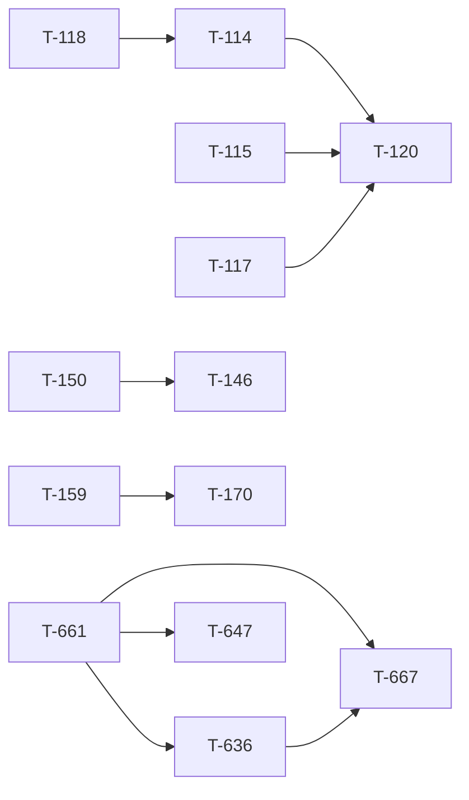

<!-- AUTO-GENERATED by ./scripts/ticket sync — DO NOT EDIT -->

# Ticket Lead Dashboard

## Running / Review

## Ready

- **T-090** (900) — Map visualization program [ready] — Map Engine v2 through sea-band + contours @ `bd481cf1`. **Active:** **T-090.5.5** tree/veg/prop glyphs. Single lane.

## Next queued (top 10)

- **T-120** (1200) — Staging soak + golden mission smoke [queued] — Pinned game/mod version soak; golden-mission smoke on staging server.
- **T-146** (1470) — Asset Browser Data Wiring [queued] — Hook up T-150 registry items (vehicles/crates/…) to Asset Browser for map drag-place. Unblocked by T-150; after or parallel T-068.9 ingest preferred.
- **T-170** (1670) — Prod default flip to Leptos SPA [queued] — Make the Leptos SPA the production default: set `SPA_DIST_DIR` to the trunk release dist in the prod env, move the Discord OAuth redirect origin, staging soak, then flip. OPERATOR-GATED (env + Discord app settings are operator-held); claude-code prepares configs/runbook + verifies the staging soak gates. Runbook anchor: docs/website/DEV_RUNBOOK.md §SPA serving; T-159 finish program left this as the sole operator-gated residual.
- **T-647** (3950) — Placement interactions: click-then-click, Ctrl multi-place, Alt empty vehicle, dbl-click entry points [queued] — SUPERSEDES T-072 and T-077 (both cancelled in favour of this row) and absorbs three interaction-sweep slices, because they are all the same seam: what a click or a double-click on the map MEANS. Ids: `PLACE-001` (TBD is drag-only; Eden also supports click-then-click), `PLACE-003` (double-click empty ground -> asset picker), `PLACE-004` (Ctrl multi-place), `PLACE-CREW-001` (Alt = place empty vehicle), `ATTR-OPEN-001` (double-click opens Attributes for vehicles/objects/zones, not just slots) and `CONN-GROUP-001`'s map half (Ctrl + drag character->character to regroup). Code: the place is consumed on canvas release — `apps/website/frontend/src/mission_editor.rs` `onpointerup` :1644 with the on-canvas guard :1668-1671 and the palette-drag comment :1655-1662; the dblclick at :1934. `ATTR-OPEN-001` is a ONE-CALL-SITE SWAP, verified: the dblclick handler at :1963 calls `crate::select_tool::pick(...)` while the click path already uses `st::pick_slot_or_vehicle` at :1537 and :1733 (both exist, select_tool.rs:128 and :150). `Alt` is genuinely free: all three word-boundary `alt_key` hits were read (mission_history.rs:490, mission_editor.rs:1020 and :1023) and not one is a placement modifier. In editor_ops.rs the arm/consume lifecycle is `begin_place` :1037, `begin_place_vehicle` :1044, `begin_place_object` :1049, `has_pending` :1079, `cancel_pending` :1096, `place_at` :2191 (the `take()` is at :2204) — Ctrl-multi-place = do not clear pending on release; Alt-empty = a flag through `place_at`; regrouping is a squad-membership write on the shape of `orbat_add_vehicle` :1616 (core side already exists: store.rs:835 `attach_vehicle`, :880 `detach_vehicle`). Ctrl is overloaded by multi-place AND map grouping — resolve that inside this ticket; it is the reason they are one row.
- **T-667** (3960) — Map furniture: scale bar and edge grid reference labels [queued] — The second half of the split T-641, and an operator decision to EXCEED Eden rather than match it. Eden ships no scale bar, no north arrow, no legend and no grid coordinate labels — only a two-axis X/Y gizmo bottom-left. A 2D top-down planner needs distance cues that a 3D-first editor does not, and they pair naturally with the ruler (T-642). Add a scale bar and edge grid reference labels; skip the legend. These belong in the full-width status bar that T-636 creates — the draft says so directly ("it gives the scale bar and grid refs from T-641 somewhere to live"), which is why this ticket is scheduled one wave after T-636 and owns only eden_toolbelt.rs. HARD DEPENDENCY on T-636: if the status bar has not landed there is nowhere to put them, and the floating pill has no room. Placement inside the bar is INFERRED (graded low in owns_parity.md) — no ticket has named the component layout.
- **T-638** (3970) — Collapse and expand both docks [queued] — Operator-requested. Eden's mechanism, measured across all 75 screenshots: a 24x24 CHEVRON in each panel's outer top corner inside the tab strip (left x 0..23 y 47..70, right x 1896..1919 y 47..70); expanded points outward (« left, » right) and collapsed is the SAME bbox with the glyph flipped; collapsed is neither a rail nor a vanish — the panel becomes exactly that 24x24 stub docked at the screen corner, overlaying the map; the viewport REFLOWS, map canvas 1440 -> 1920 px, +33%. Keys: `E` Entity List, `R` Asset Browser, `Backspace` whole interface (T-662 frees Backspace); menu path `View > Interface`. No toolbar button — edge chevron and keyboard only. Code: DockLeft and DockRight (post-split eden_dock_left.rs / eden_dock_right.rs, from eden_chrome.rs:2813 and :2961) plus the four layout constants that must become dynamic — STRIP_TOP_PX :38, DOCK_LEFT_PX :40, DOCK_RIGHT_PX :42, TOOLBELT_BAND_PX :45, all now in eden_layout.rs. THIS IS A CHOKEPOINT — three hot files at once — because those constants are read by three files: mission_editor.rs reflows the canvas at :1985 (`e.resize(rect.width(), rect.height(), dpr)`, so the device buffer really is reallocated — that answers the draft's "confirm it resizes rather than stretching") AND its on-canvas hit test :1668-1671 reads all four directly, so a collapsed dock changes what counts as on-canvas; select_tool.rs:461-466 consumes the same four for `farthest_empty_px` in the marquee self-check, which is the one nobody would guess. Keys go in the editor keydown :1005-1030. STILL OPEN: whether the camera holds its world position across the reflow.
- **T-659** (3980) — Slot census badge + generated mission summary line [queued] — Per-side live counts in the editor header (`WEST 78 · EAST 74 · IND 8 · TOTAL 160`) plus a summary line composed from the document. This REPLACES two of the MissionAnalyzer's rules by making the malformed state unreachable rather than caught — the "should be unrepresentable" pile — and WOG got a 94%-consistent community naming convention out of the counter alone. Code: the header is `TopCommandStrip` (post-split eden_top_strip.rs, from eden_chrome.rs:831); the existing OBJ/SEL/SZ counters in BottomToolbelt :3745-3766 are the pattern to copy. Per-side counts derive from the ORBAT snapshot — `orbat_manager_snapshot` (editor_ops.rs:1190) and `vehicle_rows` :1751. Cheap and visible, which is why it is early in the validation group's internal order (panel -> engine -> census -> rule content).
- **T-657** (3990) — Validation: ORBAT and slot rules [queued] — Rule content in the T-656 engine, so it modifies only `crates/map-engine-core/src/mission/validate.rs`; it READS `crates/map-engine-core/src/mission/orbat.rs` (359 lines) and doc/store.rs and modifies neither. Rules: every slot resolves a role and a squad; no default/empty identity fields; no leaderless squads; no duplicate callsigns within a side. This COLLAPSES the MissionAnalyzer's R3+R4+R5 — three overlapping rules with hardcoded name lists that exist ONLY because Eden packs role and callsign into one string — into one query over TBD's typed fields; R3 is the one rule FNF rated `error` rather than `warning`. It also revives D3-D8, six commented-out per-squad coverage rules, as ONE rule parameterised by squad template. Depends on T-656 for the primitives; collides with T-656 / T-658 / T-660 on validate.rs, which is why the four are in four different waves. Validation is ALWAYS ON — not behind a debug flag, not on save, not on export.
- **T-642** (4000) — Ruler: persistent polyline with per-leg distance and bearing [queued] — Operator-requested, and one of the two dead buttons. Both stubs are adjacent lines in one component: eden_chrome.rs:3711-3713 (Ruler, `class=TOOL_DISABLED disabled=true`, MaterialIcon name="straighten") and :3715-3717 (LoS) — `grep -n TOOL_DISABLED` returns exactly three hits, the const :74 and those two buttons — so T-642 and T-643 collide by construction and sit one wave apart. NO PRIOR ART: 3den Enhanced has no ruler beyond a 2-point measure with a 20-second notification as the readout, so the design is ours. Do: click a chain of points; per-leg distance AND bearing plus a running total; persists on the map until dismissed. Decisions left open inside the ticket — leg labels on the line vs in the status bar; whether a leg reports slope/delta-elevation (the DEM makes it free); how to dismiss (Esc, a close affordance, or tool-switch); whether rulers survive save/reload. Code: wire the `straighten` button in post-split eden_toolbelt.rs (drop `disabled=true`, add active state via TOOL_ACTIVE :72) with readouts in the readout block :3721-3766; click-chain capture in mission_editor.rs (`onpointerdown` :1395, `onpointerup` :1644, Esc in the keydown :1005-1030 — there is no other gesture host); tool-mode arbitration in select_tool.rs (`LeftGesture` :62 and `PendingLeft` :49 are the state machine a third mode must enter, `frozen_camera` :86 is the unproject it needs); the polyline model in a NEW `apps/website/frontend/src/ruler_tool.rs` (module name INFERRED; wave 0 pre-declares the stub). THE RULE THIS TICKET EXISTS TO HONOUR: removing `disabled` without the tool working is worse than the current state — it turns an honest stub into a lie. The corpus agrees twice over: FNF's `Use Default Loadout` checkbox is read by nothing in the entire worktree, and OFCRA's duration override is displayed to clients while the server ignores it.
- **T-650** (4010) — Compositions: save and place [queued] — MERGES T-078 (cancelled in favour of this row). Closes `COMP-SAVE-001`, `COMP-EDIT-001`, `COMP-PLACE-001`, `RIGHT-MODE-002` and the three metadata fields `ATTR-FIELD-COMP-TITLE` / `-AUTHOR` / `-CATEGORY`. Steam Workshop compositions (`COMP-WORKSHOP-001`, `COMP-SUBSCRIBE-001`) stay deferred — no equivalent exists. High corpus value: compositions are FNF v4's #1 strength, WOG ships 28 group presets, and Eden's F2 tab is Compositions, one of six top-level asset tabs. SCOPE AGAINST T-180 FIRST — CLAUDE.md records T-180 as already shipping "templates/vehicles", so part of this may exist. Code: `RIGHT-MODE-002` is a new palette mode — PaletteKind (eden_chrome.rs:1833) has only Character / Vehicle / Object with arms :1944-1950, tab strip :3041-3046, all now in post-split eden_dock_right.rs; save-selection is a read plus a write and place is a multi-slot paste, so `copy_selection` (editor_ops.rs:394) / `paste_at_cursor` :436 are the shapes to reuse. OPEN QUESTION, unresolved and load-bearing: WHERE COMPOSITIONS ARE STORED. Zero repo-wide hits for `save_composition` / `user_composition` / `custom_composition`; the only `composition` occurrences in the frontend are asset_catalog.rs:345-844, a path-string classifier that CONSUMES Bohemia's compositions. A title, a server-assigned author and a category are user-scoped rows, not mission-document state — if the operator accepts that framing this ticket drops `crates/map-engine-core/src/doc/store.rs` and gains NEW apps/website/api/src/handlers/compositions.rs + a migration + models/mod.rs + dto.rs, which is still `claude-code` (the Rust workspace, not packages/ or apps/mod/) and packs better. Re-open the owns row if that call is made.

## Dependency graph (scoped)

```mermaid
flowchart LR
  T118[T-118] --> T114[T-114]
  T114[T-114] --> T120[T-120]
  T115[T-115] --> T120[T-120]
  T117[T-117] --> T120[T-120]
  T150[T-150] --> T146[T-146]
  T159[T-159] --> T170[T-170]
  T661[T-661] --> T636[T-636]
  T661[T-661] --> T647[T-647]
  T661[T-661] --> T667[T-667]
  T636[T-636] --> T667[T-667]
```
