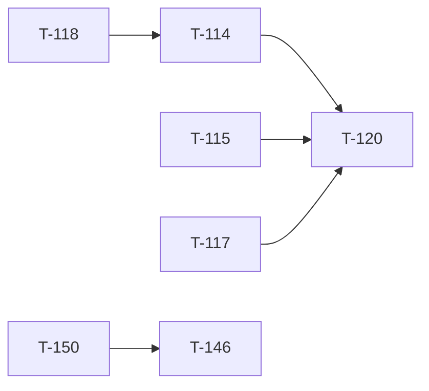

<!-- AUTO-GENERATED by ./scripts/ticket sync — DO NOT EDIT -->

# Ticket Lead Dashboard

## Running / Review

## Ready

- **T-090** (900) — Map visualization program [ready] — Map Engine v2 through sea-band + contours @ `bd481cf1`. **Active:** **T-090.5.5** tree/veg/prop glyphs. Single lane.
- **T-117** (1170) — Mission upload + validation UI [ready] — Web UI for mission upload and schema validation (API exists).
- **T-581** (3430) — BLOCKS THE ZONE DRAW TOOL: a bad zone saves 201 then 500s /compiled forever [ready] — MAJOR, found by wave 70's adversarial verifier by driving the real HTTP path. **This must land BEFORE
any zone authoring UI ships.** It is unreachable today only because T-211 shipped the document layer
with no wasm binding and no UI (see T-582) -- the moment a draw tool exists, an author can brick a
mission version permanently.

THE DEFECT: zone vocabulary is enforced only at SERVE time, not at SAVE time.
  doc/store.rs:915        set_zone_rules stores `rules` OPAQUE -- zero vocabulary check (deliberate;
                          a typed mirror would be the second vocabulary T-241 exists to prevent)
  mission/flatten.rs:1881 `rules: raw.rules.clone()` -- carried verbatim into the mod document
  handlers/missions.rs:1462 validated_compiled_body 500s on the schema violation
  mission-editor-payload.schema.json  has NO `zones` subschema; the root is open (verified)
  the T-367 save-time precheck's `ZoneIn.rules: Option<serde_json::Value>` accepts anything

EXECUTED REPRO (verifier):
  POST /missions/:id/versions with a zone whose rules include {"notInT241Vocabulary": 1}
    -> 201 Created
  GET /missions/:id/compiled
    -> 500  "'notInT241Vocabulary' was unexpected"
  ...and FOREVER, because mission_versions rows are immutable. Same mechanism for `type` outside the
  6-value enum: "capture" -> 201 -> 500.

WHY IT MATTERS BEYOND THE 500: the game server asks for /compiled with only a mission id. The author
who saved the bad zone sees success; the failure surfaces in front of a game server, at play time,
with no human in the loop. That is the exact T-367 class this codebase built a save-time precheck to
prevent -- and the precheck is the thing that lets it through.

SECOND, SAME CLASS (verifier F2): the 0.1 m mod quantisation can MANUFACTURE a schema-invalid document
from a schema-VALID authored zone. flatten.rs:1824-1851 checks `r > 0.0` BEFORE rounding, and
round_coord(0.04) = 0.0, which violates $defs/circle.r exclusiveMinimum: 0.
  EXECUTED: circle r=0.04 -> save 201 -> /compiled 500 "r\":0.0 ... not valid under oneOf"
  A CLICK-WITHOUT-DRAG IN THE FUTURE DRAW TOOL PRODUCES EXACTLY THIS RADIUS, and r=0.04 is
  schema-valid on the way in, so a naive save-time zone check would NOT catch it. Whatever validation
  lands must run the post-quantisation shape, not the authored one.

WANTED: validate zones at the SAVE boundary -- extend mission-editor-payload.schema.json with a
`zones` subschema and/or tighten the T-367 precheck's ZoneIn, so a bad zone is a 400 the author sees
immediately rather than a permanent 500 a game server discovers. Keep `rules` opaque in the DOCUMENT
(T-211's reasoning is correct); the check belongs at the API boundary where the schema already lives.

CONFIRMED SOUND, do not re-audit: quantisation is otherwise faithful (1000.256->1000.3,
175.789->175.8, vertex count and order preserved, verified over the real HTTP path).

## Next queued (top 10)

- **T-072** (720) — Ctrl multi-place [queued] — Hold Ctrl to place multiple copies without re-selecting asset.
- **T-073** (730) — Shift + map rotation [queued] — Shift-drag and map rotation widget for placed entities.
- **T-075** (750) — Spacebar flyTo vs widget [queued] — Spacebar centers selection; resolve flyTo vs transform widget conflict.
- **T-120** (1200) — Staging soak + golden mission smoke [queued] — Pinned game/mod version soak; golden-mission smoke on staging server.
- **T-146** (1470) — Asset Browser Data Wiring [queued] — Hook up T-150 registry items (vehicles/crates/…) to Asset Browser for map drag-place. Unblocked by T-150; after or parallel T-068.9 ingest preferred.
- **T-170** (1670) — Prod default flip to Leptos SPA [queued] — Make the Leptos SPA the production default: set `SPA_DIST_DIR` to the trunk release dist in the prod env, move the Discord OAuth redirect origin, staging soak, then flip. OPERATOR-GATED (env + Discord app settings are operator-held); claude-code prepares configs/runbook + verifies the staging soak gates. Runbook anchor: docs/website/DEV_RUNBOOK.md §SPA serving; T-159 finish program left this as the sole operator-gated residual.

## Dependency graph (scoped)

```mermaid
flowchart LR
  T118[T-118] --> T114[T-114]
  T114[T-114] --> T120[T-120]
  T115[T-115] --> T120[T-120]
  T117[T-117] --> T120[T-120]
  T150[T-150] --> T146[T-146]
```
