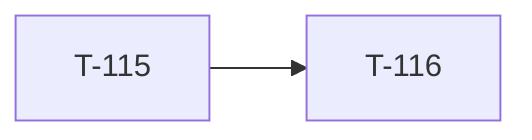

<!-- AUTO-GENERATED by ./scripts/ticket sync — DO NOT EDIT -->

# Ticket Lead Dashboard

## Running / Review

## Ready

- **T-090** (900) — Map visualization program [ready] — Map Engine v2 through sea-band + contours @ `bd481cf1`. **Active:** **T-090.5.5** tree/veg/prop glyphs. Single lane.
- **T-556** (3401) — BLOCKER: the gate depends on `rg`, which is installed nowhere — it resolves only via an agent-injected shell function [ready] — Found 2026-07-27 while gating T-555. **The wave gate is RED on merged main** and has been before T-555 touched anything — proven by running both scripts from a clean checkout with no slice changes (both exit 1).

=== THE MECHANISM ===
`ripgrep` is NOT INSTALLED. Not in the container, not on the host:
    rpm -q ripgrep                      -> not installed
    ls /usr/bin/rg /usr/local/bin/rg    -> absent
    distrobox-host-exec sh -c 'ls /usr/bin/rg'  -> not on host either
`command -v rg` SUCCEEDS in an agent shell only because Claude Code (and presumably Cursor) inject a
shell FUNCTION named `rg` that routes to the agent binary's bundled ripgrep. Proof:
    type rg          -> "rg is a function"
    bash -c 'command -v rg'  -> ABSENT   (functions are not exported to subshells)

So every gate script using `rg` passes ONLY when invoked from a shell where an AI agent harness
happens to have defined that shim. Change how the gate is invoked and the verdict changes. That is a
direct violation of acceptance-gates-reproducible.mdc rule 1 -- the rule that exists BECAUSE an
unpinned external tool once turned a routine ticket into a multi-hour session.

=== WHAT IS RED RIGHT NOW ON MAIN ===
    T-456 REST size gate   FAIL   scripts/mod/verify-t456-mission-rest-size-gate.sh:115  "rg: command not found"
    T-437 destroy inert    FAIL   scripts/mod/verify-t437-destroy-inert-diagnostics.sh
T-437's trace is less obviously rg-only -- its RED proofs fire as expected and its GREEN proof prints
PASS, yet the script returns 1. DIAGNOSE IT SEPARATELY rather than assuming it is the same cause.

=== CI IS EXPOSED, AND UNPINNED ===
.github/workflows/ci.yml runs `verify-t456` (3 rg uses) on `ubuntu-latest` with NO ripgrep install
step. Whether CI is green depends entirely on whether the runner image ships ripgrep that week. That
is unpinned floating state, forbidden by the same rule. Either install it deliberately in the
workflow (pinned) or remove the dependency.

=== TWO MORE SCRIPTS, SAME FAMILY, AND THEY ARE DEAD ===
verify-t296-results-reporter-identity-comments.sh:21,25 and
verify-t452-player-identity-link-comments.sh:21,29 use the FAIL-OPEN shape
    if rg ...; then fail; fi
With rg absent this exits 127, the `if` is false, and the ban prints OK HAVING COMPARED NOTHING.
Both scripts are also wired to NOTHING -- not the gate, not ci.yml, not the Makefile. Dead gates
carrying a known-broken shape, waiting to be wired up by someone who trusts them.

=== THE FIX IS ALREADY WRITTEN ELSEWHERE ===
T-216 solved exactly this in wave 5 for scripts/verify-t180-coherency.sh: drop `rg` for `grep -E`
(present in container AND on host AND on every runner), and read the EXIT STATUS rather than
collapsing it to a boolean --
    0 = match | 1 = no match | 2 = target file missing | 127 = tool absent
-- with the last two failing CLOSED and naming which of the two happened. Patterns are identical in
ERE. That fix did not propagate to scripts written afterwards; this ticket propagates it.

SCOPE: verify-t456, verify-t437, verify-t296, verify-t452, plus a sweep of scripts/mod/verify-t*.sh
and scripts/platform/*.sh for any other `rg` use or `if grep ...; then fail; fi` shape. Decide
deliberately whether the two dead scripts get wired into the gate or deleted -- do not leave them
dead AND broken.

## Next queued (top 10)

- **T-072** (720) — Ctrl multi-place [queued] — Hold Ctrl to place multiple copies without re-selecting asset.
- **T-073** (730) — Shift + map rotation [queued] — Shift-drag and map rotation widget for placed entities.
- **T-075** (750) — Spacebar flyTo vs widget [queued] — Spacebar centers selection; resolve flyTo vs transform widget conflict.
- **T-116** (1160) — Results POST to backend [queued] — SPLIT 2026-07-26. Mod half SHIPPED: TBD_ResultsReporter.c (682 lines, T-181.13.1) POSTs to /api/v1/ingest/match-results. Website half OPEN and folded into T-232 — event_hub.rs renders no result/outcome/match data at all. This row now tracks only the website half.
- **T-117** (1170) — Mission upload + validation UI [queued] — Web UI for mission upload and schema validation (API exists).
- **T-118** (1180) — Event ORBAT + identity linking UI [queued] — SPLIT 2026-07-26. DONE: identity-link UI (settings.rs:6-9,74-94, T-159.25) and the ORBAT selector (event_hub.rs:520-572, T-159.25a). OPEN residual is tracked by T-226 (PATCH /events/{id} has no caller), T-284 (clear_slot unreachable, admin cannot free a claimed slot) and T-231 (identity last mile). This row is a pointer, not work.
- **T-120** (1200) — Staging soak + golden mission smoke [queued] — Pinned game/mod version soak; golden-mission smoke on staging server.
- **T-146** (1470) — Asset Browser Data Wiring [queued] — Hook up T-150 registry items (vehicles/crates/…) to Asset Browser for map drag-place. Unblocked by T-150; after or parallel T-068.9 ingest preferred.
- **T-170** (1670) — Prod default flip to Leptos SPA [queued] — Make the Leptos SPA the production default: set `SPA_DIST_DIR` to the trunk release dist in the prod env, move the Discord OAuth redirect origin, staging soak, then flip. OPERATOR-GATED (env + Discord app settings are operator-held); claude-code prepares configs/runbook + verifies the staging soak gates. Runbook anchor: docs/website/DEV_RUNBOOK.md §SPA serving; T-159 finish program left this as the sole operator-gated residual.

## Dependency graph (scoped)

```mermaid
flowchart LR
  T115[T-115] --> T116[T-116]
```
