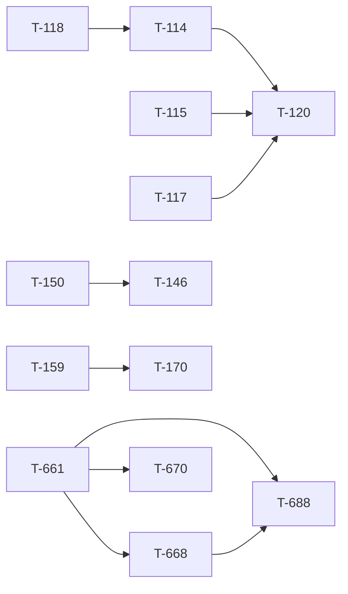

<!-- AUTO-GENERATED by ./scripts/ticket sync — DO NOT EDIT -->

# Ticket Lead Dashboard

## Running / Review

## Ready

- **T-090** (900) — Map visualization program [ready] — Map Engine v2 through sea-band + contours @ `bd481cf1`. **Active:** **T-090.5.5** tree/veg/prop glyphs. Single lane.

## Next queued (top 10)

- **T-120** (1200) — Staging soak + golden mission smoke [queued] — Pinned game/mod version soak; golden-mission smoke on staging server.
- **T-146** (1470) — Asset Browser Data Wiring [queued] — Hook up T-150 registry items (vehicles/crates/…) to Asset Browser for map drag-place. Unblocked by T-150; after or parallel T-068.9 ingest preferred.
- **T-170** (1670) — Prod default flip to Leptos SPA [queued] — Make the Leptos SPA the production default: set `SPA_DIST_DIR` to the trunk release dist in the prod env, move the Discord OAuth redirect origin, staging soak, then flip. OPERATOR-GATED (env + Discord app settings are operator-held); claude-code prepares configs/runbook + verifies the staging soak gates. Runbook anchor: docs/website/DEV_RUNBOOK.md §SPA serving; T-159 finish program left this as the sole operator-gated residual.
- **T-670** (4160) — Scale readout in the status bar [queued] — Closes `STATUS-ZOOM-001`. Eden prints metres-per-pixel in its status bar; we print nothing, which is also why the contour-ladder work (T-639) has no on-screen check. The sweep calls this "one " — IT IS NOT, and the difference is a whole file. The toolbelt half is genuinely one cell: `BottomToolbelt` (post-split eden_toolbelt.rs, from eden_chrome.rs:3672) has two mono groups, CUR/SEL + X/Y/Z at :3720-3740 and OBJ/SEL/SZ at :3741-3766, and a scale span is a fourth cell in the second group. But THE COMPONENT HAS NO ZOOM INPUT: the full signature at :3672-3682 takes `cursor`, `sel_count`, `obj_count`, `selected_ids` and an optional `sz_bytes` — no camera. `RenderEngine::zoom()` exists (crates/map-engine-render/src/engine.rs:1720) but is only reachable from the rAF sampler in mission_editor.rs (mount at :2070), so this ticket adds a signal there and a prop here.
- **T-688** (4165) — Aggregated settings view: every authored setting in one list, with diff-from-default [queued] — The U4 item from framework_synthesis.md C.2, ranked 4 of 16, and the only ticket in the program that exists to PREVENT a regression rather than fix one. FNF v4 named this defect about itself at fnf_v4.md:906: "One `config.sqf` became 22 modules whose attributes are only visible when the right module is selected. There is no 'show me every setting in this mission' view. Some settings (Fortify Points) are on Init, some (Death Mode) on Misc Options, some (Time until Zone is Deleted) on each Safe Zone — and safe-start duration is IMPLICITLY the maximum across all of them." That is the exact bill for the move to typed-attributes-on-placed-objects, which the corpus otherwise says wins outright (2 of 4 crossed that line, 1 stayed and ranks the text-config friction #1). TBD IS AT THE START OF THE SAME CURVE: `MissionSettingsDialog` (eden_chrome.rs:3788, post-split eden_settings.rs) holds terrain / time / weather / the three flow durations / JIP, while `zone.rules` ALREADY lives on placed entities (mission.schema.json `$defs/zoneRules`), and every ticket in this program that puts a setting on an entity widens the scatter. Scope: a READ-ONLY aggregation over the document listing every authored setting regardless of which entity owns it, each row showing key, owning entity, authored value and the schema default, with a diff-from-default filter. Cheap by construction — the schema declares `default` on every key that has one, so the comparison needs no second source of truth. TWO CONSTRAINTS: it must not become a second editing surface (that would duplicate every attribute control in the program), and rows must click through to the owning entity — wog.md:14.6's lesson that a findings list which only prints is worse than one that selects applies here as much as to T-655's panel. Depends on T-668 so it is built in the finished state vocabulary rather than retrofitted.
- **T-634** (4170) — Top strip: split into two rows and give the actions a hierarchy [queued] — RESCOPED by editor_chrome_direction.md from "no action hierarchy" to Eden's two-row structure. Eden fits 8 menus (y 0-22) AND 25 tool icons (y 22-40, its own row) into 40 px. We fit 5 menus, the title, a time scrubber, a weather select, undo/redo/history, three buttons and a gear into ONE 48 px strip — which is why it reads as crowded. Menus on row 1, an icon toolbar on row 2. The original hierarchy complaint stands and is part of the same work: `Save Version` :1179, `Export JSON` :1189 and `Export Compiled` :1203 sit at near-equal visual weight so the routine and the consequential read the same — one primary, demote the two exports (menu, split button, or secondary styling); the undo/redo/history glyphs :1160-1173 are too dim to find; the settings gear after :1206 is stranded alone at the far right. All inside `TopCommandStrip` (post-split eden_top_strip.rs, from eden_chrome.rs:831-1372), with the menu descriptor table `MENUS` :112-166 for any menu/split-button demotion. Build against the finished state vocabulary (T-668) — the menu rules in it (reserved checkmark gutter, `...` means dialog, drop-vs-grey by verb) are this ticket's rules too.
- **T-069** (4180) — Markers on map — the four schema-carried fields [queued] — PROMOTED, RESCOPED, AND MERGED WITH T-213 (cancelled in favour of this row — the two were the same job under two names). Keeps this id because it owns the in-code stub message and the test that pins it. SCOPE: the four schema-carried fields only — `ATTR-FIELD-MRK-TYPE`, `-MRK-TEXT`, `-MRK-POSITION` against `$defs/marker` = {x, z, icon, label}, plus `RIGHT-MODE-006`. Marker STYLE (size / rotation / shape / brush / colour / alpha) and Eden's whole second Area-marker model are a $defs/marker widening and are a workbench ticket that must ship AFTER this one, or this converts from a factory ticket into a workbench one. This is the one absent-entity family that is factory-dispatchable today, because $defs/marker already declares the four fields and the icon enum is closed at 64 aliases, so the marker CORE needs no schema edit at all. TWO DEAD PREMISES TO FIX BEFORE STARTING: T-213's spec cited a `state/schema.ts` that no longer exists (the React tree was deleted at T-159.29.3), and THIS TICKET'S OWN SPEC PREMISE at docs/specs/Mission_Creator_Architecture/t069_markers_on_map.md IS CONFIRMED DEAD — rewrite it first. Code: the whole right-dock stub — tab button `{tab_btn(2, "Markers")}` at eden_chrome.rs:3046 and a body that is the `_ =>` fallthrough arm reading "Marker placement lands in T-069." at :3337; PaletteKind :1833 has three variants and needs a fourth. `grep -c marker editor_ops.rs` -> 0: not one marker command exists in the SPA's mutation surface. In store.rs `markersById` is a declared root :355 with `marker_any(id, x, z, icon, label)` :3048 and `marker_row_id` :3033 already written, but the ONLY two mutators — `set_faction_briefing_marker` :2030 and `remove_faction_briefing_marker` :2070 — are faction-briefing scoped with zero product callers, so free placement needs generic add/move/remove. RENDER PATH, graded medium and the thing to check FIRST: `crates/map-engine-render/src/draw_order.rs` declares every lane (`LaneRole` :9; mission lanes MissionZones :55, SquadLinks :57, MissionVehicles, Slots) and there is NO marker lane, and `upload_icon_lane` (engine.rs:3555) is a CLOSED three-arm match over world assets. All 10 `marker` hits in that 6,302-line file were read and none is a mission marker. BUT if markers can ride the slot SoA that editor_ops.rs already uploads via `core.materialize()`, BOTH crate paths drop and this ticket stops touching map-engine-render at all. Trace `slots_gpu` before assuming the lane.
- **T-690** (4185) — Compile becomes a compiler: structured diagnostics instead of a toast [queued] — The U7 item from framework_synthesis.md C.2, ranked 7 of 16, and the row that FEEDS T-655's panel. fnf_v4.md:713-715 (13.1) rates "the export hook that makes Eden a compiler" as the single thing FNF v4 does better than anyone else: `init3DEN.sqf` turns Export-to-Multiplayer into a build step that derives group names, rewrites sync links, toggles markers, strips inventories, restores every mutation, wraps the lot in `collect3DENHistory` as ONE undo step, and self-heals on next open if a previous export left scaffolding behind — "No other Arma framework I've seen treats the editor as a compilation front-end this deliberately." TBD ALREADY HAS THE BUILD STEP AND NONE OF THE BUILD SYSTEM: `apps/website/frontend/src/mission_commands.rs`:23 `compiled_export_text`, :186 `compiled_document_json`, :237 the download error path, over `crates/map-engine-core/src/mission/compile.rs`. Everything the compile learns today is thrown away or flattened into a pass/fail. Scope: give the compile a structured result — a list of findings with severity, a stable rule id, the owning entity id and a message — returned alongside the bytes rather than instead of them, and rendered in T-655's panel. THE FIRST CONTENT IS ALREADY WRITTEN DOWN AND CURRENTLY SILENT: `crates/map-engine-core/src/mission/flatten.rs`:2584-2649 is the T-216 drop ledger — six author-facing values the compile silently discards (a squad's leaderSlotId, a slot's tag / callsign / rank / stance, and the entire vehicle roster) — and it records that `make verify-t180` stayed green throughout BECAUSE NOT ONE OF ITS 22 TESTS CHECKED. Each of those six is a diagnostic this ticket can emit on day one, and each stays emitted until T-674/T-675 land the schema half. TWO RULES CARRIED FROM THE CORPUS: diagnostics are NEVER debug-gated (fnf_v4.md 14.9 — v4's shipped state is the un-diagnosable one; T-635 gates telemetry, not correctness), and no severity may fire on correct input (fnf_tooling.md 1.3 — the Analyzer's role accordion can never go green). Depends on T-655 for the surface; owns only the compiler and the command layer so the panel stays a single claimant.
- **T-672** (4190) — Connection graph: draw, sync, delete, formation [queued] — The connection-graph quarter of the split T-079. Ids: `CONN-START-001`, `CONN-SYNC-001`, `CONN-DEL-001`, `ACTION-FORM-001`, `CTX-FORMATION-001`. HARD DEPENDENCY on T-664 — two of those are context-menu items by definition. Code: drag-from-entity-to-entity is a third gesture mode in `onpointerdown` (mission_editor.rs:1395) / `onpointerup` :1644; link create / sync / delete mutators in editor_ops.rs; a link map in store.rs; menu items in context_menu.rs. THE RENDER LANE MAY ALREADY EXIST: `LaneRole::SquadLinks` (crates/map-engine-render/src/draw_order.rs:57) is "T-180.4 — squad leader->member hairline links (under slot rings)" and its doc comment :49 groups it with Contours / ForestOutline as a flat LineList lane — exactly the primitive a connection graph needs. Either reuse it and drop draw_order.rs from owns, or add a MissionConnections peer. WARNING carried from the framework corpus: `CONN-SYNC-001` is a bare `missing` row in gap_analysis.md with no note, and FNF v4's ENTIRE defect cluster lives on exactly this mechanism — the inspector and the validation rules must precede the edges. Do not ship edges you cannot see or check.
- **T-671** (4200) — Mission presentation: briefing text and thumbnail [queued] — Closes `ATTR-FIELD-SCN-OVERVIEW-TEXT` and `-SCN-PICTURE`, and it is the highest value-per-unit-effort row in the attributes sweep: THE API ALREADY ACCEPTS BOTH AND THERE IS NO CALLER. `MissionDetail.briefing` (dto.rs:846) and `.thumbnail_url` :850 already exist and the PATCH body in apps/website/api/src/handlers/missions.rs already takes both (:657 / :658) — no backend change, no schema change. Blocks FNF-style derived briefings downstream. Note these are `missions` ROW COLUMNS, not `meta.*`, and the editor's only PATCH path is the RowMirror debounce machine (eden_chrome.rs:496-829, error surface :797) which today mirrors exactly two columns, `MIRROR_TIME` :501 and `MIRROR_WEATHER` :506 — authoring briefing in the editor adds a third. The editor surface is MissionSettingsDialog (eden_chrome.rs:3788, post-split eden_settings.rs; read :3788-3850 — Terrain readonly, Time, Weather, then flow + render prefs, and a briefing textarea plus a thumbnail field belong in the same overflow-y-auto column at :3834+), and create_mission_dialog.rs (227 lines, one component at :27) is the other surface that cannot set it today. PRODUCT CALL THE OPERATOR SHOULD MAKE BEFORE THIS STARTS: if briefing is authored in the Mission Library dossier instead of the editor, owns becomes `apps/website/frontend/src/mission_overview.rs` (1,412 lines) ALONE and the ticket becomes collision-free against the entire program. Both are defensible; the library version packs better.

## Dependency graph (scoped)

```mermaid
flowchart LR
  T118[T-118] --> T114[T-114]
  T114[T-114] --> T120[T-120]
  T115[T-115] --> T120[T-120]
  T117[T-117] --> T120[T-120]
  T150[T-150] --> T146[T-146]
  T159[T-159] --> T170[T-170]
  T661[T-661] --> T668[T-668]
  T661[T-661] --> T670[T-670]
  T661[T-661] --> T688[T-688]
  T668[T-668] --> T688[T-688]
```
