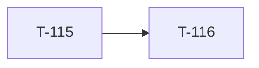

<!-- AUTO-GENERATED by ./scripts/ticket sync — DO NOT EDIT -->

# Ticket Lead Dashboard

## Running / Review

## Ready

- **T-090** (900) — Map visualization program [ready] — Map Engine v2 through sea-band + contours @ `bd481cf1`. **Active:** **T-090.5.5** tree/veg/prop glyphs. Single lane.
- **T-428** (3267) — Schedule Discord role resync; replace placeholder leader snowflake in seed [ready] — Follow-on from T-247 (wave 6). UI caller for POST /admin/roles/sync shipped in personnel.rs. Still missing: (1) nightly/cron scheduler claimed in docs/website/backend/architecture.md but no API job wires resync_all_roles; (2) apps/website/api/seeds/discord_roles.sql:23 ships placeholder snowflake 1517290000000000000 for Squad Leader/leader.

Repro: grep apps/website/api and scripts for a timer/cron calling resync_all_roles — none. Seed row: ('1517290000000000000', 'Squad Leader', 'leader', 30).
- **T-484** (3323) — Reject whitespace-only DISCORD_CLIENT_SECRET and DISCORD_REDIRECT_URL [ready] — Wave 32 verifier residual (T-481 shipped client_id trim). Production validate still uses bare is_empty() for discord_client_secret and discord_redirect_url (config.rs ~120-125). Whitespace-only secret/redirect validates Ok — same disguise class as pre-T-481 client id.

Repro: env=production, secret=" " or redirect=" " → validate() Ok.

Cure: trim().is_empty() (or reject trim-empty) for both; Class-R pins.
- **T-485** (3324) — Wire verify-t468 into Makefile / ci-local / CI so hollow t438/t456 recipes fail outside cold gate [ready] — Wave 32 verifier NIT (T-476). Tripwire lives in verify-t468-ci-schema-parity.sh and runs in wave.sh cold gate, but hollow `@true` verify-t438 still greens `make verify-t438` and GitHub mod-gates-hosted (ci.yml runs make verify-t438 only). Not in Makefile target, ci-local, or CI as a step that catches hollow recipes outside cold gate.

Repro: recipe `verify-t438:\n\t@true` → make verify-t438 rc=0; bash verify-t468 → FAIL.

Cure: add Makefile verify-t468 (or fold pin into ci-local + ci.yml) so hollow recipes fail without waiting for wave.sh gate.

## Next queued (top 10)

- **T-072** (720) — Ctrl multi-place [queued] — Hold Ctrl to place multiple copies without re-selecting asset.
- **T-073** (730) — Shift + map rotation [queued] — Shift-drag and map rotation widget for placed entities.
- **T-075** (750) — Spacebar flyTo vs widget [queued] — Spacebar centers selection; resolve flyTo vs transform widget conflict.
- **T-116** (1160) — Results POST to backend [queued] — SPLIT 2026-07-26. Mod half SHIPPED: TBD_ResultsReporter.c (682 lines, T-181.13.1) POSTs to /api/v1/ingest/match-results. Website half OPEN and folded into T-232 — event_hub.rs renders no result/outcome/match data at all. This row now tracks only the website half.
- **T-117** (1170) — Mission upload + validation UI [queued] — Web UI for mission upload and schema validation (API exists).
- **T-118** (1180) — Event ORBAT + identity linking UI [queued] — SPLIT 2026-07-26. DONE: identity-link UI (settings.rs:6-9,74-94, T-159.25) and the ORBAT selector (event_hub.rs:520-572, T-159.25a). OPEN residual is tracked by T-226 (PATCH /events/{id} has no caller), T-284 (clear_slot unreachable, admin cannot free a claimed slot) and T-231 (identity last mile). This row is a pointer, not work.
- **T-120** (1200) — Staging soak + golden mission smoke [queued] — Pinned game/mod version soak; golden-mission smoke on staging server.
- **T-146** (1470) — Asset Browser Data Wiring [queued] — Hook up T-150 registry items (vehicles/crates/…) to Asset Browser for map drag-place. Unblocked by T-150; after or parallel T-068.9 ingest preferred.
- **T-170** (1670) — Prod default flip to Leptos SPA [queued] — Make the Leptos SPA the production default: set `SPA_DIST_DIR` to the trunk release dist in the prod env, move the Discord OAuth redirect origin, staging soak, then flip. OPERATOR-GATED (env + Discord app settings are operator-held); claude-code prepares configs/runbook + verifies the staging soak gates. Runbook anchor: docs/website/DEV_RUNBOOK.md §SPA serving; T-159 finish program left this as the sole operator-gated residual.

## Dependency graph (scoped)

```mermaid
flowchart LR
  T115[T-115] --> T116[T-116]
```
