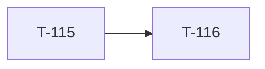

<!-- AUTO-GENERATED by ./scripts/ticket sync — DO NOT EDIT -->

# Ticket Lead Dashboard

## Running / Review

- **T-400** (3216) — Integration-test shared-fixture isolation — the 17 suites T-334 did not cover [running] — The residual of T-334, filed by the command center at dispatch time (NOT by the slice agent — three agents claimed to have filed follow-ups on 2026-07-26 and none had, so this one is filed by the party that owns the registry). T-334 was deliberately narrowed to its owns row: it created tests/common/mod.rs with a diagnostic dev-login helper and gave tests/events.rs private actor ids. Everything below is what it did not touch. Nothing here was judged wrong — only not now.

The 22 test binaries share one gate database and mutate each other's rows. From an 18-file inventory:

 - admin_field.rs:332 calls POST /admin/roles/sync, which loops EVERY users row and demotes anyone with no user_discord_roles — it fires T-372's admin lockout INSIDE the suite, silently demoting the shared dev row for every other binary. No amount of per-suite actor isolation survives a handler that rewrites every row, so this one has to go or be scoped first.
 - identity_link.rs is the heaviest writer: :26 nulls the shared row's arma_id with the error swallowed by `let _`, :106 unlinks it, :124-134 relinks it. dev.rs:47-49's ON CONFLICT does NOT restore arma_id and me.rs:77 computes arma_linked from the DATABASE row rather than the JWT claim, so auth_refresh.rs:100 (assert_eq!(me_body["arma_linked"], true)) fails whenever identity_link's setup interleaves ahead of it. Two binaries, one row, cargo test runs them concurrently. This pair is the live mechanism, confirmed by T-334's agent.
 - tests/telemetry.rs:17 PLAYER_DISCORD is still 000000000000000003, which is also seeds/content_golden.sql:166 ('Vance'). T-334 vacated the events.rs half of that double-booking; the telemetry half is untouched, and its seed carries ON CONFLICT ... DO UPDATE SET arma_id = EXCLUDED.arma_id, so it rewrites whatever another binary seeded.
 - factions.rs:18 DELETE FROM user_factions is the ONLY unscoped destructive statement in the corpus; it wipes null_tolerance.rs:589's faction. factions.rs:26-27 and registry_compat.rs both rewrite the shared role and leave it on enlisted, while misc_integration.rs:88 asserts role=='admin' by READING the DB and therefore fails when another suite leaves it lower.
 - idx_users_arma_id (migrations/0001_initial_schema.sql:887) is a NON-PARTIAL unique index, so arma_id = '' is a single global slot across the whole database, not a null-ish default. A second suite writing '' for a different discord_id hits a unique violation that ON CONFLICT (discord_id) cannot absorb. admin_field.rs:251-252 already documents this and uses NULL; nothing enforces it.
 - 17 unchecked header-index sites across 13 files still panic bare. tests/common/mod.rs now exists and its dev_login_token() reports status, body and asking suite — migrating the remaining suites onto it is most of the value here and is mechanical.

Patterns worth copying: null_tolerance.rs avoids dev-login entirely, owns ...099 and serialises its DB tests with a lock; misc_integration.rs mints via state.jwt.issue_access, which writes nothing.

DO THIS WITH T-381 (nothing validates the TEST_DATABASE_URL target name) and T-399 (nothing ever resets the gate DB) — same shared-database hazard, three different consequences.

CORRECTION TO THE RECORD, verified twice: T-365's stated mechanism is WRONG. dev_login has no ban check — handlers/dev.rs:24-64 never reads is_banned and calls issue_session unconditionally; handlers/auth.rs:35-47 issue_session loads no user row. The ban bites at POST /auth/refresh (handlers/auth.rs:144-150 -> 403). Confirmed statically and empirically on an isolated DB. Do not re-derive this a fourth time.

== ADDITIONAL INSTANCE, measured at gate level 2026-07-26 (wave 2) ==
`tests/admin_field.rs:289` (`admin_approvals_cms_field`) looks up a shared fixed user by discord_id and asserts a GLOBAL `role` value that it also mutates — not row-isolated even to the degree registry_compat.rs attempts. Two concurrent gates produced:
    panicked at apps/website/api/tests/admin_field.rs:289: left: String("leader")  right: "enlisted"
Control: the same test alone on the same clean DB passed 3/3, so this is the collision and not T-399's residue. Now masked by T-396's gate flock, but the suite is still not safe to run concurrently by hand.
- **T-408** (3224) — Two non-URL injection/authz gaps found during the T-391 sweep [running] — Both found while auditing URL sinks; neither is a URL problem, so neither belongs in T-405. Reported by T-391's slice agent, not fixed.

1. CSV FORMULA INJECTION — `apps/website/api/src/handlers/audit.rs:111` and `:113`. User-controlled text is written unescaped into the audit-log CSV export, so a value beginning `=`, `+`, `-` or `@` is a live formula when the file is opened in Excel or Google Sheets. This path bypasses Leptos escaping entirely — as does the Discord webhook consumer at `cms.rs:64`. T-391's `is_http_url` explicitly disclaims covering this: passing a URL guard is not permission to interpolate a value into a CSV. Standard fix is prefixing a single quote or a tab to any cell whose first character is one of those four, applied at the writer.

2. AUTHZ TIER ASYMMETRY — `apps/website/api/src/handlers/missions.rs:447`. `create_mission` requires `MissionMakerUser`; `update_mission` takes a plain `AuthUser` and gates only on `can_edit` ownership. Not exploitable on its own — you must own a mission, which required mission_maker to create — but the asymmetry means a ROLE DEMOTION does not revoke edit rights. Repro: create a mission as mission_maker, demote the account to enlisted, PATCH the mission; the ownership check still passes and the demoted user can keep editing, including `thumbnail_url`. Decide deliberately whether ownership should outlive the role that granted it; right now that decision has been made by omission.
- **T-410** (3231) — Residual ORDER BY ASC ratchets in the integration suites, and the dashboard next_event coverage hole [running] — Found by T-399's agent while fixing the approvals ratchet, measured against the live tbd_gate_it -- not inferred. T-399 fixed ONE instance; these are the rest of the class. The one-line rule: ASC ordering over a never-pruned table is the poison. (Inversion worth recording: handlers/audit.rs:65 orders id DESC, so residue pushes OLD rows off the page and never new ones -- missions.rs:1067 is safe by construction because of it.)

1. apps/website/api/tests/missions.rs:151 -- GET /api/v1/missions .any(id). handlers/missions.rs:266 is ORDER BY updated_at DESC LIMIT 20, and updated_at is NULLABLE WITH NO DEFAULT, so Postgres sorts NULLS FIRST on DESC. Ratchets at 20 missions with NULL updated_at. MEASURED 2 today ('Null Op'), and they ARE rows 1-2 of page 1 right now. Held at 2 only because null_tolerance.rs's boot() wipes its own rows. 845 live missions and growing.
2. apps/website/api/tests/missions.rs:249 -- ?scope=bookmarked, same handler, same ordering. Ratchets at 20 bookmarks for user 000000000000000001. Accumulates only when the test fails before its DELETE .../bookmark -- SELF-REINFORCING, identical shape to T-399.
3. apps/website/api/tests/dashboard_reads.rs:83-85 -- ALREADY FIRED AND PAPERED OVER. The comment reads 'next_event key is always present (null-safe); its value depends on shared-DB state'. Someone hit handlers/dashboard.rs:54's global ORDER BY start_time ASC LIMIT 1 and WEAKENED THE ASSERTION to key-presence rather than scoping it. Threshold is 1: any residue event with an earlier start_time wins. 558 events live. The dashboard's 'next operation' is effectively untested -- this is a genuine coverage hole, not just test hygiene, and is the highest-value item here.
4. handlers/events.rs:837/850 -- GET /api/v1/events default scope is ORDER BY e.start_time ASC LIMIT 20 OFFSET 0, exactly the approvals shape, over a table at 558 rows most sharing hardcoded fixture start_times. Already past 20. No test asserts against this list today, so it is a LOADED GUN, not a fired one: the first 'my event is in GET /api/v1/events' assertion anyone writes is red on arrival.
5. apps/website/api/tests/admin_field.rs:335 -- GET /admin/users?q=Target%20Z then .find(discord_id); handlers/admin.rs:87 ORDER BY username ASC LIMIT 20. Measured 1 match, unreachable because the fixture upserts a fixed id. Same construction, benign -- listed for completeness, no action.
6. apps/website/api/tests/registry_compat.rs:312/353/383/582 -- exact len() == 10604/529/1857. DIFFERENT MECHANISM (fixed-UUID DELETE-and-reimport race, already documented at scripts/platform/wave.sh:522-525), listed so the two are not conflated.

THE PATTERN TO PROPAGATE: misc_integration.rs:258-274's boot_servers(tag) deletes only 'T235 {tag}%' and comments why a blanket DELETE FROM servers would break telemetry.rs and admin_field.rs. factions.rs:18 is residue-proof but does an UNSCOPED DELETE FROM user_factions, which would wipe a concurrent sibling's rows -- misc_integration's tag-scoped version is the better model.

REPRO (the live one): psql -d tbd_gate_it -c \"SELECT count(*) FROM missions WHERE updated_at IS NULL AND deleted_at IS NULL\" -- at 20 this reds missions.rs:151 permanently.

== ADDED 2026-07-26 (wave 5): a THIRD instance, and it is the one that actually reds the wave gate ==
apps/website/api/tests/missions.rs:1002 `mission_submit_is_the_only_door_into_the_approvals_queue` reads page 1 of a limit:20 GET /approvals. MEASURED on tbd_gate_it during wave 5: total 26 -- the test's own mission is on page 2.
  test api  FAIL
    panicked at apps/website/api/tests/missions.rs:1002
    submitted mission missing from GET /approvals: {... "limit":20,"offset":0,"total":26}
T-399's sweep caught missions.rs:151 and :249 but MISSED this one. Every wave gate on this machine is red against the shared DB until the residue clears or the test paginates; waves 3, 4 and 5 all passed only because the command center pointed TBD_GATE_DB at a fresh cold database each time. That workaround is exactly why T-411 (per-wave DB names) matters.

## Ready

- **T-090** (900) — Map visualization program [ready] — Map Engine v2 through sea-band + contours @ `bd481cf1`. **Active:** **T-090.5.5** tree/veg/prop glyphs. Single lane.

## Next queued (top 10)

- **T-072** (720) — Ctrl multi-place [queued] — Hold Ctrl to place multiple copies without re-selecting asset.
- **T-073** (730) — Shift + map rotation [queued] — Shift-drag and map rotation widget for placed entities.
- **T-075** (750) — Spacebar flyTo vs widget [queued] — Spacebar centers selection; resolve flyTo vs transform widget conflict.
- **T-116** (1160) — Results POST to backend [queued] — SPLIT 2026-07-26. Mod half SHIPPED: TBD_ResultsReporter.c (682 lines, T-181.13.1) POSTs to /api/v1/ingest/match-results. Website half OPEN and folded into T-232 — event_hub.rs renders no result/outcome/match data at all. This row now tracks only the website half.
- **T-117** (1170) — Mission upload + validation UI [queued] — Web UI for mission upload and schema validation (API exists).
- **T-118** (1180) — Event ORBAT + identity linking UI [queued] — SPLIT 2026-07-26. DONE: identity-link UI (settings.rs:6-9,74-94, T-159.25) and the ORBAT selector (event_hub.rs:520-572, T-159.25a). OPEN residual is tracked by T-226 (PATCH /events/{id} has no caller), T-284 (clear_slot unreachable, admin cannot free a claimed slot) and T-231 (identity last mile). This row is a pointer, not work.
- **T-120** (1200) — Staging soak + golden mission smoke [queued] — Pinned game/mod version soak; golden-mission smoke on staging server.
- **T-146** (1470) — Asset Browser Data Wiring [queued] — Hook up T-150 registry items (vehicles/crates/…) to Asset Browser for map drag-place. Unblocked by T-150; after or parallel T-068.9 ingest preferred.
- **T-170** (1670) — Prod default flip to Leptos SPA [queued] — Make the Leptos SPA the production default: set `SPA_DIST_DIR` to the trunk release dist in the prod env, move the Discord OAuth redirect origin, staging soak, then flip. OPERATOR-GATED (env + Discord app settings are operator-held); claude-code prepares configs/runbook + verifies the staging soak gates. Runbook anchor: docs/website/DEV_RUNBOOK.md §SPA serving; T-159 finish program left this as the sole operator-gated residual.

## Dependency graph (scoped)

```mermaid
flowchart LR
  T115[T-115] --> T116[T-116]
```
