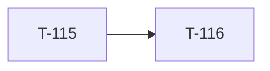

<!-- AUTO-GENERATED by ./scripts/ticket sync — DO NOT EDIT -->

# Ticket Lead Dashboard

## Running / Review

## Ready

- **T-090** (900) — Map visualization program [ready] — Map Engine v2 through sea-band + contours @ `bd481cf1`. **Active:** **T-090.5.5** tree/veg/prop glyphs. Single lane.
- **T-450** (3289) — Pin MISSION_FILE_MAX_BYTES (8MB) in mission schema [ready] — Residual from T-275 / wave 16. Schema now pins MAX_NETS/MAX_LABEL_CHARS/MAX_GRACE_SECONDS/MAX_DURATION_SECONDS, but TBD_MissionLoader.c still enforces MISSION_FILE_MAX_BYTES = 8*1024*1024 outside owns — a document can validate then fail at mod load on size.

Repro: craft a schema-valid mission JSON >8MB; CreateVersion/schema-validate OK; mod loader rejects at TBD_MissionLoader.c (~836).

Cure: add an explicit size ceiling to mission.schema.json (or document + API preflight) matching MISSION_FILE_MAX_BYTES; cite TBD_MissionLoader.c.
- **T-451** (3290) — ticket set-status mutates without schema check preflight [ready] — Residual from T-237 / wave 16 adversarial. ticket ship/done now call require_check_ok before status write, but cmd_set_status (and mark_ready etc.) still mutate registry without loading .ai/tickets/schema.json — an operator can force a red registry to a status.

Repro: break a required field in registry.json; ./scripts/ticket check RED; ./scripts/ticket set-status T-001 shipped still mutates.

Cure: gate mutators through require_check_ok (or document intentional escape hatch + refuse in CI).
- **T-453** (3292) — CI rust-backend fmt still misses workspace cargo fmt --all [ready] — Residual from T-297 / wave 18 adversarial MINOR. Local `make rust-fmt` now runs `cargo fmt --all --check`, but `.github/workflows/ci.yml` rust-backend still uses `working-directory: apps/website/api` + package-scoped `cargo fmt --check`, so GitHub CI can miss tbd-tools/xtask drift. Also `scripts/platform/wave.sh` still comments that `cargo fmt --all` is deliberately unused (stale).

Repro: format-break tools/tbd-tools/src/lib.rs; local rust-fmt RED; push and watch CI rust-backend still GREEN if only api fmt runs.

Cure: root/workspace fmt step in ci.yml (or drop working-directory for fmt); refresh wave.sh comment.

## Next queued (top 10)

- **T-072** (720) — Ctrl multi-place [queued] — Hold Ctrl to place multiple copies without re-selecting asset.
- **T-073** (730) — Shift + map rotation [queued] — Shift-drag and map rotation widget for placed entities.
- **T-075** (750) — Spacebar flyTo vs widget [queued] — Spacebar centers selection; resolve flyTo vs transform widget conflict.
- **T-116** (1160) — Results POST to backend [queued] — SPLIT 2026-07-26. Mod half SHIPPED: TBD_ResultsReporter.c (682 lines, T-181.13.1) POSTs to /api/v1/ingest/match-results. Website half OPEN and folded into T-232 — event_hub.rs renders no result/outcome/match data at all. This row now tracks only the website half.
- **T-117** (1170) — Mission upload + validation UI [queued] — Web UI for mission upload and schema validation (API exists).
- **T-118** (1180) — Event ORBAT + identity linking UI [queued] — SPLIT 2026-07-26. DONE: identity-link UI (settings.rs:6-9,74-94, T-159.25) and the ORBAT selector (event_hub.rs:520-572, T-159.25a). OPEN residual is tracked by T-226 (PATCH /events/{id} has no caller), T-284 (clear_slot unreachable, admin cannot free a claimed slot) and T-231 (identity last mile). This row is a pointer, not work.
- **T-120** (1200) — Staging soak + golden mission smoke [queued] — Pinned game/mod version soak; golden-mission smoke on staging server.
- **T-146** (1470) — Asset Browser Data Wiring [queued] — Hook up T-150 registry items (vehicles/crates/…) to Asset Browser for map drag-place. Unblocked by T-150; after or parallel T-068.9 ingest preferred.
- **T-170** (1670) — Prod default flip to Leptos SPA [queued] — Make the Leptos SPA the production default: set `SPA_DIST_DIR` to the trunk release dist in the prod env, move the Discord OAuth redirect origin, staging soak, then flip. OPERATOR-GATED (env + Discord app settings are operator-held); claude-code prepares configs/runbook + verifies the staging soak gates. Runbook anchor: docs/website/DEV_RUNBOOK.md §SPA serving; T-159 finish program left this as the sole operator-gated residual.

## Dependency graph (scoped)

```mermaid
flowchart LR
  T115[T-115] --> T116[T-116]
```
