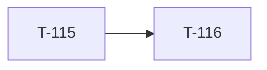

<!-- AUTO-GENERATED by ./scripts/ticket sync — DO NOT EDIT -->

# Ticket Lead Dashboard

## Running / Review

- **T-335** (3151) — One-off backfill for players who linked before T-326 shipped [running] — SPLIT FROM T-326, whose fix is deliberately FORWARD-ONLY — it claims a player's historical match_player_stats rows at link time, but does nothing for accounts already linked when it ships. Those players' rows stay orphaned forever, so their deployment count and leaderboard totals remain permanently short. T-326 measured the shape exactly: 3 ops before linking read as total_deployments=1 and 2 kills on the leaderboard where the true figures were 4 and 22.

T-326 supplied the SQL:
  UPDATE match_player_stats s SET discord_id = u.discord_id
    FROM users u WHERE u.arma_id = s.arma_id AND s.discord_id IS NULL;
then recompute_user_stats per affected user, then refresh_leaderboard.

DO NOT run it blind. Count the affected rows on a pg_dump copy of the operator's DB first and report the number — T-228 established that discipline and it is what stopped a migration that would have made the API refuse to boot. Two specific hazards here:
  1. T-326 found `ingest_link_confirm` was storing arma_id UNTRIMMED while the ingest resolver binds it trimmed. So some `users.arma_id` values in the live DB may carry whitespace and will NOT join to their rows. Check for them and decide whether to normalise users.arma_id in the same migration — an account in that state currently reads as linked while being invisible to every match ingest.
  2. The join is on arma_id alone. If two accounts ever held the same Steam id in sequence (T-326 proved unlink makes that legitimate), the rows go to whoever holds it NOW. Confirm that is the intended answer before running it.

Attendance deliberately out of scope: T-326's reasoning is that a registration was always that discord_id's, so 'they turned up' stays true, and the pre-flip state was never recorded so a reversal would have to invent one.

== DEFERRED 2026-07-26 BY OPERATOR DECISION, NOT CANCELLED ==
Recording a bug is most of its value; fixing it now is optional. The audits that produced this ticket were generating work faster than the run could close it, and the original T-182..T-297 feature backlog had not moved in hours. The operator's call, verbatim in substance: there will always be bugs, that is what developing is — knowing them is good, but spending the token budget on things that do not need fixing right now means nothing ships.
This is findable, fully diagnosed, and reproducible from the notes above. Promote it to `idea` when it actually blocks something, when it starts costing real time, or after the feature backlog lands. Nothing here was judged wrong — only not now.
- **T-506** (3346) — T-379 Class-R only tests require_role_played helper, not ingest call sites [running] — Wave 42 residual (CLEAN MINOR). require_role_played is called in ingest_match_results (telemetry.rs ~688 and ~722). Unit tests blank_role_played_is_rejected / non_blank_role_played_ok only exercise the helper. RED: delete both ingest call sites → those tests still PASS. No include_str call-site pin; no HTTP IT asserting "role_played must not be blank". Live ship is correct; cure: Class-R pin that both call sites invoke require_role_played and/or HTTP IT for blank role_played → 400.
- **T-507** (3347) — Faction manager posts untrimmed name after trim-empty check [running] — Wave 42 residual (CLEAN MINOR / admitted by T-358). faction_manager.rs rejects empty via doc.name.trim().is_empty() then posts serde_json::to_value(&doc) untrimmed. API validated_side_name rejects pad → 400; no UNIQUE twin stored. UX only: client lets pad through, API stops it. Cure: trim (or reject pad) before serialize on create/update.
- **T-513** (3353) — W44 hotfix: T-506 Class-R must not count comment bait for require_role_played [running] — Wave 44 verifier MAJOR. ingest_match_results_invokes_require_role_played_at_both_sites whitespace-collapses include_str and counts require_role_played(&p.role_played) inside // comments. Mutation: delete UPSERT bind, leave // require_role_played(&p.role_played) → PASS with one live call; delete both live calls + two bait comments → PASS. Cure: strip line comments (and block comments if needed) from the extracted production body before counting, or otherwise refuse comment-only matches. Perturbation RED with bait must fail; bare live calls still green.
- **T-514** (3354) — W44 hotfix: T-507 Class-R must not match commented trim assign [running] — Wave 44 verifier MAJOR. save_trims_name_before_serialize uses find("doc.name = doc.name.trim().to_string()") which matches a commented assign before serde_json::to_value. Mutation: replace live trim with // doc.name = doc.name.trim().to_string() + trim-empty check → PASS while payload stays untrimmed. Cure: strip comments from save body before find, or require an uncommented assign precedes to_value. Bait mutation must RED; live trim must green.

## Ready

- **T-090** (900) — Map visualization program [ready] — Map Engine v2 through sea-band + contours @ `bd481cf1`. **Active:** **T-090.5.5** tree/veg/prop glyphs. Single lane.

## Next queued (top 10)

- **T-072** (720) — Ctrl multi-place [queued] — Hold Ctrl to place multiple copies without re-selecting asset.
- **T-073** (730) — Shift + map rotation [queued] — Shift-drag and map rotation widget for placed entities.
- **T-075** (750) — Spacebar flyTo vs widget [queued] — Spacebar centers selection; resolve flyTo vs transform widget conflict.
- **T-116** (1160) — Results POST to backend [queued] — SPLIT 2026-07-26. Mod half SHIPPED: TBD_ResultsReporter.c (682 lines, T-181.13.1) POSTs to /api/v1/ingest/match-results. Website half OPEN and folded into T-232 — event_hub.rs renders no result/outcome/match data at all. This row now tracks only the website half.
- **T-117** (1170) — Mission upload + validation UI [queued] — Web UI for mission upload and schema validation (API exists).
- **T-118** (1180) — Event ORBAT + identity linking UI [queued] — SPLIT 2026-07-26. DONE: identity-link UI (settings.rs:6-9,74-94, T-159.25) and the ORBAT selector (event_hub.rs:520-572, T-159.25a). OPEN residual is tracked by T-226 (PATCH /events/{id} has no caller), T-284 (clear_slot unreachable, admin cannot free a claimed slot) and T-231 (identity last mile). This row is a pointer, not work.
- **T-120** (1200) — Staging soak + golden mission smoke [queued] — Pinned game/mod version soak; golden-mission smoke on staging server.
- **T-146** (1470) — Asset Browser Data Wiring [queued] — Hook up T-150 registry items (vehicles/crates/…) to Asset Browser for map drag-place. Unblocked by T-150; after or parallel T-068.9 ingest preferred.
- **T-170** (1670) — Prod default flip to Leptos SPA [queued] — Make the Leptos SPA the production default: set `SPA_DIST_DIR` to the trunk release dist in the prod env, move the Discord OAuth redirect origin, staging soak, then flip. OPERATOR-GATED (env + Discord app settings are operator-held); claude-code prepares configs/runbook + verifies the staging soak gates. Runbook anchor: docs/website/DEV_RUNBOOK.md §SPA serving; T-159 finish program left this as the sole operator-gated residual.

## Dependency graph (scoped)

```mermaid
flowchart LR
  T115[T-115] --> T116[T-116]
```
