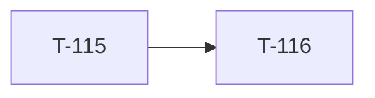

<!-- AUTO-GENERATED by ./scripts/ticket sync — DO NOT EDIT -->

# Ticket Lead Dashboard

## Running / Review

- **T-383** (3199) — Four tooling paths overwrite committed files with empty or wrong content [running] — The tail of the tooling cluster (T-378 has the two worst). All the same shape: a success path writing structurally empty or silently-lossy content over something committed.

  xtask/src/cmds.rs:765-774 — `cmd_set_status` has no non-empty check and no enum, so `./scripts/ticket set-status T-090 ""` writes `"status": ""` over `"ready"`. The registry is the source of truth for the whole program.
  xtask/src/sync.rs:403 + registry.rs:133-138 — `inject_marker_block` collapses the ROADMAP marker block to a bare heading when `tickets` is missing or empty, and CLAUDE.md's 'Latest shipped' falls back to a HARDCODED WRONG `"T-066"`.
  xtask/src/schema_gates.rs:1174-1195 — `flatten-orbat-slots --in-place` emits 8 of the schema's 11 slot keys, silently dropping `loadout` and `uid` from 3 of 5 committed goldens, and force-stamps `schemaVersion = "1.1"` over the deliberate 1.0 fixture.
  enf/apidoc.rs:168 — header-only TSV overwrite that exits 0.
  Also: world/aux.rs:1009/1022/1050, world/build.rs:664/958, map/labels.rs:455, map/sap.rs:1007.

None is urgent alone; together they are why a golden or a registry field can go wrong with nothing red. A shared 'refuse to write structurally empty output' helper would close most of them.

== DEFERRED 2026-07-26 BY OPERATOR DECISION, NOT CANCELLED ==
Recording a bug is most of its value; fixing it now is optional. The audits that produced this ticket were generating work faster than the run could close it, and the original T-182..T-297 feature backlog had not moved in hours. The operator's call, verbatim in substance: there will always be bugs, that is what developing is — knowing them is good, but spending the token budget on things that do not need fixing right now means nothing ships.
This is findable, fully diagnosed, and reproducible from the notes above. Promote it to `idea` when it actually blocks something, when it starts costing real time, or after the feature backlog lands. Nothing here was judged wrong — only not now.
- **T-529** (3369) — events roster SQL still allows whitespace arma_id (no btrim) [running] — Wave 47 verifier P2 residual from T-350. ingest_event_roster still uses u.arma_id <> '' without btrim; whitespace passes and can emit as seating key. Latent after 0016 scrub. Cure: btrim/nonempty predicate + trim seating key consistently with other arma_id sites. Owns: apps/website/api/src/handlers/events.rs (+ IT). Caution: T-343 one-sided-trim traps — read before changing.
- **T-536** (3376) — touch_changed still masks changed_rs porcelain failure as empty list [running] — FOUND by W50 adversarial verifier (MINOR-NIT) after T-492.

fmt_changed/clippy_changed now propagate changed_rs rc. touch_changed still does `for f in $(changed_rs …)` and can return 0 with listed=0 when porcelain fails. Same mask class.

Cure: `files=$(changed_rs) || return $?` (or equivalent) in touch_changed.

## Ready

- **T-090** (900) — Map visualization program [ready] — Map Engine v2 through sea-band + contours @ `bd481cf1`. **Active:** **T-090.5.5** tree/veg/prop glyphs. Single lane.

## Next queued (top 10)

- **T-072** (720) — Ctrl multi-place [queued] — Hold Ctrl to place multiple copies without re-selecting asset.
- **T-073** (730) — Shift + map rotation [queued] — Shift-drag and map rotation widget for placed entities.
- **T-075** (750) — Spacebar flyTo vs widget [queued] — Spacebar centers selection; resolve flyTo vs transform widget conflict.
- **T-116** (1160) — Results POST to backend [queued] — SPLIT 2026-07-26. Mod half SHIPPED: TBD_ResultsReporter.c (682 lines, T-181.13.1) POSTs to /api/v1/ingest/match-results. Website half OPEN and folded into T-232 — event_hub.rs renders no result/outcome/match data at all. This row now tracks only the website half.
- **T-117** (1170) — Mission upload + validation UI [queued] — Web UI for mission upload and schema validation (API exists).
- **T-118** (1180) — Event ORBAT + identity linking UI [queued] — SPLIT 2026-07-26. DONE: identity-link UI (settings.rs:6-9,74-94, T-159.25) and the ORBAT selector (event_hub.rs:520-572, T-159.25a). OPEN residual is tracked by T-226 (PATCH /events/{id} has no caller), T-284 (clear_slot unreachable, admin cannot free a claimed slot) and T-231 (identity last mile). This row is a pointer, not work.
- **T-120** (1200) — Staging soak + golden mission smoke [queued] — Pinned game/mod version soak; golden-mission smoke on staging server.
- **T-146** (1470) — Asset Browser Data Wiring [queued] — Hook up T-150 registry items (vehicles/crates/…) to Asset Browser for map drag-place. Unblocked by T-150; after or parallel T-068.9 ingest preferred.
- **T-170** (1670) — Prod default flip to Leptos SPA [queued] — Make the Leptos SPA the production default: set `SPA_DIST_DIR` to the trunk release dist in the prod env, move the Discord OAuth redirect origin, staging soak, then flip. OPERATOR-GATED (env + Discord app settings are operator-held); claude-code prepares configs/runbook + verifies the staging soak gates. Runbook anchor: docs/website/DEV_RUNBOOK.md §SPA serving; T-159 finish program left this as the sole operator-gated residual.

## Dependency graph (scoped)

```mermaid
flowchart LR
  T115[T-115] --> T116[T-116]
```
