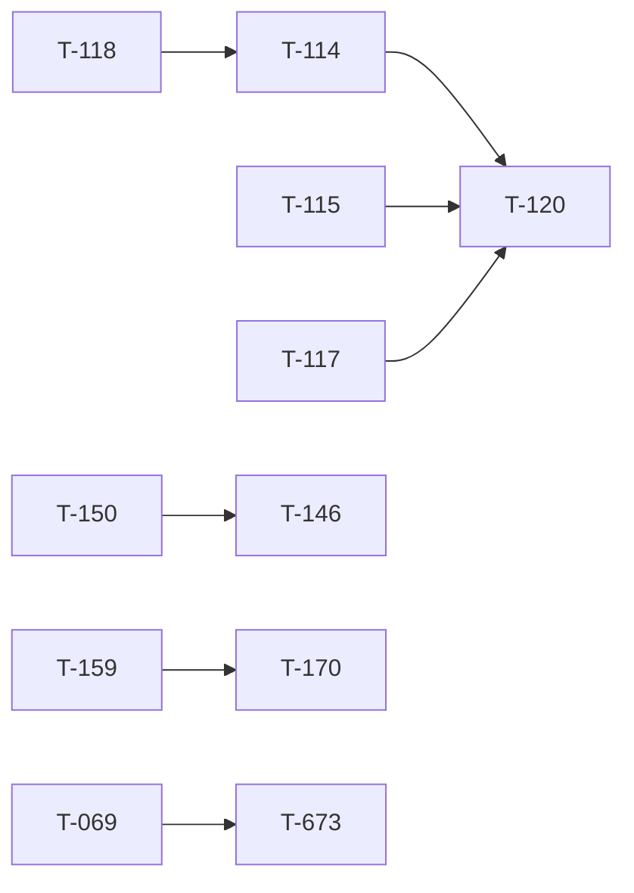

<!-- AUTO-GENERATED by cargo run -q -p xtask -- ticket sync — DO NOT EDIT -->

# Ticket Lead Dashboard

## Running / Review

## Ready

- **T-090** (900) — Map visualization program [ready] — Map Engine v2 through sea-band + contours @ `bd481cf1`. **Active:** **T-090.5.5** tree/veg/prop glyphs. Single lane.
- **T-925** (6040) — Close-selection semantics: the ceremony is unreachable live [ready] — wave close targets the oldest pending emptied label: the ship-hook repack records a fully-shipped wave's label and frozen ticket set in the lock, close validates and closes exactly that set, and open waves number past pending labels.

## Next queued (top 10)

- **T-120** (1200) — Staging soak + golden mission smoke [queued] — Pinned game/mod version soak; golden-mission smoke on staging server.
- **T-146** (1470) — Asset Browser Data Wiring [queued] — Hook up T-150 registry items (vehicles/crates/…) to Asset Browser for map drag-place. Unblocked by T-150; after or parallel T-068.9 ingest preferred.
- **T-170** (1670) — Prod default flip to Leptos SPA [queued] — Prod default flip to Leptos SPA
- **T-673** (4300) — Marker style and Area markers — the $defs/marker widening [queued] — Marker style and Area markers — the $defs/marker widening
- **T-674** (4310) — T-216 follow-on: slot identity reaches the wire [queued] — Four attribute ids — `ATTR-FIELD-OBJ-CALLSIGN`, `-OBJ-RANK`, `-OBJ-STANCE`, `-OBJ-UNIT-NAME` — plus the two TBD-only keys `tag` and `leaderSlotId`. `OBJ-UNIT-NAME` rides this slice rather than standing alone; the sweep says so explicitly. THE CONTRACT DELTA IS ALREADY WRITTEN OUT at `crates/map-engine-core/src/mission/flatten.rs`:2620-2632 — five `$defs/slot` / `$defs/group` keys. T-216 is `shipped`, but it shipped THE LEDGER AND ITS TRIPWIRE, not the fix: flatten.rs:2584-2649 enumerates six author-facing values the compile silently drops (a squad's leaderSlotId, a slot's tag / callsign / rank / stance, and the entire vehicle roster) and records that `make verify-t180` stayed green throughout BECAUSE NOT ONE OF ITS 22 TESTS CHECKED. `stance` additionally needs an Enfusion spawn-pose call — word-boundary `stance` in apps/mod is ZERO (the 39-file `grep -rl stance` result is every hit being the substring inside `instance`). Widening `/compiled` without care 500s every mission. Related: T-242. EXECUTOR IS `workbench` DELIBERATELY: this modifies `packages/tbd-schema/schema/mission.schema.json` and/or `apps/mod/tbd-framework/`, which the CLAUDE.md executor gate puts out of reach of any coding agent. The factory filters on executor, so this tagging is the safety mechanism — do not flip it to claude-code.

EXECUTOR CORRECTED 2026-08-02: was filed `workbench` on the mistaken reading that any .c file needs the Arma Workbench GUI. It does not — scripts/mod/compile.sh compiles tbd-framework against the native Linux dedicated server headlessly, verified: "OK: compiled clean, 5707 files, 11182 classes, 832 ms, no Workbench". Schema edits are plain JSON. This is factory work. Per the model-routing rule, the .c portion routes to Fable 5 even though the executor is claude-code.

SCHEMA HALF SPLIT OUT to T-706 (one widening pass for the whole program). This ticket is the Enfusion reader plus any editor UI; it does not touch packages/tbd-schema.
- **T-675** (4320) — Vehicle roster reaches game — T-076 compile half [queued] — Cross-boundary compile half split from T-076 so crew UI could ship separately.
Closes the sixth T-216 drop-ledger row: top-level vehicles[] with seats and crew refs.
T-706 already widened the schema; this program emits and reads the roster.
Unmerged salvage 113108a1 overlaps T-674 — check subsumption before redo.

- **T-676** (4330) — Trigger activation and effects — the Enfusion runtime [queued] — Trigger activation and effects — the Enfusion runtime
- **T-677** (4340) — Waypoints — group movement orders [queued] — Waypoints — group movement orders
- **T-678** (4350) — Group AI state: combat mode, behaviour, formation, speed [queued] — Group AI state: combat mode, behaviour, formation, speed
- **T-679** (4360) — Placement scatter: radius and area shape [queued] — Placement scatter: radius and area shape

## Dependency graph (scoped)

```mermaid
flowchart LR
  T118[T-118] --> T114[T-114]
  T114[T-114] --> T120[T-120]
  T115[T-115] --> T120[T-120]
  T117[T-117] --> T120[T-120]
  T150[T-150] --> T146[T-146]
  T159[T-159] --> T170[T-170]
  T069[T-069] --> T673[T-673]
```
