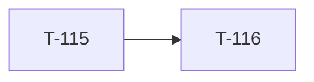

<!-- AUTO-GENERATED by ./scripts/ticket sync — DO NOT EDIT -->

# Ticket Lead Dashboard

## Running / Review

- **T-332** (3148) — PATCH /events/:id cannot clear a briefing or banner, and a mission cannot be re-attached [running] — Two gaps found by T-226 while wiring the Event Manager's edit path. Both are backend; T-226 owned only the frontend file and correctly left them.

1. **No null path on PATCH.** Every field on `PatchEventInput` is `Option<String>` where None means 'do not touch', so there is no way to CLEAR `briefing` or `banner_image_url`. The UI T-226 shipped sends `""` to blank them, which works but is a workaround standing in for a missing contract. Decide the shape — a nullable wrapper, an explicit clear list, or bless `""` as the documented clear signal — then make the UI match.

2. **A mission cannot be attached after creation.** `POST /events/:id/missions` has a caller ONLY in the create flow, so an admin who detaches the last mission must delete and recreate the whole operation. The endpoint is not dead, which is why it fell outside T-226's three bullets — but T-226 shipping the detach button makes this reachable and therefore much more visible than it was. Add an attach path to the Event Manager's Attached Missions roster, next to Detach.

== DEFERRED 2026-07-26 BY OPERATOR DECISION, NOT CANCELLED ==
Recording a bug is most of its value; fixing it now is optional. The audits that produced this ticket were generating work faster than the run could close it, and the original T-182..T-297 feature backlog had not moved in hours. The operator's call, verbatim in substance: there will always be bugs, that is what developing is — knowing them is good, but spending the token budget on things that do not need fixing right now means nothing ships.
This is findable, fully diagnosed, and reproducible from the notes above. Promote it to `idea` when it actually blocks something, when it starts costing real time, or after the feature backlog lands. Nothing here was judged wrong — only not now.
- **T-337** (3153) — Approving or rejecting a mission never touches updated_at [running] — FOUND by T-330 in its own file, and deliberately NOT shipped there because it is a write-semantics change rather than the read fix that ticket was for. Confirmed live, not inferred: approving a mission whose updated_at was NULL left it NULL.

handlers/approvals.rs:105 (approve) and :170 (reject) both UPDATE the mission's status without setting `updated_at`. Every sibling write does — handlers/missions.rs:392 and :543 both set `updated_at = now()`.

Consequences: the approvals queue orders by that timestamp (T-330 made the ORDER BY match the displayed value), so a mission's position never reflects that it was actioned; and any consumer using updated_at for cache invalidation or sync will not see an approval at all. It is also the reason a NULL can persist through a state transition that plainly modified the row.

Small fix, but decide one thing deliberately: whether `updated_at` should also move on a REJECT, or whether rejection wants its own timestamp column. T-313 (the author can never read why their mission was rejected) is adjacent and may want the same row touched.

== DEFERRED 2026-07-26 BY OPERATOR DECISION, NOT CANCELLED ==
Recording a bug is most of its value; fixing it now is optional. The audits that produced this ticket were generating work faster than the run could close it, and the original T-182..T-297 feature backlog had not moved in hours. The operator's call, verbatim in substance: there will always be bugs, that is what developing is — knowing them is good, but spending the token budget on things that do not need fixing right now means nothing ships.
This is findable, fully diagnosed, and reproducible from the notes above. Promote it to `idea` when it actually blocks something, when it starts costing real time, or after the feature backlog lands. Nothing here was judged wrong — only not now.
- **T-350** (3166) — Four sites report an identity as linked when it is whitespace [running] — FOUND by T-343. auth.rs:165, oauth.rs:152, me.rs:77 and me.rs:160 all gate "linked" on `Option::is_some()` with no content check. A legacy whitespace row therefore reads as LINKED at all four and RESOLVES at none — the exact silent-uselessness T-326 found, surviving in the read path after T-326 fixed the write path.

Related and in the same family: events.rs:2039 — the roster guards `u.arma_id <> ''` rather than `btrim(...) <> ''` and emits the value verbatim as the seating key at :2050, while all five other arma_id sites trim. Latent for rows written today, live for anything predating T-326.

Also: deployments.rs:241 `submit_leave.reason` has no guard — the fourth `reason` field in this family after T-218, T-317 and T-343.

══ DO NOT NAIVELY TRIM — two sites where a one-sided trim CREATES the catastrophe ══
T-343 found these and they bind on any ticket in this family:
  events.rs:1735 — orbat_reservations.squad must stay BYTE-IDENTICAL to orbat_slots.squad, which is written untrimmed by crates/map-engine-core/src/mission/orbat.rs:163.
  events.rs:1923 — must mirror `or_fallback` at crates/map-engine-core/src/mission/flatten.rs:626. Disagreement means the seat VANISHES, the assignment round-robins, and the request still returns 200.
Trimming on write and trimming on read must agree. T-326's bug was not an untrimmed value per se — it was a DISAGREEMENT between two sites. Check both halves before changing either.

== DEFERRED 2026-07-26 BY OPERATOR DECISION, NOT CANCELLED ==
Recording a bug is most of its value; fixing it now is optional. The audits that produced this ticket were generating work faster than the run could close it, and the original T-182..T-297 feature backlog had not moved in hours. The operator's call, verbatim in substance: there will always be bugs, that is what developing is — knowing them is good, but spending the token budget on things that do not need fixing right now means nothing ships.
This is findable, fully diagnosed, and reproducible from the notes above. Promote it to `idea` when it actually blocks something, when it starts costing real time, or after the feature backlog lands. Nothing here was judged wrong — only not now.

## Ready

- **T-090** (900) — Map visualization program [ready] — Map Engine v2 through sea-band + contours @ `bd481cf1`. **Active:** **T-090.5.5** tree/veg/prop glyphs. Single lane.

## Next queued (top 10)

- **T-072** (720) — Ctrl multi-place [queued] — Hold Ctrl to place multiple copies without re-selecting asset.
- **T-073** (730) — Shift + map rotation [queued] — Shift-drag and map rotation widget for placed entities.
- **T-075** (750) — Spacebar flyTo vs widget [queued] — Spacebar centers selection; resolve flyTo vs transform widget conflict.
- **T-116** (1160) — Results POST to backend [queued] — SPLIT 2026-07-26. Mod half SHIPPED: TBD_ResultsReporter.c (682 lines, T-181.13.1) POSTs to /api/v1/ingest/match-results. Website half OPEN and folded into T-232 — event_hub.rs renders no result/outcome/match data at all. This row now tracks only the website half.
- **T-117** (1170) — Mission upload + validation UI [queued] — Web UI for mission upload and schema validation (API exists).
- **T-118** (1180) — Event ORBAT + identity linking UI [queued] — SPLIT 2026-07-26. DONE: identity-link UI (settings.rs:6-9,74-94, T-159.25) and the ORBAT selector (event_hub.rs:520-572, T-159.25a). OPEN residual is tracked by T-226 (PATCH /events/{id} has no caller), T-284 (clear_slot unreachable, admin cannot free a claimed slot) and T-231 (identity last mile). This row is a pointer, not work.
- **T-120** (1200) — Staging soak + golden mission smoke [queued] — Pinned game/mod version soak; golden-mission smoke on staging server.
- **T-146** (1470) — Asset Browser Data Wiring [queued] — Hook up T-150 registry items (vehicles/crates/…) to Asset Browser for map drag-place. Unblocked by T-150; after or parallel T-068.9 ingest preferred.
- **T-170** (1670) — Prod default flip to Leptos SPA [queued] — Make the Leptos SPA the production default: set `SPA_DIST_DIR` to the trunk release dist in the prod env, move the Discord OAuth redirect origin, staging soak, then flip. OPERATOR-GATED (env + Discord app settings are operator-held); claude-code prepares configs/runbook + verifies the staging soak gates. Runbook anchor: docs/website/DEV_RUNBOOK.md §SPA serving; T-159 finish program left this as the sole operator-gated residual.

## Dependency graph (scoped)

```mermaid
flowchart LR
  T115[T-115] --> T116[T-116]
```
