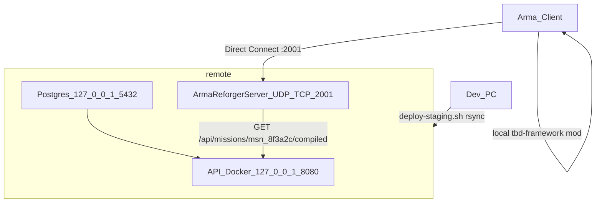

# Staging server — 192.168.0.140

Self-hosted TBD stack for LAN testing: **API + Postgres (Docker)** and **Arma Reforger dedicated server** on `sam@192.168.0.140`.

> ## CORRECTED 2026-07-31 (T-604) — read this before the 2026-06-14 text
>
> Measured on engine **1.7.0.54**, by booting the binary, not by reasoning about it. Two claims
> below this box are wrong, and the second is worse than wrong — it is silently dangerous.
>
> **1. A locally staged addon IS Direct-Joinable.** `-addonsDir <dir>` **plus** `-config <json>`
> registers a backend room *and* loads the checkout. One boot, verbatim:
>
> ```
> NETWORK      : Starting RPL server, listening on address 0.0.0.0:2001, fastValidation=true
> BACKEND      : Server registered with address: 192.168.0.117:2001
> BACKEND      : Direct Join Code: 0031768625
> ENGINE       : Loaded addons:
>   ENGINE     : gproj: '<addonsDir>/tbd-framework/addon.gproj' guid: 'B2C3D4E5F6A78901'
> ENGINE       : FileSystem: Adding relative directory '<checkout>/apps/mod/tbd-framework'
>                to filesystem under name TBD_Framework
> ```
>
> The 2026-06-14 finding was measured on **`-addons`**, which really is mutually exclusive with
> `-config`. It was never measured on **`-addonsDir`**, which is not. Use
> **[`scripts/mod/run-playtest-server.sh`](../../scripts/mod/run-playtest-server.sh)**.
>
> **2. `tbd-framework` IS on the Workshop, unlisted and STALE, and `-config` alone silently runs it.**
> It is published under the *same* id as the local gproj GUID `B2C3D4E5F6A78901`, pinned at
> **version 1.0.1**. So a `-config`-only server does not fail loudly when the addon is missing
> locally — on a clean profile with no `-addonsDir` the engine fetches it over the network:
>
> ```
> BACKEND      : Addon Download started B2C3D4E5F6A78901 - TBD Framework
> BACKEND      : Downloading B2C3D4E5F6A78901 version 1.0.1
> ENGINE       : FileSystem: Adding package '<profile>/addons/TBDFramework_B2C3D4E5F6A78901/'
>                (pak count: 1) to filesystem under name TBD_Framework
> ```
>
> It then registers a room, reaches LOBBY and looks completely healthy **while running months-old
> script**. Same mission, same machine, measured both ways: **7** `[TBD]` lines in June's flat
> format versus **108** in the current `[TBD][Subsystem]` format. `run-playtest-server.sh` treats
> the packed copy winning as a hard failure and refuses to report the server up.
>
> **3. The "Game log pass criteria" list further down is the STALE build's output.**
> `[TBD] Mission loaded`, `[TBD] Registry loaded` and `[TBD] SpawnManager: built slot spawn` are
> exactly what Workshop 1.0.1 prints. **If your log matches that old list, you are running the
> stale mod, not your checkout.**
>
> **The check to actually run is on the FORMAT, not on any one sentence** (T-608):
>
> ```bash
> grep -c '\[TBD\]\[' "$LOG"     # current checkout: >100.  Stale Workshop 1.0.1: exactly 0.
> ```
>
> June's build logs flat `[TBD] …` lines and has no subsystem tag at all; every line the current
> build emits is `[TBD][Subsystem] …`. Measured on the same mission, same machine, both ways:
> **7** flat lines versus **109** tagged ones. A zero from that `grep` is unambiguous and it does
> not depend on the wording of any individual `Print`.
>
> **Why the format check and not a quoted sentence.** This box originally pinned the check to
> `[TBD][Slots] loadout settle complete — 18 application(s) IsComplete=1 — spawn open`. **T-605
> then rewrote that exact `Print`** ([`TBD_SpawnManager.c:1143`](../../apps/mod/tbd-framework/Scripts/Game/TBD/Gamemode/TBD_SpawnManager.c))
> and, because it did not own this file, the two merged in the same wave with the string dead.
> For a week the stale-build detector told operators **on the correct build** that their expected
> line was missing — which is precisely the class of defect T-607 was filed for, reintroduced by
> the wave that named it. So: match prefixes, never whole sentences.
>
> | Match this stable prefix | Everything after it is expected to vary |
> |---|---|
> | `[TBD][Mission] loaded id=` | name, slot count, `source=` |
> | `[TBD][Validate] mission result=` | `PASS`/`FAIL`, error and warning counts |
> | `[TBD][Slots] loadout settle complete` | the whole count summary — it has changed once already |
> | `[TBD][Stage] LOADING -> LOBBY` | nothing; this one is a state-machine edge, not prose |
>
> For the record, the current build's full settle line, verbatim from a boot on `main`
> 2026-07-31, is
> `[TBD][Slots] loadout settle complete — 18 application(s), 0 unplayable, 2 with a shortfall — spawn open`
> — but **do not grep for that**, grep for the prefix. `PLAYTEST_RUNBOOK.md` §S1/§2.5A carries the
> same string and the same rule.
>
> **4. NOT verified: what the joining client loads.** The server advertises
> `game.mods[] = [B2C3D4E5F6A78901]`; a client resolves that id from the Workshop and gets 1.0.1
> while the server runs the checkout. Nobody has yet observed a second machine joining this
> combination — see "Client join" below.

**Join status (2026-06-14, superseded by the box above): WORKS.** The mod is published to the Workshop and staging runs **`-config` mode** (`TBD_SERVER_MODE=config` in `deploy.env`). The earlier local-`-addons` "Phase A" path runs the server but is **not** Direct-Joinable (no backend room) — see "Client join". **`-addons` is not `-addonsDir`, and that distinction is the whole fix (T-604).**

> **Status (2026-07-02, T-128): gates V2–V4 are BLOCKED on T-092.** `GET /api/missions/:id/compiled` and `GET /api/game/events/:id/roster` existed only in the Phase-0 REST spike backend, since removed — the current backend serves `/api/v1` only, so those curls return **404** (not 200, and no 401 auth gate). The 2026-06-14 pass ran against the spike. Real game-server routes ship with **T-092** ([`t092_spawn_transform_program.md`](../specs/Mission_Creator_Architecture/t092_spawn_transform_program.md)); until then `deploy-staging.sh` **skips** the V2–V4 smoke unless `TBD_RUN_T092_SMOKE=1`. The mission **file fallback** (`$profile:missions/`) is unaffected.

**Do not touch PrairieLearn:** all TBD paths live under `/home/sam/tbd/` only. Never deploy to `/home/sam/prairielearn/`.

---

## Architecture



| Service | Bind | Notes |
|---------|------|-------|
| Game server | `0.0.0.0:2001` UDP + TCP | game traffic; **A2S query is a SEPARATE port — `17777`** (never set `a2sPort` = `bindPort`, it breaks replication) |
| API | `127.0.0.1:8080` | Game server on same host; smoke via SSH `curl` |
| Postgres | `127.0.0.1:5432` | Docker internal hostname `postgres` for API container |

---

## Prerequisites

### Dev PC (one-time)

```bash
which sshpass rsync ssh curl git node
node -v   # 18+
cd packages/tbd-schema && npm ci
cp scripts/deploy/deploy.env.example scripts/deploy/deploy.env   # fill SSH + token + paths
```

Workbench spawn should already pass (`assigned slot` + `spawn requested` in Proton WB log).

### Server 192.168.0.140 (one-time)

| Item | Check |
|------|-------|
| Disk ≥ 30 GB | `df -h ~` |
| Docker + compose | `docker compose version` |
| steamcmd + 32-bit libs | `steamcmd +quit` |
| Arma Reforger Server (**1874900** stable) | logged-in Steam account with dedicated license — **not** 1890870 (Experimental) |
| User systemd survives logout | `sudo loginctl enable-linger sam` |
| Ports free or remapped | `ss -tlnp \| grep -E '5432\|8080\|2001'` |

---

## Paths

| Variable | Default |
|----------|---------|
| `TBD_REMOTE_DIR` | `/home/sam/tbd/repo` |
| `TBD_PROFILE_DIR` | `/home/sam/tbd/profile` |
| `TBD_ADDONS_STAGING` | `/home/sam/tbd/addons-staging` |
| `TBD_SERVER_DIR` | `/home/sam/steam/arma-reforger-server` (adjust after steamcmd) |

---

## One-time bootstrap (server)

Run discovery from dev PC:

```bash
bash scripts/mod/bootstrap-staging-server.sh
```

### 1. Discovery

```bash
ssh sam@192.168.0.140 'df -h ~; ss -tlnp | grep -E "5432|8080|2001" || true; docker compose version'
```

If `:5432` is taken, set `TBD_POSTGRES_HOST_PORT=5433` in `deploy.env` and edit `apps/website/docker-compose.yml` to map `127.0.0.1:5433:5432`.

### 2. Layout

```bash
ssh sam@192.168.0.140 'mkdir -p /home/sam/tbd/{repo,profile,addons-staging}'
```

### 3. Arma dedicated server (steamcmd)

```bash
# On server — example paths; adjust TBD_SERVER_DIR in deploy.env
mkdir -p ~/steam
cd ~/steam
# Install steamcmd per Fedora docs, then:
steamcmd +login YOUR_STEAM_USER +force_install_dir "$HOME/steam/arma-reforger-server" \
  +app_update 1874900 validate +quit
```

Note the game **build number** in server logs after first start — client must match.

### 4. API secrets (server only)

On the server, create `apps/website/.env` (**never rsync'd from dev**):

```bash
cd /home/sam/tbd/repo/apps/website   # after first rsync or clone
cp .env.example .env
# Edit:
#   SESSION_SECRET=<long-random>
#   GAME_SERVER_TOKENS=<same value as TBD_GAME_SERVER_TOKEN in scripts/deploy/deploy.env>
```

### 5. Docker stack

```bash
cd /home/sam/tbd/repo/apps/website
docker compose -f docker-compose.staging.yml up -d --build
```

First build may take 5–15 minutes.

### 6. API smoke (before game server)

> **BLOCKED on T-092** — these routes are not registered in the current backend (expect **404**). Kept as the target contract; re-run when T-092 ships.

```bash
TOKEN='<your-game-server-token>'
curl -sf -H "Authorization: Bearer $TOKEN" \
  http://127.0.0.1:8080/api/missions/msn_8f3a2c/compiled | head -c 200
curl -sf -H "Authorization: Bearer $TOKEN" \
  http://127.0.0.1:8080/api/game/events/b0000000-0000-4000-8000-000000000001/roster
curl -s -o /dev/null -w '%{http_code}\n' \
  http://127.0.0.1:8080/api/missions/msn_8f3a2c/compiled   # expect 401
```

### 7. User systemd + linger

```bash
sudo loginctl enable-linger sam
```

`deploy-staging.sh` installs `~/.config/systemd/user/tbd-reforger.service` from `scripts/deploy/tbd-reforger.service`.

### 8. Firewall (game port)

```bash
sudo firewall-cmd --permanent --add-port=2001/tcp
sudo firewall-cmd --permanent --add-port=2001/udp
sudo firewall-cmd --reload
```

---

## Deploy from dev PC

```bash
cp scripts/deploy/deploy.env.example scripts/deploy/deploy.env   # if not done
# Fill TBD_SSH_PASS (or SSH key), TBD_GAME_SERVER_TOKEN, paths
bash scripts/mod/deploy-staging.sh
bash scripts/mod/deploy-staging.sh --dry-run   # preview only
```

Flow: validate mission JSON → rsync → profile + addon symlink → Docker rebuild → API smoke (**skipped by default until T-092** — `TBD_RUN_T092_SMOKE=1` to force) → restart game server → remote log grep.

---

## Verification matrix

| Step | Command | Pass |
|------|---------|------|
| V1 Mission JSON | `node packages/tbd-schema/scripts/validate-file.mjs packages/tbd-schema/golden-missions/msn_8f3a2c.json` (from monorepo root) | exit 0 |
| V2 API mission | SSH: `curl -sf -H "Authorization: Bearer $TOKEN" http://127.0.0.1:8080/api/missions/msn_8f3a2c/compiled` | **BLOCKED on T-092** — route not registered; currently 404 (target: HTTP 200) |
| V3 Roster | SSH: `curl -sf -H "Authorization: Bearer $TOKEN" http://127.0.0.1:8080/api/game/events/b0000000-0000-4000-8000-000000000001/roster` | **BLOCKED on T-092** — route not registered; currently 404 (target: HTTP 200) |
| V4 Auth gate | SSH: unauthenticated compiled URL | **BLOCKED on T-092** — currently 404 (target: HTTP 401) |
| V5 Game listening | SSH: `ss -ulnp \| grep -E '2001\|17777'` — **both** game (2001) and A2S (17777) bound | yes |
| V6 Game logs | `bash scripts/mod/remote-log-grep.sh` | see below |
| V7 Server healthy (not crashed) | log has `Stage → LOBBY` and **no** `Unable to start replication` | yes |
| V8 Client join | `-config` + **Workshop** mod only (see "Client join"); log shows `Server registered with address:`, then Direct Connect `192.168.0.140:2001` | spawn at slot + kit |

### Game log pass criteria

- `[TBD] Mission loaded`
- `[TBD] Registry loaded`
- 18× `[TBD] SpawnManager: built slot spawn`
- `[TBD] Stage → LOBBY`
- `[TBD] Roster loaded`
- `[TBD] SpawnManager: assigned slot`
- `[TBD] SpawnManager: spawn requested`
- **No** `Can't compile`, `Unknown class`, `RequestSpawn failed`

(`TBD_RegistryPocComponent` is not on `TBD_GameMode.et` — do not expect Registry POC spawn lines.)

---

## Client join

### The one command (T-604, 2026-07-31)

```bash
bash scripts/mod/run-playtest-server.sh \
  --mission-id=<compiled-mission-id> \
  --admin=<your-identityId-or-17-digit-SteamID>
```

It stages the profile, points the mod at the API and your mission, symlinks the addon dir,
renders `server.json`, launches with **both** flags, then **waits for and asserts** the room
registration and that the *local* addon won before printing anything. On success it prints the
join address and the Direct Join Code parsed out of that boot's own log. Add `--dry-run` to see
the rendered config and the exact command without booting, `--help` for the options.

Measured end to end 2026-07-31: room registered, checkout loaded,
`[TBD][Validate] mission result=PASS errors=0`, `[TBD][Slots] loadout settle complete — 18
application(s), 0 unplayable, 2 with a shortfall — spawn open`, `[TBD][Stage] LOADING -> LOBBY`.
(Quoted whole for the record. **When you check a log, match the prefixes in the correction box
above, not these sentences** — the settle line's tail changed once already, at T-605.)

**If it does not print a join banner, it does not exit quietly.** On a failed boot the script
names the phase the engine actually reached, and it will not claim to have stopped a server it
could not confirm was dead — if you see a **`STRAY SERVER`** block, a process group is still
holding `2001`/`17777` and the block tells you the exact command to run (T-608). Two invocations
cannot share `$HOME/tbd-playtest`: the second refuses rather than orphaning the first.

**Second client:** Multiplayer → **Direct Join** → the `IP:port` the script prints (the room
registers under `publicAddress`, which the script sets to this machine's LAN IP), or paste the
**Direct Join Code**. The code is re-minted on every boot — read it from the run, never from a doc.

> ### NOT VERIFIED — needs a second human on a second machine
>
> Everything above is server-side. **Nobody has yet watched a client connect to this
> combination.** The specific risk is a *version skew*, not a missing mod: the server advertises
> `game.mods[] = [B2C3D4E5F6A78901]`, the client resolves that id from the **Workshop**, and the
> Workshop copy is pinned at **1.0.1** while the server runs the checkout. So the friend may get
> a clean join running June's script against July's server, with no error anywhere.
>
> **What the second person must actually do, and report back:**
> 1. Direct Join the printed `IP:port`. Say whether it connects, refuses, or hangs.
> 2. If it refuses, quote the exact client-side message (a content/version mismatch reads
>    differently from "No server found").
> 3. If it connects, have them type `#tbd` in chat. The current build answers with the full
>    command list; the stale build does not have that command at all. **That one line is the
>    cheapest test of which mod the client is really running.**
>
> If the skew is real, the fix is to **re-publish `tbd-framework` from Workbench** (see "Dev loop"
> below) so the Workshop copy matches the checkout, then re-run the script.

### Why the old instructions were wrong (kept for the record)

The 2026-06-14 text said a local addon could never be joinable and the mod had to be published
first. It was measured on **`-addons`**, which is a hard fatal with `-config`
(`-config cannot be used together with addons!`). **`-addonsDir` is a different flag and combines
with `-config` fine** — that is the whole of T-604. The Phase A `-server` + `-addons` launch is
still correctly described: it loads the mod and reaches LOBBY but registers **no room**, so Direct
Join answers "No server found". Verified again 2026-07-31: zero occurrences of
`Server registered with address:` in that mode's log, against 108 `[TBD]` lines and a healthy
`[TBD][Stage] LOADING -> LOBBY` in the same run. A healthy log is not a joinable server.

**Version:** client and server game versions must match (both report `1.7.0.x` in the A2S
reply / `Creating game instance … version 1.7.0.x`). Note: Steam `buildid` differs between
the client app (1874880) and the server app (1874900) — they are different apps, so do
**not** compare their buildids; compare the game **version string** instead.

**Firewall:** open UDP+TCP **2001** (game) and UDP **17777** (A2S) on the server. WiFi vs
ethernet on the same `/24` is fine if `ping` works (a WiFi server just shows a "High ping
server" warning on join).

### Game server CLI

```
-bindIP 0.0.0.0 -bindPort 2001 -a2sPort 17777     # a2sPort MUST differ from bindPort
```

**Critical:** `a2sPort` and `bindPort` are **separate UDP sockets and must not be equal.**
Setting `-a2sPort 2001` (= game port) makes the engine log `Starting RPL server, listening
on 0.0.0.0:2001` then immediately `NETWORK (E): Unable to start replication` → `Unable to
initialize the game` → `Game destroyed` (exits status 0, so `Restart=on-failure` does NOT
restart it). Standard Reforger layout: **2001 game / 17777 A2S / 19999 RCON.**

`-server` + `-addons` (local mod) is useful for headless **log verification** (mission load,
18× slot spawn, `Stage → LOBBY`) but is **not joinable** — see the box above. Joining needs
the `-config` + Workshop path.

---

## Dev loop — updating the mod after a script change

The config-mode server runs the **Workshop** copy, so script changes require a re-publish:

1. **Verify compile in Workbench** (the local server's compile check skips new files — see
   Troubleshooting): MCP `wb_connect` → `wb_reload {scripts}` → grep the WB log for `Can't compile`.
2. **Publish** in Workbench (File → Workshop Member Area → Publish; bumps the version, same modId
   = gproj GUID `B2C3D4E5F6A78901`). ⚠️ Set the **License** to a real file, **not** a stray config
   (a PrairieLearn-secrets `license.txt` was leaked this way — see CLAUDE-CONTINUATION.md §6).
3. **Clear the read-only** the publish causes: `rm tbd-framework/{data.pak,meta,ServerData.json,*_manifest.json}`
   (gitignored), restart the Launcher.
4. **Redeploy:** `bash scripts/mod/deploy-staging.sh` (with `TBD_SERVER_MODE=config`) — the server
   re-downloads the new version and applies `game.admins[]` from `TBD_ADMIN_IDENTITY_IDS`.
5. **Test:** Direct Join → the client pulls the update → play.

For fast iteration that doesn't need a publish, deploy in `TBD_SERVER_MODE=addons` (local mod,
headless log verification only — not joinable).

---

## Workbench test loop (dev PC)

enfusion-mcp has no `wb_log` tool — grep Proton console.log after play:

```bash
bash scripts/mod/mcp-call.sh wb_connect '{}'
bash scripts/mod/mcp-call.sh wb_play '{}'
sleep 25
bash scripts/mod/mcp-wb-logs.sh
bash scripts/mod/mcp-call.sh wb_stop '{}'
```

Or: `bash scripts/mod/tbd-spawn-verify.sh`

`.cursor/mcp.json` should set `ENFUSION_GAME_PATH`, `ENFUSION_WORKBENCH_PATH`, `ENFUSION_PROJECT_PATH` (parity with `.mcp.json`).

---

## Troubleshooting

| Symptom | Fix |
|---------|-----|
| **Direct Join "No server found"** | Expected with `-server`+`-addons` (no backend room). Direct Join needs a server launched with **`-config`** so it registers a room (`Server registered with address:` in the log). See "Client join" above — requires Workshop publish. |
| Server dies with `Unable to start replication` | `a2sPort` equals `bindPort` (e.g. both `2001`). Set `-a2sPort 17777` (≠ game port) and restart. The `Starting RPL server … 2001` line is printed even on this failure — check for the `(E)` line right after. |
| Server exits but systemd won't restart it | Failed init exits **status 0**, so `Restart=on-failure` ignores it. Fix the underlying error (usually the a2sPort collision above). |
| WiFi server + LAN client | Not the issue if same subnet and `ping 192.168.0.140` works — a WiFi host just triggers a "High ping server" warning on join. |
| API 401 on mission | `TBD_GAME_SERVER_TOKEN` ≠ `GAME_SERVER_TOKENS` in server `.env` / `TBD_BackendConfig.json` |
| API won't start | Check `docker compose logs api`; `DATABASE_URL` must use hostname `postgres` inside container |
| Port 8080 in use | Remap in `docker-compose.staging.yml` (e.g. `8081:8080`) |
| Empty mod / compile errors | Client launch options; server missing symlink in `addons-staging`; rsync `resourceDatabase.rdb` |
| `Unknown class TBD_*` on server | `resourceDatabase.rdb` not deployed — include in rsync |
| Version mismatch (after discovery) | Match Steam `buildid` client ↔ server; `steamcmd +app_update 1874900 validate` |
| No console.log | Server: `$TBD_PROFILE_DIR/logs/logs_*/console.log`. Client (Proton): `compatdata/1874880/.../ArmaReforger/logs/` |
| Game stops after SSH logout | `sudo loginctl enable-linger sam` |
| Overwrote server secrets | Never rsync `apps/website/.env` from dev — recreate on server |
| **Workbench shows `tbd-framework` read-only (padlock)** | Publishing packs `data.pak`+`meta` into the source dir → WB treats it as a packed addon. Delete `tbd-framework/{data.pak,meta,ServerData.json,*_manifest.json}` (gitignored) and restart the Launcher. |
| New `.c` file "compiles" locally but Workbench errors | The local dedicated-server check reuses a cached `resourceDatabase.rdb` and skips new files. **Verify in Workbench** (`wb_reload` → grep WB log). |
| Admin mission browser does nothing in-game | `#tbd` chat is dead (no chat entity); the working path is the **keybind→RPC** (`TBD_MissionBrowser.c`) — but the 2 input actions still need defining. See `CLAUDE-CONTINUATION.md` §16. |

### Debug Direct Join

```bash
bash scripts/mod/debug-direct-join.sh before-join    # from dev PC
# attempt Direct Join in game
bash scripts/mod/debug-direct-join.sh after-join
```

Writes NDJSON to `.cursor/debug-8fc1e0.log` (SSH status, ping, A2S probe on 2001/17777, build IDs, mod symlink).

Client log grep for join flow:
```bash
LOG=$(ls -td ~/.local/share/Steam/steamapps/compatdata/1874880/pfx/drive_c/*/My\ Games/ArmaReforger/logs/logs_* | head -1)/console.log
grep -E 'SEARCHING_SERVER|SERVER_NOT_FOUND|MANUAL_CONNECT|connect' "$LOG"
```

---

## Phase B — REQUIRED for any client join (no longer optional)

Verified 2026-06-14: clients can only Direct Join a server that registers a backend room,
which only `-config` mode does. So these are prerequisites to a playable client, not "nice
to have later":

- **Workshop Dev publish** of `tbd-framework` → real Workshop modId (≠ local GUID).
- **`-config` server mode** (`scripts/tbd-staging-server.config.json`) referencing that
  Workshop modId; `a2s.port` 17777, `battlEye:false`. Switch `tbd-reforger.service` /
  `deploy-staging.sh` from `-server`+`-addons` to `-config`.
- Public internet / TLS / Discord OAuth on staging (still genuinely deferred).

A vanilla `-config` server (Game Master Arland) was confirmed Direct-Joinable by IP from the
Proton client on 2026-06-14 — proving the LAN, firewall, version, and backend connectivity
are all fine; the only gap is publishing the mod.

---

## Related scripts

| Script | Purpose |
|--------|---------|
| [`scripts/mod/deploy-staging.sh`](../../scripts/mod/deploy-staging.sh) | Full deploy pipeline |
| [`scripts/mod/remote-log-grep.sh`](../../scripts/mod/remote-log-grep.sh) | SSH log verification |
| [`scripts/mod/bootstrap-staging-server.sh`](../../scripts/mod/bootstrap-staging-server.sh) | Discovery + mkdir |
| [`scripts/mod/setup-server-profile.sh`](../../scripts/mod/setup-server-profile.sh) | Profile + mission fallback |
| [`scripts/mod/setup-client-addons.sh`](../../scripts/mod/setup-client-addons.sh) | Client mod symlink + Steam launch options |
| [`scripts/mod/debug-direct-join.sh`](../../scripts/mod/debug-direct-join.sh) | LAN join diagnostics (A2S, SSH, builds) |
| [`scripts/deploy/tbd-reforger.service`](../../scripts/deploy/tbd-reforger.service) | systemd user unit template (`-a2sPort 2001`) |
