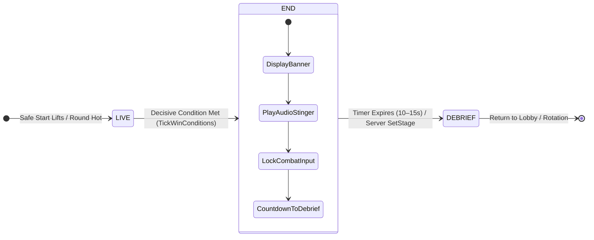

# TBD Reforger — End Screen Banner UI Functional Reference Specification

**System Domain:** Match Conclusion, Decisive Win/Defeat Presentation, Game Lifecycle Transition (`LIVE` → `END` → `DEBRIEF`)  
**Framework Alignment:** Enfusion Mod Framework (`apps/mod/tbd-framework`), Gamemode Lifecycle (`TBD_FrameworkManager.c`, `TBD_GameStage.c`), Screen Component (`TBD_EndScreen.c`), Audio Subsystem (`TBD_AudioEmitter.c`), Layout Resource (`TBD_EndScreen.layout`)

---

## 1. Purpose & Lifecycle Context

### 1.1 What It Is
The **End Screen Banner** is a high-visibility, cinematic HUD overlay presented to all connected players (both active combatants and spectators) at the immediate conclusion of a tactical round. It delivers an unambiguous verdict on the match outcome, establishes the victorious faction, explains the decisive win/loss condition, and manages the pacing transition between active gameplay and the detailed After-Action Report (AAR) / Debriefing screen.

### 1.2 When It Appears
The banner triggers the exact frame the authoritative server resolves a terminal mission condition during the `LIVE` stage, causing `TBD_FrameworkManager` to transition `m_Stage` to `TBD_EGameStage.END`:



### 1.3 Decisive Termination Triggers
The screen dynamically adapts to one of four authoritative resolution triggers evaluated on the server's 1 Hz win-condition tick (`TickWinConditions`):
1. **Faction Elimination (`faction_eliminated`):** All fielded combatants of opposing factions have been killed or rendered combat-ineffective (attrition threshold reached in one-life mode).
2. **Objective Completion / Capture (`objective_captured` / `objective_completed`):** A side captures the required territorial sector, extracts the high-value asset/VIP, or successfully defends/destroys a mission objective.
3. **Round Time Expiry (`time_limit`):** The authored scenario mission clock (`flow.roundSecondsRemaining`) reaches `00:00`, resolving victory to the defensive force or highest-scoring side.
4. **Administrative Stoppage (`admin`):** A game referee or match administrator issues `#tbd stage END` or an admin command to terminate the round manually.

---

## 2. Visual Layout & Required Information Elements

The End Screen Banner is designed as a focused, high-contrast modal banner anchored over the center of the viewport, rendered on top of a darkened tactical world scrim.

### 2.1 Visual Wireframe & Layout Architecture

```
┌────────────────────────────────────────────────────────────────────────────────────────────────────────┐
│                                                                                                        │
│                                      [ DISMISS / VIEW MAP (ESC) ]                                      │
│                                                                                                        │
│       ┌────────────────────────────────────────────────────────────────────────────────────────┐       │
│       │                                     MISSION ENDED                                      │       │
│       │                              TACTICAL ENGAGEMENT RESOLVED                              │       │
│       ├────────────────────────────────────────────────────────────────────────────────────────┤       │
│       │                                                                                        │       │
│       │                               [ FACTION INSIGNIA / LOGO ]                              │       │
│       │                             BLUFOR — UNITED STATES MARINE CORPS                        │       │
│       │                                      DECISIVE VICTORY                                  │       │
│       │                                                                                        │       │
│       │         "All opposing forces in the operational area have been eliminated."            │       │
│       │                                                                                        │       │
│       ├────────────────────────────────────────────────────────────────────────────────────────┤       │
│       │  ⏱ MATCH DURATION: 38m 24s                  ⏳ DEBRIEF SCOREBOARD IN: 00:09            │       │
│       └────────────────────────────────────────────────────────────────────────────────────────┘       │
│                                                                                                        │
│                                                                                                        │
└────────────────────────────────────────────────────────────────────────────────────────────────────────┘
```

### 2.2 Layout Breakdown & Widget Hierarchy

| Widget Name | Type | Visual Style / Color Tokens | Content & Behavioral Function |
| :--- | :--- | :--- | :--- |
| `ScreenRoot` | `FrameWidget` | Fullscreen Anchor (`0 0 1 1`) | Root container for the workspace overlay. |
| `Backdrop` | `ImageWidget` | Semi-translucent Scrim (`#080E1D` @ 72% opacity) | Darkens the 3D world, isolates combat distractions, and increases text legibility. |
| `PanelFrame` | `FrameWidget` | Center Docked (`Offset: 240px X, 120px Y`) | Main floating card holding the verdict presentation. |
| `Panel` | `ImageWidget` | Dark Slate Surface (`#0D1322` @ 100% opacity) | Solid opaque card backing with subtle outline. |
| `Title` | `TextWidget` | Bold Primary Text (`#DDE2F7`, 30pt, Center) | Static global headline: **`MISSION ENDED`**. |
| `Subtitle` | `TextWidget` | Secondary Muted (`#C4C6D0`, 16pt, Center) | Context status: `"TACTICAL ENGAGEMENT RESOLVED"`. |
| `HeaderRule` | `ImageWidget` | Horizontal Rule (`#44474F`, 2px height) | Visual separation between title and victory verdict. |
| `WinnerBanner` | `FrameWidget` / `Overlay` | Side-Themed Accent Fill (BLUFOR Blue, OPFOR Red, INDFOR Green) | Dynamic faction pill badge establishing the victor. |
| `Winner` | `TextWidget` | High-Contrast Bold (`#FFFFFF`, 24pt, Center) | Winning faction display name: e.g. **`BLUFOR — USMC VICTORIOUS`** or **`ROUND DRAW / STALEMATE`**. |
| `Reason` | `TextWidget` | Distinct Accent (`#A3C7FF` / `#F1F1F1`, 18pt, Center) | Human-readable decisive win explanation describing the outcome trigger. |
| `FooterRule` | `ImageWidget` | Horizontal Rule (`#44474F`, 2px height) | Separator between victory reason and telemetry bar. |
| `MatchDuration` | `TextWidget` | Tabular Numerals (`#C4C6D0`, 15pt, Left-aligned) | Formatted scenario duration elapsed during `LIVE` stage (`MM:SS` or `HH:MM:SS`). |
| `CountdownTimer` | `TextWidget` | Amber Highlight (`#FFCC00`, 16pt, Right-aligned) | Live 1 Hz countdown ticker indicating transition to the AAR: e.g. **`Debriefing in: 10s`**. |
| `BackAction` / `Dismiss` | `ButtonWidget` | Subtle Outline Button (`#2C303E`, Top-right) | Optional dismiss button labeled `DISMISS (ESC)` to toggle banner visibility. |

---

## 3. Required Data Fields & State Logic

### 3.1 Winning Faction Resolution (`Winner`)
* **Data Source:** Replicated via `TBD_FrameworkManager.GetEndWinner()`.
* **State Presentation:**
  * **Faction Victory:** Displays the capitalized human-readable name of the winning faction accompanied by its canonical military side color:
    * **BLUFOR (US / NATO):** Deep Blue (`#1D4ED8` accent fill, `#3B82F6` highlight border).
    * **OPFOR (USSR / Russian Armed Forces):** Crimson Red (`#991B1B` accent fill, `#EF4444` highlight border).
    * **INDFOR / Independent:** Forest Olive Green (`#166534` accent fill, `#22C55E` highlight border).
  * **Draw / Stalemate:** Rendered in neutral Slate Gray (`#475569`) with the text `NO DECISIVE WINNER` or `STALEMATE`.

### 3.2 Decisive Victory Reason (`Reason`)
* **Data Source:** Replicated via `TBD_FrameworkManager.GetEndReason()`.
* **Mapping Matrix:**

| Internal Reason Key | Rendered Headline Text | Detailed Context Description |
| :--- | :--- | :--- |
| `faction_eliminated` | **ENEMY FORCES ELIMINATED** | `"All opposing combatants have been neutralized or routed."` |
| `objective_captured` | **OBJECTIVE SECURED** | `"All critical territorial zones have been captured and fortified."` |
| `objective_completed` | **MISSION GOAL ACCOMPLISHED** | `"The primary mission objective has been completed successfully."` |
| `time_limit` | **TIME LIMIT EXPIRED** | `"The mission clock has elapsed; defending side holds operational territory."` |
| `admin` | **ADMINISTRATIVE TERMINATION** | `"The match was halted by server administration."` |

### 3.3 Match Summary Duration (`MatchDuration`)
* **Data Source:** Calculated on the server as `(EndTimestamp - LiveStartTimestamp)` and replicated via round state.
* **Format:** Formatted as `MM:SS` (or `HH:MM:SS` for operations lasting > 60 minutes).

### 3.4 Auto-Transition Countdown Timer (`CountdownTimer`)
* **Data Source:** Synchronized client-side countdown timer based on server-declared transition window (default: `10` or `15` seconds).
* **Format:** Dynamic text updated once per second: `Debrief in: 10s` → `09s` → `...` → `00s`.
* **Behavior:** When the timer reaches `0`, the server transitions state to `TBD_EGameStage.DEBRIEF`, which automatically tears down the End Screen Banner and mounts the full scoreboard.

---

## 4. Functional Mechanics & Engine Integration

1. **Server-Authoritative State Change:** The server sets `m_sPendingEndReason` and `m_sPendingEndWinner`, invokes `SetStage(TBD_EGameStage.END)`, and replicates state to all clients.
2. **Player Input Locking & Combat Freeze:**
   - Weapons are safed and projectile creation suppressed.
   - Locomotion inputs (WASD, sprint, crouch) are locked.
   - Characters receive damage invulnerability (`SetDamageHandlingEnabled(false)`) to preserve final combat records.
3. **Audio Stinger:** Plays a triumphant fanfare for winners, a solemn tone for losers, and ducks ambient combat noise by -6dB.
4. **Simple Dismissal:** Pressing `ESC` or clicking `DISMISS` hides the overlay locally so players can inspect the battlefield while awaiting the stage countdown.
5. **Debrief Transition:** When the countdown completes, `TBD_EndScreen` is torn down and `TBD_DebriefScreen` mounts automatically.
