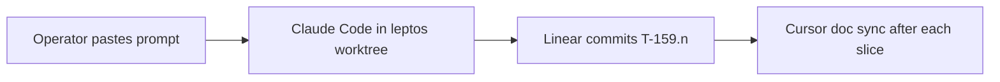

# T-159 — Leptos UI rewrite program

**Status:** program hub · **ACTIVE:** **T-159.1** (scaffold) · **Worktree:**
`.ai/artifacts/worktrees/TBD-T-159/` (absolute:
`/home/Samuel/Projects/TBD-Reforger/.ai/artifacts/worktrees/TBD-T-159`) · branch
`t-159-leptos-ui` · **Authority:** this hub · [`.ai/tickets/registry.json`](../../.ai/tickets/registry.json)

## In one sentence

Rework the website SPA from React/Vite into **Leptos (Rust)**, sharing types with the
existing Axum backend and hosting the existing map/mission wasm engines — developed on a
**standing worktree**, merge to `main` when cutover-ready.

## Why

One-language story for web UI + API + wasm cores: shared Rust types, less TS↔Rust drift,
heavier client rules (loadout/cargo later) stay in crates. Workbench/Enfusion stay Enforce
forever. React remains on `main` until an explicit cutover slice.

## Execution model (worktree-only)

Same discipline as **T-151**:



1. **CWD:** `.ai/artifacts/worktrees/TBD-T-159/` (absolute path above).
2. **No branch churn** per slice — linear commits on `t-159-leptos-ui`, tags `T-159.n`.
3. **Do not** nest a second worktree via `./scripts/ticket run` while already in TBD-T-159.
4. **Do not** delete or gut `apps/website/frontend` until the cutover slice.
5. Preflight: `git rev-parse --show-toplevel` ends with `TBD-T-159`.

## Locked decisions

| # | Decision |
|---|----------|
| L1 | **Leptos** is the UI framework (CSR acceptable for T-159.1; SSR/hydration may follow). |
| L2 | New workspace member (e.g. `apps/website-leptos`) — do not replace Axum crate. |
| L3 | Talk to existing API on `:8080` (dev-login, JWT cookies/headers as today). |
| L4 | Reuse Aegis visual language (tokens/CSS); no purple-AI redesign. |
| L5 | Map engine + `WasmMissionDoc` stay in existing wasm crates; Leptos hosts canvas later. |
| L6 | React app stays buildable on this branch until cutover. |
| L7 | Shared API/domain types: prefer Rust structs in a shared crate or `reforger_backend` re-exports — avoid hand-maintained parallel TS. |
| L8 | Arsenal / T-068 polish continues on `main` in parallel; do not block or merge-conflict Forge unless touching shared schemas intentionally. |

## Slice index

| Slice | Goal | Executor | Status |
|-------|------|----------|--------|
| **T-159.0** | Program hub + worktree + registry | cursor-docs | shipped (this pass) |
| **T-159.1** | Scaffold Leptos app in workspace; hello route; dev run docs | claude-code | **ready** |
| **T-159.2** | App shell: router, Aegis layout chrome (nav/sidebar stubs) | claude-code | queued |
| **T-159.3** | Auth bootstrap + dev-login parity | claude-code | queued |
| **T-159.4** | Wave-1 page parity (Dashboard or Mission Library — pick in slice spec) | claude-code | queued |
| **T-159.5+** | Remaining pages + Mission Creator host + cutover | claude-code | queued (specs later) |

## Non-goals (program-wide until named)

- Rewriting Workbench / Enfusion mod
- Pausing T-068 Arsenal on `main`
- Pixel-perfect day-one parity of every page in T-159.1
- Switching map engine ownership (T-151 stays)

## Ops

```bash
cd /home/Samuel/Projects/TBD-Reforger/.ai/artifacts/worktrees/TBD-T-159
# after T-159.1: follow slice README / make target for leptos dev serve
```

Merge back to `main` only when operator signs off cutover (later slice).
