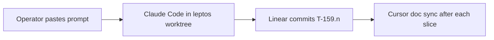

# T-159 — Leptos UI rewrite program

**Status:** program hub · **ACTIVE next:** camera interaction (pan/pick) → **T-159.16** doc
host · **Latest MC map:** **T-159.15.1** @ `a425936d` (tag **T-159.15.1**) · **Worktree:**
`.ai/artifacts/worktrees/TBD-T-159/` (absolute:
`/home/Samuel/Projects/TBD-Reforger/.ai/artifacts/worktrees/TBD-T-159`) · branch
`t-159-leptos-ui` · **Authority:** this hub · [`.ai/tickets/registry.json`](../../.ai/tickets/registry.json)

## In one sentence

Rework the website SPA from React/Vite into **Leptos (Rust)**, sharing types with the
existing Axum backend and hosting the existing map/mission wasm engines — developed on a
**standing worktree**, merge to `main` when cutover-ready.

## Why

One-language story for web UI + API + wasm cores: shared Rust types, less TS↔Rust drift,
heavier client rules (loadout/cargo later) stay in crates. Workbench/Enfusion stay Enforce
forever. React remains on `main` until an explicit cutover slice.

## Execution model (worktree-only)

Same discipline as **T-151**:



1. **CWD:** `.ai/artifacts/worktrees/TBD-T-159/` (absolute path above).
2. **No branch churn** per slice — linear commits on `t-159-leptos-ui`, tags `T-159.n`.
3. **Do not** nest a second worktree via `./scripts/ticket run` while already in TBD-T-159.
4. **Do not** delete or gut `apps/website/frontend` until the cutover slice.
5. Preflight: `git rev-parse --show-toplevel` ends with `TBD-T-159`.

## Locked decisions

| # | Decision |
|---|----------|
| L1 | **Leptos** is the UI framework (CSR acceptable for T-159.1; SSR/hydration may follow). |
| L2 | New workspace member (`apps/website-leptos`) — do not replace Axum crate. |
| L3 | Talk to existing API on `:8080` (dev-login, JWT cookies/headers as today). |
| L4 | Reuse Aegis visual language (tokens/CSS); no purple-AI redesign. |
| L5 | Map engine + `WasmMissionDoc` stay in existing wasm crates; Leptos hosts canvas. |
| L6 | React app stays buildable on this branch until cutover. |
| L7 | Shared API/domain types: prefer Rust structs — avoid hand-maintained parallel TS. |
| L8 | Arsenal / T-068 polish continues on `main` in parallel. |
| L9 | Page parity = **oracle DOM byte-identical** (V-suite). Map lane = **GPU readback / smoke**, not DOM. |
| L10 | Dates/calendar via `js_sys::Date` (+ freeze.js) so Leptos matches React’s frozen JS clock. |

## Progress (worktree tip `a425936d`)

| Milestone | Status |
|-----------|--------|
| Scaffold + Aegis shell + auth + route table | shipped on branch |
| **24 page routes** byte-identical (authed V-suite + guest) | shipped — editor excluded |
| **T-159.15.0** wgpu boundary collapse (one wasm, `RenderEngine` from Rust) | @ `3066f14c` |
| **T-159.15.1** continuous/damage-driven loop + wheel + resize + GPU self-check | @ `a425936d` tag **T-159.15.1** |
| Camera pan/pick | **next** |
| **T-159.16** `WasmMissionDoc` host | next after pan/pick |
| Eden shell .17–.22 / cutover | queued |

### T-159.15.1 root cause (authoritative)

See [`.ai/artifacts/t159_15_1_verify_log.md`](../../.ai/artifacts/t159_15_1_verify_log.md).

**Not** “WebGL2 needs `poll()`.” Smoke backend was **WebGPU/Dawn**. Panic = **GpuTimer**
16-byte readback double-map on 2nd submit. Fix = `disable_frame_timing()` (handoff option 3);
`poll()` retained for WebGL2-fallback / future cull counters. Self-check uses `?force=webgl`.

**Open bug (ticket later):** GpuTimer err-path unmaps only on `res.is_ok()` but clears
`in_flight` unconditionally — latent when HUD/timer returns.

## Full inventory (authority for “what exists”)

[`.ai/artifacts/t159_leptos_full_migration_inventory.md`](../../.ai/artifacts/t159_leptos_full_migration_inventory.md)

**Baseline:** **35,823** LOC / **235** files · **26** prod routes · **46** API hooks.

## Slice index (high level)

| Slice | Goal | Status |
|-------|------|--------|
| **T-159.0** | Hub + worktree | shipped (`f95b01ad` docs on main) |
| **T-159.1–.14** | Scaffold → shell → auth → types → UI kit → page waves | shipped on `t-159-leptos-ui` (24 routes) |
| **T-159.15.0** | MC wgpu boundary collapse | shipped `3066f14c` |
| **T-159.15.1** | Render loop + wheel + GPU gate | shipped `a425936d` |
| **T-159.15.2+** | Pan / pick / camera interaction | **ready next** |
| **T-159.16–.22** | Doc host → persist → tools → save → outliner → Arsenal | queued |
| **T-159.23–.25** | Visual sweep → cutover → delete React | queued |

Detailed ladder: inventory §8. Gates live under worktree `.ai/artifacts/t159_gates/`.

## Non-goals (program-wide until named)

- Rewriting Workbench / Enfusion mod
- Pausing T-068 Arsenal on `main`
- Reimplementing `map-engine-*` in Leptos (host only)

## Ops

```bash
cd /home/Samuel/Projects/TBD-Reforger/.ai/artifacts/worktrees/TBD-T-159
# Leptos: trunk build / make target per crate README
# Editor smoke: .ai/artifacts/t159_gates/driver/smoke_editor.mjs
# GPU self-check: selfcheck_editor.mjs (?force=webgl)
```

Merge back to `main` only when operator signs off cutover (later slice).
