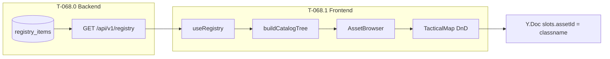
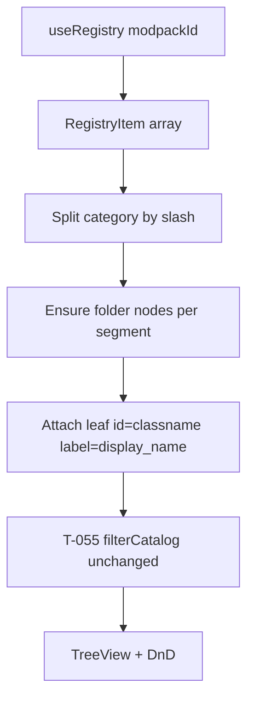

# T-068 — Asset registry + palette (thin feed)

**Status:** **ready** — spec published; implementation not started.  
**Git tag on ship:** T-068  
**Authority:** [MC ROADMAP](ROADMAP.md) §T-068+ · [agent_execution.md](agent_execution.md) §ACTIVE SLICE · [engineering_plan.md](engineering_plan.md) §Backend prerequisites · [eden/gap_analysis.md](eden/gap_analysis.md) `RIGHT-CAT-001` · [`docs/TICKET_LEAD.md`](../../TICKET_LEAD.md)

**Prerequisites:** **T-067** shipped (`d2128cf`). Dev-login `mission_maker+`; `/missions/:id/edit`.

**Agent roles (locked):** **Cursor** authors and syncs all documentation. **Claude Code** reads this spec and implements code only — return verify output to Cursor for the ship doc pass.

**Slices (Registry + Forge program):**

| Slice | targets | executor | Work |
|-------|---------|----------|------|
| **T-068.0** | `shared`, `root` | `cursor-docs` | Kit JSON schemas + ingest spec in `docs/specs/` |
| **T-068.0a** | `mod` | `workbench` | Workbench export → items/compat JSON |
| **T-068.1** | `website` | `claude-code` | `POST/GET /api/v1/registry` + kits tables |
| **T-068.2** | `website` | `claude-code` | Comlink `registry.worker.ts` + IndexedDB cache |
| **T-068.3** | `website` | `claude-code` | Wire Asset Browser to live registry tree |
| **T-068.4** | `website` | `claude-code` | Loadout Forge UI (`canEquip` / attachments) |
| **T-068.5** | `website` | `claude-code` | Arsenal inspector + compat matrix read path |
| **T-068.6** | `website` | `claude-code` | Compiler export: classname + loadout superset |

**Active slice:** **T-068.0** (Cursor docs). `./scripts/ticket run` starts at **T-068.1** after docs + Workbench export land.

**Prerequisites:** **T-067** shipped (`d2128cf`). Dev-login `mission_maker+`; `/missions/:id/edit`.

Replace the mock Factions catalog with a **thin, modpack-scoped registry feed** (`classname`, `display_name`, `category`, `icon_url`, `kind`) served by the API and rendered in the existing Eden-style tree + T-055 search + DnD placement flow.

---

## Problem (today)

| Layer | Current | Gap |
|-------|---------|-----|
| Right palette Factions tab | [`assetCatalogMock.ts`](../../../apps/website/frontend/src/features/mission-creator/layout/RightInspector/assetCatalogMock.ts) hard-coded NATO/CSAT tree | Not from `GET /api/v1/registry`; mock ids (`a-nato-rifleman`) not Arma classnames |
| Backend | No registry route or table | [`docs/backend/ROADMAP.md`](../../website/backend/ROADMAP.md) lists T-068 partial |
| DnD payload | `assetId: node.id` (mock id) | Should be **Arma classname** per [`schema.ts`](../../../apps/website/frontend/src/features/tactical-map/state/schema.ts) `Slot.assetId` comment |
| Eden parity | `RIGHT-CAT-001` **partial** | Blocks **T-069** markers and **T-070** vehicles (need registry `kind` extensibility) |

T-055 asset search, drag-place, and `addSlot` flow **must not regress**.

---

## Locked decisions (thin registry — Eden-blocking only)

| Decision | Choice |
|----------|--------|
| Scope | **Factions tab only** — Vehicles/Markers/Objectives tabs stay stubs ([`AssetPalette.tsx`](../../../apps/website/frontend/src/features/mission-creator/layout/RightInspector/AssetPalette.tsx)) |
| Feed shape | **Flat list** of placeable entries; frontend builds Faction → Category → Class tree |
| Minimum fields | `classname`, `display_name`, `category` (slash path, e.g. `NATO/Men/Rifleman`), `icon_url`, `kind` (`slot` only in T-068) |
| Modpack key | Query `?modpack=<uuid>`; **default** = current modpack ([`GET /modpacks/current`](../../../apps/website/internal/handlers/modpacks.go)) |
| Auth | `RequireAuth` + `RequireMinRole("mission_maker")` — same tier as editor route |
| Caching | TanStack Query + HTTP `ETag` / `If-None-Match` → 304; **no** Comlink worker, **no** IndexedDB blob cache (Phase 6 loadout program) |
| DnD contract | `AssetDropPayload.assetId` = **Arma classname**; `role` = `display_name`; `kind: 'slot'` unchanged |
| Slot persistence | Keep `Slot.assetId` field — becomes classname; **no Y.Doc schema migration** |
| Search | **Preserve T-055** — `filterCatalog` runs on built tree; no API search param |
| Icons | Seeded `icon_url` strings; fallback to Lucide leaf icons when URL missing or image 404 |
| Dev data | SQL seed mirroring mock catalog hierarchy with realistic Reforger-style classnames |
| Out of scope | `registry.worker.ts`, `canEquip`/`canAttach`, ArsenalInspector, ingest pipeline, attachment compat matrix, compiler classname export, Vehicles/Markers placement (**T-069**/**T-070**) |

---

## API contract (source of truth for Go + TS)

### Request

```
GET /api/v1/registry?modpack=<uuid>
Authorization: Bearer <jwt>
If-None-Match: "<etag>"   (optional)
```

- **`modpack` query param:** optional UUID. When omitted, resolve **current modpack** (`is_current = true`). Return **404** if param invalid or no current modpack in dev DB.
- **Auth tier:** mission_maker+ (register on the `mm` route group in [`handlers.go`](../../../apps/website/internal/handlers/handlers.go)).

### Response — 200

```json
{
  "data": [
    {
      "classname": "Character_US_Rifleman",
      "display_name": "Rifleman",
      "category": "NATO/Men/Rifleman",
      "icon_url": "/static/registry/icons/rifleman.png",
      "kind": "slot"
    }
  ],
  "etag": "W/\"a1b2c3d4\"",
  "modpack_id": "550e8400-e29b-41d4-a716-446655440000",
  "modpack_version": "2.1"
}
```

### Response — 304

Empty body when `If-None-Match` matches computed `etag`.

### Response — 404

Unknown modpack UUID or no current modpack configured.

### TypeScript (hand-written)

```ts
// frontend/src/types/models/registry.ts
export interface RegistryItem {
  classname: string
  display_name: string
  category: string
  icon_url: string
  kind: 'slot' // extensible: 'marker' | 'vehicle' in T-069/T-070
}

export interface RegistryResponse {
  data: RegistryItem[]
  etag: string
  modpack_id: string
  modpack_version: string
}
```

### ETag computation (backend)

Weak ETag from: `modpack_id` + row `count` + max(`updated_at`) unix nano (or content hash of sorted classnames). Stable for unchanged data; changes when rows added/updated/deleted.

---

## Architecture





---

## T-068.0 — Backend implementation

### Database model

**File:** [`internal/models/registry.go`](../../../apps/website/internal/models/registry.go) (new)

```go
type RegistryItem struct {
    ID          uuid.UUID `gorm:"type:uuid;primaryKey;default:gen_random_uuid()" json:"id"`
    ModpackID   uuid.UUID `gorm:"type:uuid;column:modpack_id;not null;index" json:"modpack_id"`
    Classname   string    `gorm:"not null" json:"classname"`
    DisplayName string    `gorm:"column:display_name;not null" json:"display_name"`
    Category    string    `gorm:"not null" json:"category"`
    IconURL     string    `gorm:"column:icon_url" json:"icon_url"`
    Kind        string    `gorm:"not null;default:slot" json:"kind"`
    SortOrder   int       `gorm:"column:sort_order;not null;default:0" json:"sort_order"`
    CreatedAt   time.Time `json:"created_at"`
    UpdatedAt   time.Time `json:"updated_at"`
}
// UniqueIndex: (modpack_id, classname)
```

### Migration

**File:** [`internal/db/migrations/03_registry_items.sql`](../../../apps/website/internal/db/migrations/03_registry_items.sql) (new)

- Idempotent `CREATE TABLE IF NOT EXISTS registry_items …`
- Unique constraint on `(modpack_id, classname)`
- Index on `modpack_id`

### Dev seed

**File:** [`internal/db/seeds/registry_dev.sql`](../../../apps/website/internal/db/seeds/registry_dev.sql) (new)

Mirror mock catalog parity (~20–30 rows). Example classnames (Reforger-style placeholders — adjust to match your modpack):

| category | display_name | classname (example) |
|----------|--------------|------------------------|
| NATO/Men/Rifleman | Rifleman | `Character_US_Rifleman` |
| NATO/Men/Rifleman | Squad Leader | `Character_US_SL` |
| NATO/Men/Rifleman | Medic | `Character_US_Medic` |
| NATO/Men/Rifleman | Autorifleman | `Character_US_AR` |
| NATO/Men/Rifleman | Marksman | `Character_US_Marksman` |
| NATO/Vehicles/Cars/MRAP (Hunter) | MRAP (Hunter) | `Vehicle_US_Hunter` |
| NATO/Vehicles/Cars/LSV (Prowler) | LSV (Prowler) | `Vehicle_US_Prowler` |
| NATO/Vehicles/Armored/IFV (Marshall) | IFV (Marshall) | `Vehicle_US_Marshall` |
| NATO/Objects/Sandbag Wall | Sandbag Wall | `Prop_SandbagWall_US` |
| NATO/Objects/H-Barrier | H-Barrier | `Prop_HBarrier_US` |
| CSAT/Men/Rifleman | Rifleman | `Character_USSR_Rifleman` |
| CSAT/Men/Rifleman | Squad Leader | `Character_USSR_SL` |
| Empty / Props/Ammo Box | Ammo Box | `Prop_AmmoBox_Empty` |

- Seed against the **current modpack** row (lookup by `is_current = true`).
- Wire into `make seed` or document `psql` apply in [`DEV_RUNBOOK.md`](../../website/DEV_RUNBOOK.md) if seed script is manual-only.
- `icon_url` may be empty string → frontend Lucide fallback.

### Handler

**File:** [`internal/handlers/registry.go`](../../../apps/website/internal/handlers/registry.go) (new)

```go
func (h *Handler) GetRegistry(c *gin.Context) {
    // 1. Resolve modpackID from ?modpack= or current modpack
    // 2. Load rows ORDER BY sort_order, category, display_name
    // 3. Compute etag; if If-None-Match match → 304
    // 4. JSON: { data, etag, modpack_id, modpack_version }
}
```

**Route registration:** [`internal/handlers/handlers.go`](../../../apps/website/internal/handlers/handlers.go)

```go
mm.GET("/registry", h.GetRegistry)
```

### Integration test

**File:** [`internal/handlers/registry_integration_test.go`](../../../apps/website/internal/handlers/registry_integration_test.go) (new)

- Seed current modpack + registry rows in test DB
- `GET /api/v1/registry` with mission_maker JWT → 200, non-empty `data`, `etag` present
- Repeat with `If-None-Match` → 304
- Unknown modpack UUID → 404

---

## T-068.1 — Frontend implementation

### Tree builder

**File:** [`frontend/src/features/mission-creator/registry/buildCatalogTree.ts`](../../../apps/website/frontend/src/features/mission-creator/registry/buildCatalogTree.ts) (new)

```ts
import { Folder, User } from 'lucide-react'
import type { TreeNodeData } from '../layout/tree/TreeView'
import type { RegistryItem } from '@/types/models/registry'

/**
 * Build Eden-style Faction → Category → Class tree from flat registry rows.
 * - Folder node id: stable path key e.g. "folder:NATO/Men"
 * - Leaf node id: item.classname (Arma classname — used in DnD + Slot.assetId)
 * - Leaf label: item.display_name
 * - NATO top-level folder: defaultExpanded: true (match mock UX)
 */
export function buildCatalogTree(items: RegistryItem[]): TreeNodeData[] {
  const root: TreeNodeData[] = []
  const folderIndex = new Map<string, TreeNodeData>()

  for (const item of items) {
    if (item.kind !== 'slot') continue
    const segments = item.category.split('/').filter(Boolean)
    let siblings = root
    let path = ''
    for (let i = 0; i < segments.length; i++) {
      path = path ? `${path}/${segments[i]}` : segments[i]
      const key = `folder:${path}`
      let folder = folderIndex.get(key)
      if (!folder) {
        folder = {
          id: key,
          label: segments[i],
          icon: Folder,
          children: [],
          ...(path === 'NATO' ? { defaultExpanded: true } : {}),
        }
        folderIndex.set(key, folder)
        siblings.push(folder)
      }
      siblings = folder.children!
    }
    siblings.push({
      id: item.classname,
      label: item.display_name,
      icon: User, // or resolve icon_url when present
    })
  }
  return root
}
```

Refine icon handling: optional `iconUrl` on leaf nodes if `TreeView` supports it later; T-068 may keep Lucide for all leaves when `icon_url` empty.

### Query hook

**File:** [`frontend/src/hooks/queries.ts`](../../../apps/website/frontend/src/hooks/queries.ts)

```ts
export function useRegistry(modpackId?: string) {
  return useQuery({
    queryKey: ['registry', modpackId ?? 'current'],
    queryFn: async () => {
      const params = modpackId ? { modpack: modpackId } : {}
      const res = await api.get<RegistryResponse>('/registry', { params })
      return res.data
    },
    staleTime: 5 * 60 * 1000,
  })
}
```

Optional: persist `etag` in query meta and send `If-None-Match` on refetch (304 → keep prior data).

### AssetBrowser wiring

**File:** [`frontend/src/features/mission-creator/layout/RightInspector/AssetBrowser.tsx`](../../../apps/website/frontend/src/features/mission-creator/layout/RightInspector/AssetBrowser.tsx)

1. Replace `import { ASSET_CATALOG } from './assetCatalogMock'` with `useRegistry()` + `buildCatalogTree`.
2. `const catalog = useMemo(() => buildCatalogTree(data?.data ?? []), [data])`.
3. Run existing `filterCatalog(catalog, q)` — **unchanged T-055 logic**.
4. Loading: skeleton or "Loading catalog…" (Aegis outline text).
5. Error: "Could not load asset registry" + retry hint.
6. Empty seed: "No placeable assets for this modpack."
7. DnD payload:
   ```ts
   const payload: AssetDropPayload = {
     assetId: node.id,        // classname on leaves
     role: node.label,        // display_name
     kind: 'slot',
   }
   ```

### Mock removal

**File:** [`assetCatalogMock.ts`](../../../apps/website/frontend/src/features/mission-creator/layout/RightInspector/assetCatalogMock.ts)

**Delete on ship** — no runtime import. If unit tests need fixture data, move minimal array to `registry/__fixtures__.ts` (optional; not required for T-068 ship).

### JSDoc update

**File:** [`frontend/src/features/tactical-map/types.ts`](../../../apps/website/frontend/src/features/tactical-map/types.ts)

Update `AssetDropPayload.assetId` comment: "Arma classname from registry feed (T-068)."

---

## Files to change (checklist)

| File | Slice | Change |
|------|-------|--------|
| `internal/models/registry.go` | 0 | New GORM model |
| `internal/db/migrations/03_registry_items.sql` | 0 | Table + indexes |
| `internal/db/seeds/registry_dev.sql` | 0 | Dev seed rows |
| `internal/handlers/registry.go` | 0 | GetRegistry handler |
| `internal/handlers/registry_integration_test.go` | 0 | Contract test |
| `internal/handlers/handlers.go` | 0 | Route registration |
| `frontend/src/types/models/registry.ts` | 1 | TS types |
| `frontend/src/hooks/queries.ts` | 1 | `useRegistry` |
| `frontend/src/features/mission-creator/registry/buildCatalogTree.ts` | 1 | Tree builder |
| `frontend/src/features/mission-creator/layout/RightInspector/AssetBrowser.tsx` | 1 | Wire feed + states |
| `frontend/src/features/mission-creator/layout/RightInspector/assetCatalogMock.ts` | 1 | **Delete** |
| `frontend/src/features/tactical-map/types.ts` | 1 | JSDoc only |

**No change:** `TreeView.tsx`, `AssetPalette.tsx` stub tabs, `TacticalMap.tsx` DnD handler, compiler, Y.Doc schema.

---

## Verification

```bash
make db-up
make seed          # includes registry_dev.sql when wired
PATH="/var/home/Samuel/.local/go/bin:$PATH" make test-it
cd frontend && npm run build && npm run lint
```

### Manual test plan

Stack: `make db-up && make api && make web`. Dev-login `mission_maker`. Open `/missions/:id/edit`.

| # | Check | Expected |
|---|-------|----------|
| 1 | Factions tab loads | Skeleton → NATO/CSAT tree from API (not mock) |
| 2 | Search `medic` | NATO ▸ Men ▸ Medic visible (T-055) |
| 3 | Search `nato` | Full NATO subtree |
| 4 | Clear search | Full tree restored |
| 5 | Drag Rifleman onto map | Slot placed; `assetId` = classname in store |
| 6 | Vehicles/Markers/Objectives tabs | Unchanged stub copy |
| 7 | Pan/paste @ large mission | No T-067 regression |
| 8 | curl registry | `GET /api/v1/registry` with JWT → 200 + etag; 304 on repeat |

```bash
# API smoke (after dev-login, read access_token from fragment or cookie flow)
curl -s -H "Authorization: Bearer $TOKEN" \
  "http://localhost:8080/api/v1/registry" | jq '.data | length, .etag'
```

---

## Acceptance — T-068 (ship gate)

| Check | Bar | Status |
|-------|-----|--------|
| `GET /api/v1/registry` | Seeded data for current modpack; ETag 304 | Pending |
| Factions tab | No mock import at runtime | Pending |
| T-055 search | medic / nato / empty query | Pending |
| Drag place | `assetId` = classname, `role` = display_name | Pending |
| T-067 regression | Pan/paste/pick unchanged | Pending |
| `make test-it` | Registry test passes | Pending |
| `npm run build` + `lint` | Clean | Pending |
| Stub tabs | Unchanged | Pending |
| Git tag **T-068** | Committed + pushed | Pending |

---

## Documentation sync on ship

Per [`docs/AGENT_COMMIT_CHECKLIST.md`](../../website/AGENT_COMMIT_CHECKLIST.md):

| Doc | Change |
|-----|--------|
| **This file** | Status → **shipped**; fill acceptance ✅ |
| [`tickets/registry.json`](../../../.ai/tickets/registry.json) | T-068 → `shipped`; `./scripts/ticket sync` |
| [`CLAUDE.md`](../../../CLAUDE.md) §Status | T-068 Done bullet |
| [`feature_inventory.md`](feature_inventory.md) | RIGHT-CAT-001 → **working**; Evidence → registry files |
| [`eden/gap_analysis.md`](eden/gap_analysis.md) | RIGHT-CAT-001 parity → **match** (Factions feed) |
| [`agent_execution.md`](agent_execution.md) | §ACTIVE SLICE → T-069; Decisions log row |
| [`ROADMAP.md`](ROADMAP.md) | DONE T-068 section + spec index |
| [`frontend/docs/pages/mission-editor.md`](../../../apps/website/frontend/docs/pages/mission-editor.md) | M5.26 → [x] |
| [`docs/backend/ROADMAP.md`](../../website/backend/ROADMAP.md) | Registry row → shipped |
| [`docs/TAGS.md`](../../website/TAGS.md) | T-068 spec row (if not already) |

**Cursor only** for doc sync. Claude Code returns verify output.

---

## Out of scope (unchanged)

- **T-069** / **T-070** — markers/vehicles placement (`kind` extension only prepared in schema)
- **Phase 6** — `registry.worker.ts`, IndexedDB cache, `canEquip`/`canAttach`
- **Loadout program** — attachment compat, ArsenalInspector, Loadout Forge
- **Ingest pipeline** — game-server push of modded gear (future backend program)
- **Compiler export** — classname in `json_payload.orbat` (separate ticket)
- **T-074** — BLUFOR/OPFOR submode filter
- **RIGHT-SEARCH-002** — `class:` prefix search

---

## After T-068

- **T-069** — markers on map ([`docs/TICKET_LEAD.md`](../../TICKET_LEAD.md))
- **T-070** — vehicles placeable
- **T-071** — ORBAT Manager modal

---

## Claude Code prompt archive — T-068

**Do not edit documentation.** Implement code only.

```
Read CLAUDE.md §Status and docs/specs/Mission_Creator_Architecture/t068_asset_registry.md.

Implement T-068 in order:
1. T-068.0 — backend: model, migration, seed, GET /api/v1/registry, integration test
2. T-068.1 — frontend: types, useRegistry, buildCatalogTree, AssetBrowser wiring, delete assetCatalogMock.ts

Verify:
  make db-up && make test-it
  cd frontend && npm run build && npm run lint

Manual: dev-login mission_maker → /missions/:id/edit → Factions tree from API, search + drag place.

Return: files changed, test output, manual checklist results. Do NOT edit docs — Cursor syncs on ship.
```

Run `./scripts/ticket brief T-068` for the generated handoff block.
