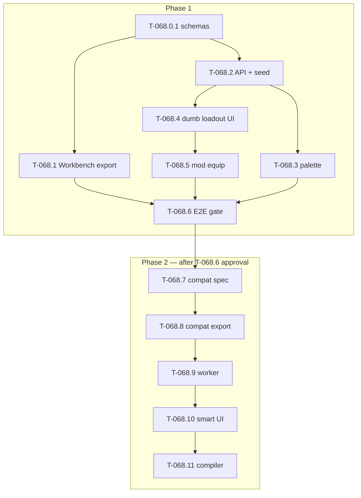

# T-068 — Virtual Arsenal (registry + loadout export)

**Status:** **ready** — program hub + slice specs published (BUILD). Code pending **T-068.0.1**.  
**Git tag on ship:** **T-068** (full ticket @ **T-068.11**; optional Phase 1 milestone @ **T-068.6**)  
**Authority:** [MC ROADMAP](ROADMAP.md) · [agent_execution.md](agent_execution.md) · [`docs/TICKET_LEAD.md`](../../TICKET_LEAD.md) · [`.ai/tickets/registry.json`](../../../.ai/tickets/registry.json)

**Prerequisites:** **T-067** shipped. Dev-login `mission_maker+`; `/missions/:id/edit`.

---

## Agent split (locked)

| Agent | Owns |
|-------|------|
| **Cursor** | This hub, all `t068_*` slice specs, registry, `./scripts/ticket sync`, narrative doc sync |
| **Claude Code** | All code — schemas, API, UI, worker, compiler (`executor: claude-code` slices) |
| **Workbench / human** | Mod export scripts, in-game E2E (`workbench` / `human` slices) |

---

## Antigravity pivot (two phases)

| Phase | Narrative | Ship gate |
|-------|-----------|-----------|
| **Phase 1 — Dumb Virtual Arsenal** | Flat ResourceName lists; dumb loadout dropdowns → `loadout-export.json`; mod equips exact names | **T-068.6** human E2E |
| **Phase 2 — Smart Arsenal** | Compat matrix export → worker `canEquip` → smart Forge UI → compiler loadout superset | **T-068.11** + `./scripts/ticket done T-068` |

Phases are labels; **`slices[]` + `active_slice`** in registry are the execution source of truth.

---

## Cross-cutting rules (locked)

| # | Rule |
|---|------|
| 1 | **Identity:** full Enfusion `ResourceName` (`{GUID}Prefabs/.../File.et`) in API, export, and `Slot.assetId`. API field name: **`resource_name`** (snake_case). |
| 2 | **Alias registry POC** ([`registry.schema.json`](../../../packages/tbd-schema/schema/registry.schema.json) + mod `Data/registry.json`) **coexists** — spawn aliases (`kit:us_rifleman`) stay mod-only; web feed uses flat `registry-items` (no aliases in Phase 1 API). |
| 3 | **Phase 1:** no `canEquip`, no attachments/mags/ammo in UI or `loadout-export` schema. |
| 4 | **Phase 1 loadout-export:** `{ loadoutVersion, modpackId, gear: { primary, uniform, vest, helmet } }` — each value is a `resource_name` string or `null`. |
| 5 | **Palette `kind`:** `character` for Eden Factions drag-place; gear rows use `gear_primary`, `gear_uniform`, `gear_vest`, `gear_helmet` for loadout UI filters. |
| 6 | **Ingest path:** T-068.2 ships **`registry_dev.sql`** dev seed + `GET /api/v1/registry`. Workbench export (T-068.1) validates against `registry-items` schema; land in DB via **`go run ./cmd/import-registry-items`** (admin) reading export JSON — not required for first API smoke. |
| 7 | **Loadout E2E handoff:** UI downloads `loadout-export.json`; human copies to **`$profile:TBD_LoadoutTest.json`** for mod equip test (T-068.5 / T-068.6). Mission compiler export deferred to **T-068.11**. |
| 8 | **T-068.4 UI:** **Build** functional dumb loadout UI — **replace** Attributes → Arsenal **stub** (disabled “Loadout Forge soon”) with 4 gear dropdowns + download JSON. Not a new route; not paper-doll (T-068.10). |
| 9 | **API caching:** `GET /registry` supports weak **ETag** / **304** (see T-068.2). |
| 10 | **Map/topo:** **T-090 / T-091 / T-110** — out of T-068. |

---

## Slice index (registry `slices[]` order)

Per-slice spec paths live here only — **`slice_plan` in registry has no `spec` field**.

| Slice | Executor | Spec file | Verification gate |
|-------|----------|-----------|-------------------|
| T-068.0 | cursor-docs | [`t068_virtual_arsenal_program.md`](t068_virtual_arsenal_program.md) | `make ticket-check-strict` + 13 specs on disk |
| T-068.0.1 | claude-code | [`t068_0_1_registry_schemas.md`](t068_0_1_registry_schemas.md) | §Verification gate A1–A7 |
| T-068.1 | workbench | [`t068_1_workbench_flat_export.md`](t068_1_workbench_flat_export.md) | §Verification gate A1–A7 |
| T-068.2 | claude-code | [`t068_2_registry_api.md`](t068_2_registry_api.md) | §Verification gate A1–A9 + curl |
| T-068.3 | claude-code | [`t068_3_palette_wire.md`](t068_3_palette_wire.md) | §Verification gate A1–A3 + M1–M7 |
| T-068.4 | claude-code | [`t068_4_dumb_loadout_ui.md`](t068_4_dumb_loadout_ui.md) | §Verification gate **A0** (stub removed) + A1–A7 + jq |
| T-068.5 | workbench | [`t068_5_mod_equip_loadout.md`](t068_5_mod_equip_loadout.md) | §Verification gate A1–A7 + logs |
| T-068.6 | human | [`t068_6_phase1_e2e_gate.md`](t068_6_phase1_e2e_gate.md) | E1–E12 + sign-off |
| T-068.7 | cursor-docs | [`t068_7_compat_matrix_spec.md`](t068_7_compat_matrix_spec.md) | §Verification gate A1–A6 |
| T-068.8 | workbench | [`t068_8_workbench_compat_export.md`](t068_8_workbench_compat_export.md) | §Verification gate A1–A5 |
| T-068.9 | claude-code | [`t068_9_registry_worker_ingest.md`](t068_9_registry_worker_ingest.md) | §Verification gate A1–A5 + W1–W3 |
| T-068.10 | claude-code | [`t068_10_smart_forge_ui.md`](t068_10_smart_forge_ui.md) | §Verification gate A1–A5 |
| T-068.11 | claude-code | [`t068_11_compiler_loadout_export.md`](t068_11_compiler_loadout_export.md) | §Verification gate A1–A4 + R1–R4 |

**Active slice after BUILD:** **T-068.0.1** (T-068.0 absorbed by BUILD).

---

## Dependency diagram



**Parallel after T-068.0.1:** T-068.1 and T-068.2 may start concurrently (`parallel_ok: true`). Registry tracks one `active_slice`; advance only when the **current pointer slice** verifies.

---

## Verification contract (mandatory — no “looks good”)

**Rule:** Do **not** run `./scripts/ticket advance-slice T-068` until **every** row in the active slice’s **§Verification gate → Acceptance criteria** table is **PASS**, with evidence pasted into the Docs & Tickets chat.

### Universal rules

| Rule | Requirement |
|------|----------------|
| **Exit codes** | Every listed command must exit **0** (non-zero = FAIL, stop) |
| **Evidence** | Paste full command output (or linked log); redact tokens only |
| **Partial pass** | Not allowed — one FAIL blocks advance |
| **Regression** | Slices that touch the editor must confirm **no new** `assetCatalogMock` imports and `make test-it` / FE build still green where listed |
| **Human slices** | Paste checklist table with **PASS/FAIL** per row + proof (log line, curl output, DevTools snippet) |
| **Cursor advance** | Cursor verifies paste against spec gate **before** `advance-slice` |

### Verify paste template (executor → Cursor)

```markdown
## T-068.N verify — PASS | FAIL
**Slice:** T-068.N
**Branch / commit:** ticket/T-068 @ <sha>
**Executor:** claude-code | workbench | human

### Automated
(paste commands + full output)

### Acceptance criteria
| ID | Result | Evidence |
|----|--------|----------|
| A1 | PASS | … |

### Blockers
(none | list)
```

### Slice verification index

| Slice | Automated anchor | Manual / proof required |
|-------|------------------|-------------------------|
| T-068.0 | `make ticket-check-strict` | All 13 spec paths exist on disk |
| T-068.0.1 | `cd packages/tbd-schema && npm run validate` | `jq` resource_name GUID regex on samples |
| T-068.1 | `npm run validate` includes workbench export | ≥20 items; 5 kinds; 3 Workbench copy checks |
| T-068.2 | `make test-it` (registry tests) | curl 200 + 304 + jq field checks |
| T-068.3 | FE build/lint + `rg assetCatalogMock` | DevTools: API tree, drag, store `assetId` |
| T-068.4 | FE build/lint + **stub grep gate** + schema validate download | Arsenal tab: **no stub**; 4 enabled dropdowns + download works |
| T-068.5 | Mod console log grep | Spawn shows 4 equip lines |
| T-068.6 | All prior slices PASS | Full E2E table + sign-off |
| T-068.7 | `make ticket-check-strict` | Phase 2 approval statement |
| T-068.8+ | Per child spec gate | Per child spec gate |

Detail: each [`t068_*`](.) child spec **§Verification gate** section.

---

## Execution workflow (ping-pong)

1. **BUILD (Cursor, `main`):** this hub + all child specs + registry reslice + `./scripts/ticket sync`.
2. **Per slice:** Cursor handoff → you run executor → paste **Verify block** (see §Verification contract) → Cursor checks gate → `./scripts/ticket advance-slice T-068` + doc sync on `main`.
3. **Claude Code:** branch `ticket/T-068`; read **child spec** path from table above (not `./scripts/ticket brief` alone — brief points at this hub).
4. **Phase 2 gate:** do not start **T-068.7** until **T-068.6** passes and you approve Phase 2.
5. **Ship:** `./scripts/ticket done T-068` only after **T-068.11** (not at T-068.6).

---

## Documentation sync map

| When | Cursor updates |
|------|----------------|
| T-068.3 shipped | `feature_inventory` **RIGHT-CAT-001** → working; `eden/gap_analysis` Factions feed |
| T-068.4 shipped | Loadout Forge FEDS row (dumb export) |
| T-068.6 passed | Phase 1 acceptance in this hub + optional git tag note |
| T-068.11 shipped | Full [`AGENT_COMMIT_CHECKLIST.md`](../../website/AGENT_COMMIT_CHECKLIST.md); registry `shipped`; MC ROADMAP Done bullet |

---

## Legacy redirect

Supersedes thin-registry draft [`t068_asset_registry.md`](t068_asset_registry.md) (stub only).

**Replaces old slice IDs:** `T-068.0a` → **T-068.1** · old API **T-068.1** → **T-068.2** · old worker **T-068.2** → **T-068.9** · old compiler **T-068.6** → **T-068.11**.
