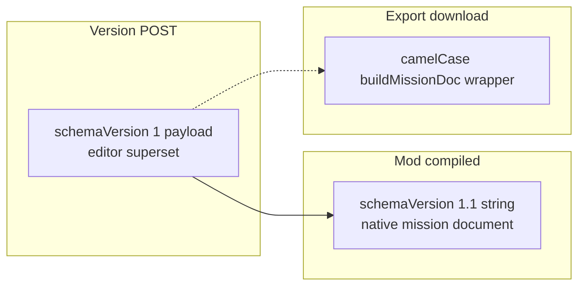

# T-092 — Spawn transform parity + mod mission compile

**Status:** **ready** — blocked on **T-091.2** only (T-091.0 anchor verify **PASS** @ `6d96339`).  
**Ticket:** T-092 · **Registry:** [`.ai/tickets/registry.json`](../../../.ai/tickets/registry.json)  
**Map program:** [`t090_091_map_terrain_program.md`](t090_091_map_terrain_program.md)

---

## Why this ticket exists

The editor **does not** produce what the mod loads today:

| Gap | Evidence |
|-----|----------|
| No mod `slots[]` in compile | [`compile.ts`](../../../apps/website/frontend/src/features/mission-creator/compiler/compile.ts) → `editor.slots` only, `schemaVersion: 1` |
| Slot ids are UUIDs | [`ydoc.ts`](../../../apps/website/frontend/src/features/tactical-map/state/ydoc.ts) `crypto.randomUUID()` |
| Mod expects `blufor:Alpha:SL:0` + `kit:us_sl` | [`bridgehead-at-levie.json`](../../../packages/tbd-schema/golden-missions/bridgehead-at-levie.json), [`TBD_Registry.Resolve`](../../../apps/mod/tbd-framework/Scripts/Game/TBD/Registry/TBD_Registry.c) |
| Mod API path wrong / missing | Mod: `{backendUrl}/api/missions/{id}/compiled` — Go: **`/api/v1/missions/:id/export`** only |
| No optional `y` on slot | [`TBD_MissionSlotStruct.c`](../../../apps/mod/tbd-framework/Scripts/Game/TBD/Backend/TBD_MissionSlotStruct.c) |
| Spawn Y | `GetSurfaceY(x,z)` only [`TBD_SpawnManager.c`](../../../apps/mod/tbd-framework/Scripts/Game/TBD/Gamemode/TBD_SpawnManager.c) L149 |

---

## Three JSON artifacts (do not conflate)



| Artifact | Consumer | Shape |
|----------|----------|-------|
| **Version POST `json_payload`** | Website save/load, event ORBAT derive | `{ schemaVersion: 1, map, orbat[], editor: { slots, … } }` |
| **Mod compiled document** | `TBD_MissionLoader`, profile `$profile:missions/{id}.json` | Golden [`mission.schema.json`](../../../packages/tbd-schema/schema/mission.schema.json) **1.1** |
| **Export / inject wrapper** | Download, admin inject | [`buildMissionDoc`](../../../apps/website/internal/handlers/missions.go) camelCase envelope |

T-092.2 builds **mod compiled document**; T-092 adds **`GET /api/v1/missions/:id/compiled`** (service token) returning that document.

**Mod config fix:** Update [`TBD_MissionLoader.c`](../../../apps/mod/tbd-framework/Scripts/Game/TBD/Backend/TBD_MissionLoader.c) path to **`/api/v1/missions/{id}/compiled`** (and [`backend.example.json`](../../../apps/mod/tbd-framework/Data/backend.example.json) docs).

---

## Coordinate mapping (locked)

| Editor | Mod `slots[]` |
|--------|----------------|
| `position.x` | `x` |
| `position.y` | `z` |
| `position.z` | `y` (optional, schema 1.2) |
| `position.rotation` | `headingDeg` |

---

## Spawn height policy (T-092.1)

```text
spawnY = slot.y if present and finite
       else GetSurfaceY(slot.x, slot.z)
spawnY += CAPSULE_GROUND_OFFSET_M   // measure once in wb_play — not guessed
```

Log: `[TBD][Spawn] slot id Y=… jsonY=… surfaceY=… delta=…`

Warn if `|jsonY - GetSurfaceY| > MAX_Y_DELTA_M` when both present.

**Measure capsule offset on human character spawn**, not only spawn-point prefab.

---

## Slot identity (T-092.2)

| Field | Editor today | Mod / golden |
|-------|--------------|--------------|
| `id` | UUID | `{faction}:{groupCallsign}:{role}:{index}` |
| `kit` | `assetId` ResourceName | `kit:us_sl` alias |
| `orbat` | Array in version payload | **Map** `{ blufor: { groups: [...] } }` |

**T-092.2 must implement:**

1. **`flattenEditorToModDocument(snapshot)`** → full 1.1 document matching golden missions.
2. **Deterministic slot id** from faction + squad callsign + role + slot index (align with [`flatten-orbat-slots.mjs`](../../../packages/tbd-schema/scripts/flatten-orbat-slots.mjs) naming).
3. **`assetId` → `kit:` alias** — registry lookup table or T-068 mapping (document in slice).
4. **`orbat` map builder** from editor factions/squads/slots for `CountOrbatInstances()`.

---

## Schema (T-092.1)

- Add optional `y` (number, meters ASL) to `$defs/slot` in [`mission.schema.json`](../../../packages/tbd-schema/schema/mission.schema.json).
- Bump to **`schemaVersion` "1.2"** when `y` ships (conditional in schema).
- Update [`TBD_MissionSlotStruct.c`](../../../apps/mod/tbd-framework/Scripts/Game/TBD/Backend/TBD_MissionSlotStruct.c) with optional `float y`.

---

## Backend route (T-092.2)

```text
GET /api/v1/missions/:id/compiled
Auth: RequireServiceToken (X-Service-Token)
Response: mod-native mission JSON (1.1/1.2 document body — NOT buildMissionDoc wrapper)
```

Derive from current mission version `json_payload` + mission row meta via new Go helper (mirror golden shape).

Register in [`handlers.go`](../../../apps/website/internal/handlers/handlers.go) on service-token or dedicated game-server group.

Document in [`DEV_RUNBOOK.md`](../../website/DEV_RUNBOOK.md).

---

## Slice ladder

| Slice | Spec | Executor | Delivers | Exit gate |
|-------|------|----------|----------|-----------|
| **T-092.0** | [`t092_0_spawn_contract.md`](t092_0_spawn_contract.md) | cursor-docs | Contract tables + slice specs | Spec files on disk |
| **T-092.1** | [`t092_1_mod_spawn_policy.md`](t092_1_mod_spawn_policy.md) | claude-code | Schema `y`, spawn policy, capsule offset | M1–M4 feet on ground |
| **T-092.2** | [`t092_2_mod_compile_route.md`](t092_2_mod_compile_route.md) | claude-code | Flatten, `/compiled`, mod path | S1–S6 golden round-trip |

---

## Verification gates

- [ ] **S1** Compiled document validates `npm run validate` in `packages/tbd-schema`
- [ ] **S2** Mod loads compiled JSON from profile; spawn points built
- [ ] **S3** `headingDeg` ±5° at 3 anchor slots (screenshot + log)
- [ ] **S4** `GET /api/v1/missions/:id/compiled` returns same shape as profile cache
- [ ] **S5** Golden missions still validate after schema 1.2 optional `y`

---

## Unblocks

- **T-071** — ORBAT authoring (queued until T-092.2)
- **T-068 Phase 2** — loadout on human player @ slot (after T-071.2 + T-068.13)

---

## Related

- [`t068_virtual_arsenal_program.md`](t068_virtual_arsenal_program.md)
- [`t071_orbat_manager_program.md`](t071_orbat_manager_program.md)
- [`t068_13_mod_slotting_screen_poc.md`](t068_13_mod_slotting_screen_poc.md) — production LOBBY picker after T-092.2
