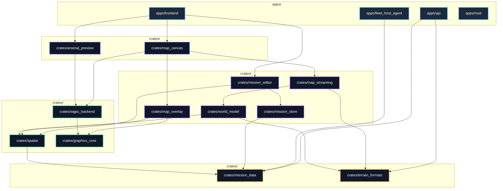

**Status:** archived — see [the restructure program](/documentation/archive/restructure/README.md)

# TBD Reforger: Monorepo Architecture Blueprint
*(Modeled on the Engineering Standards of Zed & Rerun)*

> [!NOTE]
> **Status:** Draft Architectural Specification  
> **Core Objective:** Transition `TBD-Reforger` from monolithic, feature-flagged modules into an industry-grade, multi-crate workspace modeling the software patterns of projects like **Zed** (`zed-industries/zed`) and **Rerun** (`rerun-io/rerun`).

---

## 1. Architectural Philosophy: The Zed & Rerun Model

High-performance Rust applications like Zed (editor/GUI/collaboration) and Rerun (spatial/computer-vision/rendering) maintain dozens of crates by strictly adhering to four structural principles:

1. **The Crate as a Hard Firewall:**  
   If code shouldn't touch GPU types, it physically cannot live in a crate that has `wgpu` in its `Cargo.toml`.
2. **Thin Public Surface with a `prelude`:**  
   A crate’s `lib.rs` is tiny. It exposes only what callers need and provides a `pub mod prelude` for idiomatic ergonomic imports.
3. **Strongly-Typed Newtype Domain IDs:**  
   No naked `u32`, `usize`, or `String` primitives across crate boundaries. Every entity, waypoint, lane, or chunk has a zero-cost typed identifier (`EntityId(u64)`).
4. **Isolated Error Hierarchies:**  
   Every crate defines its own explicit, typed `Error` enum using `thiserror`. Crates never bubble untyped `anyhow` or foreign error types across library boundaries.

---

## 2. Directory Layout & Sanitation

### 2.1 Canonical Suffix Sanitization
Eliminate transitional `_v2` suffixes in favor of clean, canonical naming:

| Current Path | Target Path | Responsibility |
| :--- | :--- | :--- |
| `assets_v2/` | **`assets/`** | Heightmap DEMs, terrain rasters, SVG glyphs. |
| `contracts_v2/` | **`contracts/`** | Authoritative JSON Schemas, ballistics catalogs, rules. |
| `documentation_v2/` | **`documentation/`** | Living architecture specs, runbooks, standards. |
| `tools_v2/` | **`tools/`** | Developer CLI (`xtask`), verification cores, ticket engine. |
| `apps/website/api_v2/` | **`apps/api/`** | Backend Postgres service. |

### 2.2 Target & Build Artifact Quarantine
Root-level build artifacts (`target-container/`, `target-container-api-v2/`, `target-dev-api/`, `dist-gate-frontend/`) must be moved inside `target/` and isolated by `.gitignore`:
```gitignore
/target/
/target-*/
/dist-*/
```

### 2.3 Documentation Archiving
Historical refactor accounting files (`refactor_*.tsv`, `refactor_*.md`) move to **`documentation/archive/refactor_v2/`** to keep the active documentation clean and lightweight.

---

## 3. Flat Application Layer

Eliminate the misleading `apps/website/` nesting. Applications are standalone runnables; shared engines live in `crates/`:

```text
TBD-Reforger/
├── apps/
│   ├── api/              # Axum + sqlx REST & SSE backend service
│   ├── fleet_host_agent/ # Dedicated game server host management daemon
│   ├── frontend/         # Leptos 0.8 Mission Creator SPA (WASM)
│   ├── mod/              # Arma Reforger Enfusion mod suite
│   └── ticketboard/      # egui/eframe desktop issue viewer
```

---

## 4. The 4-Tier Crate Topology (12 Crates)

The 8-tier feature flag matrix in `map-engine` is completely eliminated. The workspace divides into **12 specialized crates** across 4 strictly ordered layers.



---

## 5. Crate Specifications & Code Standards

Every crate follows the standard Zed/Rerun internal anatomy:
```text
crates/<crate_name>/
├── Cargo.toml
├── README.md           # Conforms to documentation/standards/readme_standard.md
├── src/
│   ├── lib.rs          # Thin entry point; re-exports prelude and modules
│   ├── prelude.rs      # Common traits, types, and newtype IDs for callers
│   ├── error.rs        # Explicit thiserror enumeration
│   └── <modules>/      # Under 500 lines per file
└── tests/              # Under 1,000 lines per integration test file
```

---

### Tier 0: Pure Data & Formats

#### 1. `crates/mission_data` (Modeled on `re_types` / `zed::language`)
* **Extracted from:** `apps/website/map-engine/src/data/scenario/`
* **Purpose:** The canonical Rust representations of the mission format: entities, waypoints, loadouts, objectives, ORBAT hierarchy, and kit aliases.
* **Standards:**
  * **Zero IO, Zero Graphics:** Pure computation.
  * **Validation Invariants:** Entity IDs must use a typed newtype:
    ```rust
    #[derive(Debug, Clone, Copy, PartialEq, Eq, Hash, Serialize, Deserialize)]
    pub struct EntityId(pub u64);
    ```
  * **Dependencies:** `serde`, `serde_json`, `thiserror`, `libm`.
  * **Compile Speed:** $<0.5$ s on native and wasm32.

#### 2. `crates/terrain_formats`
* **Extracted from:** `apps/website/map-engine/src/io/`
* **Purpose:** On-disk binary serialization: `rkyv` zero-copy archives, heightmap DEM density grids, chunk headers, and POD layouts.
* **Standards:**
  * Byte-aligned structures with `bytemuck::Pod` and `rkyv::Archive`.
  * All formats strictly little-endian.
  * **Dependencies:** `rkyv`, `bytemuck`, `serde`.

---

### Tier 1: Math & Graphics Primitives

#### 3. `crates/spatial` (Modeled on `re_renderer::spatial`)
* **Extracted from:** `apps/website/map-engine/src/spatial/`
* **Purpose:** 3D BVH (Bounding Volume Hierarchy) spatial indices, ray-traced terrain line-of-sight (LOS), point picking, viewsheds, and coordinate conversions.
* **Standards:**
  * **Zero GPU Types:** Must never import `wgpu` or `web-sys`.
  * Deterministic floating-point arithmetic using `libm` across native and wasm32.
  * **Dependencies:** `crates/mission_data`, `earcutr`, `libm`, `bytemuck`.

#### 4. `crates/graphics_core` (Modeled on `gpui::geometry`)
* **Extracted from:** `apps/website/graphics-engine/src/draw/`, `layout/`, `text/`
* **Purpose:** CPU-side graphics layout: polygon triangulation, ASCII font atlas rasterization, vertex bit-packing, instance layouts, and visibility culling oracles.
* **Standards:**
  * Headless testability: 100% covered by native unit tests without spawning a GPU adapter.
  * **Dependencies:** `bytemuck`, `earcutr`.

#### 5. `crates/wgpu_backend` (Modeled on `re_renderer`)
* **Extracted from:** `apps/website/graphics-engine/src/device/`, `pipeline/`, `shaders/`, `loop/`, `frame/`
* **Purpose:** The hardware abstraction layer: compiles WGSL shaders, manages per-lane GPU buffer pools, and drives the `requestAnimationFrame` render loop.
* **Standards:**
  * Encapsulates all `wgpu` pipelines and bind groups. Callers interact with typed `DrawBatch` commands, never raw `wgpu::RenderPass`.
  * **Dependencies:** `crates/graphics_core`, `bytemuck`, `wgpu` (wasm32), `web-sys` (wasm32).

---

### Tier 2: World & Mission State Systems

#### 6. `crates/world_model`
* **Extracted from:** `apps/website/map-engine/src/world/`
* **Purpose:** Ground composition (DEM relief, satellite tiles, roads, water bodies), building 3D floorplans, vegetation, and static world structures.
* **Dependencies:** `crates/terrain_formats`, `crates/spatial`.

#### 7. `crates/map_streaming`
* **Extracted from:** `apps/website/map-engine/src/streaming/`
* **Purpose:** Asynchronous terrain chunk streaming: HTTP chunk fetches, memory residency budgets, tile unzipping (`flate2`), and LOD eviction caches.
* **Dependencies:** `crates/world_model`, `crates/terrain_formats`, `flate2`, `gloo-net` (wasm32).

#### 8. `crates/map_overlay` (Modeled on CAD overlay pipelines)
* **Extracted from:** `apps/website/map-engine/src/overlay/`
* **Purpose:** 48 render lanes, MIL-STD-2525 NATO tactical symbology, movement arrows, zone boundary strokes, unit badges.
* **Dependencies:** `crates/graphics_core`, `crates/spatial`.

#### 9. `crates/mission_store` (Modeled on `zed::collab`)
* **Extracted from:** `apps/website/map-engine/src/data/store/`
* **Purpose:** Real-time multi-user collaborative editing document backed by `yrs` (Yjs CRDT) with awareness, undo/redo history, and transactional commits.
* **Dependencies:** `crates/mission_data`, `yrs`.

#### 10. `crates/mission_editor` (Modeled on `zed::editor`)
* **Extracted from:** `apps/website/map-engine/src/editing/`, `camera/`
* **Purpose:** Headless mission editing state machine: tool handlers (ruler, LOS tool, entity placement), undo/redo stacks, camera projections.
* **Standards:**
  * Pure logic: No DOM or Leptos dependencies. Operates strictly on abstract pointer coordinates and keyboard events.
  * **Dependencies:** `crates/mission_data`, `crates/mission_store`, `crates/spatial`, `crates/world_model`.

---

### Tier 3: Canvases & Presentation

#### 11. `crates/map_canvas`
* **Extracted from:** `apps/website/map-engine/src/frame/`, `diagnostics/`
* **Purpose:** The master 2D/3D interactive map component. Assembles streaming chunks, overlay lanes, and the editor state into WebGPU render passes.
* **Dependencies:** `crates/wgpu_backend`, `crates/map_streaming`, `crates/map_overlay`, `crates/mission_editor`.

#### 12. `crates/arsenal_preview`
* **Extracted from:** `apps/website/map-engine/src/doll/`, `shaders/`
* **Purpose:** 3D character loadout/mannequin preview with orbit camera and dedicated lighting WGSL pipeline.
* **Dependencies:** `crates/wgpu_backend`, `crates/mission_data`.

---

## 6. Root `Cargo.toml` Target Specification

```toml
[workspace]
resolver = "3"
members = [
    # Applications
    "apps/api",
    "apps/fleet_host_agent",
    "apps/frontend",
    "apps/ticketboard",

    # Tier 0: Pure Data & Formats
    "crates/mission_data",
    "crates/terrain_formats",

    # Tier 1: Math & Graphics Primitives
    "crates/spatial",
    "crates/graphics_core",
    "crates/wgpu_backend",

    # Tier 2: World & Mission Systems
    "crates/world_model",
    "crates/map_streaming",
    "crates/map_overlay",
    "crates/mission_store",
    "crates/mission_editor",

    # Tier 3: Canvases & Presentation
    "crates/map_canvas",
    "crates/arsenal_preview",

    # Tooling Crates
    "tools/verification-core",
    "tools/ticket-engine",
    "tools/xtask",
    "tools/developer-tools",
]
```

---

## 7. Migration Sequence

Execute the restructuring in 5 clean, verified stages:

1. **Stage 1 (Filesystem Hygiene):** Rename `_v2` directories to canonical names, move root `target-*` into `target/`, and archive dead refactor manifests into `documentation/archive/refactor_v2/`.
2. **Stage 2 (App Flattening):** Move `apps/website/api_v2` $\to$ `apps/api` and `apps/website/frontend` $\to$ `apps/frontend`. Delete empty `apps/website/` wrapper.
3. **Stage 3 (Tier 0 Extraction):** Carve `crates/mission_data` and `crates/terrain_formats`. Connect `apps/api` directly to `mission_data`, completely bypassing graphics and map code.
4. **Stage 4 (Tier 1 Math & GPU Split):** Carve `crates/spatial` and split graphics into `crates/graphics_core` (CPU) and `crates/wgpu_backend` (GPU).
5. **Stage 5 (Tier 2 & 3 Systems & Canvases):** Extract the remaining systems (`world_model`, `map_streaming`, `map_overlay`, `mission_store`, `mission_editor`, `map_canvas`, `arsenal_preview`). Delete old monolithic `map-engine` and `graphics-engine` directories.
