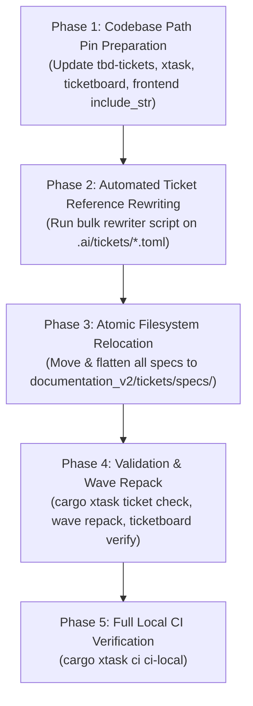

# Technical Specification & Phased Migration Architecture Plan: `docs/` -> `documentation_v2/`

> **Status (2026-09-21):** blueprint, not yet executed. `documentation_v2/` is in the repository beside `docs/`; `docs/` remains authoritative and is what every code pin and ticket citation points at. Section 0 records the starting state this plan now has to execute from.

This document defines the technical specification, code dependency audit, and zero-downtime execution roadmap for migrating the monorepo from the legacy `docs/` directory to the canonical `documentation_v2/` architecture, featuring a **flat, unified `tickets/specs/` directory with zero subfolders**.

---

## 0. Starting State This Plan Executes From (measured 2026-09-21)

| Fact | Value |
|:---|:---|
| `documentation_v2/` | **In the repository** (commit `776c245da`): 148 files — 103 Markdown, 24 PNG, 21 HTML. The hub documents under `website/`, `mod/`, `tools/`, `runbooks/`, `design_system/` were derived from `docs/` as it stood on **2026-09-16**. `tickets/` holds only its three READMEs; no spec or plan has moved. |
| `docs/` | **Still authoritative**: 824 files (652 Markdown, 102 PNG, 64 HTML, 2 YAML, 1 TSV, 3 other). Every code pin in §4 and every ticket citation in §3 resolves here. |
| Drift since the draft | **60 files under `docs/` changed** between 2026-09-16 and 2026-09-21 (listed in `ANALYSIS_AND_INVENTORY.md` §6), including the rewrite of every live document from `packages/` to `contracts_v2/` + `assets_v2/`, and runbook content added to `docs/website/HOME_SERVER.md`, `DEV_RUNBOOK.md` and `docs/mod/STAGING-SERVER.md`. Hub documents drafted from those sources are behind them. |
| Gates | No gate reads `documentation_v2/`. `verify-doc-layout` walks `apps/`, `contracts_v2/`, `assets_v2/` for forbidden `docs/` subtrees and its message says "use docs/website/ instead"; `ticket check` validates `spec`/`plan` paths on disk; no GitHub workflow filters on `docs/`. |
| Generated queues | `cargo xtask ticket sync` (`tools_v2/ticket-engine/src/sync/runner.rs`) still writes `docs/TICKET_*.md` and `docs/MILESTONES.md`; CI does not run it, but the canonical command list does name it. |

Consequences for the phases below: **Phase 3 is a merge into the existing `documentation_v2/` tree, not a `git mv docs documentation_v2`**, and it is preceded by a refresh of the hub documents that drifted (Phase 2b).

---

## 1. Architectural Strategy & Directory Structure

Per **Core Law 4 (Zero Context Needed)** and the flat specification directive:
- The root directory name strictly transitions from `docs/` to `documentation_v2/` — the `_v2` suffix matches `contracts_v2/`, `assets_v2/` and `tools_v2/`, the other trees that replaced a legacy layout; abbreviations remain forbidden.
- All ticket specifications and implementation plans are consolidated under a dedicated `tickets/` hub:
  - `documentation_v2/tickets/specs/` (**Single flat directory, zero subfolders**): All 270+ specification files reside directly in the root of `specs/`.
  - `documentation_v2/tickets/plans/` (**Single flat directory, zero subfolders**): All 206 `t-*_plan.md` files plus `TEMPLATE.md` reside directly in the root of `plans/`.
- Visual mockups and macOS blueprints are permanently colocated within their respective frontend surface directories under `documentation_v2/website/frontend/` with standardized legacy visual reference disclaimers.
- Machine-generated markdown queues in the root of `docs/` (`TICKET_REGISTRY.md`, etc.) are retired in favor of the live in-memory `apps/ticketboard` desktop viewer.

```text
LEGACY PATH (docs/)                             CANONICAL TARGET PATH (documentation_v2/)
docs/plans/t-*_plan.md                          -> documentation_v2/tickets/plans/t-*_plan.md
docs/specs/Mission_Creator_Architecture/*.md    -> documentation_v2/tickets/specs/*.md  (FLATTENED)
docs/specs/existing/*.md                        -> documentation_v2/tickets/specs/*.md  (FLATTENED)
docs/specs/ideas/*.md                           -> documentation_v2/tickets/specs/*.md  (FLATTENED)
docs/specs/audit_2026_09/*.md                   -> documentation_v2/tickets/specs/*.md  (FLATTENED)
docs/specs/factory/*.md                         -> documentation_v2/tickets/specs/*.md  (FLATTENED)
docs/specs/website_reorg/*.md                   -> documentation_v2/tickets/specs/*.md  (FLATTENED)
docs/platform/t*.md                             -> documentation_v2/tickets/specs/t*.md (FLATTENED)
docs/specs/macOS_Blueprints/<name>/             -> documentation_v2/website/frontend/<hub>/visual_reference/
docs/mod/                                       -> documentation_v2/mod/
docs/website/                                   -> documentation_v2/website/
docs/TICKET_*.md                                -> (Retired — see apps/ticketboard)
```

---

## 2. Rationale & Analysis of the Flat `specs/` Architecture

### 2.1 The Problem with Legacy Subfolders
The legacy `docs/specs/` structure suffered from fragmented, arbitrary categorization:
- `factory/` contained only 2 files.
- `existing/` was a confusing temporal label (everything in the codebase is "existing" once built).
- `ideas/` held 30 active specifications that were no longer mere ideas but implemented requirements.
- `audit_2026_09/` was an arbitrary snapshot date folder.
- `platform/` held 42 ticket specs mixed with operational runbooks.
- `Mission_Creator_Architecture/` held 185 files with nested `eden/` and `reference/` folders.

This fragmentation created high cognitive overhead: developers and AI agents could never predict whether a spec like `t052_undo_shortcuts.md` lived under `Mission_Creator_Architecture/`, `existing/`, or `ideas/`.

### 2.2 Forensic Collision Audit: 100% Collision-Free
A comprehensive collision audit across all 317 specification files in `docs/specs/` and `docs/platform/` revealed that **there is not a single filename collision among any specification files**.
- The only shared name was `README.md`, which is replaced by the master `documentation_v2/tickets/specs/README.md`.
- All `t<id>_*.md` files across all legacy subfolders have unique, distinct names.

Therefore, flattening into `documentation_v2/tickets/specs/` is **100% mathematically safe, deterministic, and unambiguous**.

---

## 3. Ticket Citation Rewriting Mechanics (`.ai/tickets/*.toml`)

A key operator consideration: **"What's required? Editing the tickets? Well, there are other tickets. Not all of them have specs. But quite a few do."**

### 3.1 Exact Ticket Corpus Linkage Census
Across the 1,459 tickets in `.ai/tickets/` (recounted 2026-09-21; the 552 / 206 linkage figures below are unchanged):
- **552 tickets** declare a `spec = "..."` attribute:
  - 345 point to `docs/specs/...`
  - 193 point to `docs/platform/t*.md`
  - 7 point to `docs/mod/...`
  - 2 point to `docs/website/...`
  - 5 point to `.ai/artifacts/...`
- **206 tickets** declare a `plan = "..."` attribute (all pointing to `docs/plans/t-*_plan.md`).
- **907 tickets** have no `spec` attribute (parent epic tickets, conceptual ideas, or chore slices).

Of the 193 `docs/platform/` citations, **14 are not `t*.md` ticket specs** and must not be flattened into `tickets/specs/`: `tbd_north_star_backlog.md` (12 tickets) and `PLATFORM_FACTORY.md` (1) are platform documents and follow their files to `documentation_v2/platform/`; `audit/t122_codebase_audit_hotfix.md` (1) is a ticket spec in a subfolder and flattens like the rest.

### 3.2 Automated Ticket Rewriter Script
Because every spec filename is unique, updating all tickets is performed mechanically in milliseconds via a deterministic Python migration script:

```python
import os, re

TICKETS_DIR = ".ai/tickets"

for fname in os.listdir(TICKETS_DIR):
    if not fname.endswith(".toml"):
        continue
    path = os.path.join(TICKETS_DIR, fname)
    with open(path, "r", encoding="utf-8") as f:
        content = f.read()

    # Rewrite spec = "docs/specs/.../foo.md" -> spec = "documentation_v2/tickets/specs/foo.md"
    content = re.sub(
        r'spec\s*=\s*"docs/specs/(?:.+/)?([^/"]+\.md)"',
        r'spec = "documentation_v2/tickets/specs/\1"',
        content
    )
    # docs/platform/: only ticket specs (t<digits>…) flatten into specs/; every other platform
    # document keeps its name under documentation_v2/platform/ (tbd_north_star_backlog.md,
    # PLATFORM_FACTORY.md — 13 tickets between them).
    content = re.sub(
        r'spec\s*=\s*"docs/platform/(?:.+/)?(t\d[^/"]*\.md)"',
        r'spec = "documentation_v2/tickets/specs/\1"',
        content
    )
    content = re.sub(
        r'spec\s*=\s*"docs/platform/((?:.+/)?[^/"]+\.md)"',
        r'spec = "documentation_v2/platform/\1"',
        content
    )
    # Rewrite plan = "docs/plans/t-xxx_plan.md" -> plan = "documentation_v2/tickets/plans/t-xxx_plan.md"
    content = re.sub(
        r'plan\s*=\s*"docs/plans/([^/"]+\.md)"',
        r'plan = "documentation_v2/tickets/plans/\1"',
        content
    )
    # Rewrite mod specs
    content = content.replace('spec = "docs/mod/', 'spec = "documentation_v2/mod/')

    # Repair broken T-068.10.5 reference
    if fname == "T-068.10.5.toml":
        content = content.replace(
            'spec = "documentation_v2/tickets/specs/t068_10_5_weapon_variants.md"',
            'spec = ".ai/artifacts/t068_10_5_weapon_families.md"'
        )

    with open(path, "w", encoding="utf-8") as f:
        f.write(content)
```

Immediately following this pass, `cargo xtask ticket check` executes. Because `xtask` checks `root.join(&spec).is_file()`, if even a single ticket link were broken, `xtask ticket check` would report it immediately.

---

## 4. Codebase Hardcoded Path Pins Audit (live tree, 2026-09-21)

Every `docs/` literal reachable at runtime, found with `grep -rn '"docs/' --include=*.rs tools_v2 apps` (test files excluded). The crates this section used to name (`crates/tbd-tickets`, `xtask/src/check.rs`, `tools/tbd-tools`) no longer exist; the pins moved with them.

### 4.1 `tools_v2/ticket-engine/` — the ticket domain
| Pin | Today | Target |
|:---|:---|:---|
| `src/ops/readiness.rs:9` `default_plan_path` | `docs/plans/{id}_plan.md` | `documentation_v2/tickets/plans/{id}_plan.md` |
| `src/validation/readiness.rs:33` (hint text) | `docs/plans/TEMPLATE.md` | `documentation_v2/tickets/plans/TEMPLATE.md` |
| `src/validation/references.rs:165-169` `scan_legacy_ids` | walks `docs/specs` | walks `documentation_v2/tickets/specs` |
| `src/validation/references.rs:82-102` allow-listed references | `docs/TICKET_*`, `docs/platform/SHIPPED_HISTORY.md`, `t911…`, `t912…`, `GROK_WAVE_130_HANDOFF.md`, `WAVE209_GROK_KICKOFF.md` | drop the `docs/TICKET_` entry with the retired queues; the rest follow their files (`documentation_v2/platform/…`, `documentation_v2/tickets/specs/…`) |
| `src/validation/constants.rs:24-25` excluded trees | `docs/specs/macOS_Blueprints/`, `docs/specs/Mission_Creator_Mock_Up/` | the `visual_reference/` directories under `documentation_v2/website/frontend/` |
| `src/validation/runner.rs:124` roadmap | `docs/specs/Mission_Creator_Architecture/ROADMAP.md` | `documentation_v2/tickets/specs/ROADMAP.md` |
| `src/repository.rs:21` `gap_analysis_path` | `docs/specs/Mission_Creator_Architecture/eden/gap_analysis.md` | `documentation_v2/tickets/specs/gap_analysis.md` |
| `src/sync/runner.rs:18-38` `ticket sync` outputs | `docs/TICKET_REGISTRY.md`, `TICKET_LEAD.md`, `TICKET_DEV_QUEUE.md`, `TICKET_BRAINSTORM.md`, `TICKET_MOD_QUEUE.md`, `MILESTONES.md` | **retired** with the queues: remove the command (and its `CLAUDE.md` line) or make it refuse with the pointer to `apps/ticketboard` |
| `src/cli/brief.rs:70-148` printed `RESUME:` / `SPEC:` lines | `docs/specs/…`, `docs/platform/…` | `documentation_v2/tickets/specs/…`, `documentation_v2/platform/…` |

### 4.2 `tools_v2/xtask/`
| Pin | Today | Target |
|:---|:---|:---|
| `src/verifications/schemas/checks/read_json.rs:12` `spec_dir` | `docs/specs/Mission_Creator_Architecture` | `documentation_v2/tickets/specs` |
| `src/commands/ci/task_runner.rs` `DOC_LAYOUT_MSG` + `task_definitions.rs` help | "use docs/website/ instead" | "use documentation_v2/website/ instead" |

### 4.3 `tools_v2/developer-tools/`
| Pin | Today | Target |
|:---|:---|:---|
| `src/enfusion_tooling/cli.rs:58` `enf citations --docs` default | `docs/mod` | `documentation_v2/mod` |
| `src/enfusion_tooling/cli.rs:97` `enf capability --verdicts` default | `docs/mod/capability_verdicts.tsv` | `documentation_v2/mod/tbd_framework/capability_verdicts.tsv` |
| `src/browser_testing/diagnostics/check_fonts.rs:299` (message) | `docs/website/EDITOR_GATE_RUNBOOK.md` | `documentation_v2/website/EDITOR_GATE_RUNBOOK.md` |

### 4.4 `apps/ticketboard/`
| Pin | Today | Target |
|:---|:---|:---|
| `src/watch.rs:125` `ROADMAP_REL` | `docs/specs/Mission_Creator_Architecture/ROADMAP.md` | `documentation_v2/tickets/specs/ROADMAP.md` |

### 4.5 Retired pins
The frontend `include_str!` of `gap_analysis.md` this section used to list no longer exists in `apps/website/frontend/src/`; nothing in the API or frontend crates reads `docs/` at build time.

### 4.6 Rules and standards that name `docs/`
`docs/platform/DOCUMENTATION_STANDARDS.md` (§8.2 paths), `docs/platform/WHERE_DOES_X_GO.md` (Spec / doc row), `docs/website/AGENT_COMMIT_CHECKLIST.md`, and root `CLAUDE.md` all say specs live under `docs/**`; they move in Phase 3 and are rewritten in the same commit.

---

## 5. Five-Phase Atomic Cutover Execution Plan



1. **Phase 1: Codebase Path Pin Preparation**: Update every pin in §4 — `tools_v2/ticket-engine`, `tools_v2/xtask`, `tools_v2/developer-tools`, `apps/ticketboard` — and retire `ticket sync` (its six generated queues are replaced by `apps/ticketboard`). `cargo test -p ticket-engine -p xtask -p developer-tools` must pass against fixtures that use the new paths.
2. **Phase 2: Automated Ticket Reference Rewriting**: Execute the rewriter in §3.2 across `.ai/tickets/*.toml`, then `cargo xtask ticket check`: it verifies every `spec`/`plan` path on disk, so a stranded citation fails here, before any file moves.
   - **Phase 2b: Refresh the drifted hub documents.** The hub documents already in `documentation_v2/` were derived from `docs/` on 2026-09-16. For each source in `ANALYSIS_AND_INVENTORY.md` §6, diff `git log --since=2026-09-16 -p -- <source>` against its `documentation_v2/` counterpart and carry the change over. Known cases: the four `runbooks/*.md` (deploy preflight, exclude set, migration-checksum repair, dev-login), every hub that names `packages/` (now `contracts_v2/` or `assets_v2/`), and `website/` pages whose surface specs changed.
3. **Phase 3: Atomic Filesystem Merge** (into the tree that already exists):
   - Move `docs/plans/*` into `documentation_v2/tickets/plans/`.
   - Move every `.md` from the legacy spec subfolders and every `docs/platform/t*.md` (including `audit/t122_…`) directly into `documentation_v2/tickets/specs/` (flattened; the collision audit in §2.2 still holds — re-run it first, since `docs/` gained files since).
   - Move the remaining `docs/platform/*` into `documentation_v2/platform/` (the hub the README atlas lists).
   - Move `docs/mod/` and `docs/website/` content over their `documentation_v2/mod/` and `documentation_v2/website/` counterparts, keeping the Phase 2b refresh.
   - Relocate `docs/specs/macOS_Blueprints/` into `documentation_v2/website/frontend/…/visual_reference/`.
   - Delete the retired queues (`docs/TICKET_*.md`, `docs/MILESTONES.md`) and, last, the emptied `docs/`.
   - Rewrite the rules in §4.6 in the same commit.
4. **Phase 4: Validation & Wave Repack**:
   - `cargo xtask ticket check` (zero missing specs/plans on disk), `cargo xtask wave repack` (`wave.lock` hashes against the new paths), open `apps/ticketboard` and confirm the spec reader resolves.
   - `cargo xtask ci verify-doc-layout` — and extend its walk to `documentation_v2/` if a `docs/` subtree must stay forbidden there too.
5. **Phase 5: Full Local CI Verification**:
   - `cargo xtask ci ci-local` and `cargo xtask mk ci-local-leptos`.
   - One commit to `main` for Phase 3, its rule rewrites and its pin updates together, so no revision of the tree has code pointing at a directory that is not there.
