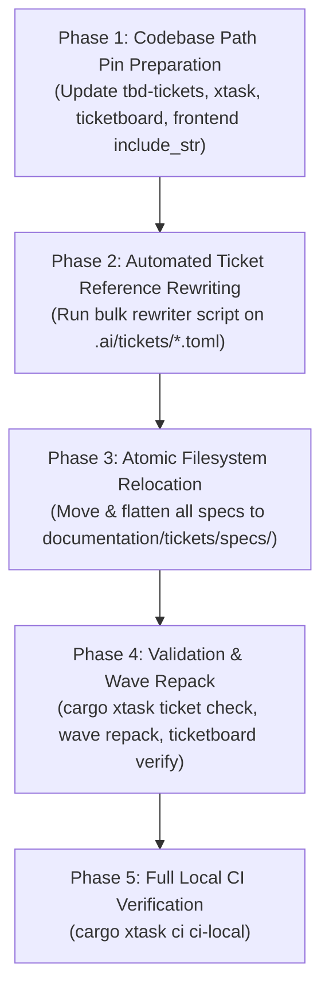

# Technical Specification & Phased Migration Architecture Plan: `docs/` -> `documentation/`

This document defines the technical specification, code dependency audit, and zero-downtime execution roadmap for migrating the monorepo from the legacy `docs/` directory to the canonical `documentation/` architecture, featuring a **flat, unified `tickets/specs/` directory with zero subfolders**.

---

## 1. Architectural Strategy & Directory Structure

Per **Core Law 4 (Zero Context Needed)** and the flat specification directive:
- The root directory name strictly transitions from `docs/` to `documentation/` (abbreviations forbidden).
- All ticket specifications and implementation plans are consolidated under a dedicated `tickets/` hub:
  - `documentation/tickets/specs/` (**Single flat directory, zero subfolders**): All 270+ specification files reside directly in the root of `specs/`.
  - `documentation/tickets/plans/` (**Single flat directory, zero subfolders**): All 206 `t-*_plan.md` files plus `TEMPLATE.md` reside directly in the root of `plans/`.
- Visual mockups and macOS blueprints are permanently colocated within their respective frontend surface directories under `documentation/website/frontend/` with standardized legacy visual reference disclaimers.
- Machine-generated markdown queues in the root of `docs/` (`TICKET_REGISTRY.md`, etc.) are retired in favor of the live in-memory `apps/ticketboard` desktop viewer.

```text
LEGACY PATH (docs/)                             CANONICAL TARGET PATH (documentation/)
docs/plans/t-*_plan.md                          -> documentation/tickets/plans/t-*_plan.md
docs/specs/Mission_Creator_Architecture/*.md    -> documentation/tickets/specs/*.md  (FLATTENED)
docs/specs/existing/*.md                        -> documentation/tickets/specs/*.md  (FLATTENED)
docs/specs/ideas/*.md                           -> documentation/tickets/specs/*.md  (FLATTENED)
docs/specs/audit_2026_09/*.md                   -> documentation/tickets/specs/*.md  (FLATTENED)
docs/specs/factory/*.md                         -> documentation/tickets/specs/*.md  (FLATTENED)
docs/specs/website_reorg/*.md                   -> documentation/tickets/specs/*.md  (FLATTENED)
docs/platform/t*.md                             -> documentation/tickets/specs/t*.md (FLATTENED)
docs/specs/macOS_Blueprints/<name>/             -> documentation/website/frontend/<hub>/visual_reference/
docs/mod/                                       -> documentation/mod/
docs/website/                                   -> documentation/website/
docs/TICKET_*.md                                -> (Retired — see apps/ticketboard)
```

---

## 2. Rationale & Analysis of the Flat `specs/` Architecture

### 2.1 The Problem with Legacy Subfolders
The legacy `docs/specs/` structure suffered from fragmented, arbitrary categorization:
- `factory/` contained only 2 files.
- `existing/` was a confusing temporal label (everything in the codebase is "existing" once built).
- `ideas/` held 30 active specifications that were no longer mere ideas but implemented requirements.
- `audit_2026_09/` was an arbitrary snapshot date folder.
- `platform/` held 42 ticket specs mixed with operational runbooks.
- `Mission_Creator_Architecture/` held 185 files with nested `eden/` and `reference/` folders.

This fragmentation created high cognitive overhead: developers and AI agents could never predict whether a spec like `t052_undo_shortcuts.md` lived under `Mission_Creator_Architecture/`, `existing/`, or `ideas/`.

### 2.2 Forensic Collision Audit: 100% Collision-Free
A comprehensive collision audit across all 317 specification files in `docs/specs/` and `docs/platform/` revealed that **there is not a single filename collision among any specification files**.
- The only shared name was `README.md`, which is replaced by the master `documentation/tickets/specs/README.md`.
- All `t<id>_*.md` files across all legacy subfolders have unique, distinct names.

Therefore, flattening into `documentation/tickets/specs/` is **100% mathematically safe, deterministic, and unambiguous**.

---

## 3. Ticket Citation Rewriting Mechanics (`.ai/tickets/*.toml`)

A key operator consideration: **"What's required? Editing the tickets? Well, there are other tickets. Not all of them have specs. But quite a few do."**

### 3.1 Exact Ticket Corpus Linkage Census
Across the 1,173 tickets in `.ai/tickets/`:
- **552 tickets** declare a `spec = "..."` attribute:
  - 345 point to `docs/specs/...`
  - 193 point to `docs/platform/t*.md`
  - 7 point to `docs/mod/...`
  - 2 point to `docs/website/...`
  - 5 point to `.ai/artifacts/...`
- **206 tickets** declare a `plan = "..."` attribute (all pointing to `docs/plans/t-*_plan.md`).
- **415 tickets** have no `spec` attribute (parent epic tickets, conceptual ideas, or chore slices).

### 3.2 Automated Ticket Rewriter Script
Because every spec filename is unique, updating all tickets is performed mechanically in milliseconds via a deterministic Python migration script:

```python
import os, re

TICKETS_DIR = ".ai/tickets"

for fname in os.listdir(TICKETS_DIR):
    if not fname.endswith(".toml"):
        continue
    path = os.path.join(TICKETS_DIR, fname)
    with open(path, "r", encoding="utf-8") as f:
        content = f.read()

    # Rewrite spec = "docs/specs/.../foo.md" -> spec = "documentation/tickets/specs/foo.md"
    content = re.sub(
        r'spec\s*=\s*"docs/(?:specs|platform)/(?:.+/)?([^/"]+\.md)"',
        r'spec = "documentation/tickets/specs/\1"',
        content
    )
    # Rewrite plan = "docs/plans/t-xxx_plan.md" -> plan = "documentation/tickets/plans/t-xxx_plan.md"
    content = re.sub(
        r'plan\s*=\s*"docs/plans/([^/"]+\.md)"',
        r'plan = "documentation/tickets/plans/\1"',
        content
    )
    # Rewrite mod specs
    content = content.replace('spec = "docs/mod/', 'spec = "documentation/mod/')

    # Repair broken T-068.10.5 reference
    if fname == "T-068.10.5.toml":
        content = content.replace(
            'spec = "documentation/tickets/specs/t068_10_5_weapon_variants.md"',
            'spec = ".ai/artifacts/t068_10_5_weapon_families.md"'
        )

    with open(path, "w", encoding="utf-8") as f:
        f.write(content)
```

Immediately following this pass, `cargo xtask ticket check` executes. Because `xtask` checks `root.join(&spec).is_file()`, if even a single ticket link were broken, `xtask ticket check` would report it immediately.

---

## 4. Codebase Hardcoded Path Pins Audit (Updated for Flat Specs)

The flat `tickets/specs/` hierarchy dramatically simplifies hardcoded paths across the monorepo:

### 4.1 `crates/tbd-tickets/src/ops.rs`
- **Line 690 (`default_plan_path`)**:
  ```rust
  format!("documentation/tickets/plans/{}_plan.md", id.to_lowercase().replace('.', "_"))
  ```
- **Line 767**:
  ```rust
  "copy documentation/tickets/plans/TEMPLATE.md to {resolved_plan} and fill the four sections"
  ```
- **Lines 1619–1940**: Update test fixtures to use `documentation/tickets/plans` and `documentation/tickets/specs/spec.md`.

### 4.2 `xtask/src/check.rs`
- **Line 898 (`scan_legacy_ids`)**:
  ```rust
  // CURRENT: root.join("docs/specs")
  // TARGET:  root.join("documentation/tickets/specs")
  ```
- **Line 1063 (`roadmap_sync`)**:
  ```rust
  // CURRENT: root.join("docs/specs/Mission_Creator_Architecture/ROADMAP.md")
  // TARGET:  root.join("documentation/tickets/specs/ROADMAP.md")
  ```

### 4.3 `xtask/src/root.rs`
- **Line 43 (`gap_analysis_path`)**:
  ```rust
  // CURRENT: root.join("docs/specs/Mission_Creator_Architecture/eden/gap_analysis.md")
  // TARGET:  root.join("documentation/tickets/specs/gap_analysis.md")
  ```

### 4.4 `xtask/src/schema_gates.rs`
- **Line 38 (`spec_dir`)**:
  ```rust
  // CURRENT: fn spec_dir(root: &Path) -> PathBuf { root.join("docs/specs/Mission_Creator_Architecture") }
  // TARGET:  fn spec_dir(root: &Path) -> PathBuf { root.join("documentation/tickets/specs") }
  ```

### 4.5 `apps/ticketboard/src/watch.rs`
- **Line 125 & 185 (`ROADMAP_REL`)**:
  ```rust
  // CURRENT: "docs/specs/Mission_Creator_Architecture/ROADMAP.md"
  // TARGET:  "documentation/tickets/specs/ROADMAP.md"
  ```

### 4.6 `apps/website/frontend/src/editor/arsenal/mod.rs`
- **Line 1491 (`include_str!`)**:
  ```rust
  // CURRENT: include_str!("../../../../../../docs/specs/Mission_Creator_Architecture/eden/gap_analysis.md")
  // TARGET:  include_str!("../../../../../../documentation/tickets/specs/gap_analysis.md")
  ```

### 4.7 `tools/tbd-tools/src/bin/enf.rs`
- **Line 58 (`Cmd::Citations`)**: Default `--docs` updated to `"documentation/mod"`.
- **Line 97 (`Cmd::Capability`)**: Default `--verdicts` updated to `"documentation/mod/tbd_framework/capability_verdicts.tsv"`.

---

## 5. Five-Phase Atomic Cutover Execution Plan



1. **Phase 1: Codebase Path Pin Preparation**: Update constants and paths in `crates/tbd-tickets`, `xtask/`, `ticketboard`, and `frontend`.
2. **Phase 2: Automated Ticket Reference Rewriting**: Execute the Python regex rewriter across `.ai/tickets/*.toml`.
3. **Phase 3: Atomic Filesystem Relocation**:
   - `git mv docs documentation`
   - Create `documentation/tickets/specs/` and `documentation/tickets/plans/`.
   - Move all `.md` files from legacy spec subfolders directly into `documentation/tickets/specs/` (flattened!).
   - Move `documentation/plans/*` into `documentation/tickets/plans/`.
   - Move platform ticket specs (`documentation/platform/t*.md`) into `documentation/tickets/specs/`.
   - Relocate blueprints from `macOS_Blueprints/` into `documentation/website/frontend/.../visual_reference/`.
   - Remove retired markdown queues (`TICKET_REGISTRY.md`, etc.).
4. **Phase 4: Validation & Wave Repack**:
   - Run `cargo xtask ticket check --strict` (assert zero missing specs/plans on disk).
   - Run `cargo xtask wave repack` (recalculate `wave.lock` hashes against new paths).
5. **Phase 5: Full Local CI Verification**:
   - Run `cargo xtask ci ci-local` and `cargo xtask mk ci-local-leptos`.
   - Commit atomic migration to `main`.
