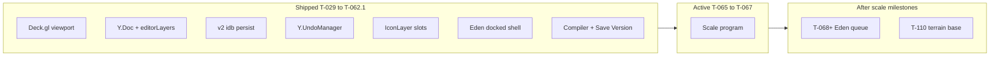
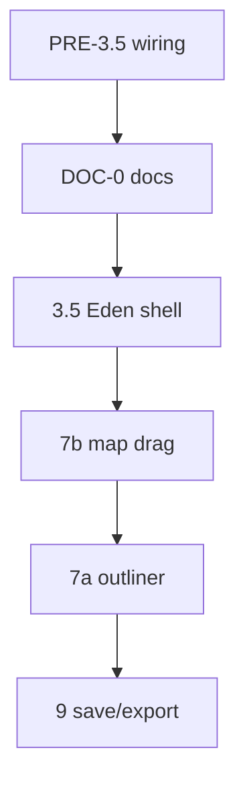

**Status:** archived — see [documentation_v2/website/frontend/apps/editor/decisions.md](/documentation_v2/website/frontend/apps/editor/decisions.md)

---
name: Mission Creator — Agent Execution Plan
overview: "Self-contained agent handoff for Mission Creator. T-057–T-067 shipped. T-068 Phase 1 shipped @ 2026-06-27; active slice T-068.7 (compat matrix spec). T-090.1.1 Map basemap shipped @ 6e06e679."
todos:
  - id: step-0-publish
    content: "STEP 0: Plan published to docs/specs/Mission_Creator_Architecture/agent_execution.md"
    status: completed
  - id: phase-pre-35
    content: "PHASE PRE-3.5: Wire Outliner + asset drag-to-map (T-033) — done"
    status: completed
  - id: phase-doc-0
    content: "PHASE DOC-0: Create 04_eden_editor_ux_spec.md + patch engineering_plan.md + mission_creator_design.md + CLAUDE.md"
    status: completed
  - id: phase-3-5
    content: "PHASE 3.5: Eden shell fidelity — docked layout, top bar, left sidebar sections, tabbed asset palette, modal-only inspector, topo skin"
    status: completed
  - id: phase-7b
    content: "PHASE 7b: Map drag-to-move, marquee multi-select, group move, Spacebar center, Delete key; remove click-to-teleport"
    status: completed
  - id: phase-7a
    content: "PHASE 7a: Outliner reparent DnD, folder rename/delete, slot delete; commit in-flight tree wiring"
    status: completed
  - id: phase-9
    content: "PHASE 9: Compiler + Export + useMissionEditor autosave (only after 3.5, 7b, 7a complete)"
    status: completed
  - id: eden-backlog
    content: "T-057–T-067 SHIPPED. Next T-068+ per docs/TICKET_LEAD.md."
    status: in_progress
  - id: phase-blocked
    content: "DEFERRED: T-090/T-091 map tiles+DEM, T-078+ power-user Eden, ruler/LoS — do not start without user approval"
    status: pending
isProject: false
---

**Status:** archived — the execution half of the Mission Creator agent execution plan; its decisions log lives in [decisions.md](/documentation_v2/website/frontend/apps/editor/decisions.md)

# AGENT EXECUTION CONTRACT

> **Live stack (T-145 / T-151 / T-159 / T-171):** Leptos + yrs + wgpu at `apps/website/frontend/` — not Deck.gl / React / Vite / Go middleware. Verify commands: `cargo xtask mk ci-local-leptos` (not `npm run build && npm run lint`). Homes: [`WHERE_DOES_X_GO.md`](/documentation_v2/standards/where_does_x_go.md). Body below retains React-era paths as ship history.

> **Phase completion log (T-033–T-040):** PRE-3.5 ✅ DOC-0 ✅ 3.5 ✅ 7b ✅ 7a ✅ 9 ✅.
> **North star:** **1M–10M editable entities** via **T-059..T-067**. **T-067 shipped.** Next: **T-068+** — [`docs/TICKET_LEAD.md`](https://github.com/darkforce09/TBD-reforger/blob/2574b0ed2f76edb131447eb10e3d55446404d785/docs/TICKET_LEAD.md).

> **For the human:** Open a new Cursor Agent / CLI session and paste the prompt below. The agent reads this file; execute **open** phases only.

## One-line prompt (copy this)

```
Read CLAUDE.md first. Mission Creator shell T-033–T-040 is DONE. **T-068 Phase 1 shipped**.
**Active slice: T-090.3.0** — Workbench export spike (claude-code); **T-090.1** aligned basemap **queued** until 3.0 K1–K7 PASS. **T-091 shipped** @ `dde589e` (`.0`/`6d96339`, `.1`/`2c56c2e`, `.2`/`dde589e`). **T-091.0 shipped** @ `6d96339` — do NOT redo plugin/export.
**T-068 Phase 2 active (T-068.11+).** ORBAT authoring done via **T-180**. Program order: T-092 ✓ → **T-180 ✓** → **T-068.11–.14**.
Read t091_1_dem_loader.md ONLY for implementation. Hub t090_091_map_terrain_program.md for context.
**T-057–T-067 shipped.** Do not `./scripts/ticket done T-068` until T-068.14.
```

Shorter variant:

```
ROADMAP.md → @agent_execution.md §ACTIVE SLICE. **T-090.10.1 active** — Map Engine v2 plan (no code). Handoff: `.ai/artifacts/t090_10_SEND_TO_CLAUDE.md`.
Read t091_1_dem_loader.md. Per docs/TICKET_DEV_QUEUE.md.
```

## Agent roles — Cursor vs Claude Code (locked 2026-06)

**Human workflow:** save tokens on Claude Code by splitting **code** vs **documentation**.

| Role | Tool | Does | Does NOT |
|------|------|------|----------|
| **Documentation owner** | **Cursor — Composer 2.5** | Write and sync all project docs (specs, ROADMAPs, `CLAUDE.md`, `agent_execution.md`, `TAGS.md`, page specs, acceptance checkboxes, Claude Code prompts, plan files) | — |
| **Code implementer** | **Claude Code** | Read docs as source of truth; implement code + tests; run verify commands; report outcomes (logs, curl results, manual verify) back to the human | Edit documentation files (no doc sync passes — Cursor handles that in a separate step or session) |

**Handoff pattern:**

1. **Cursor** — plan, diagnose, write/update specs + prompts + doc sync table; paste a **code-only** Claude Code prompt (no `PART N — DOCS`).
2. **Claude Code** — read listed docs; ship code; return verify output + bullet summary for Cursor.
3. **Cursor** — flip acceptance checkboxes, §Status, ACTIVE SLICE, TAGS, etc., in the same commit the human requests (or before the next Claude Code slice).

Claude Code prompts in `t0xx_*.md` files should end with **DO NOT edit documentation** — list which files Cursor will sync instead.

---

| Priority | Document | Agent uses it for |
|----------|----------|-------------------|
| **0** | **`ROADMAP.md`** | **Planning authority** — shipped vs queued tickets, doc index. Start here. |
| **0b** | **[`docs/TICKET_LEAD.md`](https://github.com/darkforce09/TBD-reforger/blob/2574b0ed2f76edb131447eb10e3d55446404d785/docs/TICKET_LEAD.md)** | Ready / active / next queued — generated from [`tickets/registry.json`](https://github.com/darkforce09/TBD-reforger/blob/5035931ce80324db81d84fb9535433689d72f208/.ai/tickets/registry.json) |
| **1** | **This file** (`agent_execution.md`) | **Execution authority** for UX phases. Decisions log. If UX conflicts, this file wins over ROADMAP priorities. |
| **2** | **Decisions log** (below) | Locked human choices. Do not re-litigate. |
| **3** | `ux_spec.md` | UX contract — copies Decisions log + interaction table. |
| **3b** | `reference/feds_schema.md` | **FEDS v2** — normative per-feature record format (UI Surface, Wiki anchor). |
| **3c** | `feature_inventory.md` | **What TBD has** — code-evidenced feature inventory. |
| **3d** | `eden/ui_anatomy.md` | **Eden UI** — panel-by-panel layout (Asset Browser, Toolbar, Entity List). |
| **3e** | `eden/attributes.md` | **Eden attributes** — `ATTR-FIELD-*` per entity type. |
| **3f** | `eden/interactions.md` | **Eden interactions** — wiki-anchored FEDS (toolbar, compositions, connect, …). |
| **3g** | `eden/gap_analysis.md` | **Gap + backlog** — ID-linked parity; ticket column synced from registry |
| **3i** | `ROADMAP.md` | **Master roadmap** — shipped vs queued; kits vs armory clarified |
| **3h** | `eden/wiki_manifest.yaml` + `scripts/tools/scrape-eden-wiki.mjs` | Wiki scrape manifest + automation; cache in `artifacts/eden-wiki/`. |
| **4** | `engineering_plan.md` | Engineering ADRs, Y.Doc schema, compiler/export contract, file tree. |
| **5** | `CLAUDE.md` | Repo conventions, run commands, commit tags. |
| **6** | Aegis design tokens | `frontend/src/index.css` + label/spacing scale (`text-label-sm`, `overlayPanel`, etc.). Glass palette only — **not layout**. |

**Do not use for layout or interaction decisions** (historical HTML explorations — they **contradict each other** and the Decisions log):

- `docs/specs/Mission_Creator_Mock_Up/**/code.html`, `screen.png`
- `docs/specs/macOS_Blueprints/**/code.html`, `screen.png` (editor-related — see map below)

**Supplementary only** (style tokens / product vision — read when noted, never override this plan):

| Path | Use for |
|------|---------|
| `aegis_tokens/DESIGN.md` | Aegis color tokens, typography scale, **256px / 320px** panel widths |
| `frontend/src/index.css` + `overlay.ts` | Live glass palette, semantic classes |
| `mission_creator_design.md` | Long-term product vision (Forge, Visual-Git, Briefing UI) — **deferred** items |
| `problem_statement.md` | *Why* the four hard problems exist (200 slots, DEM, nesting, registry) |
| `engineering_plan.md` | Full engineering phases 0–9, file tree, compiler §8, workers, DEM |

Visual target: **Arma 3 Eden Editor** layout + interactions, **modernized with Aegis glass**. Dimensions: left **256px** (`w-64`), right **320px** (`w-80`), both docked flush; map between them.

| Code | Route |
|------|-------|
| `frontend/src/features/mission-creator/` + `frontend/src/features/tactical-map/` | `/missions/:id/edit` |
| `frontend/src/pages/missions.tsx` | Mission library (entry to editor) + **CreateMissionDialog** launch (T-048) |
| `frontend/src/features/mission-creator/CreateMissionDialog.tsx` | Create-mission dialog on `/missions` (T-048; replaced the `/missions/create` wizard) |

**STEP 0:** Done — this file is in the repo. Shell phases PRE-3.5–9 are DONE (T-033–T-040); new sessions start at **[`ROADMAP.md`](/documentation_v2/website/frontend/apps/editor/mission_creator_roadmap.md)** and execute only OPEN items.

---

## Repository documentation map

Every Mission Creator-related folder and its role. **Execution authority remains this file**; other docs provide engineering depth or historical context.

### `documentation_v2/website/frontend/apps/editor/` — engineering

| File | Role |
|------|------|
| `agent_execution.md` | **This file** — phases, decisions, acceptance criteria |
| `engineering_plan.md` | ADRs, full file tree, phases 0–9, Y.Doc schema, compiler JSON §8, workers |
| `problem_statement.md` | Problem statement (200-slot DOM, DEM, nesting, registry) |
| `ux_spec.md` | Human-readable UX contract copied from Decisions log |
| `ROADMAP.md` | Master roadmap — ticket queue |
| `feature_inventory.md` | Code-evidenced feature inventory |
| `eden/` | Eden parity research (interactions, UI, attributes, gaps) |
| `reference/feds_schema.md` | FEDS v2 schema |

### `docs/specs/Mission_Creator_Mock_Up/` — product + early UI explorations

| Path | Role |
|------|------|
| `mission_creator_design.md` | Product blueprint: Forge, Loadout Forge, Visual-Git, Briefing UI, JSON sync |
| `aegis_tokens/DESIGN.md` | Aegis tokens + panel dimensions (256 / 320) |
| `aegis_tokens/code.html` + `screen.png` | Historical layout exploration — **do not execute against** |
| `Arsenal/DESIGN.md` | Arsenal / Loadout Forge visual tokens (**T-068+** registry work) |

### `docs/specs/macOS_Blueprints/` — editor-adjacent references

| Path | Role |
|------|------|
| `aegis_mission_editor_macos_edition/` | Early editor chrome exploration |
| `mission_editor_tactical_canvas/` | Map canvas styling reference |
| `tbd_mission_creator_visual_git_diffing/` | Future Visual-Git UI (Phase 9+) |
| `loadout_forge_tactical_equipment_management/` | Future Arsenal UI (Phase 6) |

### `frontend/src/features/` — implementation (source code)

| Module | Role |
|--------|------|
| `tactical-map/` | Deck.gl engine, Y.Doc state, layers, coords — **terrain-agnostic** |
| `mission-creator/` | Editor shell: layout panels, hooks, modals |

Key engine files already exist: `TacticalMap.tsx`, `state/{ydoc,schema,bindings,useMapStore,undo}.ts`, `layers/useIconLayer.ts`, `hooks/useMissionDoc.ts`.

Key shell files: `MissionCreatorPage.tsx`, `layout/{TopCommandStrip,BottomToolbelt,OutlinerPanel,AssetBrowser,InspectorPanel,AttributesModal}.tsx`.

**Not yet built** (per Ultra Plan): `dem/*`, `tools/*`, `registry/*`, `compiler/*`, `hooks/useMissionEditor.ts`, most extra layers.

### Other

| Path | Role |
|------|------|
| `CLAUDE.md` (T-029–T-032) | Shipped status snapshot — update in DOC-0 |
| `documentation_v2/website/frontend/pages/mission_hub/library/mission_library_page.md` | Create-mission dialog spec (T-048; superseded the `/missions/create` wizard) |
| `frontend/src/stitch-exports/mission_creator_setup_wizard/` | Wizard HTML mock (archived) |

---

## Architecture state (what exists today)



**Data flow (do not break):** mutations → `ydoc.ts` `transact()` → `bindings.ts` → `useMapStore` → Deck layers. Only `selection`, `activeTool`, `activeLayerId` are set directly on Zustand.

**Entity maps in Y.Doc:** `meta`, `factions`, `squads`, `slots`, `loadouts`, `items`, `objectives`, `vehicles`, `markers`, `editorLayers`.

**What works end-to-end today (post T-056):** fullscreen Eden docked shell (no platform chrome) on `/missions/:id/edit`; pan/zoom grid with terrain-driven bounds (`meta.terrain`, T-049); drag mock catalog unit onto map → active Editor Layer; **drag-to-move icons + marquee multi-select + group move** (T-036); **Ctrl/Cmd-click additive toggle select** (T-053); **Ctrl/Cmd+C/V copy-paste at cursor** (T-056); Delete/Backspace; Spacebar centers on selection; **keyboard undo/redo** Cmd/Ctrl+Z / Shift+Z / Ctrl+Y (T-052); **double-click → Attributes modal** from map icons, ORBAT slot rows, and Editor Layers slot rows (T-054; multi-select suppresses) with **editable numeric X/Y/Z + rotation** (T-049) and role/tag/stance; **Asset Browser search** filters the Factions catalog tree by name (T-055); **title/terrain/env hydrate** from the mission row on load (T-049); outliner reparent/rename/delete (T-037); **compiler → `json_payload`, manual Save Version + Export, IndexedDB↔server conflict prompt** (T-038); cursor X/Y/Z readout (Z=0 flat, T-050); local IndexedDB per mission id.

**Known regression (T-057 — resolved):** ~~~100–200 slots + pan → ~9 fps~~ Fixed T-057: cursor off render path, no hover pick, pan rAF-coalesce. Manual acceptance: ≥55 fps @ 200+ via `FpsCounter`.

**Open Eden gaps (active after T-060..T-067 scale milestones — see [`docs/TICKET_LEAD.md`](https://github.com/darkforce09/TBD-reforger/blob/2574b0ed2f76edb131447eb10e3d55446404d785/docs/TICKET_LEAD.md) and `eden/gap_analysis.md`):**
- **Queued Eden (T-068+):** asset registry + palette / loadout Phase 2 (**T-068**), markers (**T-069**), remaining vehicles polish (**T-070** residual). **ORBAT Manager + Eden placement shipped via T-180** (absorbs T-071.1+ / T-074 / T-147).
- **Queued Eden feel (T-072–T-077):** Ctrl multi-place, Shift/map rotate, Space conflict, vehicle crew, empty-vehicle Alt place. *(Faction submode → T-180.5 chips. **T-052** undo; **T-056** copy/paste; **T-055** asset search; **T-054** Attributes; **T-053** additive select — shipped.)*
- **Deferred Eden (T-078+):** compositions, triggers/waypoints/systems, connection/sync, transform widget + snap grids, full attribute fields, menu bar, classname search (**T-084**).
- **Deferred infra:** DEM + Z (**T-091**), aligned map tiles (**T-090**), terrain base (**T-110**), ruler/LoS/viewshed (after **T-091**).

---

## Full phase roadmap

| Phase | Name | Status | Deliverable |
|-------|------|--------|-------------|
| 0–1 | Viewport | **Done** | Deck.gl orthographic map, pan/zoom, procedural grid |
| 4 | State foundation | **Done** | Y.Doc, Zustand mirror, undo, IconLayer, v2 idb persist (T-062.1) |
| 3a | Shell scaffold | **Done** | Floating panels, TreeView, modals (T-031/032) |
| PRE-3.5 | Land tree wiring | **Done** (T-033) | editorLayers + palette DnD baseline |
| DOC-0 | Doc alignment | **Done** (T-034) | `ux_spec.md` + patch ultra plan, CLAUDE, design |
| **3.5** | **Eden shell** | **Done** (T-035) | Fullscreen, docked sidebars, palette tabs, modal inspector |
| **7b** | **Map manipulation** | **Done** (T-036) | Drag-move, marquee, Spacebar, Delete |
| **7a** | **Outliner ops** | **Done** (T-037) | Reparent, rename, delete folders/slots |
| **9** | **Compiler + save** | **Done** (T-038) | `json_payload` export, Save Version |
| 2 | DEM / Z-axis | Blocked | **T-091** heightmap assets |
| 5–6 | Registry + Arsenal | Blocked | **T-068** + `GET /api/v1/registry` |
| 8 | Tools + objectives | Blocked | Ruler, zones, LoS GLSL — after **T-091** |
| T-048 | Create dialog | Done | `CreateMissionDialog` on `/missions` → POST mission → open editor (replaced `/missions/create`) |



---

## Current gaps (Eden target vs code today)

| Eden / Decisions log | Current code | Fixed in |
|---------------------|--------------|----------|
| Fullscreen editor (no platform nav) | `Sidebar` + `TopNav` still visible | Phase 3.5 |
| Docked L/R panels, map between | Floating `inset-x-4` panels | Phase 3.5 |
| Asset palette always visible | Right panel swaps to `SlotInspector` | Phase 3.5 |
| ORBAT + Editor Layers sections | Workflow folders only | Phase 3.5 |
| Attributes modal on double-click | Modal stub; fields in SlotInspector | Phase 3.5 |
| Eden time slider/scrub | Hidden in MissionSettingsDialog | Phase 3.5 |
| Topo map + grid overlay | Procedural line grid only | Phase 3.5 |
| Click-drag icons to move | Click entity, click map to teleport | Phase 7b |
| Marquee multi-select | Single `selection.id` | Phase 7b |
| Spacebar to center | Auto `flyTo` on outliner click | Phase 3.5 + 7b |
| Delete key | No keyboard delete | Phase 7b |
| Export + API autosave | Export disabled; IndexedDB only | Phase 9 |
| Terrain drives viewport bounds | Hardcoded `terrain="everon"` | T-049 |
| Mission row title/terrain on load | Always "Untitled Mission"; empty-payload early-return | T-049 |
| Editable numeric X/Y/Z/rotation | Read-only Transform; stale "coming later" copy | T-049 |

---

## Interaction contract

| User action | System response |
|-------------|-----------------|
| Drag asset from palette | Place entity on map; file in active Editor Layer |
| Single-click entity | Select + highlight + outliner sync (**no** camera move) |
| Double-click entity | Open **AttributesModal** (Transform, Identity, States, Arsenal tabs) |
| Click-drag entity on map | Move entity; one undo step on release |
| Left-drag on empty map | Marquee box-select |
| Middle-mouse / right-drag | Pan/zoom map |
| Click-drag selected group | Move all selected together; one undo step |
| Spacebar | Center camera on selection |
| Delete / Backspace | Delete selected entities (undoable) |
| Click empty map | Clear selection only |
| Click outliner row | Select entity (**no** camera move until Spacebar) |

---

## Agent rules (mandatory)

1. **Read first:** [`CLAUDE.md`](/CLAUDE.md) §Status — **T-180 ORBAT COMPLETE**; active loadout lane **T-068**. Then this file, then `engineering_plan.md` §0–§2.
2. **Planning:** `ROADMAP.md` + [`docs/TICKET_LEAD.md`](https://github.com/darkforce09/TBD-reforger/blob/2574b0ed2f76edb131447eb10e3d55446404d785/docs/TICKET_LEAD.md). Do **not** reopen T-071.1+ / T-074 / T-147 — use T-180.
3. **Verify gate** after every phase:
   ```bash
   cd frontend && npm run build && npm run lint
   ```
4. **Do not commit** unless the user explicitly asks.
5. **Deferrals:** do **not** start **T-090**/**T-091** (map tiles/DEM), full registry/Arsenal completeness, or ruler/LoS/viewshed without user approval — these wait until after **T-068–T-077**. **Exception:** minimal registry JSON (**T-068** dependency — classname, displayName, category, iconUrl) is **in scope** when needed to unblock **T-068**/**T-069**/**T-070**; keep it minimal.
6. **Visual target:** Arma 3 Eden Editor + Aegis tokens. **Never** derive layout from `code.html` / `screen.png` mockups — use Decisions log + this plan only.
7. **State rule:** Entity mutations go through `tactical-map/state/ydoc.ts` → `bindings.ts` → `useMapStore`. Never set entity data directly on Zustand.
8. **Inspector rule:** Asset Palette stays on the right always. Properties edit via **AttributesModal on double-click only** — no right-panel inspector swap.
9. **Move rule:** Click-drag icons on the map to move (Phase 7b). Remove click-empty-map-to-teleport. Marquee box-select on left-drag empty map; middle-mouse/right-drag pans.
10. **Camera rule:** Spacebar centers on current selection. No automatic flyTo on single-click (map or outliner).
11. **Delete rule:** Delete/Backspace removes selected entities in one undoable transaction.
12. **Fullscreen rule:** Hide platform Sidebar + TopNav on the editor route.

---

### ACTIVE SLICE — Map Engine v2 implementation (2026-07-05)

Plan shipped @ `a222a146` · [`.ai/artifacts/t090_10_map_engine_v2_implementation_plan.md`](/.ai/artifacts/t090_10_map_engine_v2_implementation_plan.md)

| Slice | Status | Notes |
|-------|--------|-------|
| **T-090.3.1** | shipped @ `e47f25fc` | P1 buildings + roads export |
| **T-090.3.2** | shipped @ `a055df95` | TBDD density + PH-P2 trees + 36 forest regions |
| **T-090.3.3** | shipped @ `887a6ed1` | Taxonomy + highway + measured OBBs |
| **T-090.5.3** | shipped @ `155651b9` | Worker streaming + chunkStore LRU |
| **T-090.8.1** | shipped @ `e28d073a` | Forest mass — landcover + TBDD marching squares |
| **T-090.5.4** | shipped @ `bd481cf1` | Sea-band + DEM contours (`world-sea`, `world-contours`) |
| **T-090.5.5** | **active** | Tree/veg/prop IconLayer glyphs |
| **T-090.10.1** | shipped @ `a222a146` | Plan artifact only |

LOD v2 locked in [`t090_render_lod_contract.md`](/documentation_v2/tickets/specs/t090_render_lod_contract.md) — world cluster purged.

---

### COMPLETE — T-090.10.1 Map Engine v2 plan (2026-07-05)

Hub: [`t144_arma3_map_architecture_study.md`](/documentation_v2/tickets/specs/t144_arma3_map_architecture_study.md) · report [`.ai/artifacts/t144_arma3_map_architecture_report.md`](/.ai/artifacts/t144_arma3_map_architecture_report.md)

| Slice | Status | Shipped |
|-------|--------|---------|
| **T-144.1** | shipped | `b1949182` — read-only A3 source analysis (R1–R6 PASS) |
| **T-144.0** | shipped | cursor-docs spec + handoff |

**External source:** `/run/media/system/Disk_2/Projects/TBD_Arma_3_Remaster/Arma_3_SourceCode_Old`

---

### T-090 map program — basemap shipped through T-090.1.1.1

**Follow-on (not blocking):** `TBD_MissionListLoader` still hits legacy `/api/missions` (404) — needs same v1 + `X-Service-Token` fix as loader (OBS-2 in verify log).

---

### ACTIVE SLICE — T-091 Map & terrain program (2026-06-29) — **complete**

**T-091 program complete** @ `dde589e`. Map basemap work continues under **T-090** — see §ACTIVE SLICE — T-090 / T-092 above. Hub: [`t090_091_map_terrain_program.md`](/documentation_v2/tickets/specs/t090_091_map_terrain_program.md).

| Slice | Status | Shipped |
|-------|--------|---------|
| **T-091.0** | shipped | `6d96339` — Everon DEM + anchor verify |
| **T-091.1** | shipped | `2c56c2e` — DEM loader + `sampleElevation` |
| **T-091.2** | shipped | `dde589e` — Z UX + hillshade |

**Locked out of scope (Phase 1):** `registry.worker.ts`, smart Forge, compat matrix, compiler loadout export — see Phase 2 slices. Vehicles/Markers tabs (**T-069**/**T-070**).

**T-067 shipped** — [`t067_spatial_chunks.md`](/documentation_v2/tickets/specs/t067_spatial_chunks.md): `slot-add-bulk` paste patch; dormant chunk scaffolding; CPU viewport cull deferred (T-067.0.1 revert to `getBaseIcons()`).

**Deferred (idea):** **T-111** lazy RAM @ 1M; **T-112** GPU `DataFilterExtension` viewport cull — [`docs/TICKET_BRAINSTORM.md`](https://github.com/darkforce09/TBD-reforger/blob/fb8445b60c81fd3d99c04708ab41af83a017f4c2/docs/TICKET_BRAINSTORM.md#scale).

---

## Execution checklist (historical — shell phases complete)

### STEP 0 — Publish plan ✓
- [x] `documentation_v2/website/frontend/apps/editor/decisions.md` is in the repo

### PHASE PRE-3.5 — Land tree wiring (**historical — done T-033**)

> **Completed.** Outliner bound to Y.Doc, asset drag→map, `placedEntitiesMock` deleted. See phase completion log (T-033–T-040).

---

### PHASE DOC-0 — Documentation alignment
**Goal:** Docs agree on Eden layout + interactions before more code.

**Tasks:**
1. ~~Create `ux_spec.md`~~ — **Done (T-034)**
2. Update `engineering_plan.md`: docked shell, fullscreen, phases PRE-3.5/3.5/7b/7a, `EditorLayer`, multi-select `Selection`, point UX authority to this file
3. Update `mission_creator_design.md` §1: Attributes dialog; palette always visible; note HTML mockups are historical
4. Update `CLAUDE.md`: T-033, current phase status, uncommitted wiring note
5. Document `AppLayout` fullscreen escape for editor route

**Done when:** All four files updated; no code changes required.

---

### PHASE 3.5 — Eden shell fidelity
**Goal:** Editor shell matches **Arma 3 Eden layout** (Aegis glass skin). Includes fullscreen chrome + Spacebar camera.

**Layout target:**
```
┌─────────────────────────────────────────────────────────────┐
│ TopCommandStrip (h-12) — NO platform TopNav/Sidebar          │
├──────────┬──────────────────────────────────────┬───────────┤
│ Left     │         TacticalMap                  │ Right     │
│ w-64     │         ml-64 mr-80                  │ w-80      │
│ ORBAT +  │         topo + grid overlay          │ Asset     │
│ Layers   │         [BottomToolbelt in map area] │ Palette   │
└──────────┴──────────────────────────────────────┴───────────┘
```

**Key files:** `MissionCreatorPage.tsx`, `AppLayout.tsx` or editor wrapper, `TopCommandStrip.tsx`, `LeftOutliner/` (→ `LeftSidebar.tsx`), `RightInspector/AssetBrowser.tsx`, `AttributesModal.tsx`, `overlay.ts`, `BottomToolbelt.tsx`, `router.tsx` (fullscreen handle)

**Tasks:**
0. **Fullscreen:** Hide platform `Sidebar` + `TopNav` on `/missions/:id/edit`
1. **Layout:** Docked left `w-64` + right `w-80` flush; map `ml-64 mr-80`; top bar full width
2. **Top bar:** Mission title (inline edit); menu stubs (File/Edit/View/Mission/Environment); **Eden time slider/scrub** + weather wired to `updateEnvironment`; undo/redo; Export (still disabled until Phase 9); settings gear → `MissionSettingsDialog` (view distance, thermals)
3. **Left sidebar — both sections in one scroll:**
   - **ORBAT** (top): `factions` → `squads` → `slots` (export truth; read-only OK if no ORBAT UI yet)
   - **Editor Layers** (below): `editorLayers` workflow folders (current outliner)
   - **Stubs:** Waypoints, Zones, Logic & Events (empty until **T-079+**)
   - **Bottom icon tabs:** Hierarchy, Layers, Assets, History, Settings (stubs switch content later)
   - Header: OUTLINER + mission name + New folder
4. **Right asset palette (always visible):**
   - Tabs: Factions | Vehicles | Markers | Objectives
   - Pattern: 2-col **grid cards** at tab top level → drill-down **tree** (Men → Rifleman)
   - Keep `ASSET_DND_MIME` drag onto map; palette feeds live **`GET /registry`** via `useRegistry()` + `buildCatalogTree` (T-068.3)
   - Remove `InspectorPanel` → `SlotInspector` swap entirely
5. **AttributesModal** (double-click only) — migrate `SlotInspector` fields:
   - **Transform:** X/Y/Z, rotation (Z read-only until DEM)
   - **Identity:** role, tag, callsign, squad
   - **States:** medic/engineer flags (stub)
   - **Arsenal:** dumb loadout export @ **T-068.4** — 4 gear dropdowns + Download JSON (`loadoutExport.ts`); smart Forge deferred **T-068.10**
6. **Map skin:** Topo placeholder under Deck.gl + procedural grid at low opacity
7. **Spacebar** → `flyTo` selection centroid; remove auto `flyTo` on outliner click
8. **TreeView polish:** `border-l-2 border-primary` on selected row; folder open/closed icons

**Acceptance:** All boxes under **Phase 3.5 — Eden shell** in [Acceptance criteria](#acceptance-criteria) below.

**Verify:** `npm run build && npm run lint`

---

### PHASE 7b — Map drag & multi-select
**Goal:** Eden manipulation — grab icons on the map; marquee select; group move.

**Problem today:** `MissionCreatorPage` `onMapClick` → `moveEntity` requires click-then-click. Selection is single `{ kind, id }`.

**Key files:** `TacticalMap.tsx`, `tools/useSelectTool.ts` (create), `layers/useIconLayer.ts`, `layers/useSelectionLayer.ts` (create), `state/schema.ts`, `state/useMapStore.ts`, `state/ydoc.ts`, `state/selectors.ts`, `MissionCreatorPage.tsx`

**Tasks:**
1. **Schema:** `Selection` → `{ kind, ids: ID[] }`; update store, selectors, icon highlights, outliner multi-highlight
2. **Drag-move:** pointer down on icon → transient preview (do **not** write Y.Doc every frame); pointer up → one `transact()` / one undo step
3. **`moveEntities(md, ids, delta)`** in `ydoc.ts` — atomic group move
4. **Marquee:** left-drag on empty map draws selection box (`useSelectionLayer`); middle-mouse / right-drag pans
5. **Controller:** disable Deck pan while dragging entities; disable left-drag pan (marquee replaces it)
6. Remove `onMapClick` teleport path entirely
7. **Delete/Backspace** → batch `removeEntity`, undoable
8. **Spacebar** → `flyTo` centroid of `selection.ids`

**AttributesModal rule:** double-click opens modal only when **one** entity selected; multi-select shows count or disables modal.

**Acceptance:** All boxes under **Phase 7b — Map manipulation** in [Acceptance criteria](#acceptance-criteria) below.

**Verify:** `npm run build && npm run lint`

---

### PHASE 7a — Outliner tree operations
**Goal:** Eden left-tree workflow — reparent, rename, delete.

**Key files:** `OutlinerPanel.tsx` / `LeftSidebar.tsx`, `TreeView.tsx`, `ydoc.ts` (add rename/delete layer actions if missing)

**Tasks:**
1. Outliner reparent DnD between `editorLayers` folders
2. Folder rename + delete UI
3. Delete slot from outliner (wire `removeEntity`)
4. Wire `assetId` from palette payload into slot metadata

**Verify:** `npm run build && npm run lint`

---

### PHASE 9 — Compiler + persistence
**Goal:** Export `json_payload` and autosave to backend.

**JSON contract (Ultra Plan §8 — non-negotiable):** Output must be a **superset** containing existing `orbat[]` shape for `parseOrbatTemplate` in `internal/handlers/events.go`, plus `map`, `environment`, `loadouts`, `objectives`, `vehicles`, `markers`, `schemaVersion` (int). This version-POST payload is validated server-side against [`mission-editor-payload.schema.json`](/contracts_v2/definitions/mission-editor-payload.schema.json) (T-123.5). Separate camelCase export via `exportSchema.ts` for the Arma mod — its version field is `exportFormatVersion`, **not** `schemaVersion` (T-123.1).

**API (already exists):** `POST /api/v1/missions/:id/versions` (draft autosave / Save Version), `GET .../versions/:vid` (hydrate). On IndexedDB vs API conflict → **user prompt**.

**Key files:** `compiler/compile.ts`, `compiler/exportSchema.ts`, `compiler/compiler.worker.ts`, `hooks/useMissionEditor.ts`, `TopCommandStrip.tsx`

**Tasks:**
1. `compile.ts` traverses normalized state → `orbat[]` superset
2. Enable Export → download JSON
3. `useMissionEditor`: hydrate on load; debounced draft autosave; manual Save Version → new semver
4. Unsaved-changes indicator
5. Visual-Git scrubber stub in top bar (full UI deferred)

**Verify:** `npm run build && npm run lint` + dev-login smoke on `/missions/:id/edit`

---

### DEFERRED — Do not start without user approval

| Phase | Blocker / notes |
|-------|-----------------|
| **T-091** DEM / Z-axis | Hosted 16-bit heightmaps + topo tiles; `dem/*`, `useDemLayer.ts` |
| **T-068** Registry + Arsenal | Phase 1 **shipped** @ 2026-06-27 (T-068.0.1–T-068.6). **Active: T-068.7+** — compat matrix, smart Forge, compiler export, player loadout @ T-068.11 |
| Ruler / LoS / viewshed | After **T-091**; `useLineLayer`, `usePolygonLayer` |
| Product (future) | Visual-Git diff ghosts, Mission Planner, in-game Briefing UI, multiplayer y-websocket — see `mission_creator_design.md` |

---

## Do not break (preserve these)

- **Deck.gl + Y.Doc architecture** — Eden is a shell on top; never per-entity DOM on the map
- **Y.Doc mutation path** — `ydoc.ts` `transact()` only; one user gesture = one undo step
- **Palette → map placement** — `ASSET_DND_MIME` + `addSlot` flow
- **`editorLayers`** — workflow folders; export uses factions/squads/slots not layers
- **Undo/redo** — `Y.UndoManager` with `LOCAL_ORIGIN`; `useMissionDoc` must keep a **live** `UndoController` after React StrictMode teardown (`instanceKey` bump)
- **Lazy route** — `/missions/:id/edit` code-split; `mission_maker+` gate
- **IndexedDB** — local durability via `useMissionDoc` even after API lands

---

## Acceptance criteria

### Phase 3.5 — Eden shell

- [ ] Left sidebar docked flush left (`w-64`); right palette docked flush right (`w-80`); map between them
- [ ] **No** platform Sidebar/TopNav on `/missions/:id/edit`
- [ ] Right Asset Palette always visible with tabs (Factions / Vehicles / Markers / Objectives)
- [ ] Double-click opens Attributes modal with editable fields (role, tag, stance at minimum)
- [ ] Time control matches Eden (slider/scrub — not preset-only dropdowns)
- [ ] Map has topo appearance (placeholder OK) + grid overlay
- [ ] Left panel shows **both** ORBAT section and Editor Layers section
- [ ] Spacebar centers on selection (no auto-center on click)
- [ ] Bottom toolbelt shows X/Y/Z in mono, centered in map area

### Phase 7b — Map manipulation

- [ ] Click-drag a placed unit to move it (no second click on the map)
- [ ] Marquee box-select on left-drag empty map
- [ ] Middle-mouse / right-drag pans the map
- [ ] Spacebar centers camera on selection
- [ ] Delete removes selection; undo restores
- [ ] Group move is a single undo step
- [ ] Clicking empty map only deselects

---

## How to run this plan

1. Start a new Agent session in this repo.
2. Paste the [one-line prompt](#one-line-prompt-copy-this) from the top of this file.
3. Shell phases PRE-3.5–9 are DONE (T-033–T-040) — open [`ROADMAP.md`](/documentation_v2/website/frontend/apps/editor/mission_creator_roadmap.md) and execute only OPEN items.
4. To resume a specific shell phase for reference: `Continue agent_execution.md from PHASE 7b`.
5. To commit after a phase passes verification: `commit with tag T-033`.

**Agent reminder:** Read **Document hierarchy** → **Decisions log** → **Architecture state** before code. Use **Interaction contract** for behavior. Ultra Plan §8 for compiler. HTML mockups are historical only.
