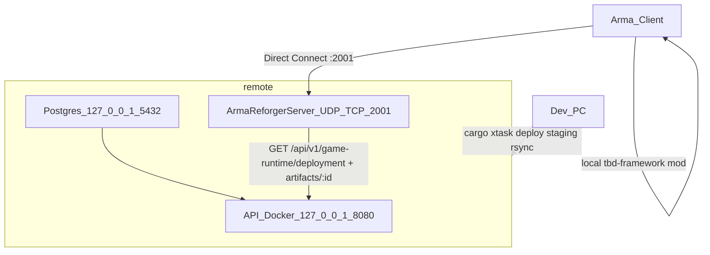

**Status:** live

# Staging server — 192.168.0.140

Self-hosted TBD stack for LAN testing: **API + Postgres (Docker)** and **Arma Reforger dedicated server** on `sam@192.168.0.140`.

> ## CORRECTED 2026-07-31 (T-604) — read this before the 2026-06-14 text
>
> Measured on engine **1.7.0.54**, by booting the binary, not by reasoning about it. Two claims
> below this box are wrong, and the second is worse than wrong — it is silently dangerous.
>
> **1. A locally staged addon IS Direct-Joinable.** `-addonsDir <dir>` **plus** `-config <json>`
> registers a backend room *and* loads the checkout. One boot, verbatim:
>
> ```
> NETWORK      : Starting RPL server, listening on address 0.0.0.0:2001, fastValidation=true
> BACKEND      : Server registered with address: 192.168.0.117:2001
> BACKEND      : Direct Join Code: 0031768625
> ENGINE       : Loaded addons:
>   ENGINE     : gproj: '<addonsDir>/tbd-framework/addon.gproj' guid: 'B2C3D4E5F6A78901'
> ENGINE       : FileSystem: Adding relative directory '<checkout>/apps/mod/tbd-framework'
>                to filesystem under name TBD_Framework
> ```
>
> The 2026-06-14 finding was measured on **`-addons`**, which really is mutually exclusive with
> `-config`. It was never measured on **`-addonsDir`**, which is not. Use
> **`cargo xtask mod playtest`**.
>
> **2. `tbd-framework` IS on the Workshop, unlisted and STALE, and `-config` alone silently runs it.**
> It is published under the *same* id as the local gproj GUID `B2C3D4E5F6A78901`, pinned at
> **version 1.0.1**. So a `-config`-only server does not fail loudly when the addon is missing
> locally — on a clean profile with no `-addonsDir` the engine fetches it over the network:
>
> ```
> BACKEND      : Addon Download started B2C3D4E5F6A78901 - TBD Framework
> BACKEND      : Downloading B2C3D4E5F6A78901 version 1.0.1
> ENGINE       : FileSystem: Adding package '<profile>/addons/TBDFramework_B2C3D4E5F6A78901/'
>                (pak count: 1) to filesystem under name TBD_Framework
> ```
>
> It then registers a room, reaches LOBBY and looks completely healthy **while running months-old
> script**. Same mission, same machine, measured both ways: **7** `[TBD]` lines in June's flat
> format versus **dozens to hundreds** in the current `[TBD][Subsystem]` format.
> `cargo xtask mod playtest` treats the packed copy winning as a hard failure and refuses to report
> the server up.
>
> **3. The "Game log pass criteria" list further down WAS the STALE build's output** — it has been
> corrected (T-606). `[TBD] Mission loaded` and `[TBD] SpawnManager: built slot spawn` are what
> Workshop 1.0.1 prints; the first survives in the current build **only inside an ERROR string**
> and the second was deleted. **If your log matches that old wording, you are running the stale
> mod, not your checkout.**
>
> **The check to actually run is on the FORMAT, not on any one sentence** (T-608):
>
> ```bash
> grep -c '\[TBD\]\[' "$LOG"     # stale Workshop 1.0.1: exactly 0.  Any current build: many.
> ```
>
> June's build logs flat `[TBD] …` lines and has no subsystem tag at all; every line the current
> build emits is `[TBD][Subsystem] …`. A zero from that `grep` is unambiguous and it does not
> depend on the wording of any individual `Print`.
>
> **Compare against zero, not against a number** (T-606). This box previously asserted **108** in
> one paragraph and **109** in another, as if one were a typo. Neither was a typo, and neither is
> reusable, because the count drifts on **two** independent axes:
>
> | Boot (measured 2026-07-31, this checkout, `cargo xtask mod world-boot --keep-logs`) | slots | `grep -c '\[TBD\]\['` |
> |---|---|---|
> | `slot-loadout-coverage` (`msn_5c1de7`) | 7 | **147** |
> | `bridgehead-at-levie` (`msn_8f3a2c`) | 18 | **155** |
>
> The second row is the punchline: **`msn_8f3a2c` is the very mission the 108/109 figures were
> measured on, and it now emits 155** — +47 on an unchanged golden, because slices keep adding
> `Print`s. So the count rots even when the mission is held constant, and it is not monotonic in
> slot count either (the 7-slot mission out-logs the 18-slot one on a per-slot basis, since
> authored cargo and shortfalls dominate). Any exact figure written here is wrong within a wave.
>
> The only stable fact is the **discontinuity at zero**, because the two builds do not share a log
> format at all. `cargo xtask mod remote-logs` therefore hard-fails on `0` and treats everything else as a
> pass, with a purely advisory floor (`TBD_MIN_TAGGED`, default 20) to flag a suspiciously quiet
> boot. **Do not turn that floor into a pass criterion**, and do not "update" it to 147 or 155 —
> that is how this defect is reintroduced.
>
> **Why the format check and not a quoted sentence.** This box originally pinned the check to
> `[TBD][Slots] loadout settle complete — 18 application(s) IsComplete=1 — spawn open`. **T-605
> then rewrote that exact `Print`** ([`TBD_SpawnManager.c:1143`](../../apps/mod/tbd-framework/Scripts/Game/TBD/Gamemode/TBD_SpawnManager.c))
> and, because it did not own this file, the two merged in the same wave with the string dead.
> For a week the stale-build detector told operators **on the correct build** that their expected
> line was missing — which is precisely the class of defect T-607 was filed for, reintroduced by
> the wave that named it. So: match prefixes, never whole sentences.
>
> | Match this stable prefix | Everything after it is expected to vary |
> |---|---|
> | `[TBD][Mission] loaded id=` | name, slot count, `source=` |
> | `[TBD][Validate] mission result=` | `PASS`/`FAIL`, error and warning counts |
> | `[TBD][Slots] Slot-` | slot id, `faction:squad:role:n`, kit alias, coordinates |
> | `[TBD][Slots] loadout settle` | **everything** after `settle` — verdict word included |
> | `[TBD][Loadout][Slot]` | all of it. The tag is `[Slot]`, **never** `[Player]` |
> | `[TBD][Stage]` … `LOBBY` | the arrow and any suffix; match the tag and the target stage |
>
> **Cut the prefixes shorter than feels necessary** (T-606). The row above used to read
> `[TBD][Slots] loadout settle complete` — still one word of prose, and that word is a verdict
> that changes with the outcome. Measured: rewording the settle line's tail to
> `loadout settle FINISHED: 7 apps, none unplayable, 3 short — deploy unlocked` breaks
> `loadout settle complete` while `loadout settle` survives. Same for the stage row: it used to
> pin `LOADING -> LOBBY`, so changing the arrow or appending a clause would have broken it.
> A prefix is only stable up to the last **structural** token — a tag, a `key=`, an enum name.
> The first English word after that is already a liability.
>
> For the record, the current build's full settle line, verbatim from a boot on `main`
> 2026-07-31, is
> `[TBD][Slots] loadout settle complete — 7 application(s), 0 unplayable, 3 with a shortfall — spawn open`
> — but **do not grep for that**, grep for the prefix. `PLAYTEST_RUNBOOK.md` §S1/§2.5A carries the
> same string and the same rule.
>
> **4. NOT verified: what the joining client loads.** The server advertises
> `game.mods[] = [B2C3D4E5F6A78901]`; a client resolves that id from the Workshop and gets 1.0.1
> while the server runs the checkout. Nobody has yet observed a second machine joining this
> combination — see "Client join" below.

> ## CORRECTED 2026-08-01 (T-607) — staging, and why the count check is now blind
>
> T-604 fixed the *playtest* launcher. **Staging was still broken both ways**, and
> `cargo xtask deploy staging` has now been fixed the same way. Measured on engine **1.7.0.54** by
> booting it three times on one machine, same mission (`msn_8f3a2c`, 18 slots).
>
> **1. `-config` alone made staging validate a build it never deployed.** The deploy rsyncs a
> checkout and symlinks it into `$TBD_ADDONS_STAGING`, then launched with `-config` and **no
> `-addonsDir`** — so the engine satisfied `game.mods[]` from the Workshop and never read the
> symlink. Verbatim, from a `-config`-only boot:
>
> ```
> BACKEND      : Downloading B2C3D4E5F6A78901 version 1.0.2
> ENGINE       : Loaded addons:
>   ENGINE     : gproj: '<profile>/addons/TBDFramework_B2C3D4E5F6A78901/addon.gproj' guid: 'B2C3D4E5F6A78901'
> BACKEND      : Server registered with address: 192.168.0.117:2001
> ```
>
> Room registered, mission `PASS`, LOBBY reached — **every green line true about the wrong
> code.** `cargo xtask deploy staging` now passes **`-addonsDir` and `-config` together** and the same
> boot reads:
>
> ```
> ENGINE       : Loaded addons:
>   ENGINE     : gproj: '<addonsDir>/tbd-framework/addon.gproj' guid: 'B2C3D4E5F6A78901'
> ENGINE       : FileSystem: Adding relative directory '<checkout>/apps/mod/tbd-framework'
>                to filesystem under name TBD_Framework
> BACKEND      : Server registered with address: 192.168.0.117:2001
> BACKEND      : Direct Join Code: 0436141035
> ```
>
> That was **not** a walkover: a 570,489-byte version-1.0.2 Workshop pak sat in
> `<profile>/addons/` for the whole boot and lost. An assertion that passes because the
> alternative is absent proves nothing, so the check reports which case it saw.
>
> **2. `-addonsDir` + `-addons` + `-server` still registers no room.** Confirmed again:
> **zero** `Server registered with address:` lines, zero `Direct Join Code:`, zero
> `Loading dedicated server config` — in a log that reached `[TBD][Stage] LOADING -> LOBBY`
> with the correct addon loaded. **A healthy log is not a joinable server.** That mode also has
> no server config at all, so it has no `game.admins[]` and therefore no working `#tbd`.
>
> **3. ⚠ THE `[TBD][` COUNT NO LONGER TELLS YOU WHICH BUILD IS RUNNING.** T-606's rule — compare
> against **zero**, never against a number — is still right and still in force. What changed is
> that **zero is no longer reachable**: the operator re-published on 2026-07-31, so the Workshop
> now serves **1.0.2**, which emits the current `[TBD][Subsystem]` format. Measured, three boots,
> same mission:
>
> | Boot | addon that won | joinable | `grep -c '\[TBD\]\['` |
> |---|---|---|---|
> | `-config` only | **Workshop 1.0.2** | yes | **154** |
> | `-addonsDir` + `-config` | **the checkout** | yes | **151** |
> | `-addonsDir` + `-addons` + `-server` | the checkout | **no** | **154** |
>
> All three are the same number to within noise, and the two that differ most in *correctness*
> are identical at 154. The format check answers "is this build ancient" — a real question, and
> `cargo xtask mod remote-logs` should keep asking it. It does **not** answer "is this the build I just
> deployed", and it never did; it only appeared to while the Workshop copy was June's.
>
> **The only thing that answers the second question is the gproj PATH**, which is why
> `cargo xtask deploy staging` asserts it and fails the deploy on it:
>
> ```bash
> cargo xtask deploy staging --verify-boot <console.log>   # verdict on a log you have
> cargo xtask deploy staging --verify-boot-selftest        # proves the verdict can FAIL
> ```
>
> Do not replace the path assertion with a line count, and do not "restore" a count threshold as
> a pass criterion. Both were tried; the table above is what happened.
>
> **4. `TBD_SCENARIO`'s default was silently truncated** (fixed). The line read
> `: "${TBD_SCENARIO:={69A85365FC09E2CA}Missions/TBD_Dev_POC.conf}"`, and bash ends the parameter
> expansion at the `}` of the ResourceGUID — so the default was `{69A85365FC09E2CA` and the rest
> was discarded. Any deploy that did not override `TBD_SCENARIO` in `deploy.env` rendered a config
> the engine hard-rejects (`Value of "#/game/scenarioId" does not match the required pattern` →
> `Unable to initialize the game`), ~90 s into a boot. The renderer now validates `scenarioId`
> against the engine's own regex before anything is pushed.

**Join status (2026-06-14, superseded by the boxes above).** Staging runs **`-config` mode**
(`TBD_SERVER_MODE=config`, now the default in `cargo xtask deploy staging`) — but with `-addonsDir`
alongside it, so it serves **the deployed checkout**, not the Workshop copy (T-607). The claim
that config mode "requires a Workshop publish" is **false**: it was measured on `-addons`.
**`-addons` is not `-addonsDir`, and that distinction is the whole fix (T-604).**

> **The V2–V4 game-runtime smoke runs on every deploy**, on the server against its own API with the runtime's `mod_runtime` credential (`TBD_MOD_RUNTIME_CREDENTIAL`): V2 reads `GET /api/v1/game-runtime/deployment` (200, or 404 `NO_DEPLOYMENT` before the first deployment), V3 fetches that deployment's artifact and checks its SHA-256, and V4 reads the deployment without a credential and expects 401. A failed check aborts the deploy before the game server restarts. Mission documents are schema-validated when the platform compiles them on submission, so the deploy validates no mission file.

**Do not touch PrairieLearn:** all TBD paths live under `/home/sam/tbd/` only. Never deploy to `/home/sam/prairielearn/`.

---

## Architecture



| Service | Bind | Notes |
|---------|------|-------|
| Game server | `0.0.0.0:2001` UDP + TCP | game traffic; **A2S query is a SEPARATE port — `17777`** (never set `a2sPort` = `bindPort`, it breaks replication) |
| API | `127.0.0.1:8080` | Game server on same host; smoke via SSH `curl` |
| Postgres | `127.0.0.1:5432` | Docker internal hostname `postgres` for API container |

---

## Prerequisites

### Dev PC (one-time)

```bash
which sshpass rsync ssh curl git cargo
cargo --version
cargo xtask ci schema-validate
cp tools_v2/xtask/deploy/deploy.env.example tools_v2/xtask/deploy/deploy.env   # fill SSH + token + paths
```

Workbench spawn should already pass (`[TBD] SpawnManager: assigned slot` in the Proton WB log).
The old companion string `spawn requested` was deleted from the codebase and must not be
re-added to any check — it matches nothing (T-606).

### Server 192.168.0.140 (one-time)

| Item | Check |
|------|-------|
| Disk ≥ 30 GB | `df -h ~` |
| Docker + compose | `docker compose version` |
| steamcmd + 32-bit libs | `steamcmd +quit` |
| Arma Reforger Server (**1874900** stable) | logged-in Steam account with dedicated license — **not** 1890870 (Experimental) |
| User systemd survives logout | `sudo loginctl enable-linger sam` |
| Ports free or remapped | `ss -tlnp \| grep -E '5432\|8080\|2001'` |

---

## Paths

| Variable | Default |
|----------|---------|
| `TBD_REMOTE_DIR` | `/home/sam/tbd/repo` |
| `TBD_PROFILE_DIR` | `/home/sam/tbd/profile` |
| `TBD_ADDONS_STAGING` | `/home/sam/tbd/addons-staging` |
| `TBD_SERVER_DIR` | `/home/sam/steam/arma-reforger-server` (adjust after steamcmd) |

---

## One-time bootstrap (server)

Run discovery from dev PC:

```bash
cargo xtask mod bootstrap-staging
```

### 1. Discovery

```bash
ssh sam@192.168.0.140 'df -h ~; ss -tlnp | grep -E "5432|8080|2001" || true; docker compose version'
```

If `:5432` is taken, set `TBD_POSTGRES_HOST_PORT=5433` in `deploy.env` and edit `apps/website/api_v2/docker-compose.yml` to map `127.0.0.1:5433:5432`.

### 2. Layout

```bash
ssh sam@192.168.0.140 'mkdir -p /home/sam/tbd/{repo,profile,addons-staging}'
```

### 3. Arma dedicated server (steamcmd)

```bash
# On server — example paths; adjust TBD_SERVER_DIR in deploy.env
mkdir -p ~/steam
cd ~/steam
# Install steamcmd per Fedora docs, then:
steamcmd +login YOUR_STEAM_USER +force_install_dir "$HOME/steam/arma-reforger-server" \
  +app_update 1874900 validate +quit
```

Note the game **build number** in server logs after first start — client must match.

### 4. API secrets (server only)

On the server, create `apps/website/api_v2/.env` (**never rsync'd from dev** — that exact path is
in the deploy's exclude list):

```bash
cd /home/sam/tbd/repo/apps/website/api_v2   # after first rsync or clone
cp .env.example .env
# Edit:
#   SESSION_SECRET=<long-random>
#   SERVICE_TOKEN=<same value as TBD_GAME_SERVER_TOKEN in tools_v2/xtask/deploy/deploy.env>
```

### 5. Docker stack

```bash
cd /home/sam/tbd/repo/apps/website
docker compose -f docker-compose.staging.yml up -d --build
```

First build may take 5–15 minutes.

### 6. API smoke (before game server)

`cargo xtask deploy staging` runs this on every deploy (V2–V4). By hand, on the server:

```bash
CRED='<this server'"'"'s mod_runtime credential>'
curl -s -w '\n%{http_code}\n' -H "Authorization: Bearer $CRED" \
  http://127.0.0.1:8080/api/v1/game-runtime/deployment | head -c 400   # 200, or 404 NO_DEPLOYMENT
curl -s -o /dev/null -w '%{http_code}\n' \
  http://127.0.0.1:8080/api/v1/game-runtime/deployment   # expect 401
```

With a deployment, `GET /api/v1/game-runtime/artifacts/<artifact_id>` with the same credential
answers the artifact's bytes; their SHA-256 equals the deployment's `artifact_sha256` and the
`ETag`. `cargo xtask mod test-game-runtime-api` (with `TBD_API_BASE` and
`TBD_MACHINE_CREDENTIAL`) runs the same checks from any machine that reaches the API.

The event roster is not on this list: it is a game-runtime route read with the server's machine
credential, see **6a**.

### 6a. Machine credential and game-runtime routes

Everything the game runtime says to the platform about itself goes to `/api/v1/game-runtime/` or
`/api/v1/fleet-executor/` and authenticates with **this server's own `mod_runtime` machine credential**
(`Authorization: Bearer tbdm_<32 hex>_<64 hex>`), not with the shared service token:

| Route | What the mod does with it |
|---|---|
| `GET /api/v1/game-runtime/deployment` | at every boot: the deployment this server runs (the one in flight, else the latest confirmed): `deployment_id`, `mission_id`, `artifact_id`, `artifact_sha256`, `artifact_bytes`, `terrain_key`, and `event_id` / `event_mission_id` for an event; 404 `NO_DEPLOYMENT` = run no mission |
| `GET /api/v1/game-runtime/artifacts/{artifactId}` | the artifact's exact bytes; loaded only when their SHA-256 equals `artifact_sha256`, then cached in `$profile:TBD_MissionArtifactCache/` |
| `POST /api/v1/game-runtime/sessions` | starts the runtime session once the artifact has loaded, reporting it (`loaded_artifact_id`, `loaded_artifact_sha256`, or `{}` for none - the report confirms the deployment) (201: `runtime_session_id`, `generation`, `heartbeat_interval_seconds`, `expires_after_seconds`); a new session supersedes the server's previous one and ends the lives open in it |
| `POST /api/v1/game-runtime/sessions/{id}/heartbeats` | every `heartbeat_interval_seconds` (15): `generation`, a strictly increasing `sequence`, and the readings (online, players, player limit, FPS, uptime, in-game time and weather) |
| `POST /api/v1/game-runtime/sessions/{id}/end` | when the world ends, after an offline heartbeat |
| `GET /api/v1/game-runtime/events/{eventId}/roster` | wire version 2: `assignments` (`armaId`, `slotUid`, `orbatSlotId`, `eventMissionId`) for seating, `slots` for naming deployments; 403 when the event is not bound to this server |
| `POST /api/v1/game-runtime/sessions/{id}/deployments` | before a player spawns into an event seat: `event_mission_id`, `orbat_slot_id`, `arma_id`, `player_life_id` -> `allowed` (with `occupancy_id`) or `denied` (with `reason` and `message`) |
| `POST /api/v1/game-runtime/sessions/{id}/deployments/{occupancyId}/end` | when that life ends (death, disconnect, seat change, round end, world end) |
| `GET /api/v1/game-runtime/missions`, `POST /api/v1/game-runtime/deployments` | the in-game admin list (`#tbd missions`) and an in-game admin's deployment request (`#tbd mission <n>`, with the admin's game identity); the server restarts only when the platform's deployment command runs |
| `POST /api/v1/fleet-executor/commands/claim`, `.../{commandId}/executing`, `.../{commandId}/result` | every 5 s while a session is open: `broadcast`, `kick`, `load_mission` (verified artifact into the cache, `succeeded`, then an in-process scenario restart) |

The service token (`serverToken`) stays in use only for `ingest/link-confirm` and
`ingest/match-results`. The profile names no mission and no event: the server runs the mission
deployed to it, and the event comes with the deployment. With no deployment it runs **no mission**
(ERROR) - there is no default; with the platform unreachable at boot it runs the last verified
cached artifact (WARNING) and reports it once a session can start.

**Set it up once per server:**

1. For an event: bind it to this server, `PATCH /api/v1/events/<event uuid>` with
   `{"server_id":"<server uuid>"}` (administrator). An event that is not bound to this server
   answers the roster with **403**, and a deployment of its event mission here is refused.
2. Issue the credential: `/admin/server` -> select the server -> credentials -> issue one for the
   **game runtime** (or `POST /api/v1/servers/<server uuid>/credentials` with
   `{"executor_kind":"mod_runtime","label":"staging runtime"}`). The secret is shown **once**.
3. Put it in `deploy.env` as `TBD_MOD_RUNTIME_CREDENTIAL`; every deploy writes it into
   `$TBD_PROFILE_DIR/profile/TBD_BackendConfig.json` as `machineCredential`.
4. Deploy a mission to the server: `POST /api/v1/servers/<server uuid>/deployments` with
   `{"mission_id":"...","artifact_id":"<approved artifact>"}` (plus `"event_mission_id"` for an
   event; administrator), or in game `#tbd missions` then `#tbd mission <n>`.

> **`cargo xtask deploy staging` rewrites `TBD_BackendConfig.json` from `backend.example.json` on
> every deploy**, with `serverToken` from `TBD_GAME_SERVER_TOKEN` and `machineCredential` from
> `TBD_MOD_RUNTIME_CREDENTIAL`; the deploy refuses to run without a well-formed credential.
> Hand-edits to the file do not survive the next deploy. The mod re-reads the file every minute
> while it waits on the platform, so a running server picks up a changed credential without a
> restart.

**While the event roster has not loaded, every deployment into an event seat is refused** (the
player keeps the seat and is told to try again shortly). A fetch without an answer is repeated with
backoff (2 s up to 60 s); a refusal (401, 403, 404, a wire version other than 2) is logged at ERROR
once and repeated every 60 s.

Check the roster the way the server reads it:

```bash
CRED='tbdm_...'   # this server's mod_runtime machine credential
EID='<event uuid>'
curl -s -w '\n%{http_code}\n' -H "Authorization: Bearer $CRED" \
  "http://127.0.0.1:8080/api/v1/game-runtime/events/$EID/roster" | head -c 600
```

Expect `200` and `{"version":2,"eventId":"...","missionId":"...","assignments":[...],"slots":[...]}`.

### 7. User systemd + linger

```bash
sudo loginctl enable-linger sam
```

`cargo xtask deploy staging` installs `~/.config/systemd/user/tbd-reforger.service` from `tools_v2/xtask/deploy/systemd/tbd-reforger.service`.

### 8. Firewall (game port)

```bash
sudo firewall-cmd --permanent --add-port=2001/tcp
sudo firewall-cmd --permanent --add-port=2001/udp
sudo firewall-cmd --reload
```

---

## Deploy from dev PC

```bash
cp tools_v2/xtask/deploy/deploy.env.example tools_v2/xtask/deploy/deploy.env   # if not done
# Fill TBD_SSH_PASS (or SSH key), TBD_GAME_SERVER_TOKEN, TBD_MOD_RUNTIME_CREDENTIAL, paths
cargo xtask deploy staging
cargo xtask deploy staging --dry-run   # preview only
```

Flow: rsync → profile + addon symlink → Docker rebuild → game-runtime smoke (V2–V4) → restart game server → boot verification → host agent (with `TBD_INSTALL_HOST_AGENT=1`, see **Host agent** below) → remote log grep.

### Host agent

Server Control's start, stop, restart and player-list commands (`POST /api/v1/servers/{id}/commands`)
are executed on the host by `fleet-host-agent` (`apps/fleet_host_agent`), a `systemctl --user` unit
that polls the API outbound with its own **`host_agent`** machine credential and reports each step
to the command ledger (`documentation_v2/website/api_v2/verification_evidence/fleet_command_ledger.md`). The game runtime
executes `broadcast`, `kick` and `load_mission` with its `mod_runtime` credential; each executor
claims only its own actions, so the two credentials are separate.

1. Issue the agent's credential: `/admin/server` → select the server → credentials → **host
   agent** (or `POST /api/v1/servers/<server uuid>/credentials` with
   `{"executor_kind":"host_agent","label":"staging host agent"}`). The secret is shown once.
2. In `deploy.env`: `TBD_INSTALL_HOST_AGENT=1`, `TBD_HOST_AGENT_CREDENTIAL=<secret>`,
   `TBD_RCON_PASSWORD` (3 to 256 bytes, no whitespace or quotes), optionally `TBD_RCON_PORT`
   (default 19999) and `TBD_HOST_AGENT_API_URL` (https, or http on a loopback host). The agent
   switches `game.scenarioId` in the server config for cross-terrain deployments, so it needs
   `TBD_SERVER_MODE=config`.
3. `cargo xtask deploy staging`. With the agent enabled the rendered `server.json` carries an
   `rcon` block on `127.0.0.1`, and the deploy builds `fleet-host-agent` on the host, writes
   `~/.config/fleet-host-agent/agent.toml` and the secret files (mode 600), installs and starts
   `fleet-host-agent.service`, and fails unless the unit is `active`:
   ```
   ==> host agent (fleet-host-agent)
     fleet-host-agent.service active, polling https://…
   ```
4. From `/admin/server`, issue **restart**: the command goes `queued` → `claimed` → `executing` →
   `succeeded`, with the unit's `active_state` in its receipt.

Without `TBD_INSTALL_HOST_AGENT=1` the deploy prints `[SKIP] host agent` and host commands stay
`queued` until they expire.

---

## Verification matrix

| Step | Command | Pass |
|------|---------|------|
| V2 Deployment | run by the deploy; by hand as in **6** | HTTP 200 with this server's deployment, or 404 `NO_DEPLOYMENT` before the first one; 401 = the credential is wrong or revoked |
| V3 Roster | SSH: `curl -s -H "Authorization: Bearer $CRED" http://127.0.0.1:8080/api/v1/game-runtime/events/$EID/roster` with the server's machine credential (**6a**) | HTTP 200, `"version":2`; 403 = the event is not bound to this server, 401 = the credential is wrong or revoked |
| V4 Auth gate | run by the deploy: the deployment read without a credential | HTTP 401 |
| V3a Artifact | run by the deploy: `GET /api/v1/game-runtime/artifacts/<artifact_id>` with the credential | HTTP 200; SHA-256 of the body equals the deployment's `artifact_sha256` and the `ETag` |
| V5 Game listening | SSH: `ss -ulnp \| grep -E '2001\|17777'` — **both** game (2001) and A2S (17777) bound | yes |
| V6 Game logs | `cargo xtask mod remote-logs` | exit **0** (player seated) or **2** (booted, nobody joined yet). **1** = fail, **3** = log unreachable. **2 is not a failure** — see the exit contract below |
| V7 Server healthy (not crashed) | log reaches LOBBY (`[TBD][Stage]` … `LOBBY`) and has **no** `Unable to start replication` | yes |
| **V9 Right build, joinable, admin-capable** (T-607) | `cargo xtask deploy staging --verify-boot <console.log>` — run automatically at the end of every config-mode deploy | exit **0**. Asserts the **deployed checkout** won (not the Workshop copy), a room registered, and the engine accepted the config carrying `game.admins[]` |
| V8 Client join | `-addonsDir` + `-config` (no publish needed for the SERVER); log shows `Server registered with address:`, then Direct Connect `192.168.0.140:2001` | spawn at slot + kit |

### Game log pass criteria

**Corrected 2026-07-31 (T-606) against a real boot.** The previous list on this line was Workshop
1.0.1's output: it required `[TBD] Mission loaded` (which the current build emits **only** inside
`TBD_FrameworkManager.c:488`'s ERROR string, `"[TBD] Mission loaded but invalid — staying in
LOADING."`, so the criterion was satisfied only when the mission had **failed**), plus
`built slot spawn` and `SpawnManager: spawn requested`, **neither of which exists in any `Print`
today**. An operator following it on a healthy server got nothing back and concluded the mod was
broken. Measured on `cargo xtask mod world-boot --mission=slot-loadout-coverage`: mission validated `PASS`,
7/7 bodies materialized, reached LOBBY — and 2 of the 3 required strings were absent.

Match the **prefix**, not the sentence. Everything after each prefix is expected to vary.

| Expect | Prefix to grep | Emitted by |
|---|---|---|
| mission document loaded | `[TBD][Mission] loaded id=` | `TBD_Log.MissionLoaded` |
| mission passed validation | `[TBD][Validate] mission result=PASS` | `TBD_Log.ValidationResult` |
| registry aliases loaded | `[TBD] Registry loaded` | `TBD_Registry.c:64` (still flat format) |
| one line per slot body | `[TBD][Slots] Slot-` | `TBD_SpawnManager.c:1231` |
| all bodies materialized | `[TBD][Slots] materialized` | `TBD_SpawnManager.c:1017` |
| loadouts applied | `[TBD][Loadout][Slot]` | `TBD_SpawnManager.c:1251` tag |
| spawn opened | `[TBD][Slots] loadout settle` | `TBD_SpawnManager.c:1143` |
| reached LOBBY | `[TBD][Stage]` … `LOBBY` | `TBD_Log.Stage` |
| a player was seated | `[TBD] SpawnManager: assigned slot` | `TBD_SpawnManager.c:675` |

- **No** `Can't compile`, `Unknown class`, `RequestSpawn failed`.
- The loadout tag is **`[TBD][Loadout][Slot]`**. It is **not** `[TBD][Loadout][Player]` — that
  string appears in **no `Print` anywhere in the codebase**, although the T-068.14 spec
  (`documentation_v2/tickets/specs/t068_14_phase2_e2e_gate.md:45`) and
  `TBD_LoadoutEquipComponent.c:17` both still name it. Grepping for `[Player]` returns **zero
  lines on a fully working loadout pass** — measured 0 vs **93** `[Slot]` lines on the boot above.
- Slot-count expectations (`18×`) are mission-specific; the golden that produced 18 is
  `msn_8f3a2c`. Count against **your** mission's slot count, not a number copied from this page.
- Platform lines (**6a**; compile-verified, not yet observed on a live boot). Match the prefix:

  | Expect | Prefix to grep | When |
  |---|---|---|
  | runtime session held | `[TBD][Runtime] session-started session=` | a machine credential is configured |
  | no credential yet | `[TBD][Runtime] no runtime session until a machine credential is configured` | legal on a host without one; **not** a failure |
  | session lost for good | `[TBD][Runtime] runtime session loop STOPPED` (ERROR) | superseded by another runtime, or the credential revoked or rejected - restart after fixing |
  | mission SHA-256 self-test | `[TBD][Sha256] self-test-passed vectors=` | once per process; an ERROR `self-test FAILED` means every artifact will be refused as a mismatch |
  | deployment read | `[TBD][Mission] deployment deployment=... mission=... artifact=... sha256=...` | a mission is deployed to this server |
  | artifact verified | `[TBD][Mission] artifact-verified artifact=... sha256=... bytes=... from=platform` (or `from=cache`) | the SHA-256 of the exact bytes matched |
  | mission loaded | `[TBD][Mission] loaded id=... source=platform` (`cache`, `last-verified-cache`) | the artifact parsed and validated |
  | platform down at boot | `[TBD][Mission] RUNNING THE LAST VERIFIED ARTIFACT - ...` (WARNING) | the deployment could not be read; the cached artifact runs |
  | nothing deployed | `[TBD][Mission] NO MISSION - the platform deploys no mission to this server (404 NO_DEPLOYMENT)` (ERROR) | deploy one; the server stays in LOADING |
  | not loaded yet | `[TBD][Mission] NO MISSION YET - ...` (ERROR, once per cause) | no credential and nothing cached, no answer, a refusal, or a `SHA-256 MISMATCH`; retried |
  | fleet commands | `[TBD][Fleet] claimed command=...`, `executing`, `reported`, `ABANDONED` (ERROR) | a command for this runtime; `load_mission` ends in `[TBD][Fleet] restart ...` |
  | roster loaded | `[TBD][Roster] loaded event=` (`version=2 assignments=... slots=...`) | the deployment names an event |
  | roster after the deadline | `[TBD][Roster] slot-table-loaded event=` | the roster arrived after seating settled; deployments are authorized from then on |
  | no event | `[TBD][Roster] the running mission is deployed for no event - round-robin slot assignment` | **not** a failure |
  | roster refused | `[TBD][Roster] roster of event ... not loaded (...)` (ERROR, once per distinct refusal) | 401 / 403 / 404 / wrong wire version / no credential / a roster of another mission; retried every 60 s |
  | roster unreachable | `[TBD][Roster] roster fetch failed (...) - attempt N, fetching again in ... ms` | network or 5xx; retried with backoff |
  | a deployment asked for | `[TBD][Deployment] authorization-requested player=` | a player deploys into an event seat |
  | allowed | `[TBD][Deployment] deployment-allowed player=... slot=... occupancy=...` | the platform allowed it; the spawn continues |
  | denied | `[TBD][Deployment] deployment-denied player=... slot=... reason=...` | the platform denied it; the player is told why and the seat is given back |
  | refused here | `[TBD][Deployment] deployment-refused player=... slot=... - the event roster has not loaded on this server yet, ...` | fail closed until the roster loads; the player keeps the seat |
  | life ended | `[TBD][Deployment] life-ended player=...` then `[TBD][Deployment] life-end-reported occupancy=...` | death, disconnect, seat change, round or world end |

  Refusals are also in the admin audit trail (`#tbd audit`, admin screen) as `DEPLOYMENT: ...`
  entries, once per cause (per player, seat and reason for a denial) per round.

To check a log you already have (a downloaded `console.log`, or one from `cargo xtask mod world-boot`
--keep-logs`) without SSH, run the same verdict locally:

```bash
cargo xtask mod remote-logs --file <path/to/console.log>
cargo xtask mod remote-logs --selftest   # proves the verdict logic can FAIL
```

(`TBD_RegistryPocComponent` is not on `TBD_GameMode.et` — do not expect Registry POC spawn lines.)

---

## Client join

### The one command (T-604, 2026-07-31)

```bash
cargo xtask mod playtest \
  --mission=<mission-uuid> \
  --admin=<your-identityId-or-17-digit-SteamID>
```

It stages the profile, deploys your mission's approved artifact to a playtest server row with a
fresh `mod_runtime` credential (see `documentation_v2/runbooks/two_client_playtest/README.md` §2.4), symlinks the addon dir,
renders `server.json`, launches with **both** flags, then **waits for and asserts** the room
registration and that the *local* addon won before printing anything. On success it prints the
join address and the Direct Join Code parsed out of that boot's own log. Add `--dry-run` to see
the rendered config and the exact command without booting, `--help` for the options.

Measured end to end 2026-07-31: room registered, checkout loaded,
`[TBD][Validate] mission result=PASS errors=0`, `[TBD][Slots] loadout settle complete — 18
application(s), 0 unplayable, 2 with a shortfall — spawn open`, `[TBD][Stage] LOADING -> LOBBY`.
(Quoted whole for the record. **When you check a log, match the prefixes in the correction box
above, not these sentences** — the settle line's tail changed once already, at T-605.)

**If it does not print a join banner, it does not exit quietly.** On a failed boot the script
names the phase the engine actually reached, and it will not claim to have stopped a server it
could not confirm was dead — if you see a **`STRAY SERVER`** block, a process group is still
holding `2001`/`17777` and the block tells you the exact command to run (T-608). Two invocations
cannot share `$HOME/tbd-playtest`: the second refuses rather than orphaning the first.

**Second client:** Multiplayer → **Direct Join** → the `IP:port` the script prints (the room
registers under `publicAddress`, which the script sets to this machine's LAN IP), or paste the
**Direct Join Code**. The code is re-minted on every boot — read it from the run, never from a doc.

> ### NOT VERIFIED — needs a second human on a second machine
>
> Everything above is server-side. **Nobody has yet watched a client connect to this
> combination.** The specific risk is a *version skew*, not a missing mod: the server advertises
> `game.mods[] = [B2C3D4E5F6A78901]`, the client resolves that id from the **Workshop**, and the
> Workshop copy is pinned at **1.0.1** while the server runs the checkout. So the friend may get
> a clean join running June's script against July's server, with no error anywhere.
>
> **What the second person must actually do, and report back:**
> 1. Direct Join the printed `IP:port`. Say whether it connects, refuses, or hangs.
> 2. If it refuses, quote the exact client-side message (a content/version mismatch reads
>    differently from "No server found").
> 3. If it connects, have them type `#tbd` in chat. The current build answers with the full
>    command list; the stale build does not have that command at all. **That one line is the
>    cheapest test of which mod the client is really running.**
>
> If the skew is real, the fix is to **re-publish `tbd-framework` from Workbench** (see "Dev loop"
> below) so the Workshop copy matches the checkout, then re-run the script.

### Why the old instructions were wrong (kept for the record)

The 2026-06-14 text said a local addon could never be joinable and the mod had to be published
first. It was measured on **`-addons`**, which is a hard fatal with `-config`
(`-config cannot be used together with addons!`). **`-addonsDir` is a different flag and combines
with `-config` fine** — that is the whole of T-604. The Phase A `-server` + `-addons` launch is
still correctly described: it loads the mod and reaches LOBBY but registers **no room**, so Direct
Join answers "No server found". Verified again 2026-07-31: zero occurrences of
`Server registered with address:` in that mode's log, against a log full of `[TBD]` lines and a
healthy `[TBD][Stage] LOADING -> LOBBY` in the same run. A healthy log is not a joinable server.
(The original note quoted "108 `[TBD]` lines" here; that mission emits 155 on the current
checkout. The point was never the number — see "Compare against zero" above.)

**Version:** client and server game versions must match (both report `1.7.0.x` in the A2S
reply / `Creating game instance … version 1.7.0.x`). Note: Steam `buildid` differs between
the client app (1874880) and the server app (1874900) — they are different apps, so do
**not** compare their buildids; compare the game **version string** instead.

**Firewall:** open UDP+TCP **2001** (game) and UDP **17777** (A2S) on the server. WiFi vs
ethernet on the same `/24` is fine if `ping` works (a WiFi server just shows a "High ping
server" warning on join).

### Game server CLI

```
-bindIP 0.0.0.0 -bindPort 2001 -a2sPort 17777     # a2sPort MUST differ from bindPort
```

**Critical:** `a2sPort` and `bindPort` are **separate UDP sockets and must not be equal.**
Setting `-a2sPort 2001` (= game port) makes the engine log `Starting RPL server, listening
on 0.0.0.0:2001` then immediately `NETWORK (E): Unable to start replication` → `Unable to
initialize the game` → `Game destroyed` (exits status 0, so `Restart=on-failure` does NOT
restart it). Standard Reforger layout: **2001 game / 17777 A2S / 19999 RCON.**

`-server` + `-addons` (local mod) is useful for headless **log verification**
(`[TBD][Mission] loaded id=`, one `[TBD][Slots] Slot-` per slot, `[TBD][Stage]` … `LOBBY`) but is
**not joinable and has no admins** — measured again 2026-08-01: zero `Server registered with
address:`, zero `Direct Join Code:`, zero `Loading dedicated server config`, in a log that
reached LOBBY with the right addon loaded. Joining needs **`-config`** — alongside
**`-addonsDir`**, which is what makes it serve your checkout rather than the Workshop copy.
No Workshop publish is required for the server (T-604/T-607).

---

## Dev loop — updating the mod after a script change

**The SERVER no longer needs a re-publish** (T-607). Since config mode carries `-addonsDir`, the
deployed checkout is what runs — so a script change reaches the server with a plain redeploy:

1. **Verify compile in Workbench** (the local server's compile check skips new files — see
   Troubleshooting): MCP `wb_connect` → `wb_reload {scripts}` → grep the WB log for `Can't compile`.
2. **Redeploy:** `cargo xtask deploy staging`. The rsynced checkout is what loads, and the
   deploy now **asserts** that before reporting success (V9). `game.admins[]` comes from
   `TBD_ADMIN_IDENTITY_IDS`.
3. **Test:** Direct Join → play.

**The CLIENT is the part that still needs a publish.** The server advertises
`game.mods[] = [B2C3D4E5F6A78901]` and a joining client resolves that id from the **Workshop**, so
a client can be running a different build from the server it is on — the version skew described
under "Client join". Re-publish when a script change must reach *players*, not merely the server:

1. **Publish** in Workbench (File → Workshop Member Area → Publish; bumps the version, same modId
   = gproj GUID `B2C3D4E5F6A78901`). ⚠️ Set the **License** to a real file, **not** a stray config
   (a PrairieLearn-secrets `license.txt` was leaked this way — see CLAUDE-CONTINUATION.md §6).
2. **Clear the read-only** the publish causes: `rm tbd-framework/{data.pak,meta,ServerData.json,*_manifest.json}`
   (gitignored), restart the Launcher.

⚠️ **Publishing does not update the server, and it can mask a broken deploy.** After a publish the
Workshop copy is current, so a server that resolved the mod from the Workshop instead of from your
checkout would still *look* right. That is the trap V9 exists to catch — do not treat a green log
after a publish as evidence that `-addonsDir` is working.

`TBD_SERVER_MODE=addons` is for headless log verification only — **not joinable, no admins.**

---

## Workbench test loop (dev PC)

enfusion-mcp has no `wb_log` tool — grep Proton console.log after play:

```bash
cargo xtask mcp call wb_connect '{}'
cargo xtask mcp call wb_play '{}'
sleep 25
cargo xtask mcp wb-logs
cargo xtask mcp call wb_stop '{}'
```

Or: `cargo xtask mod spawn-verify`

> **Exit contract — do not read `!= 0` as failure (T-612).** `cargo xtask mcp wb-logs` and
> `cargo xtask mod spawn-verify` (and `remote-log-grep` / `mod remote-logs`, same four outcomes) return:
>
> | Code | Meaning |
> |---|---|
> | **0** | PASS |
> | **2** | **PARTIAL** — healthy boot, just nothing to seat yet. **Not a failure.** |
> | **1** | FAIL — a required line is missing, or an error class is present |
> | **3** | ENVIRONMENT — no log was examined, so it says **nothing** about the mod |
>
> A `!= 0` test turns a correct headless **PARTIAL** into a break, and — worse — turns a **3**
> into something a reader may wave through. Both scripts were **fully inverted** before T-612:
> on a real healthy boot the old `cargo xtask mcp wb-logs` printed `FAIL: expected TBD spawn lines
> missing` and exited 1, while on a stale June-era log it printed `PASS` and exited 0. It passed
> **only** when the mod was wrong. That is the same defect T-607 fixed in `cargo xtask deploy staging`, and
> staging runs these — so a deploy could go green on a check that only worked on a stale build.
> `cargo xtask deploy staging` now switches on the code explicitly rather than inheriting it.

`.cursor/mcp.json` should set `ENFUSION_GAME_PATH`, `ENFUSION_WORKBENCH_PATH`, `ENFUSION_PROJECT_PATH` (parity with `.mcp.json`).

---

## Troubleshooting

| Symptom | Fix |
|---------|-----|
| **Direct Join "No server found"** | Expected with `-server`+`-addons` (no backend room). Direct Join needs **`-config`** so the server registers a room (`Server registered with address:` in the log). **No Workshop publish needed for the server** — pair `-config` with `-addonsDir` (T-604/T-607). |
| **Staging "passes" but behaves like old code** | The server resolved the mod from the **Workshop**, not from your checkout — the `-addonsDir` flag is missing from the unit. Check `systemctl --user cat tbd-reforger.service \| grep ExecStart`; it must carry **both** `-addonsDir` and `-config`. Confirm with `cargo xtask deploy staging --verify-boot <console.log>`. A `[TBD][` line count will **not** catch this (T-607). |
| **`#tbd` answers "TBD: admin only." for everyone** | `game.admins[]` is empty, or the server is in `addons` mode (which loads no config at all, so it can never have admins). Set `TBD_ADMIN_IDENTITY_IDS` in `deploy.env` and use config mode. `passwordAdmin` is a **different** mechanism and does not feed that list. |
| **`Unable to initialize the game` right after `Server config loaded`** | Look for `does not match the required pattern` — usually `game.scenarioId`. If the value stops right after the GUID (`{69A85365FC09E2CA`), `TBD_SCENARIO` was truncated by brace parsing in the shell (fixed in T-607; the renderer now rejects it locally). |
| Server dies with `Unable to start replication` | `a2sPort` equals `bindPort` (e.g. both `2001`). Set `-a2sPort 17777` (≠ game port) and restart. The `Starting RPL server … 2001` line is printed even on this failure — check for the `(E)` line right after. |
| Server exits but systemd won't restart it | Failed init exits **status 0**, so `Restart=on-failure` ignores it. Fix the underlying error (usually the a2sPort collision above). |
| WiFi server + LAN client | Not the issue if same subnet and `ping 192.168.0.140` works — a WiFi host just triggers a "High ping server" warning on join. |
| API 401 on `ingest/link-confirm` or `ingest/match-results` | `TBD_GAME_SERVER_TOKEN` ≠ `SERVICE_TOKEN` in the server's `apps/website/api_v2/.env` |
| V2–V4 smoke answers 401 with the credential | `TBD_MOD_RUNTIME_CREDENTIAL` is not a live `mod_runtime` credential of this server: issue one in Server Control, put it in `deploy.env`, deploy again |
| Every player told "the event roster has not loaded on this server yet" | The roster fetch fails: read the `[TBD][Roster]` ERROR. No `machineCredential` in `TBD_BackendConfig.json` (a deploy rewrites the file - add it back, **6a**), the event not bound to this server (403), or a revoked credential (401). The running server picks up a fix within a minute. |
| `[TBD][Runtime] runtime session loop STOPPED` | Another runtime started a session for this server (two servers sharing one credential), or the credential was revoked or rejected. Issue a fresh `mod_runtime` credential if needed, put it in the profile, restart the game server. |
| `[TBD][Mission] NO MISSION - the platform deploys no mission to this server` | Nothing is deployed to the server: deploy a mission (**6a** step 4, or `#tbd mission <n>`). The server stays in LOADING until then; there is no default mission. |
| `[TBD][Mission] NO MISSION YET - no machine credential is configured ...` | No `machineCredential` and nothing cached: add the credential (**6a**); it is picked up within a minute. |
| `[TBD][Mission] ... SHA-256 MISMATCH for artifact ...` | The bytes received do not hash to the published digest: nothing loads and the read repeats every minute. Check the `[TBD][Sha256] self-test` line first - a failed self-test means this engine build hashes wrongly. |
| `[TBD][Mission] RUNNING THE LAST VERIFIED ARTIFACT` | The deployment could not be read at boot (platform down, credential refused); the cached artifact runs and is reported when a session starts. A deployment requested meanwhile is settled by that report. |
| API won't start | Check `docker compose logs api`; `DATABASE_URL` must use hostname `postgres` inside container |
| Port 8080 in use | Remap in `docker-compose.staging.yml` (e.g. `8081:8080`) |
| Empty mod / compile errors | Client launch options; server missing symlink in `addons-staging`; rsync `resourceDatabase.rdb` |
| `Unknown class TBD_*` on server | `resourceDatabase.rdb` not deployed — include in rsync |
| Version mismatch (after discovery) | Match Steam `buildid` client ↔ server; `steamcmd +app_update 1874900 validate` |
| No console.log | Server: `$TBD_PROFILE_DIR/logs/logs_*/console.log`. Client (Proton): `compatdata/1874880/.../ArmaReforger/logs/` |
| Game stops after SSH logout | `sudo loginctl enable-linger sam` |
| Overwrote server secrets | Never rsync `apps/website/api_v2/.env` from dev — recreate on server |
| **Workbench shows `tbd-framework` read-only (padlock)** | Publishing packs `data.pak`+`meta` into the source dir → WB treats it as a packed addon. Delete `tbd-framework/{data.pak,meta,ServerData.json,*_manifest.json}` (gitignored) and restart the Launcher. |
| New `.c` file "compiles" locally but Workbench errors | The local dedicated-server check reuses a cached `resourceDatabase.rdb` and skips new files. **Verify in Workbench** (`wb_reload` → grep WB log). |
| Admin mission browser does nothing in-game | `#tbd` chat is dead (no chat entity); the working path is the **keybind→RPC** (`TBD_MissionBrowser.c`) — but the 2 input actions still need defining. See `CLAUDE-CONTINUATION.md` §16. |

### Debug Direct Join

```bash
cargo xtask debug direct-join before-join    # from dev PC
# attempt Direct Join in game
cargo xtask debug direct-join after-join
```

Writes NDJSON to `.cursor/debug-8fc1e0.log` (SSH status, ping, A2S probe on 2001/17777, build IDs, mod symlink).

Client log grep for join flow:
```bash
LOG=$(ls -td ~/.local/share/Steam/steamapps/compatdata/1874880/pfx/drive_c/*/My\ Games/ArmaReforger/logs/logs_* | head -1)/console.log
grep -E 'SEARCHING_SERVER|SERVER_NOT_FOUND|MANUAL_CONNECT|connect' "$LOG"
```

---

## Phase B — what a client join actually needs

**Rewritten 2026-08-01 (T-607).** The 2026-06-14 version of this section listed a Workshop
publish as a prerequisite for a joinable server. That was measured on `-addons` and is **wrong**
for `-addonsDir`. Still true: clients can only Direct Join a server that registers a backend
room, and only `-config` does that.

Current state:

- ✅ **`-config` server mode** — done. `cargo xtask deploy staging` defaults to it and pairs it with
  `-addonsDir`, so the server registers a room *and* runs the deployed checkout.
- ✅ **Workshop publish is NOT required for the server.** It is still required for a **client** to
  resolve `game.mods[]` — see the version-skew warning under "Client join".
- ⏳ **A second machine actually joining has still never been observed.** Server-side is proven;
  the client side is not. The cheapest discriminator once someone connects is `#tbd` in chat.
- ⏳ Public internet / TLS / Discord OAuth on staging (still genuinely deferred).

A vanilla `-config` server (Game Master Arland) was confirmed Direct-Joinable by IP from the
Proton client on 2026-06-14 — proving the LAN, firewall, version, and backend connectivity are
all fine.

---

## Related scripts

| Script | Purpose |
|--------|---------|
| `cargo xtask deploy staging` | Full deploy pipeline. Local-only entry points that touch no server: `--dry-run`, `--render-only <path>`, **`--verify-boot <console.log>`**, **`--verify-boot-selftest`** |
| `cargo xtask mod playtest` | Boot a joinable, mod-loaded, admin-capable server **locally** (T-604). The reference for the `-addonsDir` + `-config` shape staging now uses |
| `cargo xtask mod remote-logs` | SSH log verification. Four outcomes — **0 / 1 / 2=PARTIAL / 3=ENV**; `!= 0` is not "failed" |
| `cargo xtask mod bootstrap-staging` | Discovery + mkdir |
| `cargo xtask setup server-profile` | Profile + backend config (`machineCredential` from `TBD_MACHINE_CREDENTIAL`) |
| `cargo xtask setup client-addons` | Client mod symlink + Steam launch options |
| `cargo xtask debug direct-join` | LAN join diagnostics (A2S, SSH, builds) |
| [`tools_v2/xtask/deploy/systemd/tbd-reforger.service`](/tools_v2/xtask/deploy/systemd/tbd-reforger.service) | systemd user unit template (`-a2sPort 2001`) |
