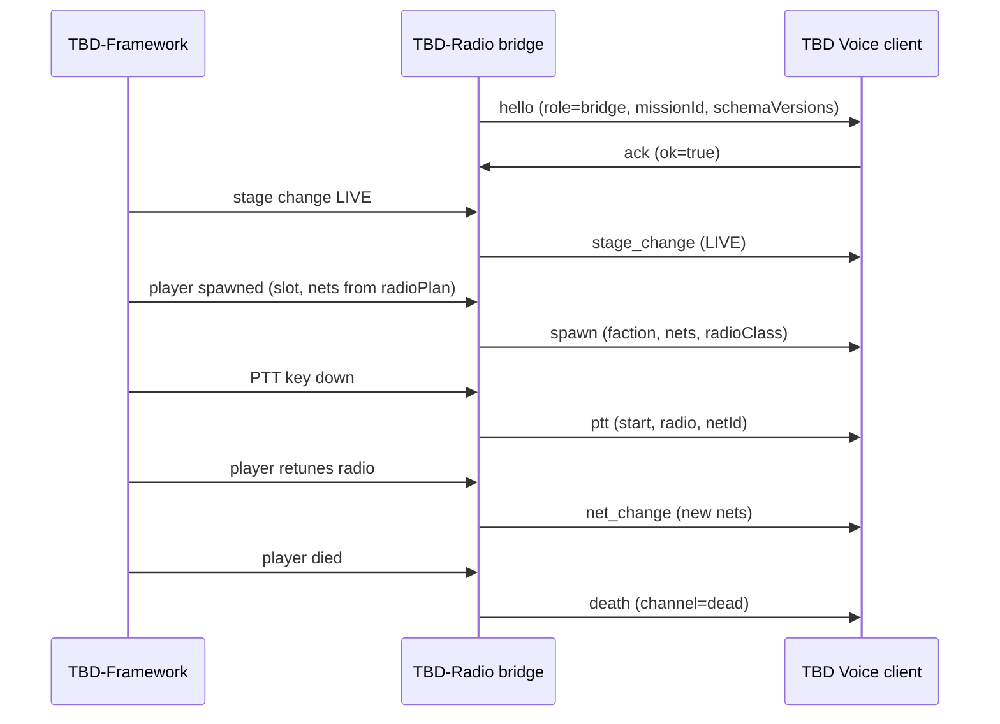

# TBD Voice — Game Bridge Contract (draft v1)

> **Status:** Draft. Main team owns this document; partner (VOIP) reviews and
> finalizes after the Phase 0.2 spike. This is the only hard coupling between the
> framework track and the VOIP track.

This contract defines how the in-game **TBD-Radio bridge mod** (built by the
partner, subscribing to TBD-Framework hooks) communicates with the external
**TBD Voice client** (also partner-built). The main team's responsibility is to
keep the framework hook points and the Mission JSON `radioPlan` stable; the
message format below is the wire between game and voice.

## Transport

The transport is **decided in Phase 0.2** (local REST, WebSocket, or named pipe).
The message envelope is transport-agnostic — the same JSON objects apply whether
they are sent as WebSocket frames or HTTP bodies. All messages validate against
[`bridge-messages.schema.json`](bridge-messages.schema.json); see
[`samples/`](samples/) for canonical examples.

## Message envelope

Every message shares a common envelope:

| Field | Type | Notes |
|---|---|---|
| `v` | integer | Protocol version, currently `1` |
| `type` | string | One of `hello`, `ack`, `spawn`, `death`, `net_change`, `ptt`, `stage_change` |
| `ts` | integer | Unix epoch milliseconds |
| `session` | string | Event/server scope id (binds to a voice room) |
| `player` | object | Present for player-scoped messages (`spawn`, `death`, `net_change`, `ptt`) |
| `payload` | object | Type-specific body |

`player.identityId` is the platform identity the framework already uses for slot
enforcement — the same id the website binds via `POST /api/link`. This is how a
voice connection is matched to an in-game player without trusting the client.

## Message types

- **`hello` / `ack`** — handshake. Bridge announces the mission id and which
  Mission JSON schema versions it supports; client acknowledges.
- **`spawn`** — emitted when the framework spawns a player into a role. Carries
  the faction, group/slot, the `radioClass` of the issued radio, and the list of
  nets the player may transmit/receive on (derived directly from the mission
  `radioPlan` + the role's `radio` array).
- **`net_change`** — emitted on in-mission retune or radio pickup/drop. Replaces
  the player's active net membership.
- **`ptt`** — push-to-talk state. `mode` distinguishes `radio` from `direct`
  (proximity) speech. `netId` is required for radio transmissions.
- **`death`** — moves the player to the `dead` (or `spectator`) channel so living
  players can no longer hear them.
- **`stage_change`** — broadcasts the game-mode stage so the client can, for
  example, mute radio outside `LIVE`.

## radioPlan → voice net mapping

The Mission JSON [`radioPlan.nets[]`](../schema/mission.schema.json) is the single
source of truth. For each net:

| Mission JSON field | Bridge `netMembership` field | Voice client use |
|---|---|---|
| `net.id` | `id` | Stable channel key |
| `net.label` | `label` | UI display name |
| `net.freqMHz` | `freqMHz` | Tuning + same-frequency grouping |
| `net.range` | (informs `radioClass` eligibility) | short/long radio gating |
| role `radio[]` membership | `transmit` / `receive` | which nets a slot may use |

A squad leader whose role lists `["net:cmd", "net:alpha"]` spawns with both nets
set `transmit: true, receive: true`; a rifleman with `radio: []` spawns with no
radio nets (direct speech only).

## Framework hook points (main-team responsibility)

The framework exposes these stable hooks for the bridge to subscribe to without
forking it. Phase 1 ships them as **stubs** (they fire and log; no voice wiring):

| Hook | Fires when | Maps to message |
|---|---|---|
| `OnPlayerSpawned` | player spawns into a slot | `spawn` |
| `OnPlayerKilled` | player dies / goes unconscious-final | `death` |
| `OnRadioRetune` | player changes frequency / radio item | `net_change` |
| `OnPTT` | push-to-talk input changes | `ptt` |
| `OnStageChanged` | game-mode state machine transition | `stage_change` |

These are verified against the live Enfusion API via **Enfusion MCP**
(`api_search`, `component_search`) during implementation — names above are the
contract intent, not confirmed engine symbols.

## Versioning

`v` is bumped only on breaking envelope changes. Additive payload fields do not
bump `v`. The bridge and client negotiate `schemaVersions` (Mission JSON) in the
`hello`/`ack` handshake and refuse to run a mission whose schema neither side
supports.
