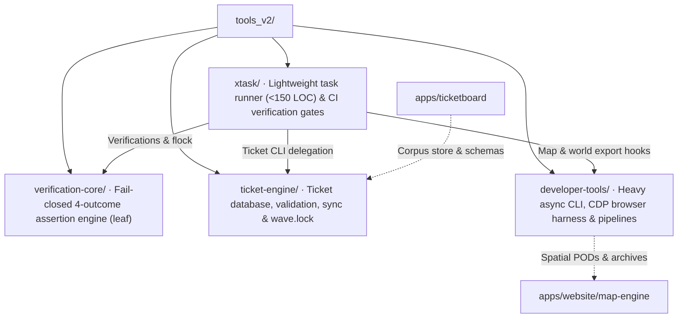

# Unified Tooling Architecture Hub (`tools_v2/`)

## Phase-one implementation

Three crates are live: `verification-core`, `ticket-engine`, and `xtask`. The heavy CLI stays in `../tools/tbd-tools`. The diagrams and architecture descriptions below are the target for all four phases; see [PHASE_ONE_HANDOFF.md](./PHASE_ONE_HANDOFF.md) for the current implementation and checks.

## Target architecture

Modernized, clean, and domain-driven architecture for the TBD Reforger platform tooling ecosystem.

Consolidates all developer tooling, assertion libraries, ticket database systems, and task dispatchers into **four strictly bounded, self-describing crates** with zero repository root clutter.

---

## 1. Top-Level Directory Topology

```text
tools_v2/
├── verification-core/                   <-- Leaf: Fail-closed 4-outcome static assertion library (regex, libc)
├── ticket-engine/                       <-- Self-contained: Ticket database, schema validation, view sync, wave.lock
├── developer-tools/                     <-- Heavy async CLI suite: CDP browser tests, map imagery & 3D blueprints
└── xtask/                               <-- Lightweight task runner: Declarative router (<150 LOC) & CI verifications
```



---

## 2. The Four Pillar Crates

| Crate | Former Location | Role & Boundary Responsibility | Dependencies |
|---|---|---|---|
| **[`verification-core/`](./verification-core/)** | `crates/tbd-gate` | Core fail-closed verification primitives. Enforces the non-collapsing 4-outcome `Verdict` (`Held`, `Failed`, `DidNotRun`), process group signal isolation, file scanning, and flock concurrency locks. | Zero internal deps; `regex`, `libc`. |
| **[`ticket-engine/`](./ticket-engine/)** | `crates/tbd-tickets` + `xtask/src/check.rs`, `cmds.rs`, `sync.rs`, `wave_lock.rs` | Complete ticket domain engine. Owns 100% of `.ai/tickets/` schema parsing, corpus database mutations, ticket integrity validation, markdown view generation, and the `wave.lock` dependency DAG compiler. | Zero internal deps; `serde`, `time`, `toml`. |
| **[`developer-tools/`](./developer-tools/)** | `tools/tbd-tools` + `xtask/src/map_blueprint/` | Async CLI suite and heavy asset compilers. Owns the headless Chrome DevTools Protocol (CDP) test runner, Enfusion script reverse-engineering oracle, 2D satellite orthophoto & cartography pipeline, and the 3D building mesh/voxel/BVH blueprint compiler. | `tokio`, `axum`, `image`, `website-map-engine`. |
| **[`xtask/`](./xtask/)** | `xtask/` | Pure developer task dispatcher (`cargo xtask ...`) and repository integrity verification suite. Stripped of all 3D mesh parsing and ticket internals. Features a declarative router (<150 LOC) and categorized verification gates. | `verification-core`, `ticket-engine`, `developer-tools`. |

---

## 3. Core Architectural Laws Enforced

1. **Law 3 (Fundamentals & Clean Architecture Over Hacks)**:
   - Eliminates root directory sprawl (`crates/` and `xtask/` deleted from root). Tooling lives under `tools_v2/`; `tools/tbd-tools` remains active through phase one.
   - Resolves the misplaced 13.4k LOC 3D mesh/BVH compiler (`map_blueprint`) by relocating it from `xtask` into `developer-tools`.
   - Eliminates code duplication: unifies the two separate Enfusion `.pak` archive readers into `developer-tools/src/enfusion_pak/`.
2. **Law 4 (Zero Context Needed for Directory & File Names)**:
   - Resolves the ambiguous "Three Gates" overload:
     - The static check engine → `verification-core`
     - The CDP browser test runner → `browser_test_runner` (binary in `developer-tools`)
     - The repository checks in `xtask` → `xtask/src/verifications/`
   - Eradicates cryptic acronyms: `sap.rs` → `aerial_orthophoto/`, `tbds_v2.rs` → `satellite_archive_container.rs`, `edds.rs` → `enfusion_texture_decoder.rs`, `jsval.rs` → `json_number_formatting.rs`.
   - Renames all 9 historical ticket files (`gate_t180.rs`, `gate_t439.rs`, etc.) to self-describing present-tense domain names.
3. **Law 5 (Categorize Primitives — Avoid Flat Dumps)**:
   - Structures the flat dump of 109 items in `xtask/src/` into clean, well-bounded domain folders: `core/`, `commands/`, and `verifications/`.
4. **Law 6 (Strict Boundary Layers)**:
   - `verification-core` and `ticket-engine` are strictly leaf crates with zero internal dependencies.
   - `xtask` does not depend on heavy 3D engine crates; it delegates pipeline tasks to `developer-tools`.
5. **Law 7 (File Size Limits & Test Placement)**:
   - Every production file is structured to remain strictly under **500 lines of code**.
   - Massive legacy monoliths (`schema_gates.rs` 4,764 LOC, `smokes.rs` 4,071 LOC, `check.rs` 2,330 LOC, `cmds.rs` 2,214 LOC, `wave_lock.rs` 2,170 LOC, `aux.rs` 1,644 LOC) are decomposed into focused submodules.
   - **No inline test modules**: Tests are extracted into sibling test files declared via `#[cfg(test)] #[path = "tests/<file>_tests.rs"] mod tests;`.
6. **Law 8 (Present-Tense Invariants)**:
   - All modules and documentation describe *what* invariant is enforced *now* and *why*, with zero references to historical ticket migrations.

---

## 4. Documentation Index

- **[`ARCHITECTURE_PLAN.md`](./ARCHITECTURE_PLAN.md)**: Phased execution plan, cross-crate dependency graph, and migration roadmap.
- **[`ANALYSIS_AND_INVENTORY.md`](./ANALYSIS_AND_INVENTORY.md)**: Exhaustive catalog of all 107+ legacy files, LOC measurements, ticket mappings, and decomposition targets.
